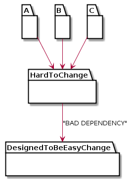

# Design Principle

## OCP (Open-Closed Principle)

기존 코드를 변경하지 않으면서 코드의 수정을 허용하는 것에 관한 원리.

"클래스는 확장에는 열려있고, 수정에는 닫혀 있어야 한다."

Board.init()의 수정은 불가능하다. 그러나 기능을 확장하고 싶다면 override하면 된다.


## DRY (Don't Repeat Yourself)

공통되는 부분을 추출해 추상화하고 한 곳에 두어 중복 코드를 피해라.

Remote와 Recognizer에 open이라는 중복되는 메소드가 있다면, Door에 하나만 두고 참조하면 된다.


## SRP (Single Responsibility Principle)

시스템의 모든 객체는 하나의 책임만을 가지며, 객체가 제공하는 모든 서비스는 그 하나의 책임을 수행하는데 집중한다. (각 객체가 변화의 요인이 하나뿐)

만약 아래와 같이 Automobile이라는 클래스에 여러 메소드가 존재한다면...


이렇게 명확한 자신만의 책임을 가지는 클래스들로 분리하면 된다.


## LSP (Liskov Substitution Principle)

자식 Type들은 부모 Type들이 사용되는 곳에 대체될 수 있어야 한다.

아래 코드에서 Board는 2D를 기초로 한 addUnit() 메소드를 가지고 있다. 3DBoard는 3D 상황이므로 부모의 addUnit()은 아무런 의미가 없다.


```
Board board = new 3DBoard();
board.addUnit(new Unit(), 1, 1); // 3DBoard에 무슨 의미인가??
```


그렇다면 3DBoard가 Board 객체들을 배열에 저장해 Board들의 집합을 가지도록 하면 된다. 어떠한 Board 객체를 사용해서 x, y 좌표를 Board 기능에 위임(delegate)할지 알아내면 된다.


## DIP (Dependency Inversion Principle)

고차원 모듈이 저차원 모듈에 의존하면 안된다. 이 두 모듈 모두 다른 추상화된 것에 의존해야 한다.

추상화된 것을 구체적인 것에 의존하면 안된다. 그 반대여야 한다.

"자주 변경되는 Concrete Class에 의존하지 마라"

아래와 같은 경우 PizzaStore에서 모든 Pizza 객체들을 생성해야 한다. 그러므로 PizzaStore는 모든 Pizza 객체들에 직접적으로 의존하게 된다.


아래를 보자. 이제 PizzaStore는 추상 클래스인 Pizza 클래스에만 의존한다. 모든 구상 Pizza 클래스들도 추상 Pizza 클래스에 의존하게 된다.


- 어떤 변수에도 구상 클래스에 대한 reference를 저장하지 마라.
- 구상 클래스에서 유도된 클래스를 만들지 마라.
- 베이스 클래스에 이미 구현되어 있던 메소드를 overrice하지 마라. (override한다는 것은 처음부터 제대로 추상화되지 못함이다.)

물론... 이것들을 모두 완벽하게 지키는 프로그램은 없다. 일단 진행하다가 문제가 보이면 적용해 나가라. 그게 현실적이다.


## ISP (Interface Segregation Principle)

client는 자신이 사용하지 않는 메소드에 의존 관계를 맺으면 안된다.

아래의 경우 EnrollmentReportGenerator는 getName(), getDate()만 필요하지만 만약 postPayment()가 변경될 경우 (인자 추가와 같은) 재배포해야 한다.


다음과 같이 변경하면 된다. 이제 각자 자신이 관심있는 메소드만 있는 interface를 제공받게 되었다.


# Package Design Principle

## REP (Release/Reuse Equivalency Principle)

다른 사람들이 편하게 재사용할 수 있는 패키지를 만드는 것도 클래스들을 패키지 안에 배치할 때 고려해야 한다.

재사용할 때 같이 몰려다니는 클래스들을 한 패키지로 묶고, 이를 릴리즈나 유지보수의 단위로 취급한다.


## CCP (Common Closure Principle)

SRP (Single Responsibility Principle)의 패키지 확장 버전이다.

패키지의 모든 클래스가 같은 종류의 변화에는 똑같이 폐쇄되어야 한다. 만약 어떤 것을 변경해야 한다면, 그것 때문에 바꾸어야 할 클래스들은 단 한 패키지에만 몰려있어야 한다.


## CRP (Common Reuse Principle)

ISP (Interface Segregation Principle)의 패키지 확장 버전이다.

많은 패키지를 클라이언트로 가지는 패키지는 이것을 모두 책임지므로 그 책임이 막중하다. 이 패키지에 변화가 생기면 여기에 의존하는 모든 패키지에 큰 영향을 줄 수도 있다. 그러므로 한 클라이언트가 사용하는 클래스들과 다른 클라이언트가 사용하는 클래스들은 최대한 분리해야 한다.


## ADP (Acyclic Dependencies Principle)

패키지 의존 관계 그래프에 순환이 있다면 어떤 것을 먼저 빌드하고 어떤 것을 다음에 할지 결정하지 못한다. 패키지 의존 관계 그래프에서 순환을 제거해라.

## SDP (Stable Dependency Principle)

패키지는 바꾸기 쉬워서 자신보다 불안정한 패키지들에 의존하면 안된다. 모든 패키지 의존 관계 화살표는 언제나 화살표가 출발하는 패키지(의존하는 패키지)보다 어려운 패키지를 가리켜야 한다.



## SAP (Stable Abstractions Principle)

안정된 패키지가 변경하기 어렵다고 해서 반드시 확장하기도 어렵지는 않다.  OCP (Open-Closed Principle)에 따르면 패키지 역시 안정된 패키지를 쉽게 확장할 수 있도록 유지하기 위해 안정된 패키지는 추상적이어야 한다.

"패키지가 안정적일수록 더 추상적이어야 한다"

