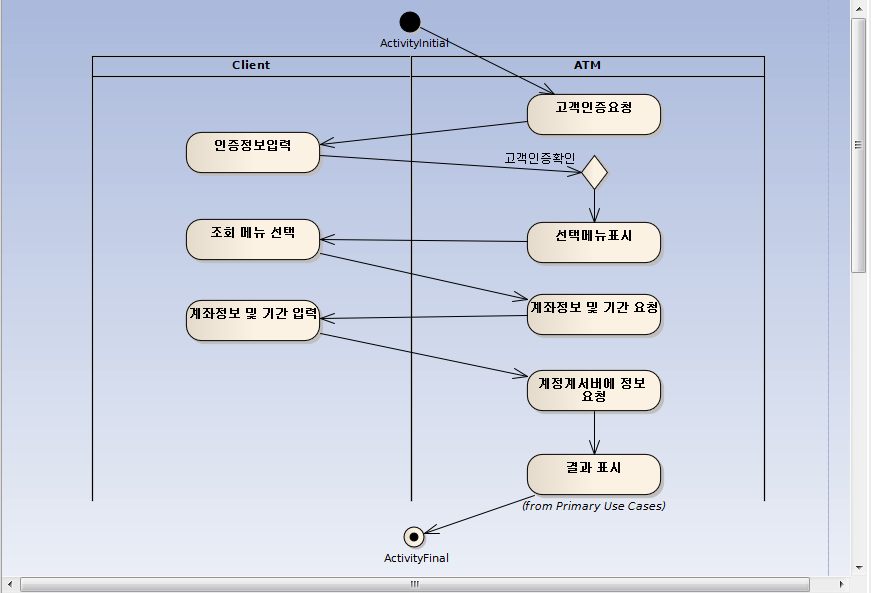

# SW Engineering 개요

>  소프트웨어 공학은 소프트웨어의 개발, 운용, 유지보수 등의 생명 주기 전반을 체계적이고 서술적이며 정량적으로 다루는 학문이다; 즉, 공학을 소프트웨어에 적용하는 것이다. 
>
> (출처 : 위키피디아, ‘소프트웨어 공학’)

즉, 소프트웨어 엔지니어링은 소프트웨어를 경제성이 있는 상품으로 현실에 내놓는 방법과 그 과정을 다루는 것이라고 볼 수 있다. 

## SW의 정의

### Soft와 Ware

SW (Software)는 정보, 표현 등과 연관되는 것이다. Ware는 뭘까? Ware는 제품. 인위적으로 만들어낸 어떤 것을 의미한다. 즉 Software는 무형, 생각의 창작물로 보면 된다. 그러므로 컴퓨터 SW 말고도 공연이나 책의 내용 등은 모두 SW라고 볼 수 있다. 

### SW와 HW

  SW는 생각에서 나오는 것으로 무형의 창작물이라고 했다. HW (hardware)는 그 반대다. 형태가 있는 것, 현실에 실제로 존재하는 것이다. 그러므로 SW와 HW의 구분은 머리 속에 있느냐, 없느냐로 이루어진다.

### SW의 가치

컴퓨터는 결국 사람의 두뇌와 같은 역할을 한다. 그렇기 때문에 컴퓨터 내부의 그 무형의 무엇인가를 SW라고 지칭하는 것이다. 그러면 SW는 결국 무엇인가? 생각과 연관성은 무엇인가?

> SW는 컴퓨터나 관련 장치들을 동작시키는데 사용되는 다양한 종류의 프로그램을 부르는 일반적인 용어이다. (출처 : 텀즈, ‘소프트웨어’)

> 컴퓨터 소프트웨어(computer software, 혹은 간단히 소프트웨어, 문화어: 쏘프트웨어, 순화 용어: 무른모)는 저장장치에 저장된 특정한 목적의 하나 또는 다수의 컴퓨터 프로그램을 뜻한다. 프로그램 소프트웨어는 컴퓨터 하드웨어에 직접 명령어를 주거나 다른 소프트웨어에 입력을 제공함으로써, 그것이 수행하도록 구현된 기능을 수행한다. (출처 : 위키피디아, ‘컴퓨터 소프트웨어’)

생각은 왜 하는가? 생각의 본질은 계획과 전략이다. 앞으로 닥칠 위험, 사고를 피하기 위한 것이다. 현실 세계에서 보고 느끼는 등 모든 감각 기관을 통해 들어오는 정보가 뇌에 전달되어 하나의 세상을 이루게 된다. 생각은 바로 이 머리 속의 세상을 가지고 현실 세계가 어떻게 돌아갈지를 예측하는 것이다. 머리 속의 가능한 모든 객체들을 이용해 현실 세계를 예측하는 것이다.

그러기 위해서는 머리 속의 객체, 세상이 제대로 들어와 있어야 한다. 그래야 정확한 예측이 가능해진다. 공부는 세상을 잘 알기 위함이다. 허나 그 범위가 너무 넓기 때문에 물리, 화학 등 여러 분야로 나누는 것이다. 나누면 단순해지고 예측하기 쉬워진다. 대신 공부한 뒤로 통합하는 것이 필요하다.

무형의 정보를 자신이 취합해 자신의 것으로 만드는 것이라야 자신이 사용할 수 있게 된다. 이것이 SW 개발과 직결되는 것이다. SW는 바로 떠다니는 무형의 정보들을 붙잡아 자신의 머리 속에서 특정 형태로 조립하여 만든 것이라고 할 수 있다. 

## Engineering의 정의

> 공학(工學, Engineering)은 인류의 이익을 위해서 과학적 원리, 지식, 도구를 활용하여 새로운 제품, 도구 등을 만드는 것이다. (출처 : 위키피디아, ‘공학’)

엔지니어링이라는 것은 상업적 가치를 지니는 무언가를 만드는 것이다. 과학과는 다르다. 엔지니어링은 과학을 이용해 경제성을 가진 제품을 만들어 내는 것이다. 그렇기 때문에 현실 세계의 요소들을 반영해야 한다. 경제적인 문제, 기술적인 문제 등 여러 현실적 제약조건을 고려해 최적의 상품을 생산해 내는 것이 공학에서 따져야 할 문제들이다.

##   SW  Engineering의 정의

엔지니어링은 경제적인 무언가, 즉 상품을 만들어 내는 것이라고 했다. 그러면 SW 엔지니어링은? 경제성을 지니는 SW 상품을 만들어 내는 것이다. 이것이 과학과 소프트웨어 엔지니어링의 다른 점이다. 과학은 세상을 분석해 법칙만 만들어 놓으면 된다. 그러나 소프트웨어 엔지니어링은 세상의 정보들을 취합해 실제 상품을 만들어내야 한다.

좀 더 구체적으로 보면 소프트웨어 엔지니어링은 개발과 직결되는 그 자체다. SW를 개발하는 과정에 필요한 모든 것들 중 돈, 인적 관리 같은 것들은 SW 개발과 직결된다고 볼 수는 없다. 여기서 프로젝트 매니지먼트와 소프트웨어 엔지니어링의 차이를 볼 수 있다.

1. 요구사항 수집 : 고객의 요구사항에 따라 SW를 개발하게 된다.
2. 분석 : 이 요구사항을 정확히 파악하고 수집, 분석하는 것이 중요하다.
3. 설계 : 여기서 구현에 필요한 실제적인 기술적 문제와 같은 부분, 즉 시스템을 결정하는 것이 설계다.
4. 구현 : 이를 SW로 구현한다.

필요에 따라 위 1-4번을 반복하는 프로세스를 거친다. 소프트웨어 엔지니어링을 배운다는 것은 체계적이고 논리적으로 SW를 개발하는 방법, 과정, 환경을 배우는 것이다.

###  구조와 논리화

오랜 기간 동안 사람들에 의해 사용되면서 공동으로 합의되고 축적된 것이 바로 언어다. 언어란 여러 사람들이 가장 공통적으로 생각하는 것을 하나의 세상으로 취합한 것이다. 언어도 세상을 모델링 한다. 그 중에서도 사람들 사이에 통하는 공통적인 것들을 말이다.

어떤 것을 언어로 표현한다는 것은 공통적인 사고를 가지고 표현하는 것이다. 주관적으로만 생각하는 것이 아닌 객관적으로 생각하고 표현해 정리하는 것이다. 그리고 한발 더 나아가 문서, 언어 구조는 지식의 아키텍처라고 할 수 있다. 

구조란 무언가를 정리하는 방법, 사용하기 쉽도록 만드는 방법이다. 또 다르게 표현하면 구조란여러 개의 데이터를 효율적으로 사용할 수 있도록 해주는 것이다. 예를 들어 가족 관계도나 회사 조직도를 표현할 때 트리 구조를 사용하면 직관적으로 이해하기 쉬운 경우를 생각할 수 있다.

구조는 여기저기서 많이 쓰인다. 언어도 마찬가지로 어떤 구조를 가져야 복잡도가 줄어든다. 그래서 자연적으로 언어도 점차 구조적으로 발전하는 양상을 보여 왔다. 말 그대로 구조는 복잡함을 줄이기 위한 것이다. 그러면 복잡도는 어떻게 측정하는가? 바로 경우의 수를 따진다. 머리 속의 세상이 정리된 경우는 경우의 수가 적다. 매우 간단하다. 구조 처리를 하면 지식의 단편들이 연결된다. 이는 생각하는 훈련으로 완성된다.

<구조화의 예 : 왼쪽처럼 텍스트를 나열한 것보다 오른쪽의 트리 구조가 이해하기 쉽다.>

### SW Engineering는 논리화다

 프로그래밍은 논리다. 논리를 만들어 낼 수 있다면 자동화가 가능하다. 즉 ‘논리화 -> 자동화’ 다.

소프트웨어 공학이 추구하는 것은 실제로 상품을 만들기까지의 모든 과정을 자동화하고 싶은 것이다. 즉 자동화는 체계화, 논리화, 규칙화로 만들어진다.

그 모든 과정들을 논리화해서 모델링 한 것이 사실상 소프트웨어 공학이다. 가장 기본적인 프로세스는 분석, 설계, 구현, 테스트의 4개 영역으로 나눌 수 있다.

1.   분석은 Problem Domain이다. 우리가 해야 할 일은 그 영역을 컴퓨터에 집어넣는 것이다(Problem Domain : 문제 영역). 그러기 위해서는 우선 Problem Domain을 알아야 하고 컴퓨터에 들어갈 수 있는 형태로 만들어 주고, 환경을 만들어 주어야 한다.  
엔지니어는 기술적인 지식을 가진 사람이다. 그래서 초보의 경우 시스템 구현부터 시작하게 된다. 그러나 점차 시간이 지날수록 설계, 분석 쪽으로 가게 된다. 그리고 결국 그것들이 기술보다 더 중요해지는 시점이 온다. 그래서 만약 엔지니어가 은행 전산실에서 일한다면 나중에는 은행 업무를 은행원보다 더 잘 알게 된다. 왜냐하면 모든 은행 업무를 분석하고 논리화하는 일을 하기 때문이다.
2.  그렇게 그 영역을 분석한 뒤 시스템을 어떻게 만들 것인지 청사진을 그린다. 이것이 설계다.  
3.  그것들을 컴퓨터가 알아들을 수 있도록 만들어 컴퓨터에 넣는 것이 개발, 구현 과정이다.  
4.  모든 구현이 끝나면 소프트웨어 품질을 보장하기 위한 테스트 과정에 들어간다.  

대상의 성격에 따라 위의 기본적인 과정들을 반복하게 된다. 소프트웨어 공학은 이 각 과정들을 어떻게 잘 할 수 있는가를 고민하는 것이다. 소프트웨어 공학에도 프로젝트 관리의 일부가 들어가게 되는데 그것이 바로 형상 관리다. 형상 관리는 프로젝트를 진행하며 나오는 모든 산출물들을 관리하는 것을 통칭하는 것이다. 예를 들어 소스의 버전 관리, 문서 관리 등이 모두 형상 관리 범주에 들어간다. 실제 한국의 경우 프로세스, 형상, 아키텍처 문제가 많이 노출된다.

# SWEBOK

SWEBOK은 Software Engineering Book of Knowledge의 줄임말이다. 말 그대로 소프트웨어 공학에 관한 전반적인 지식을 전문가들이 모여 만든 가이드이다.

##   Requirements

소프트웨어 공학의 시작은 고객의 요구사항에서 온다고 말할 수 있다. 꼭 정해진 고객이 없더라도 요구사항은 항상 존재한다. 어떤 소프트웨어 상품을 개발할 때 최초로 해야 할 일은 주어진 요구사항을 정확하게 파악하는 것이다.

요구사항을 수집하고, 분석해서 핵심을 정확하게 파악하고 결정하는 것은 가장 중요하면서 가장 어려운 일이기도 하다. 예를 들어 고객은 인테리어 업자에게 그냥 잘 해주세요, 라고 말하고 지나간다. 그러나 일이 끝나고 나면? 고객은 펄펄 뛰며 이것도 저것도 자신이 원한 것이 아니라고 할 것이다. 현실에서는 비일비재한 일들이다.

그렇기 때문에 중요한 것이 이에 대한 예측과 대비다. 반드시 경험자가 이러한 리스크를 정확히 예측하고 대비해야 한다. 계약으로 미리 방지하거나 결정이 필요한 부분에 고객을 지속적으로 참여하게 해 모든 결정권과 책임을 이양하는 방법도 있다. 물론 위와 같은 나쁜 상황을 피하고 싶다면 요구사항 단계에서 정확한 분석이 요구된다.

<요구사항은 다른 모든 과정들의 기초가 되므로, 가장 중요하다고 볼 수 있다.>

요구사항 과정이 끝나면 디자인 과정으로 넘어간다. 여기서는 소프트웨어의 기술적인 면들을 정리하고 결정한다. 바로 이것이 설계다. 요구사항을 기술적인 부분으로 변환하는 과정이라고 할 수 있다.

그 후에는 프로그래밍 언어를 사용해 (그리고 유용한 다른 도구들을 취합해) 실제 소프트웨어를 구현한다. 구현이 끝나면 테스트를 하고 유지보수를 하는 영역으로 넘어가게 된다. 유지보수도 요구사항 부분과 마찬가지로 큰 축을 이루며, 여기까지가 가장 기본적인 각 단계별 주제들이다. 이 중에서도 가장 기본적이면서도 가장 중요한 것은 요구사항을 정확하게 파악하는 것이다. 고객은 언제나 옳다. 그들이 원하는 것을 그대로 봐야 한다.

##   지원 요소들

먼저 "형상관리"는 프로젝트를 진행하는 과정에서 발생하는 모든 산출물들을 관리하는 것을 뜻한다. 그것들을 어떻게 관리하는지가 또 하나의 큰 이슈가 된다. 형상 관리는 개발에 직접적인 영향을 미치면서 또한 전체적인 프로젝트 매니지먼트의 영역에 있기도 하다. 

수주 베이스 프로젝트는 각 고객의 상황과 시스템에 맞춰서 개발해 주는 것이다. 보통 SI라고 하며, 소프트웨어 공학은 이것을 바탕으로 생각하면 된다. 물론 특정 고객에게 직접 요구사항을 받지 않고 자체적으로 제품을 만드는 회사들도 있다(MS, 한컴 등). 그러나 현실적으로 SI 수요가 많으며, 항상 요구사항은 존재하기 때문에 수주 베이스 프로젝트의 경우를 기본으로 여기면 된다. SI에서 요구사항은 직접적인 고객에게서 올 것이고, 제품을 개발할 경우의 요구사항은 기획실에서 제품 스펙을 내려주는 것으로 생각할 수 있다.

그래서 초기에 어디까지 갈 것인가, 즉 범위를 결정하는 것이 중요하다. 왜냐하면 범위 설정은 비용 결정과 직결되기 때문이다. PM이나 아키텍트가 요구사항을 실제 기술적인 영역으로 변환할 때 바로 이 범위를 결정한다. 그리고 그에 따라 비용을 산정한다. 다시 한번 말하지만 범위 결정은 비용과 직결되기 때문에 중요한 문제가 된다.

어느 시점에 인력을 몇 명 투입할지, 어떻게 투입할 것인지 같은 일들은 PM의 일이지만 소프트웨어 공학의 영역에 걸쳐 있기도 하다.

즉 소프트웨어 공학은 기술적으로 범위를 정해주기만 하면 되지만 그것은 당연히 전체 프로젝트 계획과 연결된다. 공학적 계획은 어떤 문제를 어떻게 할 것인가? 가 될 것이며, PM적 계획은  그 어떻게 하는 것을 어떤 비용으로 어떻게 할 것인가? 가 될 것이다.

이 모든 과정이 결정되면 실제 프로젝트가 시작된다. PM이 현실적 여건을 마련하고 아키텍트가 설계한다. 그리고 개발자가 구현을 한다. 개발이 끝나면 후에 평가를 한다. 이것을 하나의 큰 프로세스 덩어리로 보면 된다. 여기에는 전체 소프트웨어 공학을 위한 여러 가지 도구들을 선택하는 것 또한 하나의 요소로 들어간다. 요구사항 수집, 분석 설계, 코딩, 테스트, 유지보수, 형상관리 도구 등 다양한 도구들이 있다. 도구들의 종류와 특징은 아래에 서술한다.

결론적으로 이 모든 것들은 소프트웨어의 품질을 높이기 위한 것이다. 소프트웨어 공학의 궁극적 목적은 좋은 품질의 소프트웨어를 만들어 내는데 있다. 품질이 좋다는 것은 단순히 비싼 소프트웨어를 말하는 것이 아니다. 초가집을 지어달라고 했는데 엔지니어 입장에서 좋은 품질을 갖추기 위해 빌딩을 만들어 준다면 그것은 옳지 않다. 고객은 항상 옳다. 지어달라면 원하는 대로 지어주면 된다. 고객의 가치가 항상 최우선이다.

그렇지만 엔지니어는 항상 최고의 기술을 갖추고 있어야 한다. 그래야 어떤 고객의 요구에도 최고 품질의 소프트웨어를 생산해낼 수 있다. 품질과 가치는 상대적인 것이다. 그래서 엔지니어는 항상 다양한 기술을 최고로 갖추고 고객을 만족시켜야 한다. 그러면서도 얼마나 이익을 최대로 남길 것이냐를 줄다리기해야 한다.

# Process

## Process 개요

프로세스란 간단히 말해서 가공해서 무언가를 만드는 과정이다. 프로세스는 작업과 과정의 둘로 나눌 수 있다. 좀 더 일반적인 개념으로 말하면 일과 시간이다. 현실에서 찾아볼 수 있는 쉬운 예로는 시간표, 일과표 같은 것들이 있다. 즉 프로세스는 다음과 같이 둘로 나눠진다.

1.  작업. 업무 
2.  과정. 절차. 순서 

프로세스는 업무와 시간에 관한 것이다. 그러면 이런 프로세스는 어디에 적용되는가? 프로세스가 적용되는 부분은 대부분 비즈니스나 업무를 하는 것들에 적용된다. 프로세스의 가장 좋은 예는 공장, 그리고 군대다. 총 분해 순서, 조립 순서 등은 모호성 없이 명확하다. 이것들이 의미하는 바는 업무를 획일화해 예측 가능하게 만든다는 것이다. 프로세스는 누가 하더라도 그 업무가 예측 가능하게 만드는 것이다.

프로세스는 미국에서 비약적으로 발전했다. 왜 그랬을까? 상식이 공유되는 사회에서는 굳이 계량적이고 명확하지 않아도 통할 수 있다. 그러나 다인종 기반의 미국은 다양한 모든 것들을 획일화하기 위해서는 그것들을 정량화해 예측 가능하게 만들어야 했다. 마찬가지로 일본도 프로세스 지향적이다. 프로세스가 없으면 일을 못할 정도다.

어쨌든 ‘무엇’을 ‘어떻게’ 할 것이냐가 프로세스다. 무엇을 할 것이냐 (what) + 어떻게 할 것이냐(how) = 프로세스. 이것을 SW 개발에 적용한 것이 SW 개발 프로세스다. 다만 SW 개발 프로세스는 how를 뽑아내기가 굉장히 어렵다. 액터를 정의한다, 요구사항을 뽑아낸다, 와 같은 것들을 자동차를 조립하는 방법과 비교해보자. 자동차는 몇 번 나사를 차체의 몇 번 구멍에 어떤 드라이버를 가지고 몇 도 각도로 어느 방향으로 몇 바퀴를 몇 초로 돌려준다는 등 누가 보더라도 획일적이고 정량적으로 정의할 수 있다. 그러나 액터를 정의하고 요구사항을 뽑아내는 것은 다소 추상적이어서 what이 중심이 되고 how가 일부 섞여 들어간다고 볼 수 있다.

## Process의 종류

### Waterfall

폭포수 모델(waterfall model)은 순차적인 소프트웨어 개발 프로세스(소프트웨어를 만들기 위한 프로세스)로, 개발의 흐름이 마치 폭포수처럼 지속적으로 아래로 향하는 것처럼 보이는 데서 이름이 붙여졌다. 이 폭포수 모델의 흐름은 소프트웨어 요구사항 분석 단계에서 시작하여, 소프트웨어 설계, 소프트웨어 구현, 소프트웨어 시험, 소프트웨어 통합 단계 등을 거쳐, 소프트웨어 유지보수 단계에까지 이른다.

요구사항 -> 분석 -> 설계 -> 구현 -> 테스트. 이것이 초기에 사용된 프로세스의 모습이다. 그냥 보기에 이것은 그저 업무의 나열이다. 각각은 하나의 작업이고 이것을 시간적으로 나열한 것이다. 이런 스타일의 프로세스를 Waterfall Process라고 한다.

Waterfall은 요구사항이 변경될 경우 대처하기가 어렵다. 이것의 위험은 ‘위험을 점진적으로 감소시키지 못한다’는 것에 있다. 즉 요구사항이 고정되지 않으면 프로젝트가 망한다. 위험을 분산시키지 못하기 때문에 유연하게 움직일 수가 없다. 프로세스가 경직되면 빠르게 위험에 대처할 수 없다. 

그래서 위 과정들을 조그맣게 만들어서 미리미리 조그만 프로젝트를 반복적으로 돌리는 것을 Pilot Project 혹은 Proof Of Concept (POC)라고 한다. POC를 Pilot Project를 통해서 한다. 업무들이 쪼개어지고 반복적이므로 설계가 계속 튜닝이 된다. 이는 리스크를 줄이기 위한 것이다. 그리고 이것은 일단 실제로 돌아가야 한다. 실제로 돌려보면서 정립하는 것이다. 그래서 일단 아키텍쳐를 만들어서 세부 내용들을 실제 돌려본다. 큰 틀을 미리 잡아놓고 가는 것이라고 볼 수 있다. 그렇게 실제로 돌려보면서 성능을 측정해보는 것은 BMT (BenchMark Test : 실제로 돌려보고 성능을 측정하는 것) 라고 한다. 

로이스가 제시한 최초의 폭포수 모델은 다음과 같은 단계가 순차적으로 기술되어 있다.

폭포수 모델을 따르기 위해서는, 완전히 순차적으로 한 단계, 한 단계를 진행해 나가야 한다. 예를 들어, 가장 먼저 요구사항 기술을 진행하여 이를 확정하여야 하며, 그런 이후에 설계를 진행할 수 있다. 소프트웨어가 설계된 후, 그 설계도(blueprint)가 구현자(또는 코더)에게 따라서 구현해야할 계획으로 전달된다. 따라서 설계가 완전히 완료된 후에 설계에 대한 구현이 코더에 의해 진행될 수 있는 것이다. 이 구현의 마지막 단계에 이르면, 각각의 생성된 컴포넌트를 결합하여, 새로운 기능을 실현시키고 그때까지 발생한 버그를 해결하게 된다(디버깅). ]

그러므로 폭포수 모델은 전 단계가 수행되어 완료되기 전에는 다음 단계로 진행할 수 없도록 제한한다. 그러나, 최초의 원래 폭포수 모델과는 달리 프로세스 일부 또는 많은 부분이 변형된 모델들이 존재하며, 로이스의 최종 모델도 그 중 하나이다.

(출처 : 위키피디아, "폭포수 모델")

### Agile

Agile Process는 반복 횟수를 10회 이상, UP에 비해 더욱 짧고 반복적인 프로세스다. 굉장히 유연한 방식이기 때문에 요구사항이 자주 변하는 상황에 가장 적합하다. XP (eXtreme Programming)이 대표적인 Agile 개발 프로세스의 대표적인 방법이라고 볼 수 있다. 

시간을 나눌 때는 결과물을 기준으로 나눈다. 어떤 산출물을 낼 것이냐. 시점을 나눈 기준은 milestone(이정표)이라고 한다. 이정표에는 당연히 확실한 결과물이 있어야 한다. 한 구간 구간을 Phase라고 한다. 최종 목적은 시스템 완성이다. 시간을 나누는 방법에는 우리가 국어시간에 간단히 배운 기승전결이 있었다. 그와 같이 프로세스의 시간의 흐름도 일반적으로 3-4개로 나눈다.

애자일 개발 프로세스란 어느 특정 개발 방법론을 가리키는 말은 아니고 "애자일(Agile=기민한, 좋은 것을 빠르고 낭비 없게 만드는 것) 개발을 가능하게 해 주는 다양한 방법론 전체를 일컫는 말이다. 예전에는 애자일 개발 프로세스는 "경량(Lightweight)" 프로세스로 불렸다. 익스트림 프로그래밍 (XP:eXtreme Programming)이 애자일 개발 프로세스의 대표적인 방법이라 볼 수 있다

소프트웨어는 유동적이고 개방적이다. 또한, 요구사항의 변경에 따른 작업량을 예측하기 힘들다. 그래서 이미 고전적인 소프트웨어 공학이나 관리 기법만으로는 대처할 수 없게 되었다.

이런 문제에 대한 기술적인 해결책으로 객체지향이 있다. 객체지향 기술은 그 동안의 개발 문제를 적절하게 대처해 주었다. 그리고 객체지향 개발을 하기 위해서는 그에 적합한 개발 프로세스가 필요했다. 그래서 수많은 애자일 개발 프로세스가 이러한 필요에 따라 만들어졌다. 따라서 애자일 개발 프로세스의 상당수는 객체지향 기술을 기반으로 한다.

애자일 개발 프로세스는 제한된 시간과 비용 안에서 정보는 불완전하고 예측은 불가능하다는 전제를 가진다. 그리고 그 전제 아래에서 합리적인 답을 내도록 하는 것이 애자일 개발 프로세스이다.

전통적인 개발 프로세스들은 공업에서 사용하는 정형적 프로세스 제어 모델을 따르고 있다. 정형적 프로세스 제어모델은, 동일한 입력에 대해서 동일한 결과가 기대 될 경우에 적합하다. 하지만, 소프트웨어를 포함한 IT의 개발은 경험적 프로세스 제어 모델로 접근할 필요가 있다. 경험적 프로세스 제어 모델은 항상 불확실성을 수반하고 포용하고 있다. 애자일 개발 프로세스는 경험적 프로세스 제어모델로 개발을 관리한다.

(출처 : 위키피디아, "애자일 소프트웨어 개발")

### Unified Process

 Unified Process (이하 UP)는 이러한 반복 횟수를 적당하게 가져가는 프로세스다. Waterfall이 반복 횟수를 1로 가졌다면 Agile은 N번, 그리고 그 중간이 바로 UP다. 실수와 위험을 다음 번 기회를 줌으로써 복구할 시간을 벌고 점진적으로 다져 나가는 개념을 최초로 적용한 것이 UP이다. 보통 대규모 프로젝트에서 UP 기반의 프로세스를 채택하는 경우가 많으며 그 반복 횟수는 대개 5번에서 10번이다. 그러나 실제로는 아직도 많은 프로젝트가 Waterfall을 채택하고 있다.

유니파이드 프로세스는 개발 프로세스를 크게 두 개의 카테고리로 나눈다. 작업의 흐름과 시간의 흐름이다. 작업의 흐름은 Requirements, Analysis, Design, Implementation 의 4개로 나누어지며, 시간의 흐름은 Inception, Elaboration, Construction, Translation 의 4개로 나누어진다. 작업 흐름의 4가지 과정은 시간의 흐름 속에서 필요에 따라 반복된다. 시간의 흐름을 구체적으로 나누는 것은 정해진 시간 내에 뚜렷한 목표와 계획을 세우기 위함이다.

때문에 불확실성이 높은 환경에 유니파이드 프로세스를 적용하는 것은 매우 어렵다. 즉 예측이 매우 어렵고, 많은 구성요소들을 제어하기 힘들다는 단점이 있다. 다음 그림은 유니파이드 프로세스를 한눈에 알 수 있는 도표이다.

<그림 출처 : http://fromleaf.tistory.com/131>

## 반복적 Process

요구사항 -> 분석 -> 설계 -> 구현 -> 테스트. 이것이 초기에 사용된 프로세스의 모습이다. 그냥 보기에 이것은 그저 업무의 나열이다. 각각은 하나의 작업이고 이것을 시간적으로 나열한 것이다. 이런 스타일의 프로세스를 Waterfall Process라고 한다.

Waterfall은 요구사항이 변경될 경우 대처하기가 어렵다. 이것의 위험은 ‘위험을 점진적으로 감소시키지 못한다’는 것에 있다. 즉 요구사항이 변하거나 설계 수준의 수정이 필요할 경우 프로젝트가 어려워지거나 심지어는 망한다. 위험을 분산시키지 못하기 때문에 유연하게 움직일 수가 없다. 프로세스가 경직되면 빠르게 위험에 대처할 수 없다. 이러한 위험을 줄이고 프로젝트를 성공적으로 이끌기 위해 프로세스 모델링이 필요하게 되었다.

### Process Modeling

프로세스를 너무 크게 잡으니 현실에 맞지가 않는다. 그러면 프로세스를 모델링해야 한다. 틀을 잡아야 한다. 프로세스는 두 가지 요소, 작업과 과정으로 이루어지므로 작업 관점과 과정 관점을 만든다. 두 축으로 나누면 n * n이 n + n으로 줄어든다. 복잡도가 linear하게 낮아진다. 바로 일과 시간의 흐름 둘로 분리해낸다.

1.  y축은 method (그 안에 attributes = analysis, design 등)
2.  x축은 process, phase (그 안에 iteration : 한번 반복은 전체 일을 한번 다 하는 것 - 완전성을 가진 최소 단위)

즉 업무를 정의하고, 어떤 결과물을 낼 것인가, 그래서 시간은 어떻게 나눌 것인가, 로 줄여 말할 수 있다. 아래에 나오는 두 Process에서는 Waterfall의 길었던 하나하나의 것들을 짧게 짧게 나눈다. 위험을 분산시키고 빠르게 여러 번 반복한다.

그리고 사실상 SW 개발은 실제로 구현을 가봐야 안다. Waterfall은 프로세스가 경직되어 있어 위험을 감지하는 것이 늦기 때문에 hedge(위험 분산) 할 수가 없다. SW 개발 Process를 만들어서 사용하는 이유는 차질 없이 원하는 목표를 달성하기 위한 것이다. 그러나 정치적, 경제적, 기술적 기타 문제들이 많다. 그래서 성공 확률을 높이기 위해 구현 횟수를 늘리는 것이다. 구현 횟수를 늘리면 검증이 가능하다. 분석 설계는 머리 속에서 이루어지기 때문에 현실과 차이가 있다. 실제로 구현한 시스템을 가지고 검증하기 전에는 확신할 수 없다. 그렇기 때문에 시스템을 실제로 구현해서 검증하는 횟수를 늘려야 한다.

여기서 반복하는 주기를 적정 수준으로 만드는 것도 가장 중요한 팩터 중 하나다. 또한 반복적 프로세스의 장점은 미래의 계획들을 수정해 나갈 수 있다는 것이다. 한번 해보면 그 다음 계획이 명확해지고 구체화된다.

### UP의 Phase

일반적으로 가장 작은 단위는 하루로 끊기도 한다. Waterfall과 Agile은 극단적이다. Waterfall은 가장 적은 반복 즉 1회 반복이며(1회는 실행이며 실제 반복의 의미는 없다), Agile은 n번을 반복하는데 이것을 의미적으로 더 큰 단위로 나누기도 한다. 그것이 UP이며, 일과 시간을 나눈 최초의 프로세스다. UP는 비용이 큰 프로젝트 즉 사람이 많아서 여러 단위로 많이 쪼개지는 큰 프로젝트에서 사용한다. 그 큰 단위는 Phase라 한다. 이것도 결국 리스크를 줄이기 위한 것이다.

그러면 Phase의 기준은 무엇인가? 하나의 반복으로 완전성을 가지는 최소 단위의 결과물이 나오면 검증이 가능한데, 그 검증의 단위를 Milestone이라 한다. 일반적인 개념으로 ‘Plan, Do, See’가 기본적인 일을 하는 단계다. Milestone은 결과물을 검증할 수 있는 단위, 측정할 수 있는 단위로 끊는 것이다. 즉 검증은 산출물로 이루어진다. 이것은 함수적이라고도 할 수 있다. 한 Phase에 인풋이 제대로 들어가서 아웃풋(Milestone)이 제대로 나오는가. 그리고 그 산출물의 검증은 계량적, 정량적일수록 좋다. UP의 경우는 이러한 Phase를 크게 4개로 나누고 있다.

1.  Inception(발단) : Milestone으로 Scope가 나와야 한다. 무엇을 할지 정하는 것이다. Conceptual Prototype을 통해서. 시작, 준비하는 단계다.
2.  Elaboration(전개) : Milestone으로 Architecture Baseline이 나와야 한다. 
3.  Construction(구축) : Milestone으로 완전히 구현된 System이 나와야 한다. 
4.  Transition(전환) : Milestone으로 현장에서 사용되는 System이 나와야 한다.

## Process 전략

### 반복의 방법

이렇게 반복을 할 때는 나름대로의 방법, 철학이 있어야 한다. 이는 프로세스를 반복하는 방법들과 프로세스를 설계하는 것을 의미한다. 여기에는 크게 2가지가 있다.

1.  Prototype : 틀부터 만드는 것이다. 일단 틀을 잡는다(Architecture). 그리고 나서 그 틀에 내용물을 담아 나간다. 전체를 나타내는 틀이 존재하고 그 틀에 맞추어 작업이 진행되므로 항상 작업은 전체적으로 나간다. 항상 전체 시스템을 놓고 거기에 살을 붙이고 내용을 붙이는 방법이다. 이것은 아주 중요한 결정을 먼저 해놓고 상대적으로 덜 중요한 나머지 결정들을 미루어 천천히 작업해 나가는 것이다. 그러므로 유연성을 가지게 된다. 
2.  Incremental : 완성된 시스템들을 조그맣게 나눠서 붙이는 방법이다. 완성된 시스템을 하나하나 따로 만들어 붙여서 전체를 완성해 나가는 스타일이다. 이 스타일은 부분부분을 본다. 작은 시스템들을 모아 큰 하나를 만들기 때문에 설계 등 모든 준비가 끝나 있어야 한다.

UP는 Prototype 스타일이다. 일단 틀을 잡고 붙여 나가는 스타일이다. 큰 4개의 Phase로 봤을 때는 그렇다. Architecture 중심 개발 방법론이다. 이것이 일반적으로 가장 이상적인 개발 방법이다. 그러나 Phase 하나하나를 그 내부를 살펴보면 모두가 반드시 Prototype만을 따르는 것은 아니다. Inception, Elaboration은 보통 Prototype으로 가지만 Construction은 Incremental하게 가도 된다. 이미 앞에서 Architecture가 나왔기 때문이다. 즉 UP는 전체적으로는 Prototype 스타일이지만 내부 Phase에 따라 Prototype과 Incremental 스타일로 나뉘기도 한다.

### 반복의 횟수

Architecture는 중요한 부분을 결정하는 것이다. 변경될 경우 그 비용(돈, 노력, 시간)이 많이 드는 부분을 먼저 결정하는 것이다. 그것은 종속성이 큰 것을 뜻한다. 변경했을 때 그와 관련된 변경들이 많은 것을 말한다. 그러니 결국 Architecture를 결정한다는 것은 변경에 의한 비용을 최소화하는 것이다. 움직이지 말아야 할 것부터 앞으로 끌어내어 결정하는 것이다. 변하면 안 되는 것들은 중요한 의사결정이나 구조적인 부분이다. 변경하면 큰 영향을 미치는 것들은 모두 포함된다. 그것이 Architecture다. 중요한 부분을 명확히 하는 것이다.

앞에서 보았듯이 Architecture Baseline은 UP에서 Inception, Elaboration Phase를 거쳐 나온다고 했다. 그렇다면 Inception, Elaboration에서 반복을 많이 한다는 것은 Architecture를 잡기 힘들다는 것이다. 이게 왜 어려울까? 단순하다. 첫째로 문제 자체가 어려우면 그렇다. 그러나 어렵다는 것은 주관적이다. 즉 해보지 않은 것이 어려운 것이다. 팀원들이 해본 적이 없는 문제를 받게 되면 Architecture 결정이 어려워진다. 둘째는 문제는 복잡도다. 구성요소들 간에 연결성이 지나치게 많을 경우 Architecture가 지나치게 복잡해진다. 링크의 개수가 너무 많아 일의 개수가 지수적으로 증가한다.

그러면 나머지 2개의 Phase는 어떤 경우에 반복 횟수가 많아질까. Construction의 반복 횟수는 시스템이 커지면 증가한다. 프로그램이 커서 구현해야 할 것이 많은 경우다. 또 Transition에서 반복 횟수는 현실 업무에 SW를 적용시키기 어려운 경우 증가한다. 새로운 시스템에 거부감이 있는 경우, 교육이나 학습이 필요한 경우 등 현실적으로 적용하기 힘든 경우다. 그리고 Data Transition을 해야 하는 경우 (워드 -> 한글) 등이 있다.

## Process 관리 기법

프로세스 품질은 6-sigma, CMMI, SPICE와 같은 것들이 있다. 프로세스는 관리적 요소가 강하다. 즉 엔지니어링 상위의 개념이며, 프로젝트적 성격이 강하다고 볼 수 있다. CMMI 같은 경우 레벨 1에서 5까지 있다. 5가 제일 높은 것이다. 레벨이 높으면 어떤 상황에서 이루어져야 할 프로세스가 딱딱 이루어진다.

그러나 프로세스가 너무 경직되어 있으면 예외상황에 약하기는 하다. 왜 삼성이 세계 1위를 하는가? 프로세스가 레고처럼 정확하게만 이루어지면 유연성이 떨어진다. 애자일 프로세스는 굉장히 유연하다. 그리고 근면하며 목적 지향적이며 개인들이 똑똑하다. 삼성의 특징이다. 그래서 세계 1위를 할 수 있었다. 미국이나 일본과 같은 경우의 경영은 프로세스가 공장에서 시작되었다. 프로세스에 인간을 끼워 맞추기 때문에 창의력이 죽는다. 대신 일본은 manufacturing은 잘 된다. 프로세스가 굉장히 잘 정렬되어 있고 단단하다.

### 6 Sigma

 "6 시그마는 모토로라가 등록한 상표이다. 시그마(σ)는 원래 정규분포에서 표준편차를 나타내며 6표준편차인 100만 개 중 3.4개의 불량률(Defects per million opportunities, DPMO)을 추구한다는 의미에서 나온 말이다. 실제로 ±6 시그마 수준은 100만 개중 0.002 개의 불량률로서, 6 시그마는 불량 제로를 추구하는 말이다.

6 시그마에는 두 가지 주요한 방법론이 있는데 DMAIC과 DMADV이다. DMAIC은 주로 기존의 프로세스를 향상시키기 위해 쓰이고 DMADV는 새로운 제품을 만들거나 예측가능하고 결함이 없는 성능을 내는 디자인을 만들기 위한 목적으로 쓰인다.

**DMAIC**

다음의 5단계를 체제를 구축하도록 한다.

-  정의(Define): 기업 전략과 소비자 요구사항과 일치하는 디자인 활동의 목표를 정한다.
-  측정(Measure): 현재의 프로세스 능력, 제품의 수준, 위험 수준을 측정하고 어떤 것이 품질에 결정적 영향을 끼치는 요소(CTQs, Criticals to qualities)를 밝혀낸다.
-  분석(Analyze): 디자인 대안, 상위 수준의 디자인을 만들기 그리고 최고의 디자인을 선택하기 위한 디자인 가능성을 평가하는 것을 개발하는 과정이다.
-  개선(Improve): 바람직한 프로세스가 구축될 수 있도록 시스템 구성요소들을 개선한다.
-  관리(Control): 개선된 프로세스가 의도된 성과를 얻도록 투입요소와 변동성을 관리한다.

**DMADV**

-  정의(Define): 기업 전략과 소비자 요구사항과 일치하는 디자인 활동의 목표를 정한다.
-  측정(Measure): 현재의 프로세스 능력, 제품의 수준, 위험 수준을 측정하고 어떤 것이 품질에 결정적 영향을 끼치는 요소(CTQs, Criticals to qualities)를 밝혀낸다.
-  분석(Analyze): 디자인 대안, 상위 수준의 디자인을 만들기 그리고 최고의 디자인을 선택하기 위한 디자인 가능성을 평가하는 것을 개발하는 과정이다.
-  디자인(Design): 세부 사항, 디자인의 최적화, 디자인 검증을 위한 계획을 하는 단계를 말한다. 여기서 시뮬레이션 과정이 필요하다.
-  검증(Verify): 디자인, 시험 작동, 제품개발 프로세스의 적용과 프로세스 담당자로의 이관 등에 관련된 단계이다.

이외에 GE의 DMADOV(Define, Measure, Analyze, Design, Optimize and Verify) 등 적절하게 변형된 프로세스 방법론들이 있다."

(출처 : 위키피디아, "6 시그마")

### CMMI

CMMI는 능력 성숙도 모형 결합(Capability Maturity Model Integration, CMMI)은 조직에서 수행을 향상시키기 위해 업무절차들을 체계화하는 일이다. CMMI는 조직의 개발 프로세스를 5 단계의 성숙도 레벨과 6단계의 역량 레벨로 나누어 평가한다.

CMMI의 역량 성숙도

CMMI의 조직 개발 프로세스 성숙도는 레벨1~레벨5로 나뉘어져 있다. 레벨1은 매우 미숙하고 혼돈된 프로세스(Ad-hoc Process)이며, 레벨5는 최적화된 가장 성숙한 최고수준의 프로세스(Optimizing)이다.

CMMI의 조직 성숙도

CMMI는 조직의 프로세스 개선을 통한 소프트웨어 개발 과정에서의 비용, 품질, 일정 등 모든 것을 충족시키며 특정 성숙도 레벨로 진입하기 위한 최소한의 기준 제시와 반드시 수행해야 할 활동들의 집합으로, 프로세스 프레임워크의 성숙도 향상을 위한 모델이다.

CMMI 모델의 각 프로세스 영역(Process Areas)의 특정 목표(specific goals, SP)과 공통 목표(generic goals, GG)의 달성 정도를 측정함으로써 프로세스 개선 수준을 나타낼 수 있다.

CMMI는 조직의 SW 개발뿐만 아니라 시스템설계, 하드웨어, 운영 등 시스템통합(System Integration, SI) 사업 전반에 대한 프로세스를 평가하고 정의하는 방법인 SCAMPI(Standard CMMI Appraisal Method for Process Improvement)를 제공한다.

특히 제품 또는 서비스의 개발, 획득, 유지보수하기 위한 조직의 공정 및 관리 능력을 향상시키기 위한 가이드를 제공과 이를 통해 프로세스 개선 시 필요한 목표와 체계의 제공이 가능하다. 5단계로 구성되는 CMMI의 성숙도 레벨은 평가 조직의 프로세스를 개선 및 평가하기 위해 실행해야 할 실행지침을 포함하며, 성숙한 조직의 각 레벨 별 특징은 아래와 같다.

#### 소프트웨어 프로세스 성숙도 레벨 5단계

-  **레벨** **1(Initial)** -개인의 역량에 따라 프로젝트의 성공과 실패가 좌우된다. 소프트웨어 개발 프로세스는 거의 없는 상태를 의미한다.
  -   표준화된 프로세스  없이 프로젝트 수행결과 예측이 곤란한 조직
  -   적용 프로세스  없음.
-  **레벨** **2(Managed)** - 프로세스 하에서 프로젝트가 통제되는 수준으로 조직은 프로세스에 대한 어느 정도의 훈련이 되었다고 볼 수는 있지만, 일정이나 비용과 같은 관리 프로세스 중심이다. 기존 유사 성공사례를 응용하여 반복적으로 사용한다.
  -   기본적인 프로세스  구축에 의해 프로젝트가 관리되고 있는 조직
  -   적용 프로세스
    -    요구사항   관리(Requirement   Management)
    -    프로젝트   계획(Project   Planning)
    -    프로젝트 감시   및 제어(Project   Monitoring & Control)
    -    공급자 계약   관리(Supplier   Agreement Management)
    -    측정과   분석(Measurement   & Analysis)
    -    프로세스와   제품 품질 보증(Process   & Product Quality Assurance)
    -    형상관리(Configuration   Management)
-  **레벨** **3(Defined)** - 레벨 2에서는 프로젝트를 위한 프로세스가 존재한다면 레벨 3에서는 조직을 위한 표준 프로세스가 존재한다. 모든 프로젝트는 조직의 프로세스를 가져다 상황에 맞게 조정하여 승인 받아 사용한다.
  -   세부 표준  프로세스가 있어 프로젝트가 통제되는 조직
  -   적용 프로세스
    -    요구사항 개발   (Requirement   Development)
    -    기술적 해결   (Technical   Solution)
    -    제품 통합   (Product   Integration)
    -    검증   (Verification)
    -    조직 프로세스   중점 (Organization   Process Focus)
    -    조직 프로세스   정의(Organization   Process Definition)
    -    조직   훈련(Organization   Training)
    -    통합된 프로젝트   관리(Integrated   Project Management)
    -    통합된 공급자   관리(Integrated   Supplier Management)
    -    위험(Risk   Management)
    -    결정분석 및   해결(Decision   Analysis & Revolution)
    -    통합 조직   환경(Organizational   Environment for Integration)
    -    통합된 팀   구성(Integrated   Teaming)
-  **레벨** **4(Quantitatively Managed)** - 소프트웨어 프로세스와 소프트웨어 품질에 대한 정량적인 측정이 가능해진다. 조직은 프로세스 데이터베이스를 구축하여 각 프로젝트에서 측정된 결과를 일괄적으로 수집하고 분석하여 품질평가를 위한 기준으로 삼는다.
  -   프로젝트 활동이  정략적으로 관리․통제되고 성과 예측이 가능한 조직
  -   적용 프로세스
    -    조직적 프로세스   성과(Organizational   Process Performance)
    -    정량적인 프로젝트   관리(Quantitative   Project Management)
-  **레벨** **5(Optimizing)** - 이 레벨에서는 지속적인 개선에 치중한다. 조직적으로 최적화된 프로세스를 적용하여 다시 피드백을 받아 개선하는 상위 단계이다.
  -   지속적인 개선활동이  정착화 되고 최적의 관리로 프로젝트가 수행되는  조직
  -   적용 프로세스
    -    조직 혁신 및   이행(Organization   Innovation & Deployment)
    -    분석과   해결(Casual   Analysis & Revolution) "

(출처 : 위키피디아, "능력 성숙도 모형 결합")

### SPICE

ISO 15504 (SPICE : Software Process Improvement Capability Determination)를 뜻한다. ISO에서 추진하는 소프트웨어 품질 표준화 심사 평가 모형으로 소프트웨어 프로세스 전반을 망라하여 심사를 하고 그 결과에 따른 조직의 프로세스를 개선하여 나가는 활동에 대한 표준화 방법이다.

SPICE에서는 프로세스 범주를 5개의 카테고리로 나누어 정의한다.

1.  Customer / Supplier (고객 / 공급자) : 고객에게 SW를 개발해 주는 것을 지원하며, 이 SW를 정확하게 운용할 수 있도록 하는 프로세스로 구성된다.
2.  Engineering (공학) : SW 제품을 직접 구현하고 유지 보수하는 프로세스로 구성된다.
3.  Supporting (지원) : SW Lifecycle에서 다른 프로세스에 의해 이용되는 프로세스로 구성된다.
4.  Management (관리) : SW Lifecycle에서 프로젝트 관리자에 의해 사용되는 프로세스로 구성된다.
5.  Organization (조직) : 조직의 업무 목표를 수립, 달성하게 하는 프로세스로 구성된다.

또한 그 능력 수준을 총 6개의 레벨로 나누어 측정한다.

1.  Incomplete Process (불완전 프로세스) : 프로세스가 구현되지 않거나 그 목적을 달성하지 못하는 수준
2.  Performed Process (수행 프로세스) : 해당 프로세스의 목적은 달성하나 계획, 추적하지 못하는 수준
3.  Managed Process (관리 프로세스) : 프로세스 수행이 계획, 관리되어 그 산출물이 규정된 요구에 부합되는 수준
4.  Established Process (설립 프로세스) : 표준 프로세스를 사용하여 계획되고 관리되는 수준
5.  Predictable Process (예측가능 프로세스) : 표준 프로세스에 대하여 정량적인 이해와 성능이 예측되는 수준임
6.  Optimizing Process (최적화 프로세스) : 정의된 프로세스와 표준 프로세스가 지속적으로 개선되는 수준

(참조 : Wikipedia, "ISO/IEC 15504")

## 수주 베이스 프로젝트

수주 프로젝트를 맡으면 고객에게 맞는 유일한 시스템을 만들어 주게 된다. 그런 프로젝트를 담당해주는 업체를 SI라고 한다. 갑(Acquirer) 쪽은 SM(시스템 매니지먼트), 을(Supplier) 쪽은 SI(System Integration)다. 이런 프로젝트는 어떻게 만들어질까? 프로젝트가 어떻게 시작되고 이해 당사자들이 어떤 행동을 하는지, 그 역할과 범위 그리고 전체 프로젝트가 흘러가는 과정을 살펴보고 실제 예시를 만들어 추적해본다.

### 을의 입장

은행에서 시스템이 불편하거나 느리다고 하면 분위기가 조성된다. 시스템 개발이 제안되면 CIO가 기획팀 기획실장과 얘기한다. 그 후 시스템 개발이 사장에게 보고되고 사장이 ok하면 전산실 측에 시스템 개발에 대해 알려준다. 그러면 예산과 범위 등을 정하기 위해 조사를 시작한다. 조사 결과가 대충 나오면 다음 과정은 영업 쪽으로 넘어가는데 여기서 해당 시스템에 대한 정보를 얻기 위해 RFI(Request For Information)를 요청한다. RFI 요청 이후 시스템에 대한 정보를 수집하고 차세대 내부 계획을 확정한다. 그 후에 RFP(Request For Proposal)를 사장이 띄우면 이제 시스템 개발이 공식화된다. 기술, 업무적 조건 등이 공식적으로 발표된다. 설명회까지 하고 관련 업체들이 제안서를 써서 입찰한다.

을 쪽에서 제안 PM 하나를 선정한다. 제안 요청서를 쓰고 제안 발표를 한다. 준비를 하면 제안 PM이 가서 발표를 한다. 제안 요청서는 중요하다. 그러나 실제로 선정될 때는 발표 때는 요약본 ppt다. 발표를 하면 심사에서 점수를 매긴다. 프로젝트가 만들어지면 소수 엔지니어가 들어가서 요구사항을 파악한다. 팀을 셋업하고, 프로세스를 셋업한다. 그 멤버가 핵심 멤버다. 초기 셋업이 성공의 반을 차지한다. 요구사항 파악에서 제대로 파악하기 위해서는 경험을 축적해야 한다. 그러기 위해서는 프레임이 필요하다. 프레임을 짜놓고 그 프레임에서 경험을 축적시킨다. 경험이 잘 축적된 pm이나 아키텍트가 필요하다.

### 갑의 입장

 CIO는 일을 벌이길 원한다. 건수를 쳐야 진급한다. 혹은 돈이 많이 들어가기 때문에 힘이 쎄진다. 그러나 기획실은 일을 벌이기 싫어하므로 대립이 있다. 어쨌든 시작은 보통 영업 사원에서부터 이루어진다. 테크니컬 세일즈는 기술적인 능력을 가지고 영업하는 것인데, 보통의 영업 사원들은 기술적인 능력이 부족하다. 영업사원만으로 부족하기 때문에 영업, 엔지니어, PM이 요구를 받을 때 같이 들어간다.

RFI는 대부분 영업사원을 통해서 들어간다. 이는 대부분 비공식적이다. 공식적이면 돈이 들어간다. RFI가 들어오면 내부 자료를 가지고 기획 실장을 통해서 사장에게 결제를 받는다. 그러면 예산이 집행된다. 이제 CIO가 RFP를 띄우고, 시스템 개발이 공식화되었으므로 여러 업체들이 제안서를 써서 입찰한다. 심사 위원들이 이 제안서들을 검토한다. 80프로 이상을 기술 점수로 한다. 혹은 1차 2차로 나눠서 우선 기술 점수가 80점 이상이면 통과시키고 2차로 들어가는 등 다양한 방법들이 있다. 어쨌든 선정이 된 업체와 계약이 들어가고 을 측에서 제안한 사람이 PM이 된다. 팀을 구성하고 프로젝트를 시작한다.

<갑과 을의 관점에서 본 수주 프로젝트 시작 과정>

### 실제 예시

나는 삼성 SDS의 엔지니어다. 이번에 국민은행에서 차세대 시스템을 구축하려고 계획 중이라는 소식을 들었다. 국민은행 CIO가 이번에 진급하려고 아주 제대로 마음을 먹은 모양이다. 개발하려는 시스템의 규모가 굉장히 크고 복잡해서 매우 큰 프로젝트가 될 것 같다. CIO와 기획 실장이 꽤 대립했다는 얘기도 들었다. 큰 프로젝트인 만큼, 엄청난 규모의 돈이 들어갈 것이니 결정에 꽤나 애를 먹었을 것이다. 아무튼 윗단에서 ok사인이 나서 전산실에 시스템 개발에 대한 정보가 들어갔다. RFI 요청이 뜨고 우리가 정보를 모아서 보내줘야 한다. 그래서 동료들과 미친 듯이 서류를 작성해서 PM님께 전달해 드렸다. 엄청 열심히 한 거 같은데 PM님 표정은 그다지 밝지 않다. 프로젝트를 원하는 업체들의 경쟁이 치열한 모양이다. PM님께 한차례 욕을 먹은 뒤 다시 며칠밤을 꼴딱 새다시피 해서 서류를 다시 작성했다. 그리고 이제야 OK 사인을 받았다.

몇 주가 지나서 드디어 RFP가 떴다. 신문에도 크게 공고가 나고 뉴스에서도 며칠 간 계속 관련 기사를 볼 수 있었다. 이제 엄청난 분량의 제안서를 만들어서 가져다 줘야만 한다. 야근은 계속되었다. PM님도 최종 선정을 위해 발표 준비에 여념이 없으시다. 그렇게 인고의 시간 끝에 발표에 나서게 되었다. PM님도 우리도 매우 긴장했지만 정작 발표 때 PM님은 매우 여유가 있어 보였다. 기술적으로 말도 안되는 얘기로 태클을 걸려는 사람이 있었는데 PM님이 아주 죽여 버리셨다. 음, 멋지군 :) 그리고 결국 최종 업체 선정에 우리 삼성 SDS가 선정되는 기쁨을 누리게 되었다. 그리고 이제 프로젝트가 시작될 것이다.

시스템 개발에 대한 실제적인 세부사항들을 정하는데 업무 담당자가 자신의 업무를 논리적으로 잘 설명을 못해준다. 어쨌든 원하는 건 빠른 응답속도와 직관적인 사용법으로 같은 업무를 적은 클릭으로 해결할 수 있도록 하는 것인데, 이래서야 개발을 제대로 할 수 있을는지 모르겠다. 그래서 비싼 음료수 사줘가며 개인적으로 대화해보기도 했는데 아, 뭔가 구체적으로 잡히지 않는다. 그래서 이번엔 우리 PM님을 찾아가서 해당 문제에 대해 논의해봤다. 그런데 상대 PM도 마찬가지인 모양이다. 이걸 어떻게 해야 하나. 아무튼 PM님과 아키텍트가 팀과 프로세스 셋업을 위해 바쁘게 움직이고 계신다. 우리도 개발을 위한 준비를 하고 은행 업무 담당자들과 친하게 지내 두는 것이 좋을 것이다.

# Requirement 

## Requirement Fundamentals

### 완전성의 파악

고객에게서 요구사항을 끌어내고(Elicitation), 분석하고(Analysis), 정형화하고(specification), 검증한다(Validation). 이것이 요구사항을 정의하는 순서이다. 여기서 고객으로부터 가져온 요구사항을 정리한 뒤 왜 검증하는 과정을 거칠까? 그것은 뽑아낸 요구사항이 과연 구현될 수 있느냐, 고객이 얘기한 것을 빠짐없이 넣었느냐 하는 것을 확인하기 위한 것이다. 즉 논리적으로 오류가 없는가, 요구사항이 다 있느냐 하는 것을 확실하게 하기 위함이다. 이것을 한마디로 ‘완전성’이라고 한다.

가장 중요한 것은 바로 이 완전성이다. 요구사항을 제대로 다 적었느냐는 가장 중요한 문제다. 그래서 완전성은 요구사항을 위한 충분 조건이다. 

필요조건은 어떤 진술이 참이 되기 위해서 반드시 충족되어야 하는 조건이다. 예를 들어 호흡은 인간생존을 위해 필수적으로 충족되어야 하는 필요조건이다. 위의 예는 다음과 같이 표현할 수 있다.

만약 어떤 사람이 살아있다면 호흡을 하는 것이다. 이 진술은 참이다.

위의 진술을 뒤집어 보자. 만약 어떤 사람이 호흡을 한다면 살아있는 것이다. 이 진술은 참인가?

그렇지 않다. 이 말은 참일 수도 있고 아닐 수도 있다. 즉 반드시 참이 아니다.

'P이면 Q이다.'에서 Q는 P이기 위한 필요 조건이라 한다. P가 참이면 Q도 참이다. P가 Q에 포함되는 개념이다. (ex) P=자연수, Q=실수

충분조건은 그것이 만족되었을 때 진술의 참을 보장한다. 예를 들어, 점프는 땅에서 떨어지기 위한 충분조건이 된다. 왜냐하면 점프 개념의 본질이 땅에서 떨어지는 것이기 때문이다.

'P이면 Q이다.'에서 P를 Q의 충분 조건이라 한다. Q가 P를 포함하는 개념이다. (ex) P=자연수, Q=실수

'P이면 Q이고, Q이면 P이다.'에서 P는 Q의 필요충분조건이며, Q도 역시 P의 필요충분조건이라 한다. P가 참이면 Q도 참이며, P가 거짓이면 Q도 거짓이다. 반대로 Q가 참이면 P도 참이며, Q가 거짓이면 P도 거짓이다. 그래서, 이 때의 P와 Q를 동치라고도 한다.

(출처 : 위키피디아, ''필요 충분 조건")

완전성의 파악은 고객이 말한 것을 그대로 하면 된다. 그것을 제대로 하기 위해서는 궁극적으로 고객이 누구인가를 알아야 한다. 여기서 고객은 한두 명이 아니다. 예를 들어 차를 살 때 가족 전체가 결정권의 일부를 가진다. 차를 파는 사람은 그 중에서 최종 결정권자를 파악해야 한다. 그래야만 제대로 차를 판매할 수 있을 것이다. 완전성이라는 것은 요구사항이 과연 관련된 이해 당사자들 중 누구누구에게서 나올 수 있느냐를 파악해야 한다. 이해 당사자들 중에서 적합한 고객들을 골라내는 것이다.

이해 당사자는 시스템을 변경시킬 수 있는 가능성을 지닌 모든 사람들을 의미한다. 예를 들어 은행 시스템의 개발을 할 때 직접 업무를 담당하는 은행원이 프로젝트 진행에 직접적인 영향을 준다. 또한 은행의 고객들이 2차 사용자로써 영향을 준다. 그리고 그 프로젝트를 승인한 결제 담당자, 혹은 사장, 그 사장을 대신해 예산을 결정하는 기획실이 시스템에 영향을 준다. 돈, 일정 등을 결정하는 그들은 시스템의 구성요소에 큰 영향을 준다. 또한 영업팀이나 법무팀들도 시스템에 간접적으로 영향을 준다. 이 수많은 사람들 중 이해 당사자들의 범위를 어떻게 산정해야 하는가? 그 중에서 주요 고객이 누구고 담당자별 관심사는 뭔가(돈, 시간, 효율적으로 기술을 사용하는 것, 개발 언어, 개발 환경 등). 그 관심사가 요구사항이 된다.

프로젝트의 고객 범위에 넣을 이해 당사자들을 아는 것이 요구사항을 파악하는 가장 기초적인 문제가 되기 때문에 이는 매우 중요한 문제다. 고객을 파악하는 것은 하루아침에 되는 것이 아니다. 수많은 경험을 축적해 가면서 그 방법을 개선해 나가야 한다. 그러므로 일단 프로젝트와 관련된 이해 당사자들을 프로젝트 범위와 업무 종류, 시간의 흐름에 따른 프레임(틀)을 만든다. 그 후 그 프레임을 적용하고 수정, 보완해나가면서 계속 경험을 축적해 지속적으로 재활용할 수 있도록 하는 것이 좋다.

<프레임의 예>

### 틀 만들기 – 복잡도 줄이기

복잡한 것은 경우의 수가 많다는 것이다. 이를 줄이기 위한 방법은 많다. 주어진 데이터를 나누고, 일반화하고, 일정 부위를 추출하거나 공통 부위 추출하는 등… 우리가 stakeholder들을 나누고 틀을 만든 것도 마찬가지다. 경우의 수를 줄이고 단순화 하기 위해 세상을 분류한 것이다.

우리가 무언가를 나눌 때는 일반적으로 크게 동사와 명사로 나눈다. 우리가 stakeholder들을 나눈 것도 먼저 시간대별로 나누고(개발 시점, 운용 시점), 물질(stakeholders의 역할 - 발주자 수주자, 그 다음 시스템, 프로젝트, 비즈니스 등...)로 나누었다. 여러 가지 기준을 이용해 분류하고 정리해 사용하기 용이하게 만들었다. 그래서 체계적으로 재생할 수 있는 형태로 만들어 놓는 것이다. 세상을 단순화해서 써먹기 쉽게 예측하기 쉽게 하는 것이다.

틀을 만들어 복잡도를 줄이는 쉬운 예로 기하학이 있다. x, y 좌표축을 그려 2차원 세계의 원소들의 위치를 나타낸다. 이 경우와 2차원 공간의 원소마다 하나하나 번호를 매겨주는 방법을 비교해보자. 후자의 경우는 원소의 개수만큼 번호가 필요한 반면, 좌표축을 그리는 방법은 2n개의 좌표 점으로 n^2개의 원소를 나타낼 수 있다. 이와 같이 좌표축은 수많은 원소들을 엄청나게 간단하게 나타낼 수 있는 방법이다. 무언가를 분리해낸다는 것. 특정한 기준을 가지고 속성을 분리해내어 정리하는 것. 그것이 경우의 수를 획기적으로 줄이는 방법이다. 

일정 틀을 만들어 stakeholder들을 나누는 것도 마찬가지 방법이다. 좌표축을 그려 그 위에 원소들을 배치하듯 틀을 만들어 이해 관계자들을 배치하는 것이 정확한 결과물을 낼 수 있는 방법이다. 이는 실제 업무를 할 때, 실제 개발을 할 때도 여전히 적용된다.

기하학의 예를 계속 이어보면, x와 y 축은 독립 변수다. 한 값이 변하더라도 다른 한 값은 영향을 받지 않는다. x축 값이 아무리 변하더라도 y축 값이 일정하다면 그래프는 직선이 된다. 즉 x와 y축은 서로 ‘직교’한다. 바로 이 직교성을 유지하는 것은 굉장히 중요한 문제다.

틀을 나눌 때 시간과 stakeholder level을 나눈 것은 직교적이다. 시간이 변한다고 해서 이해 관계자가 바뀌지는 않는다. 또한 시스템, 프로젝트 관점으로 변화한다고 해서 stakeholder들이 변하지는 않는다. 직교성(orthogonal)하게 나누면 경우의 수를 linear하게 줄여줄 수 있다. 이는 복잡도를 벌리는 주요한 사실이므로, 반드시 지켜져야 한다.

물론 현실이 완벽하게 직교적으로 나누어 지지는 않는다. 그러나 가능한 한 직교하게 나누는 것이 좋다. 즉, 문제를 해결할 때 경우의 수, 복잡도를 줄이는 것이 매우 중요하다. 그러기 위해서는 분류를 해야 한다. 이것은 우리가 요구사항을 받을 때 똑같이 적용되기 때문이다. 먼저 시간적으로, 그 다음 주체적으로, 목적별로... 물론 방법은 많다. 분류하는 방법을 아는 것 자체가 공부다.

어쨌든 stakeholders들이 정의되었고, concern이 파악되고 분류되었다. 이제 진짜 요구사항을 뽑아내야 할 때다. 기능적, 비기능적 요구사항을 제대로 뽑아내어야 한다. 기능적 요구사항이란 기능성, 인풋과 아웃풋을 정의하고 그 규칙을 정의하는 것이다. 여기에는 사용자 관점의 기능성과 개발자 관점의 기능성이 있다. 사용자 관점의 기능성은 마우스를 더블 클릭하면 실행되고, 키보드로 치면 결과가 나오는 것과 같은 서비스적 관점이다. 즉 사용자는 어떤 서비스를 이용할 것이냐를 중시한다. 그래서 사용자 관점은 일반적으로 서비스라고 한다. 우리는 이것을 Use Case Diagram(사용 사례도)으로 표현한다. 개발자 관점은 이벤트 핸들러가 이벤트를 가져와서 데이터를 불러와서 모니터에 뿌려준다 등 기술적 관점이라 할 수 있다.

유즈 케이스 다이어그램은 간단하게 보면 1번 어떻게 한다, 2번 저렇게 한다... 등 사용자가 원하는 기능을 인풋과 아웃풋의 과정을 순서대로 정리한 것이다. 유즈 케이스 다이어그램은 사용자 관점에서 만들어야 한다. 우리는 여기서 하나가 더 필요하다. 바로 도메인 지식이다. 사용 사례도 들어가는 서비스는 영역 지식이 있어야 가능해진다. 그래야 기능적 요구사항의 정의가 끝난다. 즉 사용자가 원하는 서비스를 유즈 케이스 다이어그램으로 나타내고 거기에 실제 업무 담당자의 도메인 지식을 더해야만 비로소 기능적 요구사항이 정의될 수 있다. 그리고 결국 이것의 진짜 가치는 품질에서 표현된다. 그래서 기능적, 비기능적 요구사항을 둘 다 정확하게 받아야 한다.

## Functional Requirements

### 기능과 함수

기능은 Function이다. 함수는? 역시 Function이다. 사실상 기능과 함수는 같은 것이라고 볼 수 있다. 함수를 정의할 수 있다면 기능을 알 수 있다. 그러면 함수가 무엇일까?

"함수(函數)는 공집합이 아닌 두 집합 X, Y에 대하여 X의 각 원소를 Y의 오직 하나의 원소에 대응시키는 대응 관계이다. 이 때, 집합 X를 정의역, 집합 Y를 공역이라 한다."

(출처 : 위키피디아, ‘함수’)

"정의역은 집합 X에서 집합 Y로의 함수 f에 대하여 X를 일컫는 말이다. 즉 X는 f의 정의역이다. 정의역의 원소들은 모두 치역에 대응되어야 한다. 예를 들어 함수 y=1.5x에 대해 변수 x, y가 각각 X={1, 2, 3}, Y={1, 1.5, 2, 2.5, 3, 3.5, 4, 4.5} 의 원소라고 할 때, 집합 X를 함수 y=1.5x의 정의역이라고 할 수 있다."

(출처 : 위키피디아, ‘정의역’)

"수학에서 함수의 치역(値域)이라고 하는 것은 함수의 모든 "출력"값의 집합이다. 때로, 상(像)이라고도 부르고, 더 엄밀하게는 함수에 의한 정의역의 상이라고 부른다."

(출처 : 위키피디아, ‘치역’)

"수학에서 말하는 공역(共域)은 함수의 입력인 정의역에 대응(혹은 사상)되는 출력의 집합이다. 어떤 주어진 함수 f: X->Y에 대하여 함수 f가 집합 X에 정의되므로, 집합 X는 정의역이라고 불리고, Y는 가능한 값들의 집합으로 f의 공역이라고 불린다. {f(x)|x∈X}에서 실제로 대응되는 값들의 집합은 f의 치역이라고 불린다. 치역과 공역의 차이점은 표기의 차이이지만, 어떤 함수가 다른 함수와 비교될 때 중요해진다. 한 가지 중요한 점은 공역은 함수의 특성의 일부분으로 정의되는 것이지만, 치역은 각각의 함수마다 구분되는 함수 구조의 결과물이라고 할 수 있다. 모든 공역은 치역을 포함하고 있다. 치역은 공역의 최소 영역이다. 정확히 말하면 치역이 Y의 부분 집합이 아니라면, 3변수 (f, X, Y)는 함수가 아니라는 것이다."

(출처 : 위키피디아, ‘공역’)

< X는 정의역, Y는 치역, f는 함수가 된다>

즉 함수는 정의역과 치역의 원소들을 대응시키는 규칙을 뜻한다. 그렇다면 함수는 왜 만들었을까? 함수의 궁극적인 목표는 예측하기 위한 것이다. 생각의 본질이 현실의 위험과 문제들을 피하기 위한 ‘계획’에 있다는 것을 말한 바 있다. 생각은 자신의 머리 속의 세상, 객체들을 이용해 주어진 문제를 계산해서 미래를 예측해 그 규칙성을 찾아내고 일정한 계획을 세우는 것이었다. 그러면 생각에 의한 계획 또한 하나의 함수라고 볼 수 있다. 일정 규칙을 만들어서 그 규칙에 현실의 원소들을 넣었을 때 미래가 어떻게 될지 찾기 위함이다.

물론 모든 생각이 함수는 아니다. 인간은 비함수적이다. 불확정적인 것이라는 것은 함수에서 1:n 의 경우이다. 같은 조건에서 이럴 수도 저럴 수도 있다(정의역의 하나의 원소가 치역의 2개 이상의 원소에 대응된다).

함수를 컴퓨터 언어로 바꾸면 프로그램이다. 결론적으로 컴퓨터가 인간 대신 예측할 수 있도록 하기 위함이다. 컴퓨터 프로그램은 모호성이 없다. 확정적이다. 항상 일정한 결과를 낸다. 함수적 결과를 가져온다. 1:n 으로 매핑되는 것은 관계 개념이다. 관계는 함수보다 큰 개념이다. 관계는 모호성을 갖는다. n:n이 가능하다. 양방향성이다.

### 고객이 원하는 기능성

요구사항이라는 것은 고객이 원하는 것들을 뜻한다. 인간이 컴퓨터에게 요구하는 것은 뭘까? 바로 기능성이다. 인풋을 주면 생각을 해서 그 결과로 아웃풋을 주는 것. 이것이 기능성이다.

요구사항을 받을 때는 고객이 원하는 기능적 요구사항을 받아 내는 것이 중요하다. 무엇을 할 것인지 정확하게 파악해야 한다. (기능 : 무엇을 받아서 어떤 규칙을 거치면 어떤 결과를 낼 것인지) 기능적 요구사항이란 함수적, 기능적 결과를 원하는 것이다. 간단하게 인풋을 주면 아웃풋을 주는 것이다.

기능은 본래 ...을 실행하다, 는 동사다. 기능성을 정의하면 필요한 목적어들이 자동으로 정의된다. 구성 데이터, 요소들이 정의된다. 그렇다면 기능적 요구사항에서 명사와 동사가 정의된다. 가장 중요한 것은 어떤 일을 하느냐이다. 어떤 형태로 만드느냐는 기능이라는 기반 위에서 출발한다.

## Non-Functional Requirements

### 엔지니어적 비기능적 요구사항 ‘품질’

기능적 요구사항은 인풋을 주면 아웃풋을 내는 것, 바로 ‘기능성’을 위한 것이다. 프로그래밍은 계획서다. 단순한 기능들을 묶어서 큰 기능을 만든다. 다시 말해 명령어의 집합을 만든다. 그리고 그것이 기능성을 수행한다. 엔지니어의 일이 개발이라고 생각한다면 이것으로 충분하다. 정말 이것으로 충분한 것일까? 절대로 그렇지 않다. 가장 중요한 것은 고객의 요구사항이기 때문이다. 

이제 더 필요한 것은 비 기능적인 요구사항들이다. 비기능적 요구사항도 역시 파악이 중요하다. 엔지니어적, 비즈니스적, 프로젝트 단에서 본 비기능적 요구사항을 각각 파악해야 한다. 기능성은 주로 현업, 사용자로부터 온다. 물론 사용의 편의성 등 비 기능성을 요구하기도 한다. 

엔지니어적 비기능적 요구사항은 뭘까. 바로 생산성 향상, 품질 향상(대부분 품질에 관한 것이다)이다. 그러면 품질에는 무엇이 있을까. 품질에 관한 표준인 ISO 9126 (9xxx 시리즈는 품질이다. 9126은 SW 품질에 대한 틀을 갖춰 놓았다.)을 보도록 하자.

### Quality와 ISO-9126

제품의 품질이라고 해서 단일 기준만이 존재하는 것은 아니다. 결국 품질은 하나로 귀결되지만그 하나의 품질을 이루는 여러 품질이 존재한다. 해당 제품이 완성될 때까지의 과정들을 일정 기준에 의해 쪼개 보면 각 단계마다 품질은 독립적으로 존재하기도 한다.

전체 품질을 높이기 위해서는 전체 과정에서의 모든 품질을 봐야 한다. 그러나 여기서 우리가 직접적으로 따지는 품질은 SW Engineering에서의 품질이다. 바로 ISO-9126은 SW Engineering Product Quality와 User Context에서의 품질(Quality In Use)을 따진다.

SW Engineering Product Quality의 품질은 크게 둘로 나눌 수 있다. 바로 Internal Quality와 External Quality다. External Quality는 제품이 완성된 후에 외부에서 그 품질을 봤을 때의 품질이다. 완성된 제품을 일정 높이에서 떨어뜨려 본다던가, 액정의 상태를 검사해 본다던가 하는 외부적인 품질을 뜻한다. Internal은 제품을 뜯어서 그 내부가 잘 되어 있는지 내부적인 품질을 보는 것이다. 일반적으로 Internal Quality와 External Quality를 재는 척도는 동일하게 적용된다. 그리고 사용상의 품질이 있다. 썼더니 업무 효율이 향상되더라, 와 같은 목적을 얼마나 부합시킬 수 있는가 이다.

#### Internal & External Quality

-  Functionality (기능성) : SW가 특정 조건에서 사용될 때, 내적 / 외적 요구사항을 얼마나 만족하는가
  -   Suitability  (적합성)  : 제품의  기능이 얼마나 지정된 작업과 사용자 목적을 만족하는가
  -   Accuracy  (정확성)  : 얼마나  올바르게 효능 결과를 제공할 수 있는가
  -   Interoperability  (상호  운용성)  : 하나  이상의 시스템과 상호작용 할 수  있는 능력
  -   Security  (보안성)  : 권한에  따라 정보에 대한 접근을 차단하거나 허용하는 능력
  -   Functionality  Compliance (부합성)  : 기능과  관련된 관련된 표준,  관례  또는 규제를 고수하는 능력.  위의  하위 카테고리 이외의 추가 가능한 요소들.
-  Reliability (신뢰성) : SW가 특정 조건에서 사용될 때, 규정된 성능 수준 이상을 유지하거나 오류 상황을 방지할 수 있는가
  -   Maturity  (성숙성)  : 시간이  오래 지나서 얼마나 에러가 발생하는가
  -   Fault  Tolerance (결함  수용성)  : 결함발생에도  시스템이 그대로 살아있으면서 정의된 성능수준을  얼마나 유지할 수 있는가
  -   Recoverability  (회복성)  : 시스템이  다운되거나 완전히 멈추는 등 심각한 결함 발생시  성능 수준과 데이터를 원상태로 얼마 만에 복구할  수 있는가
  -   Reliability  Compliance (부합성)  : 기능과  관련된 관련된 표준,  관례  또는 규제를 고수하는 능력.  위의  하위 카테고리 이외의 추가 가능한 요소들.
-  Usability (사용성) : SW가 특정한 조건에서 사용될 때, 사용자가 SW를 얼마나 빠르게 이해하거나 학습할 수 있는가
  -   Understandability  (이해용이성)  : 사용자가  직관적으로 사용 방법을 얼마나 이해할 수 있는가
  -   Learnability  (학습성)  : 학습이  필요한 경우 얼마만큼 빠르게 사용 방법을 습득할  수 있는가
  -   Operability  (운영성)  : 사용자가  S/W를  운영하고 제어할 수 있도록 하는 능력
  -   Attractiveness  (기호성)  : 해당  제품이 사용자에게 얼마만큼 매력과 호감을 사는가
  -   Usability  Compliance (부합성)  : 기능과  관련된 관련된 표준,  관례  또는 규제를 고수하는 능력.  위의  하위 카테고리 이외의 추가 가능한 요소들.
-  Efficiency (효율성) : SW가 특정 조건에서 사용될 때, 시간과 자원을 얼마나 잘 사용하는가
  -   Time  Behavior (시간  효율성)  : 기능을  수행할 때 반응 및 처리시간,  그  처리율이 얼마나 뛰어난가
  -   Resource  Utilization (자원  활용성)  : 기능을  수행할 때 필요한 자원의 양과 종류가 얼마나 적절한  수준인가
  -   Efficiency  Compliance (부합성)  : 기능과  관련된 관련된 표준,  관례  또는 규제를 고수하는 능력.  위의  하위 카테고리 이외의 추가 가능한 요소들.
-  Maintainability (유지보수성) : SW를 변경, 개선하는데 얼마나 용이한가
  -   Analysability  (분석성)  : 결함  그리고 그 해결책에 대한 진단이 얼마나 용이한가
  -   Changeability  (변경성)  : 변경  사항을 얼마나 제대로 적용 가능한가
  -   Stability  (안정성)  : 변경으로  인한 예상치 못한 결과들을 잘 버티어 낼 수 있는가
  -   Testability  (시험성)  : 변경  사항들이 검증될 수 있도록 하는 것
  -   Maintainability  Compliance (부합성)  : 기능과  관련된 관련된 표준,  관례  또는 규제를 고수하는 능력.  위의  하위 카테고리 이외의 추가 가능한 요소들.
-  Portability (이식성) : SW가 얼마나 다양한 환경에서 정상적으로 운용될 수 있는가
  -   Adaptability  (적응성)  : 다른  환경이 주어졌을 때 환경에 맞게 변경될 수 있는 것
  -   Installability  (설치용이성)  : 명시된  환경에서 얼마나 용이하게 설치되는가
  -   Replaceability  (치환성)  : 동일한  환경과 목적의 다른 제품을 대신할 수 있는가
  -   Co-existance  (공존성)  : 공동의  환경에서 다른 제품들과 공존할 수 있는가
  -   Portability  Compliance (부합성)  : 기능과  관련된 관련된 표준,  관례  또는 규제를 고수하는 능력.  위의  하위 카테고리 이외의 추가 가능한 요소들.

#### Quality in Use

사용상의 품질이란 사용자의 입장에서 본 제품의 품질을 뜻한다. 사용상의 품질은 SW의 사용 환경에 따른 사용자 관점의 품질이므로 SW 자체의 품질보다 그것이 사용되는 SW 환경에 대한 결과로부터 측정된다. 사용상의 품질은 다음 4개의 품질 특성으로 구분할 수 있다.

1.  Effectiveness (효율성) : SW가 사용상의 환경 내에서 정확성과 완전성을 얼마나 달성할 수 있는가, 즉 고객이 원한 것을 모두 그리고 정확하게 제공해 줄 수 있는가
2.  Productivity (생산성) : SW가 사용상의 환경 내에서 효율성 달성과 관련해 적절한 자원의 양을 얼마나 확장할 수 있는가
3.  Safety (보안성) : SW가 사용상의 환경 내에서 업무나 SW 자체, 기타 자원들에 대해 얼마나 위험을 미치며, 이 위험 정도를 얼마나 허용할 수 있는 능력을 지니는가
4.  Satisfaction (만족성) : SW가 사용상의 환경 내에서 사용자를 얼마나 만족시킬 수 있는가

#### Metrics

Metric은 Quality를 내부, 외부, 사용상의 3개로 나누어 본 것과 똑같이 나눌 수 있다. 이것은 사실 새롭게 나눈다기보단 각 품질을 측정하는 방법이므로 자연스러운 것이다. 그러나 품질을 측정하는 경우 내부, 외부의 경계가 뚜렷하지 않다. 예를 들어 신뢰성의 경우 외부적인 측면으로 SW를 실행하며 발생하는 오류를 측정해낼 수 있다. 그러면서 동시에 내부적인 측면으로 설계도와 코드를 검사함으로써 신뢰성을 측정할 수도 있다.

내부 Metric

내부 Metric은 설계나 코딩 중에 실행 불가능한 SW Product(설계도나 코드 등)에 적용 가능하다. 내부 Metric은 사용자와 개발자가 SW Product의 품질을 평가할 수 있도록 도와주며, SW Product가 완성되기 전 단계에서 외부적으로 발생될 수 있는 품질 문제들을 사전에 검증할 수 있도록 해 준다. 내부 Metric은 SW Product의 정적인 성질을 분석함으로써 그 내부성을 측정한다. 내부 Metric의 측정은 예를 들어 원시 요소들의 개수나 빈도수를 사용한다.

외부 Metric

외부 Metric은 실행 가능한 SW나 시스템을 운영, 관찰 또는 시험을 통해 시스템을 구성하는 일 부분으로부터 추출된 SW Product의 측정에 사용한다. SW Product를 사용하기 전에 특정한 환경에서 제품의 사용, 개발 및 관리와 관련된 목적을 토대로 Metric을 사용하여 평가해야 한다. 이러한 것들이 주로 외부 Metric이다. 외부 Metric은 사용자, 평가자, 시험자 및 개발자에게 시험 수행이나 운영 중에 소프트웨어 제품에 대한 품질을 평가할 수 있게 한다.

사용상 Metric

사용상 품질 Metric은 제품이 사용될 경우 정해진 목표를 달성하기 위하여 효율성, 생산성 및 만족도 측면에서 사용자의 요구 사항을 얼마나 만족하는가를 측정한다. 사용상의 품질을 평가하는 일은 특정 사용자 작업 시나리오 내에서 소프트웨어 품질을 확인하는 것이다. 사용상 품질은 SW를 포함하고 있는 시스템의 품질을 사용자 관점에서 본 것이며, SW 자체의 성질보다는 그 SW 사용의 결과를 측정한다. 사용상 품질과 다른 SW 품질 특성과의 관련성은 사용자 유형에 따라 다르다.

- 최종 사용자에 있어서 사용상 품질은 기능성, 신뢰성, 사용상 및 효율성의 결과이고,
- 소프트웨어 유지보수 담당자에 있어서 사용상 품질은 유지보수성의 결과이며,
- 소프트웨어 이식 담당자에 있어서 사용상 품질은 이식성의 결과이다.

(참조 : http://blog.naver.com/PostView.nhn?blogId=ycyoo21&logNo=20025677590&redirect=Dlog&widgetTypeCall=true, "내부 메트릭, 외부 메트릭, 사용중 품질 메트릭")

## Requirements 관계와 표현

비기능적 요구사항은 일반적으로 기능 요구사항을 제약한다. 그리고 기능적 요구사항은 당연히 시스템에 한정된다. 여기서 비기능적 요구사항은 비즈니스 context에서의 요구사항(예로 가격 등)이나 프로젝트 context에서의 요구사항(일정, 인원 등) 등이 나오는데 결국 이것들도 시스템 context의 요구사항으로 들어가게 된다.

본래는 시스템 context에서만 요구사항이 나와야 하지만 실제로는 일정 등과 같이 다른 context에서도 요구사항에 영향을 미치는 요소들이 나오기도 한다. 예를 들어 일정을 줄이거나 비용을 줄이라는 명령이 떨어지면? 그럴 경우 몇몇 기능들을 빼거나, 소스의 가독성을 낮추거나, 이식성을 고려하지 않는 등의 조치를 취해야 한다. 시스템 외부에 존재하는 context에서 온 요구사항들이 시스템의 비기능적 요구사항으로 들어오게 되는 것이다.

이처럼 비즈니스가 시스템의 비기능적 요구사항을 한정해 ‘아키텍쳐’를 만들어낸다. 아키텍쳐는뭔가? 예를 들어 프로젝트를 진행할 때 소스 파일 하나로 개발을 진행해도 되지만 그렇게 하지 않는다. 유지보수가 망가지고 신뢰성이 깨지기 때문이다. 이러한 것들은 프로그램을 어떻게 나눌 것이냐 어떤 구조, 아키텍쳐를 만들 것이냐의 결정에서 나오는 것이다. 이것은 비기능적 요구사항에 의해 확정된다. 바로 비기능적 요구사항을 가지고 아키텍쳐를 만드는 것이다. 아키텍쳐는 틀이다. 아키텍쳐가 그릇이고 기능적 요구사항이 내용물이다.

또한 기능과 품질은 직교적이다. 서로가 서로에게 영향을 미치지 않는다. 서로가 독립적으로 존재한다. 또 시스템적 비기능적 요구사항은 품질 요구사항으로 표현되는데, 바로 iso-9126이 품질에 대한 틀을 제공한다. 품질은 프로세스, 프로덕트, 유저 컨텍스트에서의 품질로 나눌 수 있는데 iso-9126에서 제공하는 품질에 대한 틀은 Product와 in Use에서의 Quality에 초점을 맞추고 있다.

요구사항 파악이 끝나면 이제 분석을 한다. 요구사항 분석이란 요구사항을 논리적으로 정리하는 것이다. 그러기 위해서는 먼저 ‘관점’에 대해 알아야 한다.

기능적 요구사항은 업무 담당자가 고객보다 더 잘 알 수도 있다. 사용자 = 고객, 업무 담당자 = 은행원일 경우 ATM의 기능을 생각해보자. 입금, 출금 기능을 사용하는 것처럼 고객이 인풋과 아웃풋은 알지만 그 기능이 어떻게 수행되는지, 즉 규칙은 고객이 모를 수도 있다. 규칙은 은행원이 더 잘 안다. 그래서 기능적 요구사항은 사용자와 업무 담당자가 모두 관여하는 경우가 많다.

이 기능들은 우선 사용자 관점으로 제공되는데 개발자 관점도 존재한다. 개발자는 기능을 보안, ux, dba 등의 단위로 나누지만 사용자는 출금, 입금 기능 등으로 나눈다. 결국 기능은 기능이지만 사용자 관점과 개발자 관점은 다르다. 바로 사용자 관점의 기능을 개발자 관점으로 바꾸는 것이 설계다.

즉 기능적 요구사항은 고객의 관점에서 시작한다. 그리고 그것을 정리해서(분석 - 아직도 사용자 관점 혹은 현업의 관점) 개발자 관점으로 바꾼다(설계 - 이제부터 개발자 관점). 그리고 구현(소스코드로 만든다)하는 것이 개발자의 관점이다. 결론적으로 개발은 사용자 관점의 요구사항을 개발자 관점의 소스코드로 바꾸는 것이다.

바로 이 기능적 요구사항을 알기 위해서는 모든 고객들을 끄집어 내야 한다. 소스 파악이다. 그리고 원하는 것을 완전하게 이끌어 내야 한다. 이끌어 낸 요구사항을 어떻게 정리하는가?

보통 UML(Unified Modeling Language)을 사용해 SW개발 과정의 산출물들을 명시화한다. 그 중 사용자 관점의 기능성은 유즈 케이스로 표현한다. 유즈 케이스 모델은 요구사항 모델 안에 있다고 보면 된다. 도메인 모델은 업무 영역이자 분석 모델이며, 유즈 케이스에서 동사 중심으로 뺐다면 도메인에서는 계좌, 고객 정보 등 명사를 뺀다. 클래스&컴포넌트&디플로이 모델은 설계 모델이다. 클래스 모델은 소스 코드를 어떻게 만들 것인가, 컴포넌트 모델은 런타임의 프로세스들이 어떻게 상호작용 하는가, 디플로이 모델은 하드웨어가 어떻게 구성되어야 하는가를 각각 표현하는 것들이다.

여기서 중요한 것은 액터 중심으로 기능적 요구사항을 파악해 개발자 관점이 아닌 ‘사용자 관점’으로 그려내야 한다는 것이다. 순수하게 고객이 원하는 것을 그대로 파악해야 완전성 파악이 된다. 이것을 업무적 관점으로 도메인으로 가져오는 것이다.

# Example : ATM System Design

## ATM 분석

UML은 ‘Unified Modeling Language’ 이며, SW 개발에 사용하기 위한 여러 가지 다이어그램들을 정의한다. 다이어그램은 시스템과 여러 산출물들을 시각화 해주는 역할을 하기 때문에, 한 눈에 그 흐름을 파악하기가 쉽다. 즉 UML은 함축적이고 직관적인 장점을 가지며, 반대로 언어로 쭉 써 내려간 문서는 자세하고 정확한 표현이 가능하다.

ATM 시스템이 사용자에게 어떤 서비스를 제공하고 그것들이 내부적으로 어떻게 돌아가는가, 어떤 요소들과 엮여 있는가 그 구조는 어떻게 되는가. 이러한 것들을 Enterprise Architect를 사용해 직접 UML로 나타내어 본다.

## Use Case Diagram

Use Case Diagram은 해당 시스템이 어떤 서비스를 제공하는지 Actor 중심으로 표현하는 Diagram이다. ATM의 경우 주로 생각할 수 있는 Actor는 고객과 관리자가 존재할 수 있다. 이들은 직접 ATM을 쓰는 사람들이고, 사실 여기에 Actor가 하나 더 존재한다. 바로 AccountServer이다. Use Case Diagram에 들어가는 요소는 크게 2가지이기 때문이다.

1.  고객과 시스템의 상호작용
2.  컴퓨터가 일을 어떻게 처리하는가

위 2가지 요소 중 2번째에 해당하는 Actor가 바로 AccountServer다. ATM이 어떤 기능을 처리할 때 업무 내용 중 ATM과 상호 작용하는 은행 시스템을 AccountServer로 놓는다.

Actor가 정의되었으므로 이제 Use Case를 정의한다. Use Case는 크게 Client Service와 Administration으로 나누어 진행한다. 둘 다 내용이 많으므로 폴더로 관리한다.

먼저 Administraion 폴더를 보자. 관리자가 ATM 시스템의 어떤 기능을 사용하는지 표현된다. 통계, 수금, 프린터 용지 관리, 현금 보충 등이 있다.

다음으로 Client Service를 정의해 본다. 고객은 ATM 시스템에서 입금, 출금, 이체, 공과금 납부, 대출금 상환, 통장 정리, 계좌 조회와 같은 기능을 사용한다. 이들이 각각의 Use Case가 된다. Use Case Diagram은 아래와 같이 Actor, Use Case, 그 둘의 관계를 나타내는 선, 그리고 Use Case의 System Boundary로 이루어져 있다.

여기서 계좌 조회 기능을 생각해 보자. 조회 기능이 어떻게 시작되어 어떻게 끝나는가? 바로 이러한 일의 처리, 흐름을 표현해주는 것이 바로 Activity Diagram이다.

## Activity Diagram

Activity Diagram에서 검은점은 시작점, 흰색 안에 검은점은 종료점을 나타낸다. 앞의 내용에 이어서 계좌 조회 기능을 좀 더 깊게 분석해보자.

고객이 ATM의 계좌 조회 기능을 사용할 때 우선 고객이 누구인지 알아야 진행이 가능하다. 보통 통장이나 카드 등의 입력을 받는 것으로 가정할 수도 있는데 여기서는 정확한 방법까지는 정의하지 않는다. 정확한 방법을 정의하는 것은 비기능적 요구사항이 결정되어야 알 수 있다. 그리고 인증을 정확히 어떤 방법으로 진행할 것인지는 설계에 가야 정의할 수 있다.

어쨌든 ATM이 고객 인증을 고객에게 요청하고, 고객은 ATM에 인증 정보를 입력한다. ATM은 이 정보에 대해 고객 인증 확인 작업을 거쳐 인증이 성공하면 선택 메뉴를 표시한다. 고객은 이제 선택 메뉴에서 조회 메뉴를 선택하고, ATM은 이에 대해 계좌 번호와 기간 입력을 요청한다. 고객은 ATM에 계좌 번호와 기간을 입력하고 ATM은 이 정보를 서버에 전송한다. ATM이 서버로부터 응답이 오면 해당 고객에게 정보를 표시해주는 것으로 이 기능은 끝이 난다.

그러면 이제 무엇이 필요한가? 이제 계좌 조회 기능을 이루는 여러 조각들의 일을 어떻게 할지 결정을 해야 한다. 일을 객체 하나로 할지, 어떻게 나눠서 할지 등을 디자인한다. Activity Diagram에서 명사들을 뽑으면 고객인증, 선택메뉴, 조회 등이 나온다. 이것들을 가지고 Analysis Model로 넘어간다.

## Analysis Model

Use Case Model에서 이제 Analysis Model로 넘어간다. Analysis Model에서 Analysis Objects들을 디자인한다. Analysis Model은 Domain Model(업무 모델)이라고도 한다. 이제 각 일을 담당하는 담당자 객체들을 디자인한다. 간단한 디자인은 다음과 같다. Activity Diagram에서 기능을 볼 때 동사 중심으로 흐름을 봤다면, 이번에는 명사를 중심으로 정리한다.

앞에서 계좌 조회 기능에서 명사를 크게 고객인증, 선택메뉴, 조회 3개로 뽑았다. 고객인증 관리자, 메뉴관리자, 조회관리자 3개의 클래스 그리고 고객인증 Control, 조회 Control이 있다. 각 클래스는 자신이 어떤 일을 하는지 정의되어 있다. 그리고 그 클래스들 간에 관계가 존재하는데 실선은 Association Relationship(연관 관계), 실선 끝에 마름모는 Aggregation Relationship(집합 연관 관계)을 나타낸다.

여기서 고객인증 클래스와 고객인증Control 클래스는 어떤 관계인가? 이들의 Operation은 고객인증요청()으로 같다. 고객인증Control은 서버와의 인터페이스를 담당해 연결해주는 역할이다. 고객인증에서 고객인증요청()을 실행하면 그것을 고객인증Control이 받아 서버에 정보를 보내고 다시 응답을 받아와 고객인증에 건네주는 것이다.

각각의 클래스가 가지는 Operation은 다음과 같이 입력한다.

## Deployment Model

Use Case Model, 각 Use Case의 Activity Diagram 그리고 Analysis Model까지 완성됐다면 이제 Deployment Model을 볼 차례다. Deployment Model은 시스템의 기반이 되는 하드웨어와 소프트웨어들을 정의해 놓은 모델이다. Deployment Model의 하위 요소들은 크게 Nodes, Artifacts, Topology로 구성되어 있다.

Nodes는 하드웨어를 의미한다. ATM은 어떤 하드웨어로 구성되어 있을까? 우선 크게 Clients, Devices, Server 세 패키지로 나눈다.

Client 패키지 안에는 ATM밖에 없다. 고객은 다른 어떤 하드웨어도 관심을 두지 않으며, 또 관계도 없다. 고객이 보는 하드웨어는 오로지 ATM이라고 보면 된다.

다음은 Devices다. ATM이 어떤 디바이스들로 이루어져 있는지를 나타낸다. 다음과 같이 Printer, Tray, Keyboard, TouchScreen, NetworkCard 등으로 정의할 수 있다.

다음은 Servers다. ATM 입장에서 기능들을 수행하기 위해 은행 시스템과 데이터를 주고 받을 때 필요한 서버는 AccountServer일 것이다. 이것을 추가한다.

Artifacts는 소프트웨어를 의미한다. ServerBridge, JDK 3.0, Windows 7 등으로 정의해본다.

Nodes와 Artifacts가 정의되었다면 이제 Topology를 구성한다. Topology는 Nodes와 Artifacts를 어떻게 구성할 것인지 그 구조를 정의하는 것이다. ATM에서 필요한 OS를 Windows 7으로 결정했고, 이하 하위 디바이스들이 Nesting 관계로 ATM과 연결된 구조를 보여준다. 또 NetworkCard는 AccountServer와 연관 관계로 이어져 있는데 그 프로토콜은 TCP/IP로 정의했다. AccountServer 내부에는 Artifacts에서 정의한 ServerBridge가 포함되어 있는 것을 볼 수 있다. ServerBridge는 간단히 말하자면 서버와의 연결을 위해 존재하는 소프트웨어이다. 서버가 무엇으로 구성되어 있건 간에 서버와의 연결은 항상 필요하다.

Topology에서 필요한 전체 구조는 그려졌지만, 아직 세부사항이 들어가지 않은 상태이다. 이제 세부사항을 정의해 주어야 한다. 예를 들어 프린터는 Canon사의 LBP7664Cdn 제품을 사용할 것이며 TouchScreen은 20인치에 어느 회사의 어떤 제품을 사용할 것인지 등을 모두 기입해 주어야 한다. 이제 Deployment Model이 거의 정의되었다. 여기서 Deployment Model이 실제로 정확하게 정의되기 위해서 필요한 것은 바로 Architecture다.

## Design Model

이제 Design Model을 정의한다. 어떻게 구현할 것인가를 나타내는 것이다. 하위 요소로 크게 System과 Frameworks가 있다. Frameworks는 클래스 라이브러리를 넣는 부분이다. System은 다음과 같이 그린다.

기본적으로 UI에서 갈라져 나오는 구조를 지니고 있다. UI에서 Device를 제어하기 위해 DeviceController를 사용하며, 마찬가지로 ServerInterface를 사용해 ServerBridge를 거쳐 Server와 상호작용할 수 있는 구조로 되어있다. UI를 좀 더 자세히 살펴보자.

UI는 Main에서 Authorization, Enquiry, Transfer, Deposit 으로 갈라져 나가는 것을 볼 수 있다. 각각의 일을 담당하는 요소들을 원자적으로 나누는 것이 핵심이다. 무조건 코딩을 하면 문자, 즉 코드 자체에 집착하고 설계도를 그리면 구조에 집착하게 된다. 코드에만 집착해서 떡으로 구현하지 만들지 말고, 구조를 만들고 이를 다시 구현하는 과정을 계속 반복해야 한다. 

다음으로 이렇게 구현을 하기 위한 구조를 만들고 이것이 실제로 어떤 UI로 제공될 것인가를 생각해 보아야 한다. 물론 우리가 직접 담당해야 하는 분야와는 약간 거리가 있지만, 충분히 알아볼 수 있을 정도의 정보를 제공할 수는 있어야 한다. UserInterface Model을 직접 생성하여 UI를 간단하게 만들어 본다.

## Documentation

여기까지 작성했으면 여태까지 작성한 것들을 Documentation으로 만들어본다. Enterprise Architect에는 해당 작업을 자동으로 해주는 기능이 있다. 마우스 우클릭 – Documentation – HTML Report를 실행해 본다.

그러면 다음과 같이 웹 브라우저로 Report를 확인할 수 있다.

## Code Engineering

Enterprise Architect에는 Code를 자동으로 만들어주는 기능도 있다. 반대로 Code를 읽어와 다시 모델을 그려주는 기능도 있다. 이번에는 마우스 우클릭 – Generate Code를 실행해본다.

해당 기능을 실행해 코드를 만들 Path를 지정하고 나면 코드가 생성된 것을 확인할 수 있다.

# SW Testing

## SW Testing 개요

Testing은 activity의 일종이다. (앞에서 본 바와 같이 activity는 프로세스의 구성 요소다) 테스팅은 product quality를 평가하기 위한 것이다. 보통 평가하는 항목은 시스템이 기능성을 잘 만족하는지 (잘 돌아가는가) 혹은 성능이 원하는 만큼 나오는지 등을 따진다. 테스팅은 이러한 평가와 그것을 통해 결함이나 문제를 식별함으로써 수정, 향상시키는 것을 의미한다.

SW testing은 다음과 같이 구성된다.

1.  Dynamic (실행하는 것, 직접 돌려보는 것)
2.  Finite, 즉 유한 개의 테스트 케이스 셋을 돌려보는 것이며
3.  그 테스트 셋들은 적합하게 선택된 것들이어야 한다 (정상 범위와 그를 포함하는 조금 더 큰 범위, 그리고 그 경계선들)
4.  그리고 결과가 기대한 대로 나오는가? 예측한 대로 돌아가는가?

테스팅은 행위 자체가 아닌 그 결과물을 통해 보는 것이다. 테스트를 하려면 최소한 실행 환경이 마련되어야 한다. 예를 들어 ATM 시스템을 테스팅할 때 기본 틀을 짜놓고 돌려봤다. 실행 환경과 비슷하게 갖추어서 테스팅을 해본 것이다. Finite하다는 것은 경우의 수를 줄이기 위한 것이다. 최소의 테스트 케이스로 원하는 대부분의 문제점을 꺼내는 것이다. 그리고 그 결과는 예측할 수 있고 우리가 아는 것과 비교될 수 있어야 한다. 기능성 테스트는 예측이 쉽다. 그러나 비기능성은 알기 어렵다. 예로 수강신청 시스템에 만명이 올지 1.5만이 올지 모른다. 그래서 예측값을 낼 수 있어야 한다. 목표가 있어야 하고 그것을 이루는데 싸게 좋게, 그리고 실제로 해봐야 한다.

옛날에는 Testing이 시스템의 개발 과정 맨 끝에 한번 하는 것으로 이루어졌다. 그러나 요즘은 프로세스와 같이 나가며 계획을 하고 들어가는 모습을 보인다. 반복적 프로세스에서는 milestone마다 test가 존재한다. 또 test team이 따로 존재하며 test 일정을 따로 짜서 프로세스에 맞춘다. 즉 test는 milestone마다 걸리게 되며 이는 관리 프로세스와 직결된다. 우리가 구현하는 것을 과연 제대로 만들었는가 하는 문제는 관리의 큰 초점이다. 또한 test team은 통합 test를 진행하며 이를 위한 test case를 개발한다. Test case는 static한 것이 아니라 개발 프로세스가 진행해 나가면서 같이 점차 변화해 나간다.

CMMI를 간단히 살펴보면

- Level 1 : 아무 생각이 없는 조직
- Level 2 : 분업(반복적)이 정의된 조직
- Level 3 : defined된 조직
- Level 4 : 측정 가능한 조직 (측정, 수정, 향상, 진화 가능)
- Level 5 : 전략적 계획과 실행이 가능한 조직

이상 5개의 레벨로 나누어진다. Level이 올라갈수록 프로세스가 defined된 형태를 띄며 activity, milestone이 명확하게 defined된다. 그래야만 정확한 measure가 가능하다. 그러므로 test와 process는 아주 밀접한 관계를 가지게 된다.

### SW Testing의 과정

####  Dynamic

Dynamic = 실행이다. 직접 돌려봐서 그 결과를 측정해 보는 것을 의미한다. 

반면 Static은 실행해보지 않는 것이다. Code review가 대표적이다. 코드를 읽고 논리적인 검증을 하는 것은 static이다. 그러나 사실 code review는 엄밀히 말해서 test는 아니다. 물론 사람마다 test라고 보기도 하지만 기본적으로는 code review != testing이다. Inspections, walkthroughs의 예로는 UML로 칠판에 표현하고 동료들과 커뮤니케이션을 통해 검증을 하는 것이다.

#### Finite

Finite은 유한 개의 테스트 케이스를 뽑아내는 것이다. 시스템을 제대로 테스트하기 위해서는 사실상 무한 개의 테스트 케이스가 필요하다. 정수, 실수, 문자열, 키 조합 등 모든 경우에 대해 테스트를 진행하려면 테스트 케이스는 무한대가 될 수 밖에 없다. 그러나 무한대의 테스트를 하는 것은 불가능하며 (제한된 resource와 제한된 time 때문이다), 유한 개의 의미 있는 테스트 케이스를 뽑아 내는 것이 중요하다.

#### Selected

Selected는 유한 개의 테스트 케이스를 ‘잘’ 선정하는 것이다. 테스트 케이스가 잘 선택되어야 경제적인 테스트(최소의 테스트 케이스로 최대 범위에서 실패 가능성을 측정)가 가능하다. Equivalent set(동질 셋)을 묶어내면 경우의 수가 크게 줄어든다. 또한 테스트하는 내용은 핵심적인 내용을 중심으로 해야 한다. 은행에서는 보안이 일단 가장 중요하므로 그것을 중심으로 테스팅을 진행해야 할 것이다. 그 다음으로는 시스템이 다운되지 않도록 가용성을 테스팅하는 등, 핵심 내용을 뽑아내야 한다. 핵심 내용이란 영향-효과성이 큰 것을 의미한다. 자연히 그 효과성에 따라 중요도의 level이 나눠지게 된다. 또 test는 milestone과 직결된다. Milestone의 검증은 test와 직결되어 있다.

#### Expected

Expected란 투입한 인풋에 대해 제대로 된 아웃풋이 나오느냐 하는 것이다. 미리 예측한 결과가 제대로 나와야 충족되는 것이라고 할 수 있다. 당연히 예측 범위 내 (용인할 수 있는 범위의) 결과가 나와야만 한다. 그렇지 않으면 그 시스템은 실패한 것이다. 가장 먼저 충족해야 하는 아웃풋의 범위는 사용자가 원하는 것이다. 사용자가 원하는 대로 결과가 나오는 것이 가장 중요하며 그 다음으로 사양서에 맞는 결과가 나오느냐 하는 것이다. 그 다음으로는 암묵적인 요구사항이나 어느 정도 이해할 수 있을 정도의 범위 내에서 나올 수 있는 결과들이다.

### Prevention & Correction

Prevention = 예방이고 Correction = 수정이다. 이미 사태가 터지고 나서 수정하는 것은 비효율적이다. 비용이 든다. 그러므로 당연히 문제가 생긴 후에 이를 수정하는 것보다는 미리 위험을 회피하는 것이 낫다. 그러나 현실적으로 모든 위험을 예방하는 것은 불가능에 가깝다. 그러므로 예방과 수정에 앞서 중요한 것은 위험과 실패 그 자체를 제대로 식별해 내는 것이다. 바로 Fault identify다. 그리고 예방을 시행한다 하더라도 이것이 과연 유효한가 하는 문제는 여전히 남아있다. 예방 자체가 유효한가 하는 문제 역시 test를 통해 알아내야 한다.

## SW Testing Fundamentals

### 용어들

#### Fault, Failure, Error

Failure는 원하는 결과가 나오지 않는 것이다. 왜 원하는 대로 결과가 나오지 않는가? 그것의 원인이 바로 bug, fault, defect다. 이것들은 malfunction, 즉 시스템이 제대로 동작하지 못하게 하는 원인이다. 그러면 이것들은 어디서부터 비롯되는가? 바로 사람에서부터다. Bug를 만들어내는 사람의 행위를 바로 error라고 한다. 그리고 바로 이 error를 사전에 차단하는 것이 prevention이다. failure가 발생하는 것은 test로 발견해내는 것이며 이 failure를 보고 bug를 찾아낸다. Bug를 잡으면? 당연히 success다. 이것들의 가장 큰 목적은 바로 major risk에서 failure가 나지 않도록 하는 것이다.

#### Validation, Verification

Validation과 Verification은 testing의 2가지 목적이다. Milestone에서 이 둘을 모두 만족해야 한다. Validation은 뭔가? 바로 sw를 평가하는 프로세스 중 혹은 그 끝에 정의된 요구사항을 제대로 만족하는지를 보는 것이다. 사용자의 요구에 부합하는가? 사양서가 올바른가(요구사항을 제대로 파악해 분석했는가) 등이다. 즉 validation은 고객에 맞추는 것이다. 그러므로 대부분 이는 기능성 test를 통해 보게 된다.

Verification은 공학적, 논리적, 계획적으로 잘 되었는가, 정의된 대로 잘 갔는가 하는 것이다. 각 phase마다 specification을 정의하는데 그대로 잘 구현했는가 사양에 잘 맞추었는가를 본다. 이것은 대부분 비기능적 요구사항을 test함으로써 보게 된다. 예를 들어 고객이 초가집을 지어 달라고 했는데 기와집을 잘 지어 줬다면 이것은 verification은 훌륭하게 통과할지 모르나 validation은 꽝이다. 초점은 고객이다. 그러므로 우선 Validation이 만족되고 그 다음에 Verification을 만족하는 것이 당연하다.

단위 테스트로는 validation으로 알기 어렵다. 시스템 전체 테스트를 해봐야 한다. 그러면 각각의 엔지니어의 책임이라기보단 아키텍트나 PM의 책임이다. 큰 그림을 그리는 사람이 책임을 가지는 경우가 많다.

### Key Issues

Key issues 1 -> 적합한 테스트 케이스 선정이 가장 어렵다. (test selection criteria) 작은 시스템이라면 그 범위를 금방 알아낼 수 있지만 큰 시스템의 경우 경우의 수가 너무나 많다. 테스트 케이스를 잘 선정한다는 것은 잘 끝낼 수 있는가를 결정하는 것이다. 테스트 케이스는 시스템을 테스트하는 데 쓰이는 것이 당연하나, 그 테스트가 정확한지 그 자체를 검증하는데도 쓰인다. 정말 적합한 테스트 케이스를 선정하는 것은 현실적으로 이론도 필요하지만 경험이 굉장히 중요하다. 테스트 테크닉은 경험에서 많이 나온다.

Key issues 2 -> testing for defect identification. 목적은 시스템을 fail시키는 것이다. 시스템이 어떻게 해야 fail하는가를 알아내는 것이 목적이 되어야만 제대로 된 테스트다. 가장 궁극적인 목표는 시스템이 원활하게 제대로 작동하는 것이기 때문이다. fail할 요소들을 최대한 잡아내어 제거해 사용자에게 fail하지 않는 시스템을 제공해 주는 것이 초점이 된다.

Key issues 3 -> sw를 테스트하는 것은 리스크를 잡아내는 것이다. 테스트는 반드시 리스크를 중점으로 이루어져야 한다. 실제 sw를 완전하게 테스트하기 위한 범위를 설정하는 것은 불가능하다. 실제로 if 문 안에 중첩된 if문을 생각해 보자. If문 하나는 true or false 두 가지 경우를 가진다. 시스템을 구성하는 프로그램들에 if문이 몇 개나 쓰일까? 사실상 무한대다. If문이 중첩되는 경우 2^n 이 되며, 반복문까지 생각한다면 사실상 경우의 수는 무한대로 간다. 그래서 적절한 테스트 범위를 설정하는 것이 당연히 중요해진다.

## SW Test Levels

테스트를 어떤 단위로 해야 하는가? 구현할 때는 시스템을 뜯어서 짠다.

- 시스템 : 하나 이상의 구성요소가 하나의 목적을 위해 서로 상호 작용하는 집합체.

여기에는 Top-down 방식의 테스트가 있고 (통합 시스템을 테스트하고 문제를 찾아 내려감) Bottom-up 이 있다 (작은 것부터 테스트해서 올라가는 것).

1.  Single Module : 단위 테스트
2.  이것들의 그룹으로 모여서 하는 테스트
3.  전체 시스템 테스트
4.  유닛 테스트 : 대체로 기능성을 테스트한다. 비기능성은 기능성에 전체적으로 걸쳐 있다. 이 둘은 직교한다. 
    비기능성은 그러면서도 전체에 걸쳐 있다. 그러므로 비기능성은 시스템 전체에 관한 것이다. 기능성은 작은 하나하나다. 
    그렇기 때문에 유닛 테스트 (단위 테스트)일 때는 대부분 기능성 테스트다. 그러므로 큰 테스트로 올라갈수록 중심은 비기능성으로 간다.
5.  통합 테스트는 그 중간에 걸친 얘기다.

테스트 타겟은 프로세스와 직결되어 있다. 어떤 마일스톤을 뽑아낼 것인가가 테스트 타겟과 직결된다.

### Unit Test

유닛 테스팅은 독립적인 모듈 단위로 테스트하는 것을 의미한다. 즉 가장 작은 단위의 테스트다.시스템을 이루는 구성 요소들 중 가장 작은 단위는? 함수다. 기능성의 가장 작은 단위는 함수다. 독립적으로 테스팅 가능한 단위를 잡는 것이다. (Gran: 낱알갱이. 모듈의 사이즈를 말한다. 함수 하나가 어느 정도, 혹은 클래스 하나의 사이즈가 얼마나 되면 좋겠냐 할 때 쓰이는 용어다.) 유닛 granulity는 보통 함수 단위로 잡는다. 일반적으로 코드 테스트를 기반으로 하며, 그것이 기능성이다. (코드 : 기능성, 구조 : 비기능성) 유닛 테스트는 각 개인이 자신들의 코드를 테스트해보는 것이다.

### Integration Test

여러 개의 유닛들이 모이면 통합을 해야 한다. 여러 개가 모이면 연결하는 부분이 어렵다. 통합은 개인이 자신이 짠 것을 합치는 것을 얘기하기도 하지만 다른 사람이 짠 서브 시스템과 연동하는 것을 말하기도 한다. 아키텍쳐를 먼저 짜는 경우는 통합 과정이 쉽다. 그럴 경우는 스켈레톤 코드를 먼저 짜서 통합 테스트를 먼저 하고 더 작은 부분들을 구현하면서 유닛 테스트를 병행하는 경우도 있다.

이럴 경우 아키텍쳐를 먼저 짤 때는 경험이 많이 필요하다. 경험이 없다면, 그리고 문제를 잘 모른다면 어렵다. 그러면 프로세스 과정 중 inception과 elaboration이 반복이 길어진다. 아키텍쳐가 결정된다는 것은 통합에 관한 내용을 거의 끝내는 것이다. 전체 틀을 구성하는 일부분들에 대한 프로토타입을 미리 제공해 준다. 아키텍쳐 기반은 핵심 인터페이스를 미리 만들어 놓는다는 것, 통합을 미리 준비한다는 것이 장점이다.

또한 테스트는 마일스톤과 직결되어 있다. Elaboration이 길어지면 작은 부분들의 결정을 모아 bottom-up을 한다. 그러나 아키텍쳐가 나온 후에는 전체 틀을 놓고 부분을 구현하게 된다. 테스트도 마찬가지로 지속적이고 반복적으로 간다. 테스팅은 점차 붙여 나가는 것이 좋다. 첫번째를 먼저 테스트하고 나서 두번째를 붙이면 두번째만 테스트하면 된다. 단위들을 독립적으로 유지함으로써 각각이 독립적으로 테스트될 수 있도록 한다. 테스팅의 비용을 줄이는 가장 좋은 방법은 그 단위들의 독립성을 유지하는 것이다. 독립적으로 나누어서 반복적으로 점진적으로 하는 것이다.

### System Test

시스템 테스팅은 대부분 비기능성에 관한 것이다. 기능성 테스트는 유닛 테스트와 통합 테스트에서 거의 끝난다고 본다. 기능성에 전체로 걸쳐 있는 것이 Aspects다. ( = cross-cutting concern : 기능성에 전체적으로 걸쳐져 있다) 시스템의 품질 속성을 aspect라고도 한다. Error-handling, help 등이다. Help같은 경우 일관성을 가지도록 해야 한다. 이것은 아키텍트의 일이다. 아키텍트는 주로 비기능성을 따진다. 구조적인 결정을 해준다. 전체 틀에 관한 결정을 하게 된다. 그러므로 시스템 테스팅은 아키텍트가 주도한다. Interoperability의 테스트도 주의 깊게 신경 쓰게 된다. 

### etc

테스팅의 목적은 뭔가? 우선적으로 기능이 제대로 돌아가는가, 하는 것이다. 완성된 시스템이 기능 사양서와 기능이 일치하는가, 그리고 비기능적 요소들, 그 구조를 어떻게 제대로 구성했는가다. Acceptance 테스팅의 목적은? 정말 내가 이 시스템을 사용할 수 있느냐 없느냐다. 개발자가 떠나고 나서 그리고 유지보수 전, 그 중간에서 고객이 시스템을 제대로 운용할 수 있도록 할 수 있는가를 뜻한다.

Acceptance Testing = 수용성 테스트다. 알파 테스팅은 내부에서 테스트하는 것, 베타 테스팅은 외부에서 테스트 하는 것이다. 베타 테스팅까지 끝나면 그 다음이 바로 Acceptance / Qualification이다. 이것은 고객이 직접 하는 것이다. 고객이 개발자를 제외하고 직접 테스팅해서 결정을 짓는 것이다. 그러므로 계약과 직결되어 있다. 이 과정이 끝나야만 계약을 마무리 짓게 된다고 생각하면 된다. 당연히 SI에서는 분쟁을 제거하고 테스팅 범위를 명확히 하기 위해 이것을 완전히 문서화해야 한다. 그리고 마지막으로는 해당 환경에 직접 설치하는 것을 테스팅한다. (Deployment) 여기까지가 일반적으로 시스템의 테스트가 거치는 과정이다.

시스템은 다음과 같은 기준에 의해 평가된다.

1.  시스템 요구사항의 어디까지를 구현했느냐. (test coverage) 
2.  원래 기능해야 할 것들을 기능하느냐.  (conformance)
3.  실제로 개발자가 떠나고 운용, 유지보수 하는데 문제가 없겠는가.(feasibility)

프로젝트성 (수정, 유지보수) 시스템 개발은 이것이 매우 중요하다.

테스트의 가장 마지막 단계는 deliverable : 실제로 고객에게 갈 수 있느냐, 하는 것이다.

Regression testing : 뭔가 수정했을 때 그 수정이 의도하지 않은 문제를 발생시키지 않아야 한다. 이전에 테스트를 통과한 sw 부분은 다른 뭔가를 수정했다고 해서 문제가 생기면 안 된다는 것이다. 변화한 부분만 테스트해 나갈 수 있어야 함을 뜻한다. 그러기 위해서는 그 부분들 간에 관계는 직교적이어야 한다.테스트 타겟이 되는 시스템을 이루는 ‘부분’들이 최대한 각각 독립적으로 존재해야 (loose coupling, high cohesion) 성공할 수 있는 요건이다.

이번에는 테스트를 타겟에 따라 나누어 본다. 우선 Functional, Structural로 나눌 수 있다. 기능성 테스트는 인풋과 아웃풋을 뽑아본다. 기능성이라는 것이 본래 함수적, 즉 인풋과 아웃풋을 가지는 것이므로 그것을 측정하면 된다. 그러나 구조에서는 인풋과 아웃풋의 영향이 없다. 예를 들어 ATM 시스템을 C로 하든 Java로 하든 어떤 프레임워크를 쓰든 뭘로 하든 ATM 시스템이 제공하는 서비스는 일정하다. 즉 인풋과 아웃풋은 그대로다. 그러나 언어나 프레임워크 등의 선택에 따라, 그리고 생각에 따라 구조는 달라질 수 있다. 구조의 테스트는 주로 비기능성을 테스트하는 것으로 한다. 그러므로 구조는 실제로 테스팅하기가 쉽지 않다. 

성능을 테스트하는 것은 일반적으로 수용량과 반응 속도를 본다. Volume test는 구체적인 성능의 요소들을 테스팅하는 것으로, 내부 프로그램이나 시스템 제한 등을 시도해 보는 것이다. 또한 비기능적 테스트 중 많이 쓰는 것이 바로 stress test다. 이것은 한번에 만명, 10만명이 몰리는 등의 상황을 가정해 시스템에 max design load를 가해 보는 것이다.

Recovery testing : 멀쩡한 놈을 죽여봐서 다시 켰을 때 제대로 돌아가는가, 하는 것이다. 예를 들어 완성된 시스템을 갑자기 끈 다음 다시 켜봐서 이전 상황과 비교해 보는 것이다. 과연 사용상에 문제는 없는가, 이전 context를 제대로 기억하고 있는가 갑작스러운 fault가 발생하지는 않는가 등이다.

Configuration testing : hw를 바꿔보는 등 여러 설정을 바꿔본다. 보통 비기능적 사항들은 hw와 많이 맞물리는 경우가 많다. 예를 들어 보안이나 성능같은 부분은 어떤 시스템에서나 공통적으로 요구되는 대표적인 비기능적 사항들이다. 그러므로 당연히 이러한 공통적인 부분을 미리 hw로 만들어 제공하는 경우가 많다. 그래서 configuration testing은 일반적으로 hw의 구성을 바꿔보는 경우가 주를 이룬다.

Usability testing : 사용성 테스트는 말 그대로 완성된 시스템이 제공하는 기능들이 얼마나 실제 업무에 효과적으로 적용되는가이다. 이 외에도 많다. ISO-9126에서 본 여러가지 quality model들에 대한 모든 테스트들이 가능하다. 물론 그 외의 모든 비기능성에 대해 테스트할 수도 있다. 

Fault를 식별해 내는 것은 테스트 신뢰성을 향상시키는 데 도움이 된다. 그러나 반대로 무작위로 test case를 만들어 운용 프로파일을 결정함으로써 신뢰성의 통계적 측정 결과를 얻어낼 수도 있다. 혹은 대상을 두 개의 다른 버전에서 따로 돌려보는 등의 방법도 존재한다. 여기에도 다양한 이론도 있고 다양한 방법이 있다. 이것들은 적용하기 나름이다.

테스트 기반 개발. 되는 것이 아니라 안 되는 것을 중심으로 짜는 것이다.

1.  우선 돌아가는 부분을 최소한으로 구현한 뒤,
2.  먼저 시스템을 fail하게 만드는 케이스들을 만든다. 
3.  그리고 나서 그것을 pass하게 만드는 프로그램을 짠다. 

이것은 SW를 개발하는 하나의 방법론이다. SW를 개발하는 데는 다양한 철학과 방법이 존재한다. Test-Driven은 그 중 하나일 뿐이며, 사실상 반드시 고려사항이 되어야 할 요소는 아니다.

## SW Test Techniques

테스트를 구체적으로 어떻게 하느냐, 그 테크닉은 크게 기능적, 비기능적 두 가지로 나뉠 수 있다. 그리고 다음과 같은 것들로부터 만들어질 수 있다. 

첫째 엔지니어의 직감과 경험이다. 테스트 케이스들을 만들어내는데, 그리고 시스템의 취약점을 찾아내는데 있어 경험이라는 요소는 굉장히 중요한 요소다.

다음으로는 정의서, 코드 구조, 인공적 결함, 사용 사례, 혹은 애플리케이션의 성격(서버-클라이언트냐, 실시간이냐 등) 등이 있다.

또 블랙박스와 화이트박스로 구분되기도 하는데, 블랙박스는 인풋을 넣어 아웃풋을 보는 것이다. 즉 시스템의 내부는 보지 않는다. 그러나 여기서 아웃풋이 예상한대로 나오지 않으면 화이트 박스 테스트로 넘어간다. 화이트 박스 테스트는 인풋이 시스템의 내부에서 어떤 과정을 거치는지 모든 경로를 trace하는 것이다. 

### Intuition, Experience

앞에서 말했듯 엔지니어의 숙련도, 경험, 직관에 기반을 둔 테스트는 매우 중요한 요소다. 엔지니어의 개인 역량에 따라, 그리고 유사한 프로그램에 대한 경험에 따라 쉽게 찾아내기 힘든 문제들을 찾아내고 정의한다. 만약 문제를 아예 모르거나 문제 자체가 어려운 경우 그에 대한 테스트가 어려울 수 있다. 여기서 엔지니어의 경험이 풍부하다면 문제를 잘 알 것이며 테스트가 수월해질 것이다. 그래서 엔지니어에게 경험적 토대는 중요하며, 이것들을 제대로 담기 위한 그릇(이론적 배경)이 올바른 형태로 만들어져야 한다.

그리고 엔지니어는 테스트를 진행하면서 우선 순위에 따라 테스트 요소들을 정의해 나가고, 앞의 테스트 결과에 따라 그 이후 테스트들을 어떻게 진행할 것인지를 동적으로 만들어 나가게 된다. 이것은 상황에 따라 (난이도, 프로그램의 속성 등) 유연하게 바꿔 나가는 것이다.

### Specification-based

Specification 기반 테크닉은 말 그대로 정의서에서 정의한 대로 만들어졌는가 하는 것이다. 시스템은 특정한 인풋을 받아들여 아웃풋을 내놓게 되는데 여기에 들어가는 인풋은 시스템의 기능과 성격에 따라 그 범위가 정해질 수 있다. 예를 들어 성적 입력 시스템이라면 점수는 0점에서 100점까지, 소수점을 포함할 수 있을 것이다. 그러면 유효 범위는 0에서 100이다.

Equivalence partitioning은 동질의 요소들을 기준으로 영역을 나누는 방법을 의미한다. 성적 입력 시스템이라면 유효 범위 0에서 100 사이가 valid partition이며 0 미만으로는 invalid partition 1, 100 초과로는 invalid partition 2가 된다. 또한 파티셔닝을 통해 테스트 범위를 정했다면 많은 fault가 그 파티션 사이의 경계면에 존재하는 값에서 발생한다는 것을 알 필요가 있다. 위의 예를 계속 이어나가자면 0, -1, 100, 101과 같은 테스트 케이스들이 이에 해당한다고 볼 수 있다. 테스트의 목적은 system to fail에 있으므로 예상치 못한 값, 잘못된 입력들을 input으로 넣어주는 것이다.

### Code Structure-based

Decision table : 상태와 행동에 관한 논리적인 관계를 나타낸다. 우리가 ATM에서 기능적 요구사항을 정의할 때 유즈 케이스 다이어그램을 통해 정의했다. 이것은 시나리오 베이스다.

시간과 변화를 정의하는 법, 시나리오를 정의하는 방법(동적 모델)은 다음과 같다.

-  업무의 흐름으로 정의하는 것이 있다. 시간과 변화를 나타낼 때, flow of control, 즉 어떤 문장을 어떤 순서로 실행할 것인가, 이다. 이것은 논리적인 인과관계로 움직이는 것이 아니라 인위적인 순서를 정하는 것이다. 이것은 논리가 없다. 그저 인위적인 것이다. 
-  data flow가 있다. Data flow는 데이터가 어떻게 가공되어 가는가를 나타낸다. 인풋과 아웃풋을 매핑시키는 것은 함수다. 그래서 functional mapping이라고 한다. 의미적 변화를 따질 때 많이 쓴다.  A = b에서 q = a, w = a로 간다면 1번과 2,3번은 인과관계를 가진다. 그러나 2번과 3번은 서로 인과관계가 없다. 인과관계는 data로 정의된다.
-  state transition이 있다. 객체가 시간에 따라 어떻게 변화하는가를 나타낸다. (자동차 엑셀을 밟으면 정지 상태에서 움직이는 상태로 간다. 그러나 자동차는 똑같은 객체다. 이벤트-변화를 야기하는 원인-로 인해 상태가 변하는 것이다) 내부의 속성값이 변하는 것이다. 객체 하나의 라이프 사이클이다. 객체와 이벤트의 관계다. 이벤트는 시간적 공간적 상황에 따라 다를 수 있다.
Finite-state machine-based은 data flow와 state transition으로 시나리오를 결정하는 것이다. 테스트는 어쨌든 기능성이 실행 되어야 가능하다. 기능의 결과가 예상 결과와 같은가, 이다. 그것은 시나리오를 결정하는 위 3가지 방법에 따라 테스팅 방법이 달라진다. UI의 경우 state diagram을 그려 봐야 한다. 공간/시간적 상태에 따라 그림판 App 위에서도 마우스 클릭이 하는 일이 다르다.

시나리오를 업무의 흐름으로 정의하는 것이 있다. 이것은 시간과 변화를 나타낼 때, flow of control, 즉 어떤 문장을 어떤 순서로 실행할 것인가, 이다. 이것은 논리적인 인과관계로 움직이는 것이 아니라 인위적인 순서를 정하는 것이다. 이것은 논리가 없다. 그저 인위적인 것이다. 이러한 시나리오 정의를 주요 관점으로 테스팅을 진행하는 것은 해당 control flow가 시작되는 지점과 끝나는 지점에 대해 측정하는 것이다.

시나리오를 정의하는 방법에는 또한 data flow가 있다. Data flow는 데이터가 어떻게 가공되어 가는가를 나타낸다. 여기서 인풋과 아웃풋을 매핑시키는 것은 함수다. 그래서 functional mapping이라고 한다. 이것은 의미적 변화를 따질 때 많이 쓴다. 

1. a = b
2. q = a
3. w = a

위 3개의 statements 중 1번과 2번, 그리고 1번과 3번은 인과관계를 가진다. 그러나 2번과 3번은 서로 인과관계가 없다. 인과관계는 data로 정의된다.흐름의 제어는 Sequence, iteration(selection + repeat), selection 셋으로 나누어진다. 이것들을 시작과 끝점으로 두고 테스트하는 것이다. If문의 시작과 끝, 함수의 시작과 끝, while의 시작과 끝 등으로 나누는 테크닉을 의미한다. State transition에서는? 이벤트 단위로 끊는다. 테크닉은 어떤 형태의 프로그램이냐에 따라 달라진다. 이것들을 가시적으로 나타내면 그것이 그래프가 되는 형태다.

### Fault-based

Fault-based는 에러를 인위적으로 삽입해서 테스트해보는 것이다. 특정 위치에 fault를 넣어본다. 아마 이 지점에 fault가 생길 것이다, 혹은 저 위치에 있을 것이다, 라고 엔지니어의 추측 아래 행해지는 것이다. 그러므로 이 방법은 엔지니어의 직감력과 경험에 크게 의존하는 형태를 띈다. 코드를 에러가 나도록 만들어 두는 것이다. 그러나 다분히 이론적이고 현실적으로 적용하기 어렵다. 에러를 마구 삽입해 본 뒤 그것들을 수정해야 하는데, 어디를 어떻게 수정해야 하는지 까먹으면 어떻게 되는가? 그러면 인위적으로 만든 에러가 추가된 시스템을 내놓게 된다. 그래서 사실 쉽지 않은 방법이다. 그냥 쓰지 않는 것이 좋다.

### Usage-based

실제 상황을 가정해서 테스트하는 것이다. 이 방법은 비기능적인 요소들을 테스트할 때 많이 쓴다. 기능적 요소들은 앞에서 본 것처럼 인풋과 아웃풋, 기능 A, 기능 B 등 누가 봐도 명확하게 나누어져 있다. 어느 정도 정형적이다. 그러나 비기능적 요소들은 실제 사용 상황을 가정해서 그 환경 내에서 테스트해보는 것이다. 예를 들어 수강신청 시스템이 동시접속 2만명을 수용할 수 있을 것인지는 비기능적 요구사항이라고 볼 수 있다. 이것을 테스트 해보기 위해서는 우선 기능성이 완성되어 있어야 하며 그것들을 기반으로 위 실제 상황을 가정해 시스템이 버티는지 보는 것이다.

### Selecting & Combining

대부분 규모가 작을 경우 functional 테스트를 진행한다. 반대로 규모가 큰 시스템은 structural 테스트를 주로 진행하게 되는데 사실 이 둘은 반대 성향의 테스트라기보단 상호 보완적이다. 그리고 테스트 케이스를 미리 결정해 테스트하는 방법과 랜덤하게 뽑아서 하는 방법이 있다. 미리 결정해서 테스트하는 방법은 매우 분석적이고 논리적인 진행이 가능하지만 일부 생각치 못한 fault를 발견할 확률이 적다. 그러나 랜덤하게 테스트를 하는 경우에는 엔지니어의 직감력과 경험에 크게 의존하게 된다.

### Measure

테스트에는 척도가 필요하다. 여기서 말하는 것은 이 테스트가 얼마나 완벽했느냐 하는 것이다. 즉 테스트 자체가 제대로 이루어졌느냐를 평가하는 척도다. 테스트를 계획하고 실행하는데 있어 어떤 실수가 있었는지를 찾아내고 수정해서 modify된 테스트를 재생성해야 한다. 그러기 위해서 필요한 것이 테스트를 평가하기 위한 척도다. Size는 각 모듈 하나하나의 크기를 의미한다. Structure는 각 모듈들의 연결성을 의미하는 것이다. 프로그램 사이즈가 커지면 당연히 경우의 수가 늘어난다. n^k 형태로 커지게 된다. 그래서 사이즈를 줄여야 한다. 뜯어내고 뜯어내 각 함수, 객체 등을 가볍게 유지해야 한다. 그러나 나누어 낼수록 경우의 수가 또 늘어날 수 있다. 그래서 이번엔 구조를 가볍게 유지해야 한다. 그래서 연결성과 응집성 사이에서 균형의 줄타기를 잘 해야 한다. (Low coupling, High cohesion)

테스팅을 더 효과적으로 진행하기 위해서는,

-  Fault들이 어떤 타입을 가질 것인가?
-  그리고 그 fault들 간에 어떤 상관관계가 있는가

위와 같은 것들을 잘 생각해 보아야 한다. 0(숫자)과 O(알파벳)를 잘못 쓰는 경우 컴파일 에러를 잡아낼 수 없는 경우가 있다(포트란). 이러한 경우 엔지니어가 해당 언어와 문제에 관한 경험이 많다면 이러한 문제를 잘 잡아낼 수 있다.

## SW Test Process

### SW Test Process 개요

Process = Activity에 인풋을 넣으면 아웃풋, 산출물(artifact)이 나오는 것이다. 그리고 이것을 실행하는 것은 사람, 즉 Role이다. 프로세스는 대부분 액티비티의 플로우 컨트롤을 정의한다. 거기에 데이터 플로우 개념의 워크 플로우를 삽입해주면 논리적인 흐름이 명확해진다. 거기에 액티비티를 실행할 role이 있어야 한다. 그래서 test process란 사람에 의해 정의되고 통제된 프로세스에 통합되는 테스트 개념, 전략, 기법, 측정 등

-  액티비티가 정의된다. Activity는 어떻게 하느냐, 그 지침서를 포함하고 있다. (프로세스가 테스트 방법론을 표방한다)
-  테스팅 처음부터 끝까지
-  테스트 목적이 효율적으로 이룰 수 있도록.

테스트를 진행할 때 엔지니어가 방어적인 태도를 취할 수 있다. 그렇게 놔두는 것은 바람직하지 않다. 테스팅에 협력적인 태도를 가지도록 만드는 것이 중요하다. 관리적 요소, 목적을 엔지니어들이 알아야 한다. 관리자는 엔지니어들이 그것을 알게 하도록 설득하는 것이 똑똑한 것이고, 엔지니어들은 그것을 긍정적으로 받아들이고 본질 안에서 자신이 어떻게 존재해야 하는지를 아는 것이 똑똑한 것이다.

Test phase는 다양한 목적에 따라 달라질 수 있다. Risk-based는 위험 요소가 가장 중요하게 여겨진다. 위험요소의 우선순위를 기반으로 하는 것이다. Scenario-based는 sw 시나리오를 중요하게 본다. 시간 순으로 구성한 것이다. (flow of control) 이는 유즈 케이스를 중심으로 하면 된다. 

### Management

테스트 프로세스를 관리해야 한다. 이것은 누가 어떤 원칙 하에서 어떤 도구를 써서 어떻게 진행할 것인가를 의미한다. SW 개발 프로세스와 마찬가지로 Test 프로세스도 Test를 진행하기 위해 중요한 요소가 된다. 그래서 보통 회사에서는 테스트 팀을 따로 구성하거나 테스트 프로세스의 틀을 잡아서 가지고 있다. 이것은 항상 계획 하에서 움직이는 것을 의미한다. 이는 Test 프로세스가 전체 SW 개발 프로세스와 맞물릴 것이라는 것을 의미한다. 그러므로 마일스톤마다 테스트가 필요하며, 그대로 이루어지도록 하는 것이 Test 프로세스다.

### Activities

프로세스가 정의되려면 activity가 필요하다. 활동 없는 프로세스는 존재하지 않는다. 무언가 목적을 이루기 위해 행동을 하고, 행동을 잘 하기 위해 프로세스를 정의하는 것이다. 

### Planning

프로세스의 시작은 계획이다. 업무 영역의 정의다. 범위의 설정이다. UP에서는 inception의 마일스톤으로 나온다. 그리고 누가 이것을 할지 결정하는 것이다. 또한 개발하기 전에 테스트 환경을 구축해 놓아야 한다. 테스트는 쉬워야 한다. 테스트는 전체 SW 개발 프로세스를 구성하는 하나의 중요한 요소로 생각해야 한다. 테스트 때문에 전체가 발목 잡히는 일은 없어야 한다.

### Test-Case Generation

테스트 케이스는 구체적으로 어떤 것들을 테스트할 것인가의 요소들이다. 테스트 level마다 테스트 케이스는 달라진다. 테크닉도 달라진다.

### Environment Development

테스트 케이스들을 만들어야 테스트 환경 구축이 분명해진다. 테스트 케이스를 만들기 전에는 그저 예상을 할 뿐이다. 그러나 테스트 케이스를 직접 만든 후에는 이것들을 실제로 테스트하기 위해 어떤 환경을 갖추어야 하는지가 명확해진다.

### Execution

이 모든 것들을 기반으로 테스트를 실행한다. 이 때 중요한 것은 모든 것들을 문서화해야 한다는 것이다. 모든 수행 과정과 방법 등이 명확하게 다른 사람들에게 이해될 수 있도록 해야 한다.

### Results Evaluation

그리고 테스트 결과를 평가한다. 문제점을 파악해서 수정한다.그리고 결과에 따라 다시 테스트를 계획해서 수정된 테스트를 다시 수행한다.

### Report & Tracking

Problem reporting과 test log는 테스트 결과를 분석해 어떤 문제가 있었는지를 파악하는 것이다. 예기치 못한 잘못된 검사 결과는 기록해 두거나 보고한다. 이러한 데이터들은 나중에 디버깅이나 테스트할 때 문제 해결을 위한 기초로 사용된다. 테스트는 결국 문제를 발견, 추적하는 것이다. 테스트 자체로는 아무 의미가 없다. 테스트를 통해 시스템 fault를 발견하고, fault를 추적해 bug를 찾아내어 이것을 수정하고 보완하는 것이다. 그리고 더 나아가 이 bug를 만들어내는 사람의 error를 찾아내 그것을 수정하거나 더욱 나아가 prevention하는 것이다. 

### Cost/Effort

테스트의 목적이 뭔가? 결국 하나의 목적을 이루는 것이 가장 중요하다. 이는 내가 원하는 예상 결과가 나왔는가를 평가하는 것을 의미한다. 결론적으로 유저가 원하는 바를 부합했는가, 이다. 또 SW engineering의 목적은 경제적 부분이 분명 존재한다. 그래서 비용 문제도 현실적으로 중요하다. 비용의 밸런스를 맞추는 것은 비용 대 효과를 잘 따져봐야 하는 것이다.

# SW Engineering Management

## Management 개요

관리란 무언가가 진행될 때 그것이 원래의 목적에 부합하도록 인위적으로 관찰하고 통제하는 것이다. 관리의 요점은 통제(Controlling)에 있다. 통제란 수정해서 원하는 대로 실행하게 만드는 것을 의미한다. 일반적으로 통제는 3자적 관점에서 본다. 내부에서 진행되는 일이 원래의 목적에 부합하도록 가게 만드는 것이다.

그러면 일이 원래의 목적에 부합하도록 흘러가게 만들려면 어떻게 해야 하는가? 그러기 위해서는 우선 계획을 잘 세우고 (plan) 그대로 실행하면서 (do) 잘 가는지 평가하고 (see) 문제가 생기면 수정하는 등이다. 이 일반적인 경영, 관리의 개념은 자원을 조달하고 분배하는 등의 모든 요소들을 포함한다.

그리고 관리는 실제 진행되는 일이 있어야 가능한 것이다. 관리에는 당연히 그 대상이 있어야 한다. 그리고 목적, 방향성이 필요하다. 예로 운전을 할 때는 분명한 목적지가 필요하며, 자동차의 페달이나 핸들 등 관리 대상들이 존재한다.

SW Engineering Management는 다음과 같은 management activity들의 응용으로 정의될 수 있다.

1.  Planning : 일을 하기 전에 우선 계획한다.
2.  Coordinating : 협업한다.
3.  Measuring : 측정한다. 측정은 관찰을 통해 이루어진다. 사실상 관찰의 목적은 측정에 있으므로 사실상 측정과 관찰은 한 묶음으로 볼 수 있다.  
4.  Monitoring : 관찰한다.
5.  Controlling : 통제한다. 평가해서 잘못된 사항들을 인위적으로 원하는 방향대로 가도록 만드는 것이 controlling이다. 이것의 예로 코딩을 할 때 "flow of control" 즉 if나 for, sequence등이 있다. 이 세 종류의 제어문 안에 computational statement들이 있다. 그것이 모여 프로그램이 된다.  
6.  Reporting : 보고한다.

이것들은 sw의 개발과 유지가 시스템적이며 체계적이고 계량적이도록 보장해주는 요소들이다. 각 요소들은 독립적인 존재들이 아니다. 관리는 통제를 필요로 한다. 통제는 모니터링을 통해서 일어날 수 있으며 또 그 모니터링은 측정으로 귀결된다. 측정하기 위해서는? 특정한 기준이 있어야 한다. 이러한 논리적 흐름으로 연결된 하나의 큰 덩어리다. SW engineering management KA(Knowledge Area)는 sw engineering의 management와 measurement에 대해 다루는 것이다.

SW product의 구체적 측면과 SW life cycle process에 대해 다룬다. (소프트웨어 제품과 life cycle 프로세스에 한정된 (특징적인), 고유의 특성들)

1.  고객은 sw engineering에 내재된 복잡성에 대한 이해가 부족하다. 또 특히 고객들은 요구사항의 변경이 가져오는 크나큰 영향을 이해하기 힘들다. sw는 생각에 관한 것, hw는 현실에 관한 것이다. 그래서 고객들은 sw에 대한 요구사항을 변화시키는 것을 쉽게 생각한다. sw engineering에 내재된 복잡도에 대한 이해가 부족하다. 특히 요구사항을 변화시키는 영향에 대한 이해가 가장 부족하다.
2.  SW engineering process는 보통 고객의 새로운 요구가 들어오거나 기존 요구사항의 변경을 변경하는 경우를 피할 수 없다. 그래서 SW의 개발 process는 닫힌 작업 순서보다는 그 과정들을 반복하는 경우가 많다. hw는 변화가 쉽지 않다. sw는 수정과 반복이 가능하다. 그러므로 반복적 프로세스가 본질적이다. 생각도 또한 반복적인 과정을 통해 명확해진다.  
3.  또한 SW Engineering은 research와 manufacturing과는 다르게 creative가 들어간다. 창조성과 학문적 면이 공존하며 이들 사이에 적절한 균형을 유지하는 것이 어렵다. 그러므로 불확실성이 존재한다.  
4.  게다가 관련 기반 기술들은 매우 빠르게 발전한다.

management : planning, organizing (재료 준비), staffing (사람에게 일을 시키는 것), leading/directing (role의 control ,측정), controlling/monitoring. 사실상 앞에서와 같은 얘기다. 굳이 비교를 하자면 이것은 아주 일반적인 경우고, 앞은 sw engineering적 관리다. sw engineering에서는 일반적으로 activity와 product를 다룬다.

SW는 HW에 비해 수정하거나 되돌리는 작업이 쉽다. 소스 코드를 수정하는 것은 충분히 가능하고 현실적으로 납득할 수 있지만, 비행기를 이미 조립한 뒤에 후 작업을 한다는 것은 사실상 불가능하다. 그래서 SW engineering은 반복적인 프로세스를 사용한다.

그러나 SW는 눈에 보이지 않고 무형이라는 특징이 있어 관리하기가 어렵다. 측정이 가능하려면 뭔가 가시적인 것이 필요하다. 가시적인 산출물들, 즉 문서들을 보고 측정하게 된다. 그 측정은 일정한 기준과 단계로 나누어지는데 그것을 나누는 기준이 바로 milestone이다.

sw 관리는 형태가 없어 어렵다. 일을 시키고 목적을 직접 가진 사람은 관리하기를 원하며 가시적으로 결과를 보길 원한다. 그것이 관리의 시작이다. 가시화하려면 먼저 계획이 있어야 하고 그 결과를 명확하게 확인할 수 있어야 한다.

sw는 추상적이므로 sw를 이루는 요소들을 가시화한다. 바로 문서다. 문서에는 두 가지 목적이 있다. 자신이 자기 자신을 관리하기 위함이며 관리자도 역시 가시적인 진행 상황을 볼 수 있다. 이것들은 중간 산출물들이며 이것들로 마일스톤을 끊어낸다. 관리 포인트는 즉 마일스톤, 산출물에 집중되어 있다.

engineering 관리는 사실상 사람이 프로덕트를 만드는 것이 끝이다. 그러나 재료나 돈 그리고 여러 가지들을 관리해야 할 필요가 생긴다. 그것이 project scope다.

여기서 프로세스는 activity로 구성되고 product가 인풋 아웃풋으로 들어간다. role은 이들에 영향을 미친다. 이것은 함수적이라 "인풋, 아웃풋" = product가 있고 이를 수행하는 사람, 즉 role이 있다. 이것이 engineering process의 추상적인 3가지 요소다. activity는 구체적인 업무 하나하나다.

그러므로 그 관리 대상 또한 위 3가지가 된다. 관리는 개발 및 유지보수가 체계적, 원칙에 부합하고 계량적으로 될 수 있도록 하는 것이다.

## Management Process

sw engineering 위에 project 관리가 있다. 둘을 떨어질 수 없는 관계다. 관리는 중간 product를 보면서 한다. sw eng 역시 중간 중간 product를 만들면서 그것들을 어떻게 할지를 공학적으로 하는 것일 뿐이다. 이 둘은 붙어가는 것이므로 그 싱크를 맞춰줘야 한다. 

싱크의 초점은 마일스톤에 있다. major, minor 등 마일스톤을 나누고 그 위에 프로세스를 싸는 것이다. 프로젝트의 목적은 조직의 목적에 중점이 있다. 그러므로 조직의 정체, 목적, 표준과 engineering process가 일치되게 실행될 수 있도록 관리하는 것이다. 그것이 project management다.

process는 activities의 셋이다. 관리를 하려면 측정을 해야 한다. 현재 상황을 판단하고 피드백을 통해 목표를 달성하기 위한 모니터링, 측정하고 제어하는 것이다. 일정 이상 성취를 하기 전에는 반복해서 원하는 수준에 오르기 위한 것이다. 측정을 위해서는 척도(metric)가 필요하다. 측정은 sw engineering의 각 요소들에 점수를 매긴다.

관리 프로세스는 다음과 같다.

1. 최초 시작 시에 일의 범위를 잡는다. 실현 가능성을 정의한다.
2. 일정, 계획이다. 계획을 위해서는 리소스를 가지고 어떻게, 얼마나 할당할 것인지를 정의한다. 1,2는 현실적으로 굉장히 어려운 문제다. 20억을 던져주고 시스템 개발해라, 라고 한다면 어떻게 해야 하는가?
3. 그리고 실행한다. 모니터링과 컨트롤이다. 모니터링에는 측정이 따른다. 그리고 드디어 마일스톤이 나온다.
4. 그리고 그것을 평가한다. 보통 1-4번을 반복한다.
5. 클로저.
6. sw engineering measurement. 어떻게 무엇을 측정할 것인가.

우리가 직접적으로 관련되는 것은 development process와 maintenance process다. 그것이 engineering process다. 그리고 그것들을 관리하는 것이 project management process다. 목적하는 바에 제대로 끝날 수 있도록 리소스들(사람, 돈, 시간)을 관리하는 것이다. audit은 감리로, 산출물들을 보고 평가한다. 해당 프로젝트가 제대로 돌아가는지 체크하는 역할이다. operation은 운용이다. 고객이 직접 시스템을 돌리는 것이고 그 위에 그것을 관리하는 project management 있다.

IEEE 12207 = process에 관한 표준. 이것은 recommendation일뿐, 정해진 룰이 아니다.

프로세스의 성숙도가 높아진다는 것은 규정대로 하는 것이다. 예측이 가능해지고 측정이 가능해진다. .전략을 세울 수가 있다. 확실한 목표를 정의하고 프로세스를 확실히 해 나가는 것, 가장 중요한 것은 명확한 목표다.

project management를 요약하면 plan, monitor, control, closure다. Engineering은 process, activity, task다. Process는 activities의 셋이고 activity는 tasks의 셋이다. project management의 가장 peak, 즉 가장 바쁠 때는 마일스톤이 나오는 시점과 일치한다. 

PMBOK = Project Management Body of Knowledge

integration management. 시스템이 크면 각각의 블록을 붙이는 것도 큰 일이다.

cost management. 원가 관리. 가장 중요한 것은 일정과 돈이다. 예산도 따오고 집행하는 것들을 모두 관리한다.

communication management. 

scope management.

quality management. 

risk management. 이것을 알려면 경력이 많아야 한다. 리스크 관리는 앞으로 있을 위험의 확률을 예측하고 대비하는 것이기 때문이다.

time management. 일정.

human resource mng. 인력 관리.

Procurement Management. 구매 관리.

목록은 위와 같다. 범위를 정해서 리소스를 할당하고 계획한다. 그것을 모니터링하고 컨트롤한다.

# Architecture

## Architecture의 정의

> The fundamental organization of a system, embodied in its components, their relationships to each other and the environment, and the principles governing its design and the evolution. [ANSI/IEEE Std 1471 2000]

아키텍쳐는 설계할 때 가장 핵심적인 부분이다. 아키텍쳐는 하나의 시스템을 이루는 기본적인 구성으로, 구성 요소들과 그 구성 요소들 간의 관계, 그리고 구성 요소들과 외부 환경과의 관계를 포함한다. 또 그 시스템을 디자인하고 그 진화를 지배하는 원칙들을 포함한다. 위 아키텍쳐의 정의는 세계 표준으로 정한 아키텍쳐의 정의에 관한 문장이다. 아키텍쳐의 정의를 정확하게 이해하기 위해서는 위 문장을 이루는 단어들에 대해 정확하게 정의할 필요가 있다.

- system : 하나의 목적을 이루기 위한 하나 이상의 구성 요소들의 집합, 그리고 그들의 상호작용을 말한다. 즉 "system = 구성요소 + 상호작용" 이다.
- fundamental (기본, 기초) : 변했을 때 상대적으로 시스템에 영향을 가장 크게 주는 부분. 영향력이 가장 큰 요소를 말한다.
- organization (구성) : 시스템이 가지고 있는 부분들. 요소들과 그 연결, 그리고 원칙들이다. 이것은 동적인 부분을 표현한다.
- structure (구조) : 연결의 정적인 상태의 요소들과 관계를 말한다.
- relationships (관계) : 두 개 이상의 entity에 관한 것. 아키텍쳐에서 관계란 구성 요소들 간의 관계, 그리고 환경과의 관계다.

즉 아키텍쳐는 영향도가 큰 구성 요소와 상호 작용을 뽑아내는 것이다. 기본 구성은 변화했을 때 비용이 매우 크다. 즉 위험이 발생한다. 위험은 목적을 달성하는데 걸림이 되는 요소다. 아키텍쳐가 변하면 비용이 커지며 소기의 목적을 달성할 수 있는 확률이 줄어들게 된다. 아키텍쳐는 상대적으로 영향력이 매우 큰 결정이기 때문에 아키텍쳐의 변화는 큰 리스크를 가지고 있다(Major Risk)고 말한다.

## AAD의 Steps

Attribure-Driven Design Steps는 다음과 같다.

1.  Stakeholder Framework (Context, Stakeholder, Concern)
2.  Requirements (Functional Requirements, Non-Functional Requirements)
3.  Transform Non-Functional Requirements to Product Quality
4.  View & Viewpoint  
5.  Tactics
6.  Architectural Pattern
7.  Instantiate Modules & Allocate Functionality
8.  Define Interfaces
9.  Verify & Refine Use Cases & Quality Scenarios

이 프로세스에서 가장 먼저 시작되는 것은 Context를 나누어 Stakeholder들을 파악하고 그들로부터 Concern을 끄집어 내는 것이다. 그리고 나서 Concern으로부터 Requirements를 추출한다. Requirements는 두 가지, Functional Requirements와 Non-Functional Requirements 로 분류된다. 그리고 나서 Non-Functional Requirements는 엔지니어적, 시스템적 Product Quality로 변환한다. 여기까지가 Architecture Driver를 끄집어 내는 과정이다.

Architecture Driver : 아키텍처를 구동하는 요인이다. (from Quality Scenario & Functional Requirements. 즉 기능적, 비기능적 요구사항 모두로부터 이끌어 내는 것이다)

앞에서 비기능적 요구사항을 품질로 변환했다. 그 품질에 대한 일련의 시나리오를 가정해서 설계와 구현을 진행할 수도 있고, 품질에 관한 것들을 제약사항으로 명시해 정형적인 범위와 방법을 제약해주어 진행할 수도 있다. 전자가 품질 시나리오 작성이고 후자가 제약사항을 작성하는 것이다.

그리고 나서 Viewpoint에 따른 View를 그리기 시작한다. 일단 요구사항이 어떻게 나오는가에 따라 View를 어떻게 할 것인가가 결정된다. 예를 들어 Requirements가 보안을 중시한다면 보안에 관련된 View를 따로 그려야 한다. 어떠한 Quality를 만족하기 위한 하나의 방법이 정의되기 시작하는 것이다. 그래서 그것도 사실상 Tactic에 해당한다고 보면 된다. Tactic과 View는 사실상 거의 같은 것이다. 원칙은 View를 먼저 만드는 것이다. Tactic에 의해 Pattern이 결정된다. Tactic의 결과가 Pattern이다.

다음은 Tactic인데, Tactic은 Product Quality를 만족하기 위한 구체적인 방법을 결정하는 것이다. Tactic은 View 안에 있다. 외부적으로 보여지는 것은 View와 Pattern 뿐이다. Non-Functional Requirements 이 나오면 View가 결정된다. 즉 Requirements까지는 고객의 관점이지만 View로 바뀌는 순간 엔지니어의 관점으로 완전히 넘어온다.

그렇게 View를 그리고, Tactic이 나오면 그것들로부터 Architectural Pattern을 이끌어낸다. Architecture Pattern을 선택한다는 것은 런타임 패턴에서 서버-클라이언트 패턴, 구현 패턴에서 J2SE or MFC, 혹은 HW 패턴 등을 선택하는 것이다. 여기까지 Product Quality에 의해서 View와 Tactic, Pattern이 결정되었다. 여기가 거의 Architecture의 끝이다. 그리고 나서 실제 구현을 하기 위해서는 구체적인 업무를 대입해야 한다.

다음으로 복수의 View와 Use Cases로부터 Module들을 실체화하고 그 안에 Functionality를 끌어내 할당한다. (타입 : 정의, 인스턴스 : 실체) Module을 실체화한다는 것은 예를 들어 ‘클라이언트-서버’ 패턴은 타입이고, 이제 그 인스턴스들을 만드는 것이다. 실체화한다. 관점 별로 실제적인 HW 종류 등으로 실체화한다.

그리고 따로 떨어진 구체화한 인스턴스들이 서로 이어질 수 있도록 일반적인 인터페이스를 정의한다. 패턴에서 정의해 놓은 것들이 연결되도록 하는 것이다.

여기까지 하고 나면 빠진 요구사항이 보이게 된다. Use Case와 Quality Scenario를 Verify하고 Refine해 (검증과 개선, 개량) 자식 Module들을 위한 Constraints으로 만든다. Product Quality는 결국 Constraints로 변환된다고 보면 된다.

## Architecture Driver

### Stakeholder Framework

아키텍처도 요구사항으로 시작한다. SW의 비용을 살펴보면 시스템 개발 초기에 수정하는 비용에 비해 나중에 갈수록 변화에 대한 비용은 엄청나게 증가한다. 그래서 중요한 변화 사항들은 앞으로 먼저 끄집어내 미리 결정해 두어야 한다. 아키텍처는 영향도가 크기 때문이다. 그래서 아키텍처를 SW 개발 과정의 앞으로 끌어낸다.

그것이 아키텍처 중심 개발이다. 우리가 배운 SW 개발 프로세스 중 UP (Unified Process)가 있었다. UP에는 4 Phase가 있었고, 그에 대한 Mileston이 있었다. 바로 이 중 Elaboration Phase의 Milestone으로 Architectural Baseline이 나왔었다. 바로 UP는 아키텍처를 앞쪽으로 빼서 Major Risk의 비용을 조기에 커버하는 것이다.

아키텍처는 stakeholders로부터 시작하므로 그들은 매우 중요하다. 그들은 시스템에 영향을 주는 사람들이다. 이들을 이해하기 위해서는 Context와 어떤 Stakeholder들이 존재하는지, 그들의 Concern이 무엇인지를 명확히 나타내 줄 전체 틀을 잡는 것이 중요하다. 그것이 바로 Stakeholder Framework다. 각 이해관계자들의 영향 범위 (Context)를 설정하고 범위와 역할에 따라 그들을 분류하는 것이다.

우선 Context는 시스템에 영향을 주는 범위를 말하는데, 여기에는 주체가 있어야 한다. 현재 내 상태와 그것들을 둘러싼, 내 상태에 영향을 줄 수 있는 것들을 말한다. 예를 들어 내가 똑같은 버튼을 누른다 해도 작동 모드(상태)에 따라 결과는 다를 수 있다. Context란 변화의 영향을 줄 수 있는 범위를 말한다. 

각 Context에 속하는 Stakeholder들의 목적은 서로 다르다. Business Context에서는 돈을 버는 것, Project Context에서는 프로젝트를 성공적으로 (비용, 시간) 끝내는 것, System Context에서는 시스템을 성공적으로 (기술적으로) 만드는 것을 그 목적으로 한다. 또 Context에 따라 관점도 다르다. Business와 Project는 의사 결정권을 가지지만 기술적 배경이 없기 때문에 그것을 도와주는 것이 Architect다. Architect는 negotiator다. Architect의 배경은 엔지니어다. 직접 결정권은 없다. PM은 Architect와 같이 전 Context에 걸쳐 있지만 결정권이 있다. Architect는 뛰어난 엔지니어 배경이 탄탄하게 서 있어야 전체 틀을 잡아낼 수 있다.

바로 이러한 틀을 가지고 실제 현실에 적용해 적어 나가며 경험을 축적해 나간다. 그것이 Stakeholder들의 요구사항을 파악하는 기초가 된다. 이제 Concern이 나오면 이것을 기능적, 비기능적 요구사항으로 변형한다. 비즈니스, 프로젝트적 단어들을 기술적인 것으로 변형하는 것이다.

즉 Context를 나눠서 stakeholder들을 파악했고, 그들로부터 concern을 추출했으며 또 이것으로부터 functional, nonfunctional requirement를 끄집어 낸다. nonfunctional은 대부분 다음으로 발현된다 : quality (nonfunctional requirement’s subset) = constraints. quality는 measure가능해야 한다. 또 그에 대한 metric이 있어야 한다. 여기서 quality는 architecture와 직결된다. 왜? 품질이 기능을 제약한다. 즉 품질이 기능이 실행되어야 할 구성을 제약한다. 그러므로 어떤 품질을 원하는가의 결론은 Architecture로 나타난다. 구조는 품질에 의해 정해진다. (aspect : 여러 개의 기능성에 걸쳐있는 것)

### Requirements

#### Functional Requirements

  말 그대로 기능성을 받아내는 것이다. 기능적 요구사항은 대부분 실제 업무를 담당하는 사람들로부터 (현업, 업무 담당자) 온다. 기능적 요구사항을 파악하는 것은 Stakeholder의 범위와 내용이 상대적으로 명확하고 구체적이기 때문에 파악하기가 쉽다. 정말 어려운 것은 아래에 나올 비기능적 요구사항이다.

#### Non-Functional Requirements

비기능적 요구사항이 나오기 시작하면 그것이 기능성들을 시간 공간적으로 나누기 시작한다. 즉 기능성들의 구조를 결정하기 시작한다. 은행 시스템을 예로 들어 옛날 종이로 업무를 하던 시절과 다르게 네트워크를 통해 언제 어디서든 다양한 기기로 은행 업무를 할 수 있게 만들어야 한다는 비기능적 요구사항을 생각해보자. 그러면 그 순간부터 입금, 출금, 조회 등 기능성들의 구조가 한꺼번에 결정되기 시작한다. 서버 클라이언트 구조에 어떻게 구성하고 어떻게 연결하는가 등이 결정되며, 서비스의 구조를 확정하기 시작한다.

말 그대로 비기능성은 기능성을 일반적으로 제약한다. 전체 기능성의 구조를 확정하기 시작한다. 아키텍처는 바로 이 비기능적 요구사항과 직결된다. 그러나 기능성을 아주 구체적으로 몰라도 비기능성을 가지고 아키텍처를 만들 수 있다. 아키텍처는 기능성과 아주 밀접하지는 않다. 아키텍처는 주로 비기능성을 다루는 문제다. 인체를 예로 들면 눈의 기능은 같으나 왜 지금과 같은 위치에 달리게 되었는가? 발바닥에 달려도 기능성은 같다. 그러나 제약조건, 살기 위한 제약성이 눈의 위치를 결정했다.

즉 업무 그 자체보다는 업무를 제약하는 환경적 요소가 더 중요한 것이다. 공부를 할 때도 사실을 그냥 암기하는 것보다는 어떠한 환경에 맞추어서 대응하고 실행하는 것이 더 중요하고 어렵다. 비기능성은 기능성에 대해 cross-cutting이기 때문에 전체 기능성에 영향을 미친다. 그래서 아키텍처는 일반적인 구조의 형태로 나타난다. 그래서 아키텍처 경험이 많으면 구조를 어떻게 해야 할 것인지 패턴을 가지고 보게 된다.

비기능적 요구사항은 여러 종류가 있다. 비즈니스적, 프로젝트적, 시스템적이다. 결론은 그것들이 시스템의 품질로 변형이 되어야 한다. 예를 들어 할아버지도 쓸 수 있는 스마트 폰을 만든다고 할 때 폰트를 크게 하는 결과로 나타난다.

여기까지 온 과정을 살짝 정리해 보면 stakeholder들을 끄집어 내기 위해 우선 Context를 나눴다. 6개의 stakeholder 군을 나누어 그들로부터 concern을 추출하기 위함이다. 그리고 이 concern을 가지고 requirements로 연결된다. 여기서 기능적 요구사항은 대부분 실제 사용자나 업무 담당자에서 온다. 이외의 사람들은 업무가 실제로 어떻게 돌아가는지를 알기는 힘들기 때문이다. 기능적 요구사항은 그래서 추출하기가 그리 어렵지는 않다. 명확하게 나온다. 불분명한 대부분의 요소는 비기능적 요구사항이다. 그리고 아키텍처에서 주로 관심 있는 부분은 비기능적 요구사항이다. 왜냐면 비기능성이 기능성을 제약하기 때문이다. 그로부터 기능성의 구조가 한정된다. 아키텍처는 일반성을 가진 패턴을 말한다. 구조 자체는 아니다. 구조는 각 컴퍼넌트들을 모두 조립한 형태지만 아키텍처는 그 구조의 타입, 구조를 만드는 패턴을 뜻한다.

그리고 이 비기능적 요구사항들이 시스템적, 엔지니어링적 품질로 변형되어야 한다. 싸게, 빨리 만들라는 비즈니스적 요구사항들을 시스템적 품질로 변환하는 것이다. 여기서 관점에 따라 기준이 달라지는 경우가 생긴다. 예를 들어 보안성이 기능성이냐 비기능성이냐는 관점에 따라 다를 수 있다. 안철수 Lab에서 보안 시스템을 만들었다면 기능성이다. 그러나 엑셀을 만드는데 보면 보안은 비기능성이다. v3는 목적이 보안이기 때문에 보안이 기능성이다. 엑셀은 목적이 보안이 아니다. 이것은 상대적인 것이다.

실제로는 비기능적 요구사항을 만족시키는 패턴, 아키텍처에 관한 것을 만들어 놓은 것들이 있다. 그것이 솔루션인데, 이것들을 따로 만들기가 쉽다. 왜냐면 비기능성은 공통적이기 때문이다. 즉 아키텍처는 여러 가지 기능성에 걸쳐져 있는 비기능성에 관한 것이라고 볼 수도 있는 것이다.

## Architecture Pattern / Style

### View & Viewpoint

이제 비기능적 요구사항이 나왔다. 신뢰성에 관한 요구사항으로 (1) Site1에서 파워가 나갔을 때 3초 안에 Site3으로 redirect할 것, (2) disk failure가 생기면 5분 내로 재시작할 것, (3) network failure가 발생하면 1.5분 안에 회복할 것, 이 3개가 나왔다고 예를 들어 보자. 이 요구사항들은 HW Failure와 COTS SW failure 두 개의 카테고리로 나눌 수 있다. 요구사항들을 분류하고 정리한 것이다. 이것들은 사실 모두 Fault Tolerance에 관한 얘기다. 그러나 분류와 정리 후에도 아직 이것들을 어떻게 해결할 것인가 그 구체적인 방법은 나오지 않았다. 아직은 정리하는 부분이다.

이렇게 정리를 하고 나면 점수를 매기기 시작한다. 수많은 요구사항들이 들어왔을 때 서로 상충하는 부분이 생기는데 이 때 결정을 내리기 위해서 점수를 매기는 것이다. 중요도와 난이도, 비용 점수를 매긴다. 계량적으로 가치 판단 기준을 만들어야 논리적 근거가 생기기 때문이다. 그러나 이 결정은 사실 엔지니어의 것이 아니라 갑의 것이다. 물론 아키텍트는 결정하는 사람이 맞지만 우리가 우선하는 것은 고객의 니즈를 충분히 반영하고 책임을 고객에게 주는 것이다.

이것들은 Trade-Off에 관한 얘기다. 품질 요소에 대한 정리가 끝나면 관점에 대해 얘기하는 것이다. 요구사항 추출과 정리가 끝난 후에는 결정을 내리고 구현에 들어가야 한다. 그 결정이 바로 Tactic이다. 구체적으로 문제를 해결하기 위한 방법이다. Tactic을 만들기 위해서는 관점이 정해져야만 하는 것이다.

<출처: "Enterprise Solution Architecture" : p82, 최성운, 명지대학교/한국OMG>

위 그림은 Zachman Framework이다. 이것은 Enterprise에 관한 Architecture다. Perspective는 이해 당사자들의 관점이다. 아키텍트는 Designer에 해당한다. Owner는 비즈니스 컨텍스트의 업무 담당자 등이다. Planner는 기획실. Subcontractor는 하청 업체다.

그리고 현실에서 수행되는 프로젝트는 사실상 이 프레임워크의 순서를 그대로 따른다. 우선 시스템을 바꾸거나 개발할 필요가 생기면 기획을 한다. 앞으로 IT 시스템이 어떻게 만들어져야 하는가 = ISP (Information Strategy Planning) 이라 한다. 그리고 나서 시스템은 실제로 업무를 하기 위한 도구이므로 비즈니스 분석을 한다. BPR (Business Process Reengineering) 현재의 비즈니스 업무가 제대로 돌아가는가 검토해보고 문제가 있으면 적합하게 바꿔낸다. 혹은 PI (Process Improvement) 라고 한다. 그래서 비즈니스가 Optimize되면 이제 시스템 구현에 들어가는 것이다.

위 프레임워크는 복잡해서 다음과 같이 간단하게 나누어 미 연방정부에서 사용하고 있다.

<출처 : "Enterprise Solution Architecture" : p83, 최성운, 명지대학교/한국OMG>

여기까지가 관점에 관한 얘기다. 요구사항이 나왔는데 이것들을 어떤 관점으로 어떻게 나눠서 구체적으로 어떻게 실행할 것인가가 나온 것이다. 이 모든 것들은 사실상 EA에 관한 얘기고, 엔지니어링적 관점 중 가장 유명한 것 중 하나는  4+1이다. 4+1은 RUP에서 비롯된 것이다.

### Tactics

이제 Tactic에 관한 얘기다. Tactic은 요구사항을 만족하기 위한 구체적인 방법을 구축하는 것이다. 품질 요소가 나왔으면 그것을 확보하기 위한 tactic들을 만든다. 그리고 그 tactic들에 의해 결정을 한다. 그러나 여기서 중요한 것은 관점이다. 모든 것들은 관점의 문제다. 다음 예는 신뢰성에 관한 전술이다.

<출처 : "Enterprise Solution Architecture" : p88, 최성운, 명지대학교/한국OMG>

BCP (Business Contingency Plan) - 백업 시 HW를 두 개를 놓는 등 비즈니스가 지속적으로 제공될 수 있도록 하는 전략.

**<**출처: "Enterprise Solution Architecture" : p89, 최성운, 명지대학교/한국OMG>

위 Tactic Specification은 각각 전술이 어느 요구사항에서 나왔으며 (관련 품질요소 시나리오) 내용은 어떤 것이고 (내용) 그것은 어떤 관점과 관련된 것인지를 (관련 뷰) 상세하게 나타낸다. 이렇게까지 하고 나서 이것을 가지고 고객들에게 공개하고 합의하게 되면 시스템 디자인이 가능하다. 그런데 만약 반응시간이 2초 이내여야 한다면 2초가 될지 안될지 어떻게 하는가? 경험이 있거나 아니면 우선 빨리 해봐야 한다. 그것이 POC (Proof of Concept) 이다.

이렇게 Tactic이 만들어지고 나면 Architecture Design을 시작한다. 아키텍처는 구체적인 것으로 말하지 않는다. 구성 요소들의 집합을 말하지 않고 패턴을 말한다. 타입으로 말한다. 공통으로 적용되는 것, 틀, 패턴이다. 기능성에 직교하는 제약 조건을 통해서 기능성의 패턴으로 만들어 내는 것이다. 직교하는 구조적 패턴이다. 그래서 대부분 아키텍처는 Aspect적 측면의 비기능적 요소들로부터 도출된다.

### Pattern / Style

패턴이란 동일하게 반복되는 것들을 공통으로 묶어낸 것이다.

-  Module Viewtype : 어떤 문제들을 분석할 때 정적인 분석(구조의 분석)이 있고 동적인 관점의 분석이 있다. 정적인 분석은 소스 코드들을 어떤 구조로 만들 것인가에 관한 것이고, 동적 분석은 어떤 행위를 하느냐에 관한 것이다. SW 측면에서 정적인 분석이란 소스 코드와 설계에 관한 것이다. hierarchy를 그리는 것이 가장 기본적이며 그 중 설계에서 가장 많이 쓰이는 것은 Aggregation Hierarchy 이다.  
  -   Decomposition  (분할)  : 문제가  복잡할 경우 분할을 통해 문제를 이해하기 쉽게  만들어야 한다.  여기서  어디까지 분할할 것인가?  바로  이해하기 쉬운 사이즈까지 나누는 것이다.  Aggregation Hierarchy에  의해 일반적인 명령과 통제가 가능해진다.  총체적,  통합적  관리가 가능해진다.  이것이  느슨하면 Aggregation,  강하면  Composition이다.  Aggregation Hierarchy의  경우 방향성이 일정하다.  순환이  없는 그래프,  즉  트리다.  이것을  얼마나 Solid하게  만드느냐,  최대한  독립적인 것들로 뜯어내느냐가 가장 중요한 틀이다.  Aggregation은  부모가 자식을 관리하기 위한 것이다.  자식의  생성과 소멸,  명령  등을 부모가 관리한다.  행위적  종속성을 지닌다.  그래서  만들 때도 부모가 자식을 만들고 죽이며 행위적  종속성을 가지도록 만든다.  그러면  관리가 편하다.  이것은  일반화된 관리,  명령  체계를 위한 것이다.
  -   Generalization  : 일반화.  Tree를  밑에서 보면 일반화고 위에서 보면 Specialization이다.  이것은  재사용을 위한 것이다.  여기서  아무것이나 재사용하면 복잡하다.  이것을  트리 구조로 제약해서 단순한 구조를 만든 것이 자바의  상속이다.  C++은  다중 상속이나 friend  등  복잡하다.  Generalization Style은  재사용에 중점을 둔 것이다.
  -   Layered  : 사용  관계다.  블랙  박스 형태로 사용하는 것이다.  상속은  인터페이스,  껍데기가  다 보이면서 복사해 재사용하는 형태다.  Layer는  블랙박스 형태로 재사용하는 형태다.  공통의  서비스를 사용하는,  서비스와  제공의 관계를 의미한다.  수평과  수직이 있다.  수평은  동등한 레벨로,  서로  상호작용한다.  수직의  경우 서비스의 방향성이 단방향성이다.  Layered Style은  상호작용하는 경우다.  
      보통  먼저 Layer를  나누고 (Tier  나누기)  그  안에 Aggregation,  Generalization Hierarchy를  그려낸다.  이  때 시스템은 초기화와 소멸 시에 가장 잘 죽기 때문에  이는 매우 중요하다.  또한  Sibling끼리는  상호작용이 일어나도 된다.  그러나  부모로 건너뛸 수는 없다.  이것이  Layer다.

-  Runtime Viewtype : Architecture의 요소들을 프로세스 단위, 실행되는 단위로 보는 것이다. 시스템이 어떻게 실제로 실행 되느냐. Runtime은 바로 시간에 관한 것이다. 시간의 변화에 따른 상호작용하는 컴포넌트에 관한 것이다. 시간의 흐름, 변화를 어떻게 나타내느냐 하는 것이다. 시간은 변화를 특정해 놓은 것이다. 어떤 원인이 있어 변하는 것이다. 어떠한 에너지, 힘이 개입해야 한다. 컴퓨터의 입장에서 이것은 데이터의 변화다. 계산은 데이터를 어떤 규칙으로 변화시키는 것이다. 변화를 어떤 식으로 표현할 것인가가 런타임이다. 데이터를 보면 변화가 나온다. Runtime은 즉 흐름을 어떻게 잡느냐. 데이터를 시간적 공간적으로 어떻게 설계하느냐 이 문제다.
  -   Data  Flow Style : 바로  첫 번째가 Data  Flow다.  데이터가  어떻게 변화하는가?  함수는  데이터를 변형시키는 것,  대응시키는  것이다.  그래서  data  flow는  데이터가 어떻게 변형되는지,  어떻게  대응되는지를 볼 때 쓴다.  이  스타일에서는 업무의 순서가 정확하게 나타난다.  그  업무가 처리해야 할 일의 순서가 나타난다.
  -   Control  Flow Style : 그런데  A라는  프로세스를 진행하는데 갑자기 B의  프로세스가 끼어들어와 A의  컨텍스트를 어지럽히게 되면 오버래핑이 되면 A의  프로세스의 의미가 어지러워진다.  실제로도  A  프로세스만을  순수하게 할 수는 없다.  그래서  예외 처리 등이 들어간다.  완전히  하나의 컨텍스트로 프로그램을 짜는 것은 불가능에  가깝다.  인위적인  순서가 개입되기 시작한다.  즉  원래는 data  flow로  짜야 되는 것이지만 flow  control을  삽입하는 것이다.  즉  data  flow는  업무가 명확하게 보이지만 실제로 짤 때는 예외적  상황들이 개입된다.  그래서  전체 업무가 어떻게 흘러가는가 그 흐름을 볼 때는  도움이 되지만 실제 프로그래밍에는 크게 도움이  되지 않는다.  control flow는  cpu를  보면 알 수 있듯 컴퓨터의 가장 기본적인 철학으로  시작한 것이다.  flow control을  중심으로 하는 것이 절차적 언어다.  sequence, iteration, selection 세개로  이루어진다.  그리고  그 내부의 본질은 assignment다.
  -   Event-Driven  Style : Data flow, Control flow를  했고 다음 세번째가 event-driven이다.  앞  두개는 너무 디테일해서 아키텍처에서 쓰기는 쉽지  않다.  event-driven에서  event는  변화의 원인이다.  그래서  그에 따른 대응이 필요하다.  원인에  따른 결과를 짜는 것이다.  UI에서  많이 쓴다.  외부와의  인터페이스에서 많이 쓴다.  어떤  일의 중간 과정은 확장하기 쉽지만 그 시작은 정의하기  쉽지 않다.  왜냐하면  어떤 시스템은 복합적인 컨텍스트들이 서로 만나기  때문이다.  event-driven은  원인을 중심으로 하는 것이다.  확정된  업무를 중심으로 하지 않는다.  event-driven은  외부에서의 사건과 그에 대한 대응으로 구성된다.  state transition diaram으로  그린다.  이벤트에  따른 상태를 그린다.  data flow는  data  flow diagram. control flow는  activity  diagram으로  그린다.  이  셋은 같은 동적 행위지만 관점이 다른 것이다.
  -   Data-Sharing  : 여태까지는  데이터를 변화시키는 것에 대한 것이고,  이제  데이터의 관리와 공유에 관한 것이다.  프로그래밍에서  중괄호 안에서 하나의 컨텍스트가 유지된다.  이  경우 control  flow 기반의  스타일이다.  고정된  메모리에 데이터를 두고 갖다 쓰고 업데이트하는  등의 스타일이다.  함수적  프로그래밍에서는 계속 데이터를 매핑시키면서  나간다.  업데이트하는  경우가 없다.  공유가  없다.  control flow에서  공유된 데이터를 각각이 사용할 때는 완전한 공유다.  완전히  공유하거나,  아예  공유하지 않거나,  둘  중 하나다.  그  중간 형태가 객체지향이다.  
      즉  동적 행위를 정의할 때 행위를 어떻게 할 것인가,  데이터를  어떻게 공유할 것인가를 정의해야 한다.  공유  데이터,  지속적인  데이터를 관리하는 형태는 두 가지다.  파일은  OS에  종속적이다.  DB는  독립적이다.  데이터를  보는 관점은 지속적이냐,  혹은  전역적이냐 로컬이냐가 있다.  시간적,  공간적  관점의 차이다.  객체는  같은 객체 내에서의 데이터 공유 문제를 해결해 준다.

-  Allocation Viewtype : 그리고 실제 실행할 hw가 있어야 한다. 어떤 모듈들을 어떤 hw에서 돌릴 것이냐, 어떤 기반 SW 위에서 돌릴 것이냐가 할당이다. hw에 어떻게 나누겠느냐, 소스코드를 어떤 모듈로 나누겠느냐, 어떤 사람에게 일을 나누겠느냐, 이것들이 모두 할당이다.  
  -   Deployment  Style, Implementation Style, Work Assignment Style   

# References
- [ISO 42010](http://www.iso-architecture.org/42010/) 
- [SW Engineering Blogs](https://github.com/kilimchoi/engineering-blogs) 
- [효과적인 코드 리뷰를 위해서 - LINE ENGINEERING](https://engineering.linecorp.com/ko/blog/effective-codereview/) 
- [XLGantt(엑셀간트) | 엑셀 일정관리 (2.1.0 버전) 2018.10.14 릴리즈 - XLWorks](https://xlworks.net/xlgantt-project-scheduler/) 

