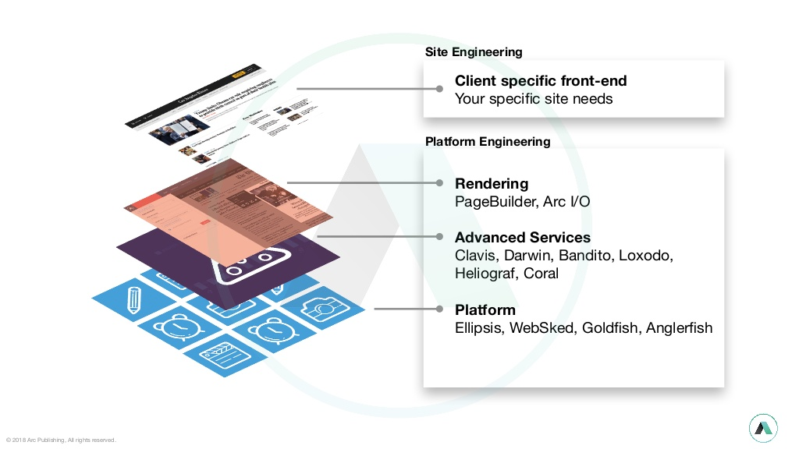

# Summary

## 개념

- **Digital Publishing**을 위한 **Content Management System**.
- Washington Post에서 만들었으며 주로 뉴스 저작물에 사용됨.

## 기능, 특징

- **Composer**: 페이지를 간단하게 조립하여 구성할 수 있는 기능. 디자인 요소가 적은 간단한 아티클 작성에는 적합함. 
- **WebSked**: Content Publishing의 Planning, Scheduling 관리 기능. 날짜, 시간, 상태 등을 예약하여 정해진 시점에 정확한 컨텐츠를 배포할 수 있음. 
- **PageBuilder**: 여러 컨텐츠를 연동하여 복잡한 Template/Page를 구성해낼 수 있는 기능. 동일한 형태에 내용만 다른 Page들을 Template을 통해 대량 생산할 수 있음. 
- **Photo Center** : 사진 관리 시스템. 대용량 사진 저장, 사진 수정 및 정보 관리, 사진 분류 등 가능. 
- **Video Center** : 비디오 관리 시스템. 대용량 동영상 저장, 라이브 방송, 자막 등을 사용할 수 있고 모바일 앱/웹/스마트TV 등 다양한 환경 지원. 
- **Bandito**: 여러 컨텐츠에 대해 A/B 테스트를 제공해주는 기능. 
- **Advertising**: 간단한 광고를 게재할 수 있는 기능. 
- **Clavis**: AI 기반 개인화 추천 기능. 
- **Subscriptions**: 구독 기능. 고객이 서비스를 구독하면 그에 맞는 적절한 컨텐츠를 제공하고 결제 및 청구까지 처리할 수 있음. 

## 도입 시 기대 효과

- **쉽고 빠른 컨텐츠 생성** : Composer, PageBuilder를 통해 비교적 손쉽게 컨텐츠를 만들어낼 수 있음. 
- **글로벌 지원** : WebSked를 사용해 여러 국가에 각각의 Timezone에 정확하게 맞추어 적절한 컨텐츠를 오픈하는 계획적인 시나리오가 가능함.
- **Digital Asset의 효과적 관리** : Photo/Video Center가 내장되어 있어 컨텐츠 주요 요소가 되는 Digital Asset들을 분산시키지 않고 통합된 플랫폼 위에서 관리할 수 있음. 

## 도입 시 우려되는 점

- **중복 비용 발생**: 또 다른 Content Management System인 ICS를 도입중이며 2020년 초까지 도입 완료 예정. 비슷한 솔루션을 도입하는데 시간과 비용이 들어갔으며 중국 브랜드 웹사이트에도 이미 ICS를 전진 배치한 상태. 
- **Reference 미비**: 국내에서는 도입한 예시를 찾아보기 힘들고, 외국에서도 Arc Publishing의 가이드나 관련 문서를 찾아보기 어려움. 
- **Customizing 가능 여부 불투명**: 공식 메일을 통해 Arc Publishing 담당자에게 어려 번 Demo를 요청하였음에도 불구하고 원하는 수준의 답을 받기는 어려웠음. 이것으로 미루어보아 솔루션의 Customizing이 필요할 경우 진행이 어려울 가능성이 높을 것으로 예상됨. 

## Why or Why not Arc Publishing?

- Template을 잘 설계/개발할 경우 개발을 전혀 모르는 사람도 쉽고 빠르게 수준 높은 컨텐츠를 만들 수 있다. 이건 기대 효과랑 동일한거 아닌가?

# Detail

- Cloud-based SaaS, AWS에 포커스된 Multitenant headless CMS. CDN은 Akamai. JSP/React 기반 개발. 
- DevOps 지원. CI/CD Pipeline 구성 가능.
- 뉴스 출판사의 요구사항에 포커스 (Boston Globe, Tribune Publishing, Raycom Media를 포함하여 전 세계 600 개 이상의 웹 사이트가 Arc 기반)

## 기능

### Composer

페이지를 간단하게 구성할 수 있는 wysiwyg editor. 디자인 요소가 많은 페이지 작성은 어려워보이지만, 심플한 아티클 작성에는 적합해보임. 

### WebSked

Content Publishing의 Planning, Scheduling 관리. 뉴스 출판사에는 적합해보이나 브랜드 웹사이트에 어떤 value를 줄 수 있을지는 확인 필요. 

### PageBuilder

각 모듈을 선택/배치/구성하여 만들어진 템플릿/페이지를 렌더링하는 엔진. 

또한 API/DB를 통해 타사/내부 시스템의 모든 컨텐츠를 렌더링할 수 있음. 

AMP용 템플릿이 포함되어 Google SEO에 이점 있음. 

다만 모듈 개발이 JSP or React 기반인지 등 정확한 tech stack 확인 필요. 

### Photo Center (Anglerfish)

사진 관리 시스템. batch upload, photo assignments, gallery editing and photographer-friendly curation and editing workflows.

### Video Center (Goldfish)

비디오 관리 시스템. Arc’s online video platform. native apps, mobile web and smart TVs도 지원.

### Bandito

dynamic page test

### Clavis

AI 기반 개인화 추천

## Pricing

- Editor without CMS : 사용자 수 및 툴 사용량 기반 가격 책정, 데이터 저장 및 지원에 대한 추가 요금. 
    - Composer
    - Photo Center
    - Video Center
    - WebSked
    - Bandito
    - Clavis
    - 24/7 tech support
- Full CMS : 월별 사이트 트래픽 기반 가격 책정, 데이터 저장 및 지원에 대한 추가 요금. 
    - Composer
    - PageBuilder
    - Photo Center
    - Video Center
    - WebSked
    - Bandito
    - Clavis
    - CDN (Akamai), WAF
    - 24/7 tech support

## Pros & Cons

- Pros
    - Composer, PageBuilder를 통한 손쉬운 페이지 작성. ICS 액션필드 대비 JSP로 고급기능 개발가능
    - Photo/Video Center 내장
    - AWS 기반 SaaS로 인프라 등 관리 소요 없음
- Cons
    - Headless CMS로 Presentation 부분은 고민 필요할 수 있음
    - Reference가 적고 React 유지보수 인력 충원 어려움
    - SaaS 기반으로 솔루션 커스터마이징 여부 불투명

## Architecture

# References
- [The Washington Post Case Study – AWS](https://aws.amazon.com/ko/partners/success/washington-post-stelligent/) 
- [What is PageBuilder? - Arc Confluence](https://arcpublishing.atlassian.net/wiki/spaces/PD/pages/13336785/What+is+PageBuilder) 
- [Activity feed - Arc Confluence](https://arcpublishing.atlassian.net/wiki/discover/all-updates) 
- [Arc Publishing](https://www.arcpublishing.com/) 
- [demo.arcpublishing.com](http://demo.arcpublishing.com/) 
- [Arc Publishing on GitBook (Legacy)](https://arcpublishing.gitbooks.io/getting-up-and-running-with-arc/content/chapter1/pagebuilder.html) 
- [github - The Washington Post](https://github.com/washingtonpost) 
- [PageBuilder and You: A giude to getting started with tronc&#39;s (LATMG&#39;s?) PageBuilder repository](https://gist.github.com/mhoofman/ede1de12b7cb41b0dd113ebc2080114d) 
    
