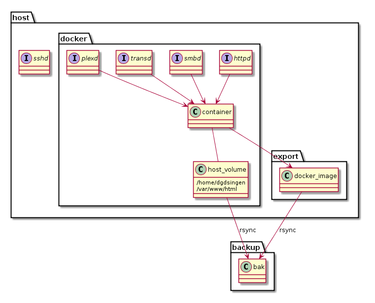

# Install


## Ubuntu


```sh
sudo apt install docker.io
```

## Mac

유료화 되는 Docker Desktop 대신 Docker Machine을 사용해보자

> k8s를 사용한다면 [k8s.md](k8s.md) 를 참조(`minikube docker-env`)하여 docker-machine 대신 minikube를 사용하자

```sh
brew install docker docker-machine docker-compose
brew install --cask virtualbox virtualbox-extension-pack
# virtualbox 설치시 설치 실패하면 System Preferences -> Security & Privacy 로 가서 자물쇠 unlock 하면 Allow가 하나 뜨는데 눌러준 뒤 다시 설치해준다.

docker-machine create --driver virtualbox default
docker-machine ls
docker-machine env default
```

```sh
# env를 자동 설정하려면 .bashrc .zshrc에 아래와 같이 추가해주자.
if command -v docker-machine &> /dev/null; then
    eval $(docker-machine env default)
fi
```

```sh
# docker-desktop을 쓰다가 docker-machine으로 옮기는 경우 docker-compose up 등이 여전히 docker-desktop을 찾으며 에러가 나는 경우가 있다. 
# 이 때는 ~/.docker/config.json에 "desktop"으로 남아있는 설정 부분을 지워준다.
```

```sh
# 또한 container들이 localhost로 접근되지 않는데, 이 때는 아래와 같이 dhost 함수를 .bashrc .zshrc에 추가해주자.
# 이후 dhost 실행시 docker vm을 dhost 도메인으로 접근할 수 있다. ex: http://dhost:8080
if command -v docker-machine &> /dev/null; then
    eval $(docker-machine env default)

    function dhost() {
        sudo cp /etc/hosts /etc/hosts.bak
        sudo bash -c "cat /etc/hosts.bak | egrep -v ' dhost' > /etc/hosts"

        docker_host=`docker-machine ip default`
        sudo bash -c "echo '${docker_host} dhost' >> /etc/hosts"
    }
fi
```


# Config

## Docker Daemon의 TCP IP:PORT 설정

```sh
sudo vi /etc/systemd/system/docker.service.d/docker.conf

[Service]
ExecStart=
ExecStart=/usr/bin/dockerd -H tcp://0.0.0.0:2375 -H unix:///var/run/docker.sock
```

```sh
systemctl daemon-reload
systemctl restart docker.service
```

## tzdata 설치시 Timezone 선택 때문에 Dockerfile build 불가능한 경우

```dockerfile
ARG DEBIAN_FRONTEND=noninteractive
ENV TZ=Asia/Seoul

RUN apt-get install -y tzdata
```

## /bin/s


```sh
if [ "${1}" -eq 1 ]; then
    # into container's terminal
    sudo docker run --name myserver1 -v /var/www/html:/var/www/html -v /home/dgdsingen:/home/dgdsingen -p 80:80 -i -t myserver
elif [ "${1}" -eq 2 ]; then
    # run container as a daemon
    sudo docker run -d --name myserver1 -v /var/www/html:/var/www/html -v /home/dgdsingen:/home/dgdsingen -p 80:80 myserver /bin/bash -c "/etc/rc.local"
fi
```

## /root/.bashrc


```sh
export LANG="ko_KR.UTF-8"
```

## /etc/rc.local


```sh
/usr/sbin/apache2ctl -D FOREGROUND
exit 0
# init
sudo docker run -i -t ubuntu

# setup in container
apt update
apt install apache2 php5.6 vim jdk graphviz...

# run container
sudo docker run --name myserver1 -v /var/www/html:/var/www/html -v /home/dgdsingen:/home/dgdsingen -p 80:80 -i -t myserver
sudo docker run -d --name myserver1 -v /var/www/html:/var/www/html -v /home/dgdsingen:/home/dgdsingen -p 80:80 myserver /bin/bash -c "/etc/rc.local"

# stop & kill container
sudo docker stop myserver1
sudo docker rm myserver1
sudo docker rm -f myserver1

# save & load images
sudo docker commit server1 server
sudo docker save server -o server.tar
sudo docker load -i server.tar

# copy files container
sudo docker cp wiki server1:/var/www/html

# backup volume
sudo docker run --rm -v data:/data -v $(pwd)/docker:/docker server tar cvfP /docker/data.tar /data
```

## run docker commands without root permission


```sh
sudo usermod -aG docker dgdsingen
sudo reboot
```

## auto restart

아래 옵션 넣어서 컨테이너 실행시 도커가 실행 될 때 자동으로 컨테이너도 기동됨. 단 docker stop 명령어로 종료했을 경우에는 재기동하지 않음. 그 경우에는 docker restart 명령어를 사용해서 컨테이너를 수동으로 재시작 해줘야 한다.

```sh
docker run --restart=unless-stopped
```

 

# Backup


## by rsync



# Sample

## Dockerfile

```dockerfile
FROM ubuntu

# Copy dependencies
COPY .ssh /root/.ssh
RUN chmod 600 /root/.ssh/id_rsa

# Install applications
RUN apt-get update
RUN apt-get install -y curl wget
RUN apt-get install -y apt-transport-https
RUN apt-get install -y vim
RUN apt-get install -y openjdk-8-jdk
RUN apt-get install -y python-pip
RUN apt-get install -y git
RUN apt-get install -y maven
RUN apt-get install -y p7zip-full
RUN apt-get install -y mp4v2-utils
RUN apt-get install -y ffmpeg
RUN apt-get install -y libsubtitles-perl
RUN apt-get install -y command-not-found
RUN apt-get install -y bash-completion
RUN apt-get install -y language-pack-ko

RUN pip install --upgrade yt-dlp

RUN apt-get -y upgrade
RUN apt-get -y autoremove

# Git clone
RUN git config --global core.editor vim
RUN git config --global core.eol lf
RUN git config --global core.autocrlf input
RUN git config --global user.name "dgdsingen"
RUN git config --global user.email dgdsingen@gmail.com
RUN git clone git@github.com:dgdsingen/me.git ~/me

# Set vim
RUN mkdir -p ~/.vim/autoload
RUN wget https://raw.githubusercontent.com/junegunn/vim-plug/master/plug.vim -O ~/.vim/autoload/plug.vim
RUN cp ~/me/programming/.vim/vimrc ~/.vim/vimrc

# Set bashrc
RUN mv ~/.bashrc ~/.bashrc.bak
RUN cp ~/me/platform/linux/.bashrc ~/.bashrc
RUN . ~/.bashrc

# Set custom scripts
RUN cp -R ~/me/platform/linux/usr/local/bin/* /usr/local/bin
RUN chmod -R +x /usr/local/bin/*

# Locale
ENV LANG ko_KR.UTF-8
ENV LANGUAGE ko_KR.UTF-8
ENV LC_ALL ko_KR.UTF-8

# Clean
RUN rm -rf ~/me
```

## Commands

```sh
# copy dependencies
xcopy %HOMEPATH%\.ssh .\.ssh /d /c /i /h /k /e /y

# build
docker build --tag ubuntu:me .

# clean dependencies
rmdir .\.ssh /q /s

# run container - s.bat
docker run --name ubuntu-me -v C:\Users\dgdsi:/data -dit ubuntu:me
docker exec -it ubuntu-me /bin/bash

# commit container to image - c.bat
docker commit ubuntu-me ubuntu:me

# remove container - d.bat
docker rm -f ubuntu-me

# remove containers that in 'exited' status
docker rm -f $(docker ps -aq -f "status=exited")
```


# Issues

## Containerization을 위한 고려 사항들

- ip 기반 방화벽
- ip 기반 IAM
- Monitoring :  Intermax sidecar in image?
- Logging
- Volume

## Image 내 Library Dependency 확인하기

- [Syft](https://github.com/anchore/syft)를 설치하고 아래와 같이 실행하면 된다.

```sh
syft gcr.io/test-container-image

# 그러면 아래와 같이 결과가 나온다.
 ✔ Pulled image            
 ✔ Loaded image            
 ✔ Parsed image            
 ✔ Cataloged packages      [636 packages]
NAME                                    VERSION                                    TYPE         
HikariCP                                3.4.5                                      java-archive
adduser                                 3.118                                      deb
argparse                                1.2.1                                      python
...
```

- [Grype](https://github.com/anchore/grype)를 사용하면 vulnerability scanning도 된다.


## image history 모두 보기

```sh
docker history image_id --no-trunc
```


## Docker Desktop 유료화

Docker Desktop이 유료화 됩니다. (Docker가 아니라 Docker Desktop입니다)

> https://www.docker.com/blog/updating-product-subscriptions/

- Docker Desktop, 250명 이상 or 연매출 120억원($10m) 이상의 회사는 유료 Plan을 사용해야 합니다.
    - 유료 Plan: Pro $5/월, Team $7/월, Business $21/월
    - 해당 약관은 2021-08-31부터 유효합니다.
    - 유료 Plan으로의 변경은 2022-01-31까지 유예 기간이 주어집니다.
- 개인 사용자는 여전히 무료입니다. Plan 명칭은 Free => Personal 로 변경됩니다.
- Docker Engine/CLI/Compose는 변경 없습니다. Docker Desktop만 해당됩니다. 즉 Linux는 해당 없으며, Windows/Mac 사용자가 영향을 받게 됩니다.
- Docker Desktop 없이 Docker 사용하기: https://blog.bsk.im/2021/09/07/macos-docker-without-docker-feat-minikube-ko/


# References

- [컨테이너란? 리눅스의 프로세스 격리 기능](https://www.44bits.io/ko/keyword/linux-container)
- [컨테이너 네트워크 기초 1편 - UTS 네임스페이스를 사용한 호스트네임 격리](https://www.44bits.io/ko/post/container-network-1-uts-namespace)
- [컨테이너 네트워크 기초 2편 - Uip로 직접 만들어보는 네트워크 네임스페이스와 브리지 네트워크](https://www.44bits.io/ko/post/container-network-2-ip-command-and-network-namespace)
- [veth: 리눅스 가상 이더넷 인터페이스란?](https://www.44bits.io/ko/keyword/veth)
- [컨테이너 기초 - chroot를 사용한 프로세스의 루트 디렉터리 격리](https://www.44bits.io/ko/post/change-root-directory-by-using-chroot)
- [도커 컨테이너는 가상머신인가요? 프로세스인가요?](https://www.44bits.io/ko/post/is-docker-container-a-virtual-machine-or-a-process)
- [Docker](https://www.docker.com/) 
- [Docker Hub](https://hub.docker.com/) 
- [Docker Training](https://training.docker.com/) 
- [Docker - Github](https://github.com/docker) 
- [Docker Docs](https://docs.docker.com)
- [Deployment Automation using Python](https://subicura.com/2016/06/07/zero-downtime-docker-deployment.html)
- [Named Volume](http://serverfault.com/questions/750868/how-to-decide-between-a-docker-volume-container-and-a-docker-volume)
- [How should I backup & restore docker named volumes?](http://stackoverflow.com/questions/38298645/how-should-i-backup-restore-docker-named-volumes)
- [Named Volume Explained](https://madcoda.com/2016/03/docker-named-volume-explained)
- [nginx-php-fpm](http://webprogblog.com/?page=15)
- [Cheat Sheet](https://gist.github.com/nacyot/8366310)
- [Guide Book](https://www.kencochrane.net/blog/2013/08/the-docker-guidebook)
- [Save & Load Images](https://www.jamescoyle.net/how-to/1512-export-and-import-a-docker-image-between-nodes)
- [Save & Load Volumes](https://docs.docker.com/engine/tutorials/dockervolumes/#/backup-restore-or-migrate-data-volumes)
- [한글 깨짐 이슈](http://forum.falinux.com/zbxe/?mid=lecture_tip&l=ru&page=4&m=1&document_srl=808302)
- [가장 빨리 만나는 Docker](http://pyrasis.com/docker.html) 
- [왜 굳이 Docker(컨테이너)를 써야 하나요?](https://www.44bits.io/ko/post/why-should-i-use-docker-container) 
- [도커 이미지 빌드와 Dockerfile 기초](https://www.44bits.io/ko/post/building-docker-image-basic-commit-diff-and-dockerfile)
- [만들면서 이해하는 도커(Docker) 이미지: 도커 이미지 빌드 원리와 OverlayFS](https://www.44bits.io/ko/post/how-docker-image-work) 
- [scratch 도커 이미지를 활용한 초경량 이미지 만들기](https://www.44bits.io/ko/post/static-compile-program-on-chroot-and-docker-scratch-image) 
- [초보를 위한 Docker 안내서 - Docker란 무엇인가?](https://subicura.com/2017/01/19/docker-guide-for-beginners-1.html) 
- [초보를 위한 Docker 안내서 - 설치하고 컨테이너 실행하기](https://subicura.com/2017/01/19/docker-guide-for-beginners-2.html) 
- [초보를 위한 Docker 안내서 - 이미지 만들고 배포하기](https://subicura.com/2017/02/10/docker-guide-for-beginners-create-image-and-deploy.html) 
- [Get Docker CE for Ubuntu](https://docs.docker.com/install/linux/docker-ce/ubuntu/) 
- [Docker and OOM(Out Of Memory) Killer](https://blog.2dal.com/2017/03/27/docker-and-oom-killer/) 
- [Docker를 이용한 웹서비스 무중단 배포하기](https://subicura.com/2016/06/07/zero-downtime-docker-deployment.html) 
- [Spring Boot와 Docker](http://wonwoo.ml/index.php/post/268) 
- [Spring Boot와 Docker를 이용한 MSA](https://www.slideshare.net/mobile/heungrae_kim/spring-boot-docker-msa) 
- [Docker Compose 활용법 - 개발 환경 구성하기](http://raccoonyy.github.io/docker-usages-for-dev-environment-setup/) 
- [Docker Compose](http://avilos.codes/infra-management/virtualization-platform/docker/docker-compose/) 
- [쓸만한 Docker Image 만들기 - Part 2](https://www.sauru.so/blog/build-usable-docker-image-part2/) 
- [리눅스 서버에서 sudo 없이 docker 실행하기](https://www.slipp.net/questions/485) 
- [Docker Image/Container 전체 삭제](https://eclipse4j.tistory.com/256) 
- [컨테이너 기반 워크플로우 솔루션 Argo](http://bcho.tistory.com/1299) 
- [Docker Network 구조(1) - docker0와 container network 구조](http://bluese05.tistory.com/15) 
- [Docker 이미지 크기를 줄이는 방법 – 실용주의 이야기](http://pragmaticstory.com/?p=444) 
- [(번역) Haproxy와 Docker를 이용한 로드밸런싱 · Mrchypark](https://mrchypark.github.io/post/%EB%B2%88%EC%97%AD-haproxy%EC%99%80-docker%EB%A5%BC-%EC%9D%B4%EC%9A%A9%ED%95%9C-%EB%A1%9C%EB%93%9C%EB%B0%B8%EB%9F%B0%EC%8B%B1/) 
- [Assign IP on Docker Container](https://blog.leocat.kr/notes/2016/12/24/docker-assign-ip-on-docker-container) 
- [docker for window 환경 kubernetes dashboard 생성 | 이재욱이의 개발 이야기](https://lejewk.github.io/docker-for-window-kubernetes-dashboard/) 
- [Docker #3. 데이터 볼륨(Data Volume)과 데이터 볼륨 컨테이너(Data Volume Container)](https://devowen.com/255) 
