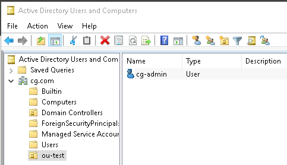
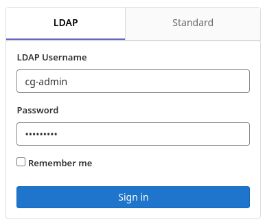

# Nexus

## Install

> https://hub.docker.com/r/sonatype/nexus3/

```sh
sudo docker run -d -p 8081:8081 --name nexus -v /home/ubuntu/nexus-data:/nexus-data --restart unless-stopped sonatype/nexus3
```

Admin Password는 `/nexus-data/admin.password` 파일을 참조한다.


## Nexus 3 admin password 초기화

```sh
docker exec -it -u 0 containerID bash

java -jar /opt/sonatype/nexus/lib/support/nexus-orient-console.jar
```

```sql
connect plocal:/nexus-data/db/security admin admin

select * from user;

update user SET password="$shiro1$SHA-512$1024$NE+wqQq/TmjZMvfI7ENh/g==$V4yPw8T64UQ6GfJfxYq2hLsVrBY8D1v+bktfOxGdt4b/9BthpWPNUy/CBk6V9iA0nHpzYzJFWO8v/tZFtES8CA==" UPSERT WHERE id="admin"
```

이후 Container restart 하면 default 값(admin123)으로 초기화된다.


# GitLab

## Install

.envrc

```sh
# volume mount
export GITLAB_HOME=$PWD/gitlab
```

docker-compose.yml

```yaml
version: "3"

services:
  gitlab:
    image: 'gitlab/gitlab-ce:latest'
    restart: always
    hostname: 'localhost'
    ports:
      - 80:80
      - 443:443
      - 22:22
    volumes:
      - '$GITLAB_HOME/config:/etc/gitlab'
      - '$GITLAB_HOME/logs:/var/log/gitlab'
      - '$GITLAB_HOME/data:/var/opt/gitlab'
```

## Config LDAP



- AD가 위와 같은 경우 GitLab과 연동하는 설정을 아래 기술한다. 

> 참조 : [GitLab Docs - LDAP](https://docs.gitlab.com/ee/administration/auth/ldap/) 

```sh
# sudo vi /etc/gitlab/gitlab.rb
gitlab_rails['ldap_enabled'] = true
gitlab_rails['prevent_ldap_sign_in'] = false
gitlab_rails['ldap_servers'] = YAML.load <<-'EOS'
  main:
    label: 'LDAP'
    host: 'x.x.x.x' # IP address or domain name of your LDAP server.
    port: 389
    uid: 'sAMAccountName' # LDAP attribute for username. Should be the attribute, not the value that maps to the uid.
    #bind_dn: 'cn=Administrator,cn=Users,dc=cg,dc=com' # The full DN of the user you bind with.
    bind_dn: 'cn=cg-admin,ou=ou-test,dc=cg,dc=com' # The full DN of the user you bind with.
    password: 'xxxx' # The password of the bind user.
    encryption: 'plain' # Encryption method. The method key is deprecated in favor of encryption. "start_tls" or "simple_tls" or "plain"
    #verify_certificates: true
    smartcard_auth: false
    active_directory: true # This setting specifies if LDAP server is Active Directory LDAP server. For non-AD servers it skips the AD specific queries. If your LDAP server is not AD, set this to false.
    allow_username_or_email_login: false
    lowercase_usernames: false
    block_auto_created_users: false
    base: 'dc=cg,dc=com' # Base where we can search for users.
    user_filter: ''
    attributes:
      username: ['uid', 'userid', 'sAMAccountName']
      email:    ['mail', 'email', 'userPrincipalName']
      name:       'cn'
      first_name: 'givenName'
      last_name:  'sn'
    ## EE only
    #group_base: ''
    #admin_group: ''
    #sync_ssh_keys: false
EOS

# Reconfigure GitLab for the changes to take effect
gitlab-ctl reconfigure

# Test LDAP Connection
gitlab-rake gitlab:ldap:check
```


이후 GitLab에서 LDAP 타입을 선택하여 Username에 AD의 User logon name을 넣고 로그인하면 된다. 




## Git branch 전략

- [GitFlow](https://www.atlassian.com/git/tutorials/comparing-workflows/gitflow-workflow)에서 release/feature/hotfix branch를 간소화한 버전입니다. 
  
- 기본 branch는 서버 환경별로 1개씩 사용합니다. 기본 branch의 소스는 각 서버 환경 배포 상태와 동일하게 유지합니다. 
  
    - dev branch = 개발(dev) 서버 환경
    - stg branch = 스테이징(stg) 서버 환경
    - main(master) branch = 운영(prd) 서버 환경
        - > 전통적으로 git의 기본 branch명은 master였습니다. 그러나 master/slave라는 용어가 인종차별적/주종 관계 요소로 받아들여질 수 있어 master라는 명칭을 main으로 변경하는 추세입니다. 이에 따라 기존에 master로 생성한 branch를 계속 사용하셔도 되고 새로 main branch를 사용하셔도 되지만, 본 문서에서는 이하 main으로 표기합니다. 
        - > 관련해서 Git 2.28부터 기본 브랜치를 변경(master -> main)할 수 있는 기능이 추가되었습니다. `git config --global init.defaultbranch main` 와 같이 설정하면 됩니다. 
    - 만약 추가적으로 qa 서버 환경 등이 존재한다면 그에 맞게 qa branch 등 추가 생성합니다. 
    
- 이후 개발 업무 진행시 프로세스는 아래와 같이 진행합니다. 
    - 기능 개발시에는 dev branch로부터 feature branch(branch명 자유)를 생성하여 개발하고, 개발 완료 후 dev branch로 merge 합니다. 
        - feature branch는 특별히 공유할 필요가 없다면 local 저장소에서만 관리합니다. 개발이 완료되면 dev branch에 merge하여 다른 사람들과 공유합니다.
    - 이후 dev branch에서 stg branch로 merge하여 테스트하고, stg branch에서 main branch로 merge하여 운영 배포합니다. 
    - 운영 긴급 오류건 hotfix 개발시에는 main branch로부터 hotfix branch(branch명은 자유)를 따서 개발하고, 테스트 완료 후 main branch에 merge하여 운영 긴급 배포한 뒤 stg/dev branch로 merge 합니다. 
        - feature와 hotfix branch는 본질적으로 같습니다. 차이점은 분기하는 branch가 dev냐 main이냐 뿐입니다. 그러므로 엄격하게 분리하여 명명하고 관리할 필요가 없습니다. 
    - release branch는 사용하지 않습니다. 버전 등 필요시 tag로 처리합니다. 
    - 이를 Diagram으로 나타내면 아래와 같습니다. 

```
Branch : feature        dev          stg          main        hotfix
            |            |            |            |            |
            |<-----------+            |            |            |
            | start      |            |            |            |
            |            |            |            |            |
            +----------->|            |            |            |
            | merge      |            |            |            |
            |            +----------->|            |            |
            |            | merge      |            |            |
            |            |            +----------->|            |
            |            |            | merge      |            |
            |            |            |            +----------->|
            |            |            |            | start      |
            |            |            |            |            |
            |            |            |            |<-----------+
            |            |            |            | merge      |
            |            |            |<-----------+            |
            |            |            | merge      |            |
            |            |<-----------+            |            |
            |            | merge      |            |            |
            |            |            |            |            |
Server :  local         dev          stg          prd         local
```

- dev branch에 여러 개의 feature branch가 merge 되었는데 그 중 하나만 골라서 운영 배포하는 상황이 발생할 경우, 아래와 같이 feature branch에서 stg/main branch로 merge 하시면 됩니다. 

```
Branch : feature        dev          stg          main
            |            |            |            |
            |<-----------+            |            |
            | start dev1 |            |            |
            |            |            |            |
            |<-----------+            |            |
            | start dev2 |            |            |
            |            |            |            |
            +----------->|            |            |
            | merge dev1 |            |            |
            |            |            |            |
            +----------->|            |            |
            | merge dev2 |            |            |
            |            |            |            |
            +------------+----------->|            |
            | merge dev1 |            |            |
            |            |            |            |
            +------------+------------+----------->|
            | merge dev1 |            |            |
            |            |            |            |
Server :  local         dev          stg          prd
```


## Pipeline

- Repository 생성
    - 최초 Repository 생성은 Maintainer 권한을 가진 사용자가 생성
    - 프로젝트를 생성 후 최초 소스를 master origin에 push
        - ```sh
            git init
            git remote add origin http://gitlab.test.com/test/example.git
            git add .
            git commit -m "init"
            git push -u origin master
            ```
    - 최초 생성된 master 브랜치로부터 develop 브랜치를 생성한다.
    - Repository 권한 부여 by Admin/Owner
- GitLab > Admin Area > Overview > Runners > Runner 선택 > Assigned projects에 Project 추가
- 권한설정
    - GitLab > Repo 선택 > Settings > Repository > Protected Branches > develop 브랜치에 Protected 설정
    - master, develop 브랜치는 보통 protected로 설정되어 있어서 빌드/배포가 가능하다.
    - 개발자는 develop 브랜치에 대한 merge 권한만 주고, push 권한은 제외해 개발자는 feature를 통해서 merge 하도록 한다. 다만 hotfix는 Developer에도 모든 권한을 준다.
    - GitLab > Repo 선택 > Settings > Repository > Protected Tags > Protected Tags 설정
    - Protected Tags 설정을 해야만 Tag에 의한 운영 배포 시 Protected 하게 설정된 글로벌 변수를 사용할 수 있다.
    - Protected Tags 설정이 된 Tag 들을 부득이하게 삭제 할 경우 Protected를 풀어줘야 한다.(삭제 후 재설정)
    - 프로젝트에 대한 담당 개발자에게 개발 권한을 준다.
- 개발자 로컬에 `git clone ${repo}` 
- 기능 개발 (feature > develop)
    - 새로운 기증을 개발하기 위해 feature 브랜치 생성
        - ```sh
            git checkout -b feature/test1
            ```
    - 개발이 완료되면 Gitlab 서버에 feature 브랜치를 push
        - ```sh
            git commit -a -m "test1"
            git push origin feature/test1
            ```
    - feature 브랜치를 develop 브랜치에 merge
    - develop 브랜치의 pipeline이 성공 여부를 확인 후 dev 환경에서 테스트를 한다.
- Staging 배포
    - 개발환경에서 테스트가 통과하면, master 브랜치에 merge request를 한다.
    - merge request 요청을 받고, 담당 Maintainer가 review & merge를 진행한다.
    - master 브랜치의 pipeline이 성공여부를 확인 후 스테이지 환경에서 테스트를 한다.
- Production 배포
    - 스테이지 환경에서 Maintainer가 테스트가 통과하면, 태깅 작업을 통해 운영환경에 배포한다.
    - Tag name은 protected 설정된 글로벌 변수를 사용하기 위해 protected tag에 설정한 패턴에 따른다. 현재 protected tag는 prod-* 로 되어있다.
    - master 브랜치로부터 태깅한다. develop 브랜치로 태깅시 운영환경 빌드 과정에서 오류가 발생한다.
    - 이전 master 커밋에 대한 Tag 작업은 해당 커밋 화면에서 진행 할 수 있다. 해당 commit > Options > Tag 클릭
    - 운영환경의 파이프 라인을 통해 배포 확인 후 운영환경에서 해당 기능을 점검한다.


# Jenkins

## Install

.envrc

```sh
# volume mount
export JENKINS_HOME=$PWD/jenkins
```

docker-compose.yml

```yaml
version: "3"

services:
  jenkins:
    image: 'jenkins/jenkins:lts'
    ports:
      - 8080:8080
      - 50000:50000
    volumes:
      - '$JENKINS_HOME:/var/jenkins_home'
```

## Config LDAP


- AD가 위와 같은 경우 GitLab과 연동하는 설정을 아래 기술한다. 
- Jenkins > Jenkins 관리 > Configure Global Security > Security Realm > Select LDAP
    - Server : AD's IP or Domain
    - root DN : ou=ou-test,dc=cg,dc=com
    - User search filter : sAMAccountName={0}
    - Manager DN
        - cn=Administrator,cn=Users,dc=cg,dc=com
        - cn=cg-admin,ou=ou-test,dc=cg,dc=com
    - Manager Password : xxxx
- 이후 Test LDAP Settings를 클릭하여 로그인 테스트를 해볼 수 있다. 
- 다만 위와 같이 설정하고 끝내버리면 기본적으로 모든 LDAP 계정이 Jenkins Admin 권한을 가지게 되므로, 아래와 같이 권한 설정을 해준다.
    - Jenkins > Jenkins 관리 > Configure Global Security > Security Realm > Select LDAP
    - Advanced Configuration > Authorization > Select Project-based Matrix Authorization Strategy
        - Admin 권한이 필요한 계정은 Overall > Select Administer
        - 일반 User 권한이 필요한 계정은 Overall > Select Read
    - 이후 Project 별로 User에 권한을 줄 때는 아래와 같이 설정해준다. 
        - Jenkins > Project 선택 > 구성 > General > Enable project-based security > Add user or group > 계정명 입력 > 필요한 권한 선택


# Pipeline

## GitLab - Jenkins 연동

### GitLab push webhook to Jenkins

- Jenkins > Jenkins 관리 > 플러그인 관리 > GitLab Plugin 설치
- GitLab > Admin Area > Users > New user > jenkins용 계정 생성
    - ~~이후 해당 계정의 Impersonation Tokens 탭으로 가서~~
    - ~~api, read_user, read_api, read_repository, sudo 권한으로 Create impersonation token 버튼을 눌러 token을 생성한다.~~ 
- ~~Jenkins > Jenkins 관리 > Manage Credentials > Jenkins > Global Credentials > Add Credentials~~
    - ~~에서 GitLab API Token 타입을 선택하여, 위 GitLab에서 생성한 token 값을 저장한다.~~ 
- ~~Jenkins > Jenkins 관리 > 시스템 설정 > GitLab~~
    - ~~영역에 Gitlab host URL을 넣고 (만약 docker compose를 사용했다면 service명 gitlab을 넣어주면 된다)~~
    - ~~앞서 미리 만든 GitLab API Token 타입 Credential을 선택한다.~~ 
- ~~Jenkins > Jenkins 관리 > Manage Users > 사용자 생성~~
    - ~~pipeline용 계정을 생성한다.~~ 
- Jenkins > 새로운 Item > Freestyle project
    - 빌드 유발 > Build when a change is pushed to GitLab. GitLab webhook URL: http://localhost:8080/project/app
    - 빌드 유발 > 고급 > Secret token > Generate
- GitLab > Repository 선택 > Settings > Webhooks
    - URL에는 위 Jenkins에서 생성한 Gitlab용 webhook URL을 넣고
    - Secret token에 위 Jenkins에서 생성한 Secret token을 넣는다. 
    - 만약 여기서 localhost는 URL로 추가할 수 없다는 경우 아래와 같이 진행한다. 
        - GitLab > Admin Area > Settings > Network > Outbound requests
            - Allow requests to the local network from web hooks and services 체크
            - Local IP addresses and domain names that hooks and services may access 영역에 URL 추가
- GitLab > Repository 선택 > 아무 파일이나 Push
    - 하면 Jenkins에서 Build가 수행되는 것을 테스트할 수 있다. 
- 만약 Webhook event 별로 테스트해보고 싶다면
    - GitLab > Repository 선택 > Settings > Webhooks > Hooks 선택 > Test

### Jenkins pull from GitLab

- Jenkins > Jenkins 관리 > Manage Credentials > Jenkins > Global Credentials > Add Credentials
    - 에서 Username with password 타입을 선택하여, GitLab 계정의 ID/PW 입력 (PW에 GitLab API Key Token값을 넣는다)
- Jenkins > Project 선택 > 구성 > 소스 코드 관리 > Git > URL, Credentials 추가
    - Credentials에서 앞서 미리 만든 Username with password 타입 Credential을 선택한다. 
- 이제 GitLab에서 Push 해서 Webhook으로 Jenkins Build가 실행되든, Jenkins에서 Build Now 하든 git pull을 받아오게 된다. 

### Jenkins deploy to CodeDeploy

- AWS > IAM > 역할 > 역할 만들기: https://docs.aws.amazon.com/ko_kr/codedeploy/latest/userguide/getting-started-create-service-role.html
    - AWS 서비스 > CodeDeploy
    - AWS 서비스 > EC2 > AmazonEC2RoleforAWSCodeDeploy
- AWS > S3 > 버킷 > 버킷 만들기
- AWS > EC2 > ALB, Auto Scaling Group 생성
    - AmazonEC2RoleforAWSCodeDeploy 롤을 적용해준다
    - 만약 CodeDeploy 대상 그룹을 ASG가 아니라 EC2로 할 것이라면 EC2 대상 Role로 AWSCodeDeployRole를 만들고 EC2에 해당 롤을 부여한다. 또한 DownloadBundle 과정에서 S3로 접속하여 zip 파일을 받아와야 하니 AmazonS3ReadOnlyAccess 역할도 부여해준다.
- AWS > EC2 > 인스턴스 > 연결
    - [CodeDeploy Agent 설치](#CodeDeploy) 
- AWS > CodeDeploy > 애플리케이션 > 애플리케이션 생성
    - 배포 그룹 생성 > 서비스 역할 ARN에 IAM에서 만든 Role ARN 입력
    - 잠깐 트래픽이 끊겨도 상관없는 DEV 환경이고 EC2가 고정되어 있으며 in-place 배포를 한다면 Load Balancer 옵션을 빼버리자. BlockTraffic, AllowTraffic 등의 event가 없어져 빠르게 배포된다.
- Jenkins > Jenkins 관리 > 플러그인 관리 > AWS CodeDeploy Plugin 설치
    - plugin 설치 실패하는 경우 https://plugins.jenkins.io/aws-java-sdk/#releases 에서 다운받아 수동으로 설치한다. [Jira - Jenkins 연동](#Jira - Jenkins 연동) 부분 참조
- Jenkins > Project 선택 > 구성 > 빌드 후 조치 > Deploy an application to AWS CodeDeploy 추가
    - AWS CodeDeploy Application Name : AWS > CodeDeploy > 애플리케이션 > CodeDeploy에서 생성한 애플리케이션 이름
    - AWS CodeDeploy Deployment Group : AWS > CodeDeploy > 애플리케이션 > CodeDeploy에서 생성한 배포 그룹 이름
    - AWS CodeDeploy Deployment Config : AWS > CodeDeploy > 배포 구성 > `CodeDeployDefault.OneAtATime` 등
    - AWS Region : `AP_NORTHEAST_2` 
    - S3 Bucket : AWS > S3 > 버킷 > CodeDeploy 용으로 생성한 버킷 이름
    - Use Access/Secret keys : AWS Access Key, AWS Secret Key in aws credentials
        - 이것보단 Use temporary credentials : arn:aws:iam::1234567890:role/CI-DEV-CodeDeploy 와 같이 Role을 사용하는게 더 좋다. 
- GitLab > Repository에 CodeDeploy용 파일 추가

`appspec.yml` 

```yaml
version: 0.0
os: linux
files:
  - source: /
    destination: /
permissions:
  - object: /
    pattern: "**"
    owner: root
    group: root
    mode: 644
    type:
      - file
  - object: /
    owner: root
    group: root
    mode: 755
    type:
      - directory
hooks:
  BeforeInstall:
    - location: scripts/backup.sh
      timeout: 300
      runas: root
  AfterInstall:
    - location: scripts/change_permissions.sh
      timeout: 300
      runas: root
  ApplicationStart:
    - location: scripts/start_server.sh
      timeout: 300
      runas: root
  ApplicationStop:
    - location: scripts/stop_server.sh
      timeout: 300
      runas: root
```

`backup.sh` 

```sh
mv -f /app.jar /app.jar.bak || true
```

`change_permissions.sh` 

```sh
chmod 775 /app.jar || true
```

`start_server.sh ` 

```sh
# 서버 프로세스를 background로 돌리고 stdout도 redirect 해준다. 안그러면 CodeDeploy ApplicationStart 과정에서 계속 foreground 프로세스 기다리다가 실패로 빠져버린다.
cd /
java -jar app.jar > /dev/null 2>&1 &
```

`stop_server.sh` 

```sh
kill $(pgrep -f 'java -jar app.jar')
sleep 5
```


- 이제 Jenkins에서 Build 후에 Repository 전체를 zip으로 묶어 S3 버킷에 업로드하고 CodeDeploy가 트리거링되며 appspec.yml 실행됨


> 만약 CodeDeploy에서 BlockTraffic이 너무 오래 걸린다면 EC2 > Target Group > Attribute > Edit > Deregistration delay 값을 낮춰준다.
>
> 만약 CodeDeploy에서 AllowTraffic이 너무 오래 걸린다면 EC2 > Target Group > Health Check > Edit > HealthyThresholdCount 값을 낮춰준다.


## Jira - GitLab 연동

- GitLab > Admin Area > Overview > Users > User 선택 > Impersonation Tokens > api scope으로 token 발급하여 Jira에 전달


## GitLab - Jira 연동

- GitLab > Setting > Integrations Settings > Jira
    - Active: Check
    - Trigger: Commit, Merge request
    - Web URL: Jira domain:port (http://jira.com:8080/)
    - Username or Email: username
    - Test settings and save changes 버튼 클릭
- 이후 Git commit message에 Jira issue 번호(ex: ISSUE-1)를 넣으면 Jira에 자동 연결된다. Jira에서 해당 링크 클릭시 GitLab으로 이동됨.


## Jira - Jenkins 연동

- Jira
    - Atlassian Marketplace에서 [Jira App 설치](https://docs.marvelution.com/jji/5.5.0/guides/quick-start-guide/) 
- Jenkins
    - https://docs.marvelution.com/jji/5.5.0/releases/jenkins/ 에서 Jira Integration for Jenkins Plugin을 받는다.
    - /var/lib/jenkins/plugins 에 hpi 파일을 넣고 서버 리스타트 하거나 
    - Jenkins > Jenkins 관리 > 플러그인 관리 > 고급 > 플러그인 올리기 > hpi 파일 선택하여 Plugin 설치한다.
    - Jira에서 설정 후 Jenkins > Jenkins 관리 > Jira Integration for Jenkins > Registration Token, Token Secret 등록


# CodeDeploy

## Install

> https://docs.aws.amazon.com/ko_kr/codedeploy/latest/userguide/codedeploy-agent-operations-install-ubuntu.html

```sh
sudo apt update; sudo apt install -y ruby-full wget
cd /home/ubuntu

# https://docs.aws.amazon.com/ko_kr/codedeploy/latest/userguide/resource-kit.html#resource-kit-bucket-names 참조
wget https://${bucket-name}.s3.${region-identifier}.amazonaws.com/latest/install
wget https://aws-codedeploy-ap-northeast-2.s3.ap-northeast-2.amazonaws.com/latest/install

chmod +x ./install
sudo ./install auto > /tmp/logfile

sudo service codedeploy-agent status
# codedeploy-agent 로그는 /var/log/aws/codedeploy-agent 에서 확인
```


Ubuntu 22.04에서는 ruby 3 버전이 설치되는데, 이 경우 CodeDeploy Agent가 설치되지 않는다. Ubuntu 20.04 설치해서 ruby 2 버전 기반으로 CodeDeploy 설치하는게 빠르다.


## Issues

- 스크립트 오류 : 잘못 입력된 스크립트 내용을 확인하여 내용을 수정할 수 있도록 가이드 전달. 스크립트 오류의 대부분은 배포 경로 및 명령어에 오타가 있는 경우 많이 발생
- already exist 오류 : 사전에 배포를 위해 사용된 배포파일이 정상적으로 삭제되지 않아 최신 배포 시 충돌이 발생하여 배포 실패. 정상적으로 삭제되지 않은 파일 혹은 디렉터리를 삭제하여 정상적으로 배포 프로세스가 동작하도록 지원
- 프로세스 소유 이슈 : 서비스 시작 명령어가 서비스 계정이 아닌 root 권한으로 수행되어 이상이 발생. codedeploy는 기본적으로 root 권한으로 수행이 되기 때문에 서비스 시작 시 `sudo –u <서비스계정> <명령어>` 로 서비스 시작할 수 있도록 가이드 전달
- 배포 미적용 : 배포는 정상적으로 수행되었으나 소스가 정상적으로 적용되지 않아 배포 실패. codedeploy 디렉터리 삭제 후, codedeploy-agent 재기동으로 이슈 해결 가능


# References

> [Spinnaker](https://spinnaker.io/) 
>
> [GitLab Docker images](https://docs.gitlab.com/omnibus/docker/) 
>
> [Docker Container로 Jenkins 설치](https://www.leafcats.com/215) 
>
> [Jenkins + Github Webhook + Slack 연동 샘플](https://jojoldu.tistory.com/139) 
>
> [Jenkins Pipeline 정리 - 1. 파이프라인 샘플 만들기](https://jojoldu.tistory.com/355) 
>
> [Jenkins Pipeline 정리 - 2. Scripted 문법 소개](https://jojoldu.tistory.com/356?category=777282) 
>
> [Kubernetes 클러스터에서 Jenkins X 사용하기](https://blog.outsider.ne.kr/1395) 
>
> [AWS CodeDeploy 문제 해결](https://docs.aws.amazon.com/ko_kr/codedeploy/latest/userguide/troubleshooting.html) 
