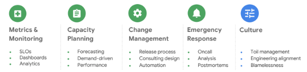
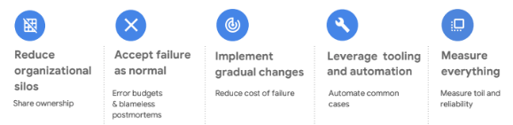

# SRE

## SRE는 무엇인가?

- Site Reliability Engineering, 사이트 안정성(신뢰성) 엔지니어링은 서비스가 '적절한 안정성'을 가지도록 하는 것이다.
- 여기서 중요한 것은 '적절한 수준'과 '안정성'이다. '완벽한 수준'의 안정성이나, 적절한 수준의 '비용'이 아니다. 
- '적절한 수준'이라는 것은 예를 들면 네트워크 안정성이 90%인데, 애플리케이션 안정성을 95%로 만들려는 노력은 헛수고다. 즉 불필요한 안정성 추구는 돈 낭비다. 
- '안정성'이라는 것은 예를 들면 AP몰이 서버 에러로 shutdown되면 비즈니스를 할 수 없게 된다. 이는 AP의 명성/경제성/계약 등에 피해를 준다. 

## SRE는 왜 만들어졌나?

- 서비스가 커지면 속도에 중점을 두는 개발팀과 안정성에 무게를 두는 운영팀 사이에 마찰도 커진다.
- 개발팀이 빠르게 많은 릴리즈를 내놓을수록 시스템 장애는 커진다. 그럼 운영팀은 개발팀을 욕하며 보수적으로 가게 된다. 
- 이러한 문제를 해결하기 위해 탄생한 DevOps는 개발/운영을 한팀으로 조직하는 문화이자 운영 철학이다. SRE는 DevOps의 구현체다. SRE는 이를 어떻게 구체적으로 정의하고 수행하는지 개념과 사례를 제공한다. 
- SRE는 가용성에 대한 명확한 정의, 가용성 목표 정의, 장애 발생에 대한 계획을 명확히 하며 이에 대한 책임을 조직 전체가 공유하여 개인이나 특정 팀이 비난받는게 아니라 공동 책임으로 시스템/프로세스를 개선하는 방향으로 한다. 
- SRE는 빌드/배포, 모니터링, 알림, 시스템 복구 등을 자동화하여 개발팀이 스스로 운영에 안정적으로 섞여들 수 있게 한다. 그리고 자동화된 운영 환경으로 인해 수동 작업과 휴먼 에러가 줄어들게 된다. 

## SRE는 무엇을 하나?

- SRE는 크게 아래와 같은 일들을 한다. (From Google Next 2018)

- Metric & Monitoring
    - 서비스 지표를 정의하고 그 지표를 모니터링 시스템에 적용한다. 
    - 무엇을 서비스 상태의 지표(SLI : service level indicator)로 할 것인가?
        - 예를 들어 서비스가 작동하는지 어떻게 알 수 있는가? Timeout? HTTP Code?
    - 어느 수준을 목표(SLO : service level objective)로 서비스할 것인가?
        - 예를 들어 서비스 실패율 목표는 10%인가?
        - 여기서 기준은 명확해야 한다. SLO를 충족하거나 못하거나 데이터가 명확해야 하며, 일정 기간 충족하지 못하면 해결해야 한다. 
        - 모든 것을 데이터화하고, 그 데이터에서 인사이트를 찾으며, 의사결정도 데이터 기반으로 한다. 
- Capacity Planning
    - 서비스에 필요한 충분한 리소스를 확보한다. 
    - 예를 들어 큰 이벤트를 앞두고 Scale-up/out과 Top 쿼리 확인을 진행하는데, 이는 적절한 HW 리소스 확보와 SW 튜닝을 하는 것이다. 
    - 이를 앞에서 정의한 지표를 바탕으로 진행하게 된다. 
- Change Management
    - HW 설정, SW 릴리즈 배포 관리 영역이다. 
    - 점진적인 배포(보통 롤링 업데이트를 하나, 카나리 배포와 같은 방식도 사용)를 진행하며 미리 정의한 지표 기준으로 모니터링하여 배포 시 장애를 파악하여 빠르게 롤백할 수 있도록 한다. 
    - 즉 코드 관리, 버전 컨트롤, 테스트, 빌드/배포 등 전체 릴리즈 프로세스를 정의하고 가능한 한 자동화한다. (GitFlow, GitOps...)
- Emergency Response
    - 시스템 안정성은 MTTF(Mean Time To Failure), MTTR(Mean Time To Recover)로 증명된다. 
    - MTTR을 줄이고 MTTF는 늘리는 것이 기본 목표다. 
    - 장애 발생시 Post Mortem(사후 분석)을 작성하고 이를 Playbook으로 정착시켜 에러 대응을 상향 평준화한다. 특정 사람이나 조직을 비난하고 책임에 대해서 논하지 말고, 장애도 데이터화하여 시스템과 프로세스에 반영한다. 
- Culture
    - 이러한 SRE 문화를 지속적으로 유지하고 개선해나가는 사람과 조직이 필요하다. 
    - 예를 들어 SRE에는 오류 예산(Error Budget)이라는 개념이 있다. 서비스와 관련된 조직이 모두 이에 동의하고 시작해야 한다. 1년에 오류 예산이 10시간이라면, 장애가 날 때마다 장애 시간만큼 예산을 차감하고 0이 되면 신규 기능을 배포하지 않고 안정성에 초점을 맞춰 개발/운영한다. 
    - 그러기 위해서는 맨 앞에서 이야기한 지표와 모니터링으로 얻은 데이터 기반으로 의사결정하는 것이 꼭 필요하다. 
    - 반복적인 일은 자동화, 수동으로 해야만 하는 일은 문서화한다. 

## SRE는 어떻게 하나?

- SRE는 위와 같은 일을 하기 위해 아래와 같은 활동을 한다. (From Google Next 2018)

- Reduce organizational silos
- Accept failure as normal
- Implement gradual changes
- Leverage tooling and automation
- Measure everything

## 지표 설정 방법

- SLI (Service Level Indicator)
    - 보통 B2C 서비스는 Response Time, Error Rate, Throughput, Availiability 등의 지표를 사용한다. 
    - "REST API의 Response Time은 500ms 이내여야 한다"고 절대값 기준의 지표를 쓸 수도 있겠지만, 가용성 99.99%와 같은 상대 지표로 표현하는 것이 좋다. 절대값이나 평균값보다는 백분율/백분위를 사용한다. 
    - 측정 단위는 표준화되어야 한다. "지표 수집 주기를 매 10초마다, 수집 범위는 서비스 클러스터 단위로, 지표화는 1분 단위로, HTTP GET/POST만 측정하며, 모니터링 시스템을 통해 수집한다"와 같이 정의하여 템플릿화한다. 
- SLO (Service Level Objective)
    - SLI의 목표치를 정한 것이다. 
    - 예를 들어 "**매주 99%의 REST API 호출 Response Time**은 500ms 이하여야 한다"에서 **Bold 부분은 SLI**이고, 나머지 부분이 목표치가 되어 SLO를 구성하게 된다. 
    - SLO는 단순하고 이해하기 쉬워야 하며, 서비스 제공자 관점이 아닌 사용자 관점에서 정의되어야 한다. 그래야 모든 조직이 쉽게 이해하고 받아들일 수 있게 된다. 
    - 또한 가용성 100%와 같이 비현실적인 수치는 버리고, 최대한 적은 수의 SLO만 정의한다. 나중에 서비스가 작아지거나 커지면 그에 따라 조정해 나가면 된다. 만약 <= 500ms와 같은 SLO 설정 시 0ms에 가려고 오버 엔지니어링이 발생한다면 100ms <= SLO <= 500ms와 같이 최소값도 지정해준다. 
- Toil (운영에서의 반복적인 노가다)
    - 수동이고 반복적이며 수행한다고 해서 서비스가 개선되지 않으며 서비스가 커짐에 따라 함께 커지는 작업은 자동화한다. 
    - 1년에 한번 하는 작업이라면 굳이 안하는게 더 효율적이겠다. 구글은 Toil을 30 ~ 50%로 유지하도록 권장하고 있다. 
    - 예를 들어 수동 배포시 배포 시작 ~ 종료 시간을 측정하거나 장애 발생시 티켓을 등록하고 처리가 완료될때까지의 시간을 측정해보면 알 수 있다. 

# References
- [MS SRE](https://docs.microsoft.com/ko-kr/learn/modules/intro-to-site-reliability-engineering/) 
- [Google SRE](https://landing.google.com/sre/) 
- [네이버 검색의 SRE 시스템](https://d2.naver.com/helloworld/2047663) 
- [네이버 검색의 스마트한 경보 시스템](https://m.blog.naver.com/naver_search/221217634238) 
