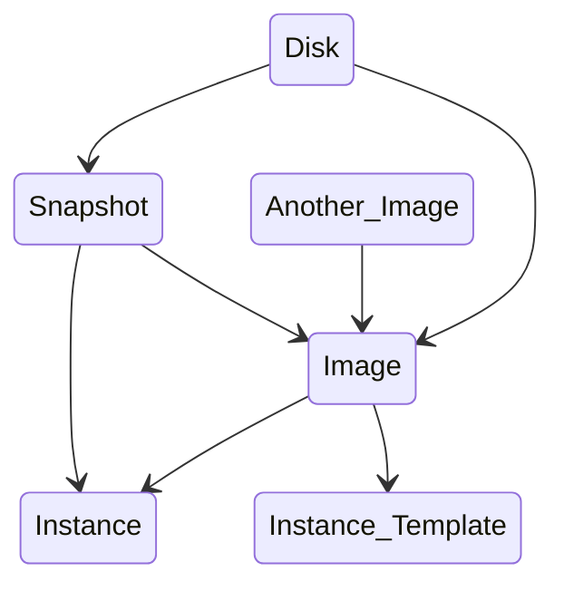

# Concept

> [GCP Console](https://console.cloud.google.com) 
>
> [GCP Docs](https://cloud.google.com/docs) 
>
> [Google Dev Library](https://devlibrary.withgoogle.com/) 
>
> [Google APIs Explorer](https://developers.google.com/apis-explorer/) 
>
> [GCP Status Dashboard](https://status.cloud.google.com) 
>
> [Earn a Google Cloud Badge](https://cloud.google.com/training/badges) 
>
> [Google Cloud Skills Boost](https://www.cloudskillsboost.google/) 
>
> [GCP GitHub](https://github.com/orgs/GoogleCloudPlatform/repositories) 
>
> [Micro Services Sample](https://github.com/GoogleCloudPlatform/microservices-demo) 
>
> [AWS, Azure, GCP 서비스 비교](https://cloud.google.com/free/docs/aws-azure-gcp-service-comparison?hl=ko) 
>
> [The Cloud Girl](https://thecloudgirl.dev/) 


# Network

## Subnet

IP CIDR `10.1.2.0/24` 인 Subnet을 만든다고 하면, 아래 4개 주소는 미리 예약되어 있다.

| 예약된 IP 주소      | 설명                                                         | 예시                         |
| :------------------ | :----------------------------------------------------------- | :--------------------------- |
| 네트워크            | 서브넷의 기본 IP 범위에서 첫 번째 주소                       | `10.1.2.0/24`의 `10.1.2.0`   |
| 기본 게이트웨이     | 서브넷의 기본 IP 범위에서 두 번째 주소                       | `10.1.2.0/24`의 `10.1.2.1`   |
| 끝에서 두 번째 주소 | 나중에 사용할 수 있도록 Google Cloud가 예약한 서브넷의 기본 IP 범위에서 끝에서 두 번째 주소 | `10.1.2.0/24`의 `10.1.2.254` |
| 브로드캐스트        | 서브넷의 기본 IP 범위에서 마지막 주소                        | `10.1.2.0/24`의 `10.1.2.255` |


## Load Balancing

- Global
    - TCP Proxy Load Balancing
    - SSL Proxy Load Balancing
    - External HTTP(S) Load Balancing
- Regional
    - Internal TCP/UDP Load Balancing
    - External TCP/UDP Network Load Balancing
    - Internal HTTP(S) Load Balancing
    - Regional External HTTP(S) Load Balancing


```sh
# list regional url-maps
gcloud compute url-maps list --project PROJECT_ID

# list global url-maps
gcloud compute url-maps list --project PROJECT_ID --global

# describe
gcloud compute url-maps describe LB_NAME --region=asia-northeast3 --project PROJECT_ID

# edit
gcloud compute url-maps edit LB_NAME --region=asia-northeast3 --project PROJECT_ID
```


# VM

VM Linux 안에서 혹시나 잘못해서 방화벽으로 22번 포트를 막아 ssh 접속이 불가능해졌을때, 아래와 같이 방화벽 해제하는 스크립트를 startup-script로 추가해준다.

```sh
#!/bin/bash
sudo systemctl disable firewalld
sudo systemctl stop firewalld
```

## Disk

- Online으로 VM root partition size 변경하기

```sh
# 우선 GCP Console or gcloud로 VM에 attach 된 disk의 size를 늘려준다
gcloud compute disks resize example-disk --size 30

# 이후 VM OS에 접속해서 아래와 같이 실행
sudo apt install -y cloud-utils # Debian jessie
sudo apt install -y cloud-guest-utils # Debian stretch, Ubuntu
sudo dnf install -y cloud-utils-growpart # Redhat, Fedora, CentOS
sudo growpart /dev/sda 1 && sudo resize2fs /dev/sda1 # ext 2/3/4
sudo growpart /dev/sda 1 && sudo xfs_growfs -d / # xfs. CentOS 6 needs `resize2fs`
```


**VM, Disk, Snapshot, Image 상호 호환성** 




# Cloud Functions

```sh
# Cloud Storage의 Object가 Finalize/Create 되었을 때 Triggering 되도록 Cloud Functions 배포
gcloud functions deploy memories-thumbnail-creator --runtime nodejs14 --trigger-resource memories-bucket-84787 --trigger-event google.storage.object.finalize --entry-point thumbnail
```


# Cloud SQL

## Private Service Connection

Cloud SQL에 Private IP를 부여하기 위해서는 VPC에 Private Service Connection으로 Cloud SQL용으로 사용할 Private IP 대역을 추가해주어야 한다.

해당 Private IP 대역은 My VPC와 Managed VPC 사이에 Peering을 맺고 그 영역을 가리키는 IP 대역이므로, My VPC 대역과는 겹치지 않아야 한다. 자세한 사항은 아래 문서들을 참조한다.

- [비공개 IP](https://cloud.google.com/sql/docs/postgres/private-ip)
- [비공개 IP 구성](https://cloud.google.com/sql/docs/postgres/configure-private-ip)
- [비공개 엑세스 서비스](https://cloud.google.com/vpc/docs/private-services-access)
- [비공개 엑세스 서비스 구성](https://cloud.google.com/sql/docs/postgres/configure-private-services-access)


표준/비표준 Private IP 대역은 아래 문서로 확인하자.

- [Reserved IP addresses](https://en.wikipedia.org/wiki/Reserved_IP_addresses)


해당 Private IP 대역을 미리 정해두지 않는 경우 GCP에서 설정해주는 자동 옵션으로 진행해도 된다.

그러나 Private IP 대역을 정해서 쓰는 경우 만약 Cloud SQL 용 Private IP 대역이 부족하게 되면 아래와 같은 에러 메시지가 나며 DB 생성이 실패할 수 있다.

`Failed to create subnetwork. Couldn't find free blocks in allocated IP ranges. Please allocate new ranges for this service provider.`

이 때는 아래와 같이 Private Service Connection 용 신규 subnet을 만들어준다.

- GCP Console > Project 선택 > VPC network > VPC networks > vpc-homin-share-devstg 선택 > PRIVATE SERVICE CONNECTION > ALLOCATED IP RANGES FOR SERVICES > ALLOCATE IP RANGE 버튼 클릭 후 아래와 같이 생성
    - Name: allocip-test-sql
    - IP range: Custom, 100.127.0.0/24
        - 원래 100.64.0.0/10 대역은 비표준 Private IP 대역이다. 그러나 IP range도 넓고 비표준 대역이라 타 네트워크와 쫑날 가능성이 매우 적어서 한정적으로 사용되고 있을 가능성이 높다. 해당 대역의 끝 부분을 Private Service Connection 용으로 할당할 수 있다.
- PRIVATE CONNECTIONS TO SERVICES > cloudsql-postgres-googleapis-com 클릭 > Assigned allocation: allocip-test-sql 추가 선택 > UPDATE 버튼 클릭
- 이후 VPC network peering > cloudsql-postgres-googleapis-com 클릭 > Destination IP ranges에 100.127.0.0/24 대역이 새롭게 추가된 것을 확인할 수 있음
- 또한 Routes > peering-route-12345 가 자동으로 생성된 것을 확인할 수 있음

이후 sql-pg-test 생성이 잘 되고 GCP 내 서버에서의 접속도 문제없는 것을 확인할 수 있다.


# Memorystore

## Redis

> [Running Redis on GCP: 4 deployment scenarios](https://cloud.google.com/blog/products/databases/running-redis-on-gcp-four-deployment-scenarios) 
>
> [High Availability](https://cloud.google.com/memorystore/docs/redis/high-availability) 
>
> [Manual Failover](https://cloud.google.com/memorystore/docs/redis/manual-failover-overview) 


# Pub/Sub

> [Async Pull](https://cloud.google.com/pubsub/docs/samples/pubsub-subscriber-async-pull) 
>
> [Sync Pull](https://cloud.google.com/pubsub/docs/samples/pubsub-subscriber-sync-pull) 


## Example

우선 topic과 subscription을 만들고, 해당 프로젝트의 Pub/Sub Editor 권한이 있는 Service Account의 key json 파일을 받아둔다.

```sh
gcloud pubsub topics create test-pub --project PROJECT_ID --labels=env=dev,name=test_pub
gcloud pubsub subscriptions create test-sub --project PROJECT_ID --topic=test-pub --expiration-period=never --enable-message-ordering
```


이후 라이브러리를 설치하고 pub 측과 sub 측의 코드를 작성한다.

```sh
pip install --upgrade google-cloud-pubsub
```


`pubsub_pub.py` 

```python
import json
import datetime
import time

from google.cloud import pubsub_v1
from google.auth import jwt

PROJECT_ID = 'PROJECT_ID'
TOPIC = f'projects/{PROJECT_ID}/topics/test-pub'


def auth():
    service_account_info = json.load(
        open("tmp/service-account-key.json"))
    audience = "https://pubsub.googleapis.com/google.pubsub.v1.Subscriber"
    credentials = jwt.Credentials.from_service_account_info(
        service_account_info, audience=audience
    )
    return credentials


def pub(credentials):
    publisher_audience = "https://pubsub.googleapis.com/google.pubsub.v1.Publisher"
    credentials_pub = credentials.with_claims(audience=publisher_audience)
    publisher = pubsub_v1.PublisherClient(credentials=credentials_pub)
    message = f'{datetime.datetime.now()}'
    future = publisher.publish(
        TOPIC, message.encode(), spam='eggs')
    future.result()
    print(f'published message: {message}')


while True:
    pub(auth())
    time.sleep(5)
```


`pubsub_sub.py` 

```python
import json

from google.cloud import pubsub_v1
from google.auth import jwt

# var
PROJECT_ID = 'PROJECT_ID'
SUB = f'projects/{PROJECT_ID}/subscriptions/test-sub'


def auth():
    service_account_info = json.load(
        open("tmp/service-account-key.json"))
    audience = "https://pubsub.googleapis.com/google.pubsub.v1.Subscriber"
    credentials = jwt.Credentials.from_service_account_info(
        service_account_info, audience=audience
    )
    return credentials


def sub(credentials):

    def callback(message):
        print(f'pulled message: {message.data}')
        message.ack()

    with pubsub_v1.SubscriberClient(credentials=credentials) as subscriber:
        future = subscriber.subscribe(SUB, callback)
        future.result()

sub(auth())
```


아래와 같이 실행한다.

```sh
# 5초마다 topic에 publish
python3 pubsub_pub.py

# async로 publish된 message를 읽어옴
python3 pubsub_sub.py
```


# Monitoring

## Alert

> https://cloud.google.com/monitoring/alerts

- GCP > Monitoring > Alerting
    - EDIT NOTIFICATION CHANNELS > alert 받을 채널 등록
    - CREATE POLICY > alert 받을 policy 등록
- GCP > Error Reporting > CONFIGURE NOTIFICATIONS > error report 받을 채널 등록


만약 Log based metric 으로 alert 을 걸고 싶다면 아래와 같이 진행한다.

> https://cloud.google.com/logging/docs/alerting/log-based-alerts

- GCP > Logging > Logs-based Metrics > CREATE METRIC
    - Metric Type: `Counter` 
    - Log metric name: `metric-exception-occurred` 
    - Units: `1` 
    - Build filter:

```sql
-- 1. Exception or Error 문구를 검색하는 경우: Application 담당자를 위함
(severity=ERROR AND jsonPayload.message:("Exception" OR "Error")) OR textPayload:("Exception" OR "Error")
-- 혹은 아래와 같이 정규표현식을 사용할 수도 있다.
(severity=ERROR AND jsonPayload.message=~"(?i)Exception|Error") OR textPayload=~"(?i)Exception|Error"

-- Exception or Error 문구가 포함되지 않은 것 중 severity가 ERROR인 경우: Application 외 담당자를 위함
severity=ERROR AND jsonPayload.message!~"(?i)Exception|Error" AND jsonPayload.message!~"(?i)Application에서 Error가 아닌데 Error Log로 찍는 문구들을 제외하기 위해 여기에 등록"
```

- GCP > Logging > Logs-based Metrics > `metric-exception-occurred` 맨 우측 More actions > View logs for metric: metric filter에 해당하는 log 확인
- GCP > Logging > Logs-based Metrics > `metric-exception-occurred` 맨 우측 More actions > View in Metrics Explorer: metric 통계 확인
- GCP > Logging > Logs-based Metrics > `metric-exception-occurred` 맨 우측 More actions > Create alert from metric
    - Rolling window: `5 min` 
    - Rolling window function: `count` 
    - Time series aggregation: `sum` 
    - Time series group by: `name` 
        - 이렇게 설정하면 각 `name` 별로 group by 했을때의 sum값을 count하여 5분안에 몇 개 발생했는지 측정한다. (예를 들면 pod가 hash로 2개 떠있을때 동일한 container name으로 group by)
    - Condition type: `Threshold` 
    - Alert trigger: `Any time series violates` 
    - Threshold position: `Above threshold` 
    - Threshold value: `5` 
    - Notification Channels: `alert 받을 채널 선택` 
    - Alert name: `alert-exception-occurred` 
    - Documentation: markdown 문법이며 'View logs', 'View alert policy' 링크 등을 걸어두는 등 필요와 편의에 따라 옵션으로 작성


## Logging

> https://cloud.google.com/logging/docs/view/logging-query-language

### Cloud Logging Agent

> [Install Cloud Logging Agents in VM](https://cloud.google.com/logging/docs/agent/logging/installation) 
>
> [google-fluentd releases](https://github.com/GoogleCloudPlatform/google-fluentd/releases) 

```sh
# Cloud Monitoring agent
curl -sSO https://dl.google.com/cloudagents/add-monitoring-agent-repo.sh
sudo bash add-monitoring-agent-repo.sh
sudo apt-get update
sudo apt-get install stackdriver-agent

# Cloud Logging agent
curl -sSO https://dl.google.com/cloudagents/add-logging-agent-repo.sh
sudo bash add-logging-agent-repo.sh
sudo apt-get update
sudo apt-get install google-fluentd

# 이후 package upgrade는 yum, apt로
```


# gcloud

## install

>  https://cloud.google.com/sdk/docs/install

- macOS 64비트 (x86_64) https://dl.google.com/dl/cloudsdk/channels/rapid/downloads/google-cloud-sdk-367.0.0-darwin-x86_64.tar.gz 다운받아 압축 풀기
- `./google-cloud-sdk/install.sh` 실행
- `./google-cloud-sdk/bin/gcloud init` 실행
- `gcloud auth login` 실행하여 브라우저에서 계정 로그인
- `gcloud auth list` 실행하여 gcloud 로그인 잘 되었는지 확인 후 커맨드 날려보기


## auth

GCP > Cloud Shell > 아래 두 파일을 Local PC의 ~/.ssh로 복사한다.

```sh
cat ~/.ssh/google_compute_engine
cat ~/.ssh/google_compute_engine.pub
```

```sh
# 우선 GCP 계정으로 로그인하여 Local PC에 Token을 받는다.
gcloud auth login

# 이후 해당 계정으로 ssh key를 사용하여 cloud shell에 로그인한다.
gcloud cloud-shell ssh
```

그런데 이렇게 접속하면 Cloud Shell > gcloud compute ssh 로 다른 VM에 붙는건 안되네.


## compute

```sh
gcloud compute ssh --zone $ZONE --project $PROJECT_ID $VM_NAME
```


## service-accounts

```sh
# select all project's id
gcloud projects list --filter 'PROJECT_ID:pjt*' > projects

export PROJECT_ID="PROJECT_ID"
export SERVICE_ACCOUNT_ID="SERVICE_ACCOUNT_ID"

while read PROJECT_ID; do
    # create service account
    gcloud iam service-accounts create "${SERVICE_ACCOUNT_ID}" --description="" --display-name="${SERVICE_ACCOUNT_ID}" --project "${PROJECT_ID}"

    # iam policy binding
    gcloud projects add-iam-policy-binding "${PROJECT_ID}" --member="serviceAccount:${SERVICE_ACCOUNT_ID}@${PROJECT_ID}.iam.gserviceaccount.com" --role="roles/viewer"
    
    # create service account's key
    gcloud iam service-accounts keys create "${SERVICE_ACCOUNT_ID}@${PROJECT_ID}.json" --iam-account="${SERVICE_ACCOUNT_ID}@${PROJECT_ID}.iam.gserviceaccount.com"
done < projects
```


## ssl-certificates

> https://cloud.google.com/load-balancing/docs/ssl-certificates
>
> https://cloud.google.com/sdk/gcloud/reference/compute/target-https-proxies/update


pem 파일을 붙여넣을 때 반드시 chaining 되는 내용을 전부 모아서 하나의 파일로 넣어주자.

예를 들어 ca-root.pem과 mysite.pem이 있는 경우 chaining의 가장 마지막에 있는 mysite.pem을 먼저 넣고, 그 다음 ca-root.pem을 이어 붙여서 하나의 pem 파일로 만들어야 한다.

`cat mysite.pem > merged.pem; cat ca-root.pem >> merged.pem` 

그렇지 않으면 ca-root.pem 내용이 빠져서 GCP Console 상에서 Certificate object를 보면 chaining에 CA Root가 ca-root.pem의 값이 아닌 mysite.pem의 값으로 설정되어 버린다.


```sh
# variables
GCLOUD_PROJECT="project-test"


# list target-proxies
## list global target-proxies
gcloud compute target-https-proxies list --project "${GCLOUD_PROJECT}" --global

## list regional target-proxies
gcloud compute target-https-proxies list --project "${GCLOUD_PROJECT}" --regions=asia-northeast3


# create certificates: global/region cert를 각각 만들어야 global LB와 regional LB에 각각 적용이 가능하다. 그러나 콘솔에서는 global cert만 노출된다.
## create global certificates
gcloud compute ssl-certificates create "cert-dev" --certificate="WILD.dev.com/GCP-LB/cert.pem" --private-key="WILD.dev.com/GCP-LB/newkey.pem" --project "${GCLOUD_PROJECT}"

## create regional certificates
gcloud compute ssl-certificates create "cert-dev" --certificate="WILD.dev.com/GCP-LB/cert.pem" --private-key="WILD.dev.com/GCP-LB/newkey.pem" --region=asia-northeast3 --project "${GCLOUD_PROJECT}"
gcloud compute ssl-certificates create "cert-prd" --certificate="WILD.com/GCP-LB/cert.pem" --private-key="WILD.com/GCP-LB/newkey.pem" --region=asia-northeast3 --project "${GCLOUD_PROJECT}"


# attach certificates to target-proxies
## attach global certificates to target-proxies
gcloud compute target-https-proxies update "target-proxy-global" --ssl-certificates="cert-dev" --global --global-ssl-certificates --project "${GCLOUD_PROJECT}"

## attach regional certificates to target-proxies
gcloud compute target-https-proxies update "target-proxy-regional" --ssl-certificates="cert-dev,cert-prd" --region=asia-northeast3 --ssl-certificates-region=asia-northeast3 --project "${GCLOUD_PROJECT}"


# Regional certificates는 GCP console에서 보이지 않아 삭제가 안됨. 잘못 만든 Regional certificates는 gcloud로 강제 삭제
gcloud compute ssl-certificates list --project "${GCLOUD_PROJECT}"

gcloud compute ssl-certificates delete cert-dev --region=asia-northeast3 --project "${GCLOUD_PROJECT}"
gcloud compute ssl-certificates delete cert-prd --region=asia-northeast3 --project "${GCLOUD_PROJECT}"
```


# Cloud Storage

## gzip 압축 트랜스코딩

Cloud Storage에 gzip 압축된 파일을 올려서 서비스하고 싶다면 아래와 같이 진행한다.

> [gzip 압축 파일의 트랜스코딩](https://cloud.google.com/storage/docs/transcoding) 
>
> [객체 메타데이터 보기 및 수정](https://cloud.google.com/storage/docs/viewing-editing-metadata) 
>
> [gsutil commands](https://cloud.google.com/storage/docs/gsutil/commands/cp) 

```sh
# 비압축 상태의 로컬 파일을 Cloud Storage에 업로드할 때 gzip 압축 상태로 저장하기
# request header에 accept-encoding:gzip 이 있으면 gzip으로, 없는 경우 비압축으로 트랜스코딩됨
gsutil cp -z js,css app.js gs://test.com/resources/app.js

# 로컬에서 gzip 압축해서 Cloud Storage에 업로드하기
gzip -c app.js > app.gzip.js
gsutil -h "Content-Encoding:gzip" cp app.gzip.js gs://test.com/resources/app.gzip.js

# 이미 Cloud Storage에 업로드된 gzip 압축 파일의 header만 설정하기
gsutil setmeta -h "Content-Encoding:gzip" gs://test.com/resources/app.gzip.js
```


그러나 만약 Cloud Storage 앞단에 CDN이 있을 경우 gzip 압축/비압축 트랜스코딩이 동작하지 않을 수 있다.

이유는 `gsutil -z` 명령어로 Cloud Storage에 gzip 압축으로 파일 업로드하는 경우 자동으로 `Cache-Control:no-transform` 헤더가 추가되는데

그러면 Cloud Storage 앞단 CDN에서는 `Accept-Encoding:none` 으로 요청받아도 gzip 압축본으로만 응답하게 된다.

CDN에서 `Accept-Encoding:gzip` 으로 요청받을 때만 gzip 압축본을 전송하고, `Accept-Encoding:none` 으로 요청받을 때는 비압축본을 전송하고 싶다면

아래와 같이  Cloud Storage에서 `Cache-Control:no-transform` 헤더를 제거해준다.

> [Cloud CDN - Troubleshooting](https://cloud.google.com/cdn/docs/troubleshooting-steps) 
>
> [Cloud CDN - Caching - Vary Header](https://cloud.google.com/cdn/docs/caching#vary-headers) 

```sh
# 여러 파일을 처리할 때는 -m (multithreading) 옵션을 넣어서 성능을 높이자
gsutil -m setmeta -h "Cache-Control:" "gs://test.com/resources/**.js"

# macOS에서는 multiprocess 관련 에러가 날 수 있어 -o "GSUtil:parallel_process_count=1" 옵션을 추가
gsutil -m -o "GSUtil:parallel_process_count=1" setmeta -h "Cache-Control:" "gs://test.com/resources/**.js"
```


## gsutil

- VM에서 gsutil cp 등 write 작업시 `ResumableUploadAbortException: 403 Provided scope(s) are not authorized` 발생할 때. 2가지 방법이 있다.
    1. VM API access scope 변경
        - Stop VM instance
        - Open VM instance details
        - Press "Edit"
        - Change Cloud API access scope--> "Allow full access to all cloud APIs"
        - Start VM instance
    2. VM에서 `gcloud init` 으로 cloud storage에 write 권한을 가진 계정으로 새로 로그인하면 된다.


- Signed URL 만들기
    - 참조: https://cloud.google.com/storage/docs/access-control/signing-urls-with-helpers
    - IAM & Admin > Service Accounts > 계정 선택 > KEYS > ADD KEY > Create new key > JSON > CREATE
    - 다운로드된 json 파일을 넣어서 Signed URL 생성

```sh
gsutil signurl -d 1m test@developer.gserviceaccount.com.json gs://test/sample.zip
```


# Q&A

- Name some of Google Cloud Platform’s pricing innovations.
    - Sub-hour billing
    - Sustained-use discounts
    - Compute Engine custom machine types
- Name some benefits of using Google Cloud Platform other than its pricing.
    - Commitment to environmental responsibility
    - Commitment to open-source technologies
    - Robust infrastructure
- True or False: If a Google Cloud IAM policy gives you Owner permissions at the project level, your access to a resource in the project may be restricted by a more restrictive policy on that resource.
    - False: Policies are a union of the parent and the resource. If a parent policy is less restrictive, it overrides a more restrictive resource policy.
- True or False: All Google Cloud Platform resources are associated with a project.
    - True: All Google Cloud Platform resources are associated with a project.
- Service accounts are used to provide which of the following?
    - Authentication between Google Cloud Platform services
    - Key generation and rotation when used with App Engine and Compute Engine
    - A way to restrict the actions a resource (such as a VM) can perform
    - A way to allow users to act with service account permissions
    - **All of the above**
- Name 3 robust networking services available to your applications on Google Cloud Platform.
    - Cloud Virtual Network, Cloud Interconnect, Cloud DNS, Cloud Load Balancing, and Cloud CDN.
- Name 3 Compute Engine pricing features.
    - Per-second billing, custom machine types, preemptible instances.
- True or False: Google Cloud Load Balancing lets you balance HTTP traffic across multiple Compute Engine regions.
    - True.
- Your application transcodes large video files. Which storage service should you consider first?
    - Google Cloud Storage
- You stream huge amounts of data from devices with sensors. Which storage service should you consider first?
    - Google Cloud Bigtable
- Name two reasons for deploying applications using containers.
    - Consistency across development, testing, and production environments; Simpler to migrate workloads; Loose coupling; Agility
- True or False: Kubernetes lets you manage container clusters in multiple cloud providers.
    - True
- True or False: GCP provides a private, high-speed container image storage service for use with Kubernetes Engine.
    - True
- Name 3 advantages of using the App Engine flexible environment over App Engine standard.
    - The flexible environment allows SSH access, allows disk writes, and supports third-party binaries (also allows stack customization and background processes).
- What is the difference between Cloud Endpoints and Apigee Edge?
    - Cloud Endpoints helps you create and maintain APIs; Apigee Edge helps you secure and monetize APIs.
- When would you use Cloud Dataproc?
    - You can use it to migrate on-premises Hadoop jobs to the cloud. You can also use it for data mining and analysis of cloud-based data.
- Name two use cases for Cloud Dataflow.
    - ETL, orchestration
- Name three use cases for the Google machine learning platform.
    - Fraud detection, sentiment analysis, content personalization
- What is a key distinguishing feature of networking in the Google Cloud Platform?
    - Unlike other cloud networks, access lists and firewall rules are available
    - **Network topology is not dependent on address layout** 
        - Networks have no IP address range in Google Cloud, so subnetworks DO NOT have to "fit under" the network range in a hierarchical format defined by the extension of the network mask bits. This breaks with traditional networking and also with the way that networking has been implemented in other clouds.
    - Data can be tagged for "late delivery," and it will be delivered on the time and day you set
    - Supports IPv4 addresses that conform to RFC 1918
- What are the three types of networks offered in the Google Cloud Platform?
    - Zonal, regional, and global
    - Gigabit network, 10-gigabit network, and 100-gigabit network
    - **Default network, auto-mode network, and custom-mode network** 
        - The default network established fixed standard subnetworks with predefined IP ranges and it is fast to set up. The auto-mode network uses the same subnet IP ranges as the default-type, with a network name other than default. And custom-mode allows you to specify the IP ranges of subnets.
    - IPv4 unicast network, IPv4 multicast network, IPv6 network
- What is one benefit of applying firewall rules by tag rather than by address?
    - Tags help organizations track firewall billing.
    - Tags in network traffic help with network sniffing.
    - Tags on firewall rules control which ephemeral IP addresses VMs will receive.
    - **When a VM is created with a matching tag, the firewall rules apply irrespective of the IP address it is assigned.** 
        - When a VM is created, the ephemeral external IP address is assigned from a pool. There is no way to predict which address will be assigned, so there is no way to write a rule that will match that VM's IP address before it is assigned. Tags allow a symbolic assignment that does not depend on order in the IP addresses. It makes for simpler, more general, and easier-to-maintain firewall rules.
- Which statement is true of virtual machine instances in Compute Engine?
    - A VM in Compute Engine always maps to a single hardware computer in a rack.
    - Compute Engine uses VMware to create virtual machine instances.
    - **In Compute Engine, a VM is a networked service that simulates the features of a computer.** 
        - VMs in Compute Engine are a collection of networked services. This includes disks (persistent disks) which are network-attached. In some cases, the GCP VM behaves unlike hardware or other kinds of virtual machines; for example, when a multi-tenant virtual CPU "bursts," using excess capacity beyond the VM spec.
    - All Compute Engine VMs are single tenancy and do not share CPU hardware
- What is inferred instance discounting?
    - Usage of VMs for a partial month is extrapolated out to the entire month to give the best discount.
    - Usage of VMs of the same machine types across all zones in a region is combined as if they were one machine to give the best discount.
    - Usage of VMs of similar machine types in the same zone is combined as if they were one machine to give the best discount.
    - **Usage of VMs of the same machine type in the same zone is combined as if they were one machine to give the best discount** 
        - Compute Engine combines usage of the same machine type in the same zone as if it were one virtual machine being used for a continuous period. This provides sustained use discounts without penalizing the user for terminating VMs when they are not needed and starting more on demand.
- Which statement is true of persistent disks?
    - **Persistent disks are encrypted by default.** 
        - Persistent disks are not physical disks; they are a virtual networked service. For example, persistent disks already include encryption as a default service. So if an administrator configures encryption as they might on a hardware disk, it will be redundant and might provide little or no additional benefit.
    - Persistent disks are physical hardware devices connected directly to VMs.
    - Persistent disks are always HDDs (magnetic spinning disks).
    - Once created, a persistent disk cannot be resized.
- What abstraction is primarily used to administer user access in Cloud IAM?
    - Leases, an abstraction of periodic entitlements
    - **Roles, an abstraction of job roles**
        - Cloud IAM administration uses pre-defined roles for administration of user access. The roles are defined by more granular permissions. But permissions are not applied to users directly; only through the roles that are assigned to them.
    - Credentials, an abstraction of an authorization token
    - Privileges, an abstraction of access rights
- How is a user identity created in Cloud IAM?
    - User identities are created from the Cloud Identity console that is only visible to GCP Super-administrators.
    - User identities are created from the Cloud IAM area of the GCP Console, or by using the gcloud command.
    - User identities are created through a federated Active Directory domain.
    - **User identities are created from outside of GCP in a Google-administered domain.**
        - Cloud IAM access is built on top of an identity authorization and access management system that is used by all Google Cloud products, not just GCP.
- What technology can be used along with Cloud IAM to provide another layer of security and access control in GCP?
    - Machine learning; specifically, intrusion detection
    - Antivirus and anti-exploit software built into GCP VMs
    - **Networking; specifically, firewall rules**
        - Because GCP is a collection of networked services, you can administer fine-grained access to resources by limiting network access. Example: Using Cloud IAM roles, you could grant a group of users access to a particular VM running an application. Using firewall rules, you could permit access to the VM only from specific IP ranges, so that those users could only gain access to the VM from the corporate network, and not from another location.
    - Dynamic per-user resource throttling
- What data storage service might you select if you just needed to migrate a standard relational database running on a single machine in a data center to the cloud?
    - **Cloud SQL**
        - Cloud SQL offers a PostgreSQL server or a MySQL server as a managed service.
    - BigQuery
    - Persistent Disk
    - Cloud Storage
- Which GCP data storage service offers ACID transactions and can scale to thousands of nodes?
    - Cloud Storage (GCS)
    - Cloud CDN
    - **Cloud Spanner**
        - Cloud Spanner provides ACID (Atomicity, Consistency, Isolation, Durability) properties that enable transactional reads and writes on the database. It can also scale globally.
    - Cloud SQL
- Which data storage service provides data warehouse services for storing data but also offers an interactive SQL interface for querying the data?
    - **BigQuery**
        - BigQuery is a data warehousing service that allows the storage of huge data sets while making them immediately processable without having to extract or run the processing in a separate service.
    - Cloud Dataproc
    - Cloud Datalab
    - Cloud SQL
- No resources in GCP can be used without being associated with...
    - A user
    - A virtual machine
    - A bucket
    - **A project**
        - All resources in GCP are tracked and their consumption is logged against a project. A project relates resources to a billing method.
- A budget is set at $500 and an alert is set at 100%. What happens when the full amount is used?
    - Everything in the associated project is suspended because there is not more budget to spend.
    - **A notification email is sent to the Billing Administrator.**
        - Budgets in GCP are not a way to prevent spending or stop resources. They are a tool for raising awareness about the consumption of resources so that a business can implement its own consumption management processes.
    - You have a 4-hour courtesy period before Google shuts down all resources.
    - Nothing. There is no point to sending a notification when there is no budget remaining.
- How do quotas protect GCP customers?
    - By preventing resource use in too many zones in a region.
    - By preventing resource use by unknown users.
    - By preventing resource use of too many different GCP services.
    - **By preventing uncontrolled consumption of resources.**
        - Quotas are established at reasonable defaults for common cloud usage and proof of concept activities. If you are planning to scale up a production cloud solution, you may need to request that the quotas be raised. This is a reasonable checkpoint to verify that actions that might result in a large consumption of resources are reviewed.
- What is the foundational process at the base of Google's Site Reliability Engineering (SRE) ?
    - Capacity planning
    - Testing and release procedures
    - **Monitoring**
        - Before you can take any of the other actions, you must first be monitoring the system.
    - Root cause analysis
- What is the purpose of the Stackdriver Trace service?
    - **Reporting on latency as part of managing performance**
        - Stackdriver Trace provides latency sampling and reporting for App Engine, Google HTTPS load balancers, and applications instrumented with the Stackdriver Trace SDKs. Reporting includes per-URL statistics and latency distributions.
    - Reporting on GCP system errors
    - Reporting on application errors
    - Reporting on GCP resource consumption as part of managing performance
- Stackdriver integrates several technologies, including monitoring, logging, error reporting, and debugging, that are commonly implemented in other environments as separate solutions using separate products. What are key benefits of integration of these services?
    - **Reduces overhead, reduces noise, streamlines use, and fixes problems faster**
        - Stackdriver integration streamlines and unifies these traditionally independent services, making it much easier to establish procedures around them and to use them in continuous ways.
    - Ability to replace one tool with another from a different vendor
    - Detailed control over the connections between the technologies
    - Better for GCP only so long as you don't need to monitor other applications or clouds
- What is the purpose of virtual private networking (VPN)?
    - It is a method to detect intruders at the edge of a network boundary.
    - VPNs are also called access control lists, or ACLs, and they limit network access.
    - **To enable a secure communication method (a tunnel) to connect two trusted environments through an untrusted environment, such as the internet.**
        - VPNs use IPSec tunnels to provide an encapsulated and encrypted path through a hostile or untrusted environment.
    - The main purpose is to encrypt data so that it can be stored in an encrypted format.
- Why might you use Cloud Interconnect or Direct Peering instead of VPN?
    - Cloud Interconnect and Direct Peering are cheaper because you can turn them on and off easily when not in use.
    - Google only offers SLAs for Cloud Interconnect and Direct Peering.
    - VPN does not offer control over IP address assignment and CIDR subnets, while Cloud Interconnect and Direct Peering do.
    - **Cloud Interconnect and Direct Peering can provide higher availability, lower latency, and lower cost for data-intensive applications.**
        - Benefits of Cloud Interconnect include higher availability, lower latency, and lower cost for data-intensive applications.
- What is the purpose of a Cloud Router and why does that matter?
    - It connects VPN on one side to Direct Peering on the other, which is faster than VPN alone.
    - **It implements dynamic VPN that allows topology to be discovered and shared automatically, which reduces manual static route maintenance.**
        - Cloud Router provides BGP routing to dynamically discover and advertise routes.
    - It is a hardware router, provided by Google but hosted in GCP.
    - A Cloud Router enables you to perform round-robin switching over multiple VPNs so that you can combine the bandwidth and get better throughput than is actually offered by the internet.
- What are the three categories of GCP load balancing as described in the course materials?
    - Local Area load balancing, HTTP(S) load balancing, and auto scaling load balancing
    - Network load balancing, local area load balancing, and unmanaged load balancing
    - HTTP(S) load balancing, SSL proxy load balancing, and HAProxy load balancing
    - **Global external load balancing, regional external load balancing, and regional internal load balancing**
        - The correct answer is global external load balancing, regional external load balancing, and regional internal load balancing.
- Which form of load balancing distributes traffic among a pool of instances within a region?
    - SSL Proxy load balancing
    - HTTP(S) load balancing
    - **Network load balancing**
        - Network load balancing distributes traffic among a pool of instances within a region. Network load balancing can balance any kind of TCP/UDP traffic.
    - TCP Proxy load balancing
- Which form of load balancing uses path rules to send traffic to backend services based on type?
    - Any Load Balancer that uses a Managed Instance Group
    - UDP Network Load Balancer
    - **Content-based Load Balancing**
        - Content-based Load Balancing routes traffic to servers that specialize in different kinds of content. This is the opposite of a Managed Instance Group that uses server templates to ensure that all VMs are the same.
    - SSL Proxy
- How does the autoscaler resolve conflicts between multiple scaling policies?
    - First come, first served.
    - **It selects the one that recommends the most VMs, to ensure the application is supported.**
        - Autoscaler handles multiple policies by calculating recommended number of virtual machines for each policy and picking policy that leaves the largest number of virtual machines in the group ensures enough virtual machines to handle application workloads and allows you to scale applications that have multiple possible bottlenecks.
    - It selects the one with the fewest VMs to provide the lowest cost.
    - It is based on priority, a value set in each policy that determines the precedence.
- When autoscaling using Total CPU utilization, what is the difference on Total CPU utilization between adding the 4th VM to a group versus adding the 10th VM?
    - **The 4th VM adds 25% additional capacity, the 10th VM adds only 10% additional capacity.**
        - The percentage utilization that an additional VM contributes depends on the size of the group.
    - There is no difference, the VMs are identical and afford the same CPU capacity.
    - The 4th VM uses a smaller CPU, so the 10th VM will provide 2.5 times more CPU capacity.
    - The 4th VM adds 4% CPU capacity and the 10th VM adds 10% CPU capacity.
- Which statement is true of autoscaling custom metrics?
    - Autoscaling does not support custom metrics.
    - Custom metrics are much slower than native autoscaling metrics, so avoid using them.
    - **Stackdriver metrics can be used as custom metrics for autoscaling policies.**
        - Stackdriver metrics can be used with autoscaling.
    - Every custom metric includes a multiplier variable that you can use to adjust the input value range.
- What is a fundamental difference between a snapshot of a boot persistent disk and a custom image?
    - A snapshot is only for backing up data and cannot be used to create a VM.
    - **A snapshot is locked within a project, but a custom image can be shared between projects.**
        - A custom image can be shared between projects.
    - A custom image can only be used in disaster recovery.
    - There is no difference, they are different names for the same thing.
- What happens when a custom images is marked "Obsolete" ?
    - **No new projects can use the custom image, but those already with the image can continue to use it.**
        - Deprecated - warning that image is not supported and may end
        - Obsolete - existing users can continue to use it, but no new users
    - All VMs based on the custom image immediately terminate.
    - VMs that are based on the custom image continue to run, but cannot be re-launched.
    - A warning is displayed to new users that the image is no longer supported and will not be maintained or fixed.
- Metadata can be used to do which of the following?
    - Store and retrieve large amounts of columnar data.
    - Implements user-defined encryptions with user supplied keys.
    - **Pass key:value pairs to the VM, including a literal script or a reference to a script file.**
        - Passes key:value pairs.
    - Change which information for a VM is monitored by Stackdriver.
- What kinds of files form the Deployment Manager templates?
    - Templates are composed of *.yaml, java, and Node.js files.
    - **Templates are composed of *.yaml, python, and jinja2 files.**
        - *.yaml, python, and jinja2
    - Templates are composed of Powershell, python, and text files.
    - Templates are composed of bash, *.yaml, and Angular.js files.
- What service does Cloud Launcher provide?
    - **Provides pre-packaged 3rd party solutions using Deployment Manager templates.**
        - Pre-packaged solutions by 3rd party vendors in a "solution marketplace".
    - It is an Android app that sends notifications when new Zones are launched.
    - Provides 3rd party solutions using the Google Cloud API and bash scripts.
    - Provides an open source standard alternative to Deployment Manager.
- Which of the following is true of Deployment Manager Templates?
    - They cannot be nested, can use environment variables, but do not have their own properties.
    - They can be nested, but cannot share data except as passed in an external file.
    - There can be multiple templates, but they cannot be nested and don't share properties or variables.
    - **They can be nested, have properties, and can use environment variables.**
        - Templates can be nested, have properties, and can use environment variables.
- How are Managed Services useful?
    - Managed Services are more customizable than infrastructure solutions.
    - **Managed Services may be an alternative to creating and managing infrastructure solutions.**
        - Managed Services in this class are presented as a possible alternative to building your own infrastructure data processing solution.
    - If you have an existing infrastructure service, Google will manage it for you if you purchase a Managed Services contract.
    - Managed Services are pay services offered by 3rd party vendors.
- Which of the following are data processing Managed Services?
    - Dataproc, Datastudio, and Google Cloud Storage.
    - Google Compute Engine, Cloud IAM, and Hadoop.
    - **Dataproc, Dataflow, and BigQuery.**
        - Dataproc, Datalfow, and BigQuery are the ones described in the class.
    - Google Hadoop Manager, DataQuery, BigProc
- Which of the following is a feature of Dataproc?
    - **It typically takes less than 90 seconds to start a cluster.**
        - Fast to start a cluster.
    - Dataproc allows full control over HDFS advanced settings.
    - Dataproc billing occurs in 10-hour intervals.
    - It doesn't integrate with Stackdriver, but it has its own monitoring system.
- What is Cloud Pub/Sub?
    - A feature of Google Maps that identifies bars and sandwich restaurants.
    - A feature of Google console that allows you to subscribe to Cloud news feeds.
    - **A fully-managed distributed real-time messaging services for applications.**
        - Cloud Pub/Sub is a fully-managed real-time messaging service that allows you to send and receive messages between independent applications
    - A mutex-based metadata sharing system that serializes access to shared data.
- What is the purpose of Cloud Endpoints and APIgee API Management?
    - Provides a method to publish APIs into Google's Cloud API marketplace.
    - **Provides a point of redirection where policy, licensing, authorization, and security can be implemented around a shared API.**
        - It's a single "choke point" for API management and administration.
    - Changes API calling semantics constantly as a security measure.
    - It is an internal call-back mechanism used with Cloud Pub/Sub for internal applications.
- What is a Cloud Source Repository?
    - It is how Google shares Open Source software with the world.
    - A memory cache system similar to MemcacheD.
    - Another term used for Google Cloud Storage.
    - **A private Git repository on GCP.**
        - It's a Git repository on GCP.
- Where can docker containers be run in GCP?
    - **Both on Google Kubernetes Engine and in Google App Engine Flexible Environment**
        - Google Kubernetes Engine and Google App Engine Flexible Environment only.
    - Only on Google Kubernetes Engine
    - Only on Google App Engine Standard Environment
    - Google Kubernetes Engine and either Google App Engine Flexible or Standard Environments
- Which platform enables customization including choice of the operating system?
    - Google Kubernetes Engine
    - Google App Engine
    - **Google Compute Engine**
        - Compute Engine gives you complete control over the operating system.
    - Cloud Functions
- Which development platform uses a "code first" design?
    - Google Kubernetes Engine
    - Google Compute Engine
    - Google App Engine Flexible Environment
    - **Google App Engine Standard Environment**
        - Google App Engine Standard Environment gets apps running fast but offers less control and fewer options.
- When starting a Kubernetes cluster in Google Kubernetes Engine do you need to create a Master?
    - Yes, just as in any other Kubernetes cluster.
    - **No, the Master is created by GKE as part of the interface that controls the cluster.**
        - The Master is part of the cluster hosting interface in GCP.
    - Yes, but you have to install special software on the Master to make it work with GCE.
    - No. Unlike Kubernetes, GKE doesn't use a Master.
- Does Google Kubernetes Engine support multi-zone containers?
    - **Yes. It improves availability because if one zone fails, the others can pick up the work.**
        - It's for work distribution and zone coverage for improved availability.
    - No. It supports multi-region containers, not multi-zone.
    - No. That wouldn't make sense because clusters are already multi-zone.
    - Yes. But it significantly reduces performance so it has limited uses.
- Which platform would be best for running containers both in the datacenter and in the cloud?
    - Google Compute Engine
    - Google App Engine Standard Environment
    - **Google Kubernetes Engine**
        - Google Kubernetes Engine - you can run open source Kubernetes in the data center and it will be compatible with Google Kubernetes Engine.
    - Google App Engine Flexible Environment
