# Task

- [x] Guides
    - [x] 2022-02-22 [Google Cloud Certifications - FAQs](https://support.google.com/cloud-certification/#topic=9433215) 
    - [x] 2022-02-23 [Exam Guide](https://cloud.google.com/certification/guides/professional-cloud-architect) 
    - [x] [신입 아키텍트의 Google Cloud Professional Architect 자격증 취득 후기](https://velog.io/@tedigom/신입-아키텍트의-Google-Cloud-Professional-Architect-자격증-취득-후기-y6k50jsmlq) 
    - [x] [GCP 자격증 후기 (Google Cloud Certified Professional Cloud Architect)](https://reoim.tistory.com/entry/Google-Cloud-Certified-Professional-Cloud-Architect-후기) 
    - [x] [GCP PCA 자격증 준비하기 (Google Professional Cloud Architect)](https://jflip.tistory.com/5) 
- [ ] Courses
    - [x] [Cloud Architect Learning Path](https://cloud.google.com/training/cloud-infrastructure/?skip_cache=true#cloud-architect-learning-path) : 내용 좋음. 그러나 너무 길어서 중간중간 skip 하는게 좋음
    - [x] [Google Cloud Professional Cloud Architect Tutorial](https://www.youtube.com/watch?v=h1skBOA3NJM) : 20분쯤 봤는데 화면 짤리고 소리도 웅웅거리고 내용도 그닥
    - [x] [Exam Case Study & Solution - GCP Professional Cloud Architect (May 2021)](https://www.youtube.com/watch?v=wJqmcacktOE) : 그냥 PPT 읽기만 하니 case study 4개 solution 화면만 보면 됨
    - [x] [Solutioning Mountkirk Games - Professional Cloud Architect](https://www.youtube.com/watch?v=1cqHgRhdNrc) : 내용 괜찮으나 댓글보면 의견이 분분함
    - [x] [Solutioning Dress4Win - Professional Cloud Architect](https://www.youtube.com/watch?v=R-0nx2Zi6tM) : 내용 괜찮으나 댓글보면 의견이 분분함
    - [x] [Helicopter Racing League Case Study - Professional Cloud Architect Exam (Version 1)](https://www.youtube.com/watch?v=cwTiYOtmQbI) : 내용 좋음
    - [x] [TerramEarth Case Study - Professional Cloud Architect | Google Cloud Exam](https://www.youtube.com/watch?v=MYuuF_t6Nas) : 내용 좋음
    - [x] [Bigtable Vs BigQuery - Professional Cloud Architect | Google Cloud Exam](https://www.youtube.com/watch?v=qLgE40F5HwM) : 내용 좋음
    - [x] [Google Cloud Secret Manager | Professional Architect Exam Essentials](https://www.youtube.com/watch?v=nsrADMrp4BI) : 내용 좋음
    - [ ] [Complete 1.5 Hours GCP Professional Cloud Architect Certification Exam Preparation](https://www.youtube.com/watch?v=2DydzKPGlhI) 
    - [ ] [Professional Cloud Architect Certification | Google Cloud (GCP) | First 25 Steps](https://www.youtube.com/watch?v=9vvS47MAFcA) 
    - [ ] https://www.cloudskillsboost.google/quests/24
    - [ ] https://www.coursera.org/specializations/gcp-architecture
    - [ ] https://www.coursera.org/learn/preparing-cloud-professional-cloud-architect-exam
- [ ] Docs
    - [ ] [Google Cloud Solutions](https://cloud.google.com/solutions) 
    - [ ] [Google Cloud Architecture](https://cloud.google.com/architecture) 
    - [ ] [Google Cloud Decision Tree](https://grumpygrace.dev/posts/gcp-flowcharts/) 
    - [ ] [The Cloud Girl](https://thecloudgirl.dev/sketchnote.html) 
    - [ ] [Google Cloud Docs](https://cloud.google.com/docs) 
        - [ ] https://cloud.google.com/vpc/docs/routes
        - [ ] https://cloud.google.com/vpc/docs/create-modify-vpc-networks
        - [ ] https://cloud.google.com/vpc/docs/add-remove-network-tags
        - [ ] https://cloud.google.com/load-balancing/docs/network
        - [ ] https://cloud.google.com/load-balancing/docs/https
        - [ ] https://cloud.google.com/load-balancing/docs/health-check-concepts
        - [ ] https://cloud.google.com/network-connectivity/docs/interconnect/concepts/dedicated-overview
        - [ ] https://cloud.google.com/compute/docs/instances/instance-life-cycle
        - [ ] https://cloud.google.com/sdk/gcloud/reference/compute/instances/create
        - [ ] https://cloud.google.com/sdk/gcloud/reference/compute/instances/set-disk-auto-delete
        - [ ] https://cloud.google.com/compute/docs/disks
        - [ ] https://cloud.google.com/compute/docs/disks/local-ssd
        - [ ] https://cloud.google.com/compute/docs/disks/performance
        - [ ] https://cloud.google.com/binary-authorization
        - [ ] https://cloud.google.com/kubernetes-engine/docs/concepts/secret
        - [ ] https://cloud.google.com/blog/products/gcp/how-to-deploy-geographically-distributed-services-on-kubernetes-engine-with-kubemci
        - [ ] https://cloud.google.com/bigquery
        - [ ] https://cloud.google.com/bigquery/quotas
        - [ ] https://cloud.google.com/bigquery/external-data-sources
        - [ ] https://cloud.google.com/billing/docs/how-to/export-data-bigquery
        - [ ] https://cloud.google.com/bigtable
        - [ ] https://cloud.google.com/bigtable/docs/schema-design-time-series#time-series-cloud-bigtable
        - [ ] https://cloud.google.com/sql
        - [ ] https://cloud.google.com/sql/docs/quotas
        - [ ] https://cloud.google.com/storage/docs/storage-classes
        - [ ] https://cloud.google.com/storage/docs/gsutil/commands/hash
        - [ ] https://cloud.google.com/storage/docs/encryption/customer-supplied-keys
        - [ ] https://cloud.google.com/storage-transfer-service
        - [ ] https://cloud.google.com/storage-transfer/docs/overview
        - [ ] https://cloud.google.com/deployment-manager/docs
        - [ ] https://cloud.google.com/endpoints
        - [ ] https://cloud.google.com/explainable-ai
        - [ ] https://cloud.google.com/iot-core
        - [ ] https://cloud.google.com/products/operations
        - [ ] https://cloud.google.com/dataflow
        - [ ] https://cloud.google.com/dataproc
        - [ ] https://cloud.google.com/dataprep
        - [ ] https://cloud.google.com/data-fusion
        - [ ] https://cloud.google.com/architecture/using-apache-hive-on-cloud-dataproc
        - [ ] https://support.google.com/datastudio
        - [ ] https://cloud.google.com/pubsub
        - [ ] https://cloud.google.com/pubsub/docs/pubsub-dataflow
        - [ ] https://cloud.google.com/pubsub/docs/samples/pubsub-publisher-batch-settings
        - [ ] https://cloud.google.com/resource-manager/docs/access-control-org
        - [ ] https://cloud.google.com/resource-manager/docs/creating-managing-labels
        - [ ] https://cloud.google.com/sdk/gcloud/reference/compute/security-policies
        - [ ] https://cloud.google.com/secret-manager
        - [ ] https://cloud.google.com/security-key-management
        - [ ] https://cloud.google.com/trace
        - [ ] https://cloud.google.com/community/tutorials/load-testing-iot-using-gcp-and-locust
        - [ ] https://github.com/GoogleCloudPlatform/distributed-load-testing-using-kubernetes
        - [ ] https://cloud.google.com/dlp
        - [ ] https://cloud.google.com/architecture/pci-dss-compliance-in-gcp
        - [ ] https://cloud.google.com/architecture/tokenizing-sensitive-cardholder-data-for-pci-dss
        - [ ] https://cloud.google.com/architecture/identity/federating-gcp-with-active-directory-synchronizing-user-accounts
- [ ] Test Exams: 합격선은 대략 80점
    - [x] [Sample Questions](https://docs.google.com/forms/d/e/1FAIpQLSdvf8Xq6m0kvyIoysdr8WZYCG32WHENStftiHTSdtW4ad2-0w/viewform) : [시험 결과](https://docs.google.com/forms/d/e/1FAIpQLSdvf8Xq6m0kvyIoysdr8WZYCG32WHENStftiHTSdtW4ad2-0w/viewscore?viewscore=AE0zAgAreJh8j0d1ejTo4BNPMApc4MgDNATpg46_lm9iF3WGLCJrqVXohpWnGz6pImJ1Eug) 13/17 = 76점. 시험 내용 및 해설은 [Q&A](#Q&A) 에 정리
    - [ ] https://www.examtopics.com/exams/google/professional-cloud-architect/view/
    - [ ] https://www.examtopics.com/discussions/google/

# Certification Overview

> [Google Cloud - Professional Cloud Architect](https://cloud.google.com/certification/cloud-architect) 

Professional Cloud Architects enable organizations to leverage Google Cloud technologies. With a thorough understanding of cloud architecture and Google Cloud, they design, develop, and manage robust, secure, scalable, highly available, and dynamic solutions to drive business objectives.

The Professional Cloud Architect certification exam assesses your ability to:

- Design and plan a cloud solution architecture
- Manage and provision the cloud solution infrastructure
- Design for security and compliance
- Analyze and optimize technical and business processes
- Manage implementations of cloud architecture
- Ensure solution and operations reliability

# Exam Overview

- Length: 2 hours
- Registration fee: $200 (plus tax where applicable)
- Languages: English, Japanese
- Exam format: Multiple choice and multiple select, taken remotely or in person at a test center. [Locate a test center near you](https://www.kryteriononline.com/Locate-Test-Center).
- Exam delivery method:
    - Take the [online-proctored exam](https://www.webassessor.com/wa.do?page=certInfo&branding=GOOGLECLOUD&tabs=13) from a remote location
    - Take the onsite-proctored exam at a [testing center](https://www.kryteriononline.com/Locate-Test-Center) 
- Prerequisites: None
- Recommended experience: 3+ years of industry experience including 1+ years designing and managing solutions using Google Cloud
- Certification Renewal / Recertification: Candidates must recertify in order to maintain their certification status. Unless explicitly stated in the detailed exam descriptions, all Google Cloud certifications are valid for two years from the date of certification. Recertification is accomplished by retaking the exam during the recertification eligibility time period and achieving a passing score. You may attempt recertification starting 60 days prior to your certification expiration date.

----

- Review the exam guide: The [exam guide](https://cloud.google.com/certification/guides/professional-cloud-architect) contains a complete list of topics that may be included on the exam, helping you determine if your skills align with the exam.

- Start training:
    - Follow the learning path: Prepare for the exam by following the Professional Cloud Architect learning path. Explore online training, in-person classes, hands-on labs, and other resources from Google Cloud. [Start preparing](https://cloud.google.com/training/cloud-infrastructure/?skip_cache=true#cloud-architect-learning-path) 
    - Take a webinar: [Tune into Cloud OnAir](https://cloudonair.withgoogle.com/events/professional-cloud-architect?utm_source=cgc&utm_medium=et&utm_campaign=-&utm_content=architect-cgc-cert-architect&utm_term=-) for valuable exam tips, tricks, and insights from industry experts.
    - Additional resources:
        > [Google Cloud documentation](https://cloud.google.com/docs) 
        >
        > [Google Cloud solutions](https://cloud.google.com/docs/tutorials) 
        >
        > [Official Google Cloud Certified Professional Cloud Architect Study Guide](https://www.google.com/books/edition/Official_Google_Cloud_Certified_Professi/MRCyDwAAQBAJ) 
    
- Sample questions: [Review sample questions](https://docs.google.com/forms/d/e/1FAIpQLSdvf8Xq6m0kvyIoysdr8WZYCG32WHENStftiHTSdtW4ad2-0w/viewform) to familiarize yourself with the format of the exam and example content that may be covered on the Cloud Architect exam.

- Schedule your exam: [Register and select](https://www.webassessor.com/googlecloud/) whether to take the exam remotely or at a nearby testing center. Review exam [terms and conditions](https://cloud.google.com/certification/terms) and [data sharing policies](https://cloud.google.com/certification/data-sharing-policy).

## Topics

**Section 1. Designing and planning a cloud solution architecture** 

1.1 Designing a solution infrastructure that meets business requirements. Considerations include:

- Business use cases and product strategy
- Cost optimization
- Supporting the application design
- Integration with external systems
- Movement of data
- Design decision trade-offs
- Build, buy, modify, or deprecate
- Success measurements (e.g., key performance indicators [KPI], return on investment [ROI], metrics)
- Compliance and observability

1.2 Designing a solution infrastructure that meets technical requirements. Considerations include:

- High availability and failover design
- Elasticity of cloud resources with respect to quotas and limits
- Scalability to meet growth requirements
- Performance and latency

1.3 Designing network, storage, and compute resources. Considerations include:

- Integration with on-premises/multicloud environments
- Cloud-native networking (VPC, peering, firewalls, container networking)
- Choosing data processing technologies
- Choosing appropriate storage types (e.g., object, file, databases)
- Choosing compute resources (e.g., preemptible, custom machine type, specialized workload)
- Mapping compute needs to platform products

1.4 Creating a migration plan (i.e., documents and architectural diagrams). Considerations include:

- Integrating solutions with existing systems
- Migrating systems and data to support the solution
- Software license mapping
- Network planning
- Testing and proofs of concept
- Dependency management planning

1.5 Envisioning future solution improvements. Considerations include:

- Cloud and technology improvements
- Evolution of business needs
- Evangelism and advocacy

**Section 2. Managing and provisioning a solution infrastructure** 

2.1 Configuring network topologies. Considerations include:

- Extending to on-premises environments (hybrid networking)
- Extending to a multicloud environment that may include Google Cloud to Google Cloud communication
- Security protection (e.g. intrusion protection, access control, firewalls)

2.2 Configuring individual storage systems. Considerations include:

- Data storage allocation
- Data processing/compute provisioning
- Security and access management
- Network configuration for data transfer and latency
- Data retention and data life cycle management
- Data growth planning

2.3 Configuring compute systems. Considerations include:

- Compute resource provisioning
- Compute volatility configuration (preemptible vs. standard)
- Network configuration for compute resources (Google Compute Engine, Google Kubernetes Engine, serverless networking)
- Infrastructure orchestration, resource configuration, and patch management
- Container orchestration

**Section 3. Designing for security and compliance** 

3.1 Designing for security. Considerations include:

- Identity and access management (IAM)
- Resource hierarchy (organizations, folders, projects)
- Data security (key management, encryption, secret management)
- Separation of duties (SoD)
- Security controls (e.g., auditing, VPC Service Controls, context aware access, organization policy)
- Managing customer-managed encryption keys with Cloud Key Management Service
- Remote access

3.2 Designing for compliance. Considerations include:

- Legislation (e.g., health record privacy, children’s privacy, data privacy, and ownership)
- Commercial (e.g., sensitive data such as credit card information handling, personally identifiable information [PII])
- Industry certifications (e.g., SOC 2)
- Audits (including logs)

**Section 4. Analyzing and optimizing technical and business processes** 

4.1 Analyzing and defining technical processes. Considerations include:

- Software development life cycle (SDLC)
- Continuous integration / continuous deployment
- Troubleshooting / root cause analysis best practices
- Testing and validation of software and infrastructure
- Service catalog and provisioning
- Business continuity and disaster recovery

4.2 Analyzing and defining business processes. Considerations include:

- Stakeholder management (e.g. influencing and facilitation)
- Change management
- Team assessment / skills readiness
- Decision-making processes
- Customer success management
- Cost optimization / resource optimization (capex / opex)

4.3 Developing procedures to ensure reliability of solutions in production (e.g., chaos engineering, penetration testing)

**Section 5. Managing implementation** 

5.1 Advising development/operation team(s) to ensure successful deployment of the solution. Considerations include:

- Application development
- API best practices
- Testing frameworks (load/unit/integration)
- Data and system migration and management tooling

5.2 Interacting with Google Cloud programmatically. Considerations include:

- Google Cloud Shell
- Google Cloud SDK (gcloud, gsutil and bq)
- Cloud Emulators (e.g. Cloud Bigtable, Datastore, Spanner, Pub/Sub, Firestore)

**Section 6. Ensuring solution and operations reliability** 

6.1 Monitoring/logging/profiling/alerting solution

6.2 Deployment and release management

6.3 Assisting with the support of deployed solutions

6.4 Evaluating quality control measures

**Case Studies** 

> [EHR Healthcare](https://services.google.com/fh/files/blogs/master_case_study_ehr_healthcare.pdf) [PDF](master_case_study_ehr_healthcare.pdf) 
>
> [Helicopter Racing League](https://services.google.com/fh/files/blogs/master_case_study_helicopter_racing_league.pdf) [PDF](master_case_study_helicopter_racing_league.pdf) 
>
> [Mountkirk Games](https://services.google.com/fh/files/blogs/master_case_study_mountkirk_games.pdf) [PDF](master_case_study_mountkirk_games.pdf) 
>
> [TerramEarth](https://services.google.com/fh/files/blogs/master_case_study_terramearth.pdf) [PDF](master_case_study_terramearth.pdf) 

### Sample Architecture

### Data Processing Solutions

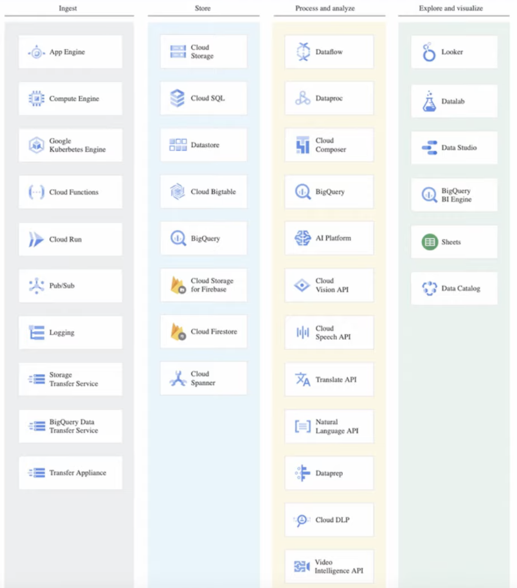

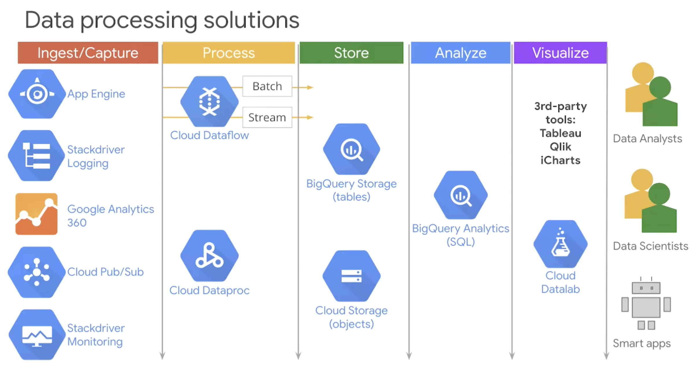

### Case Study

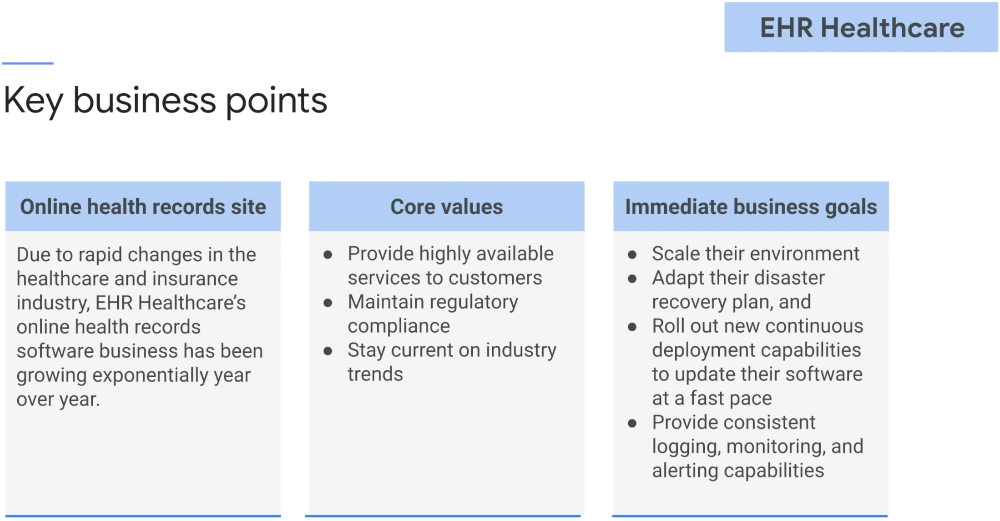

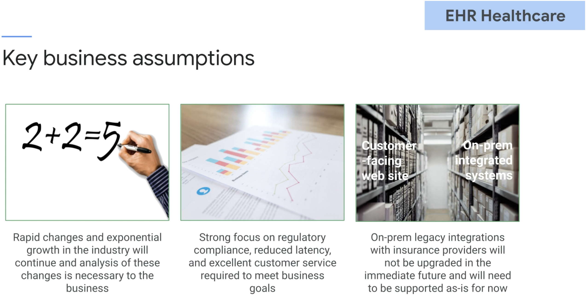

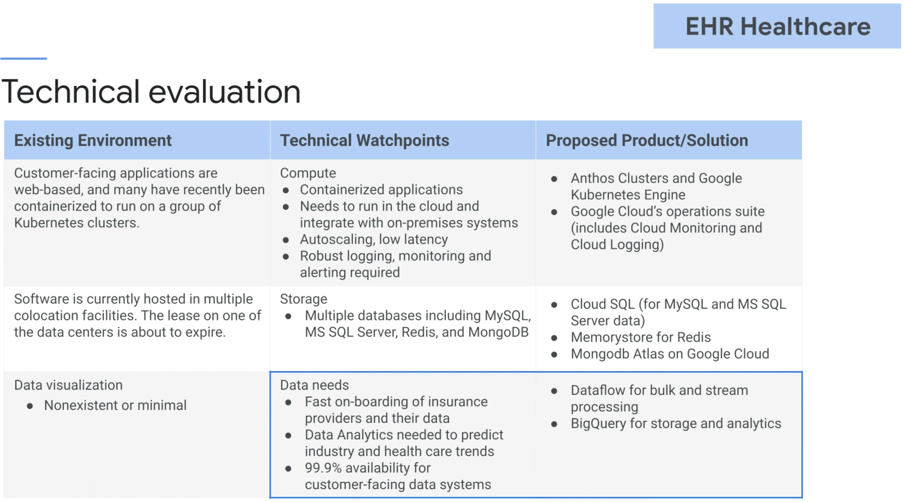

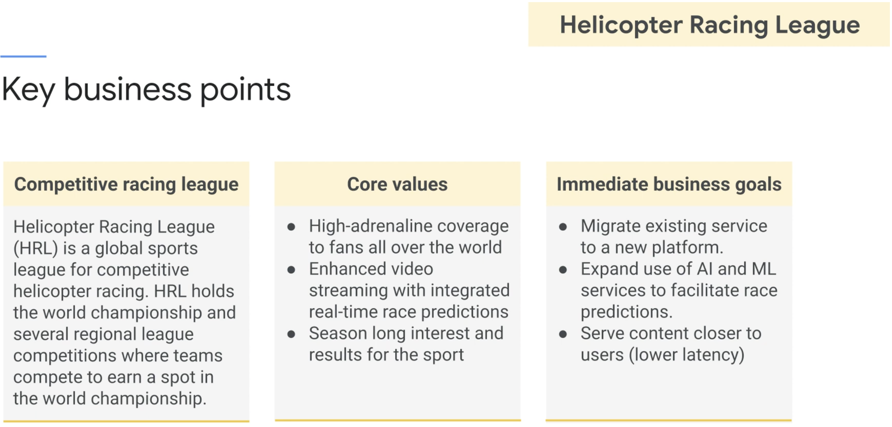

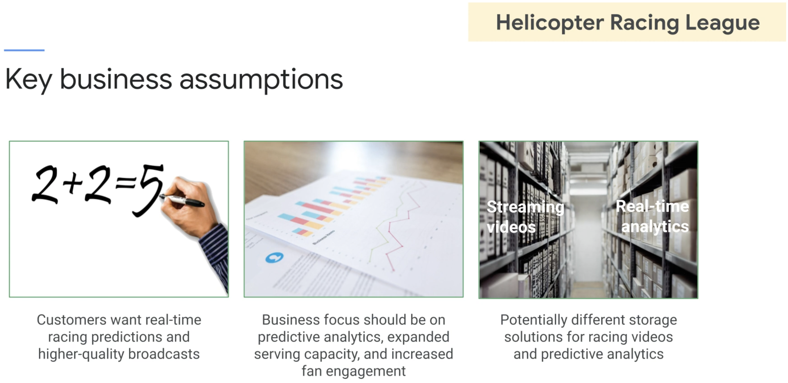

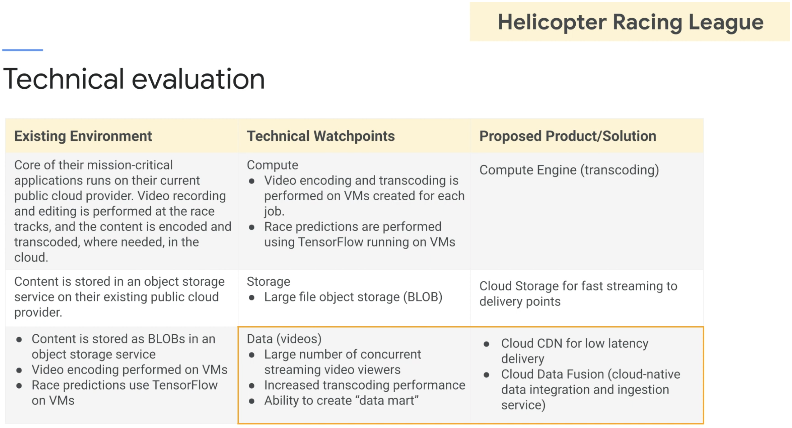

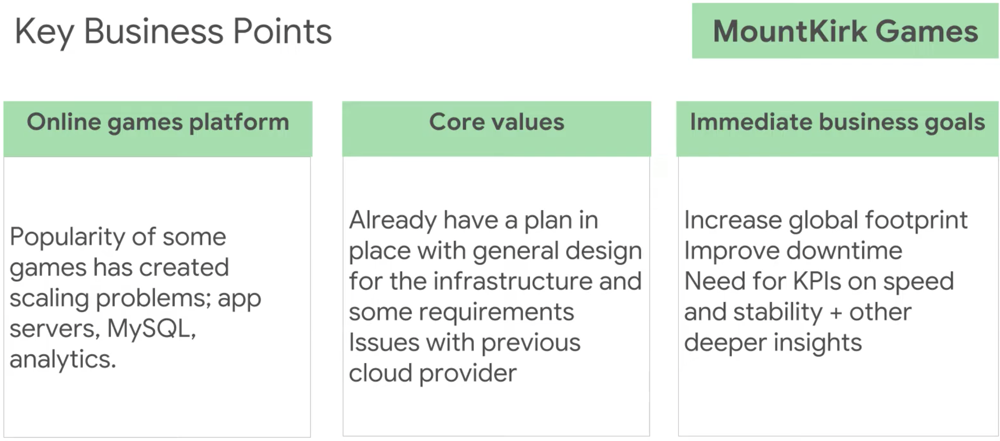

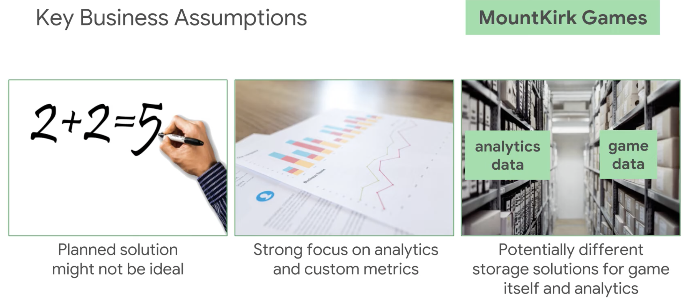

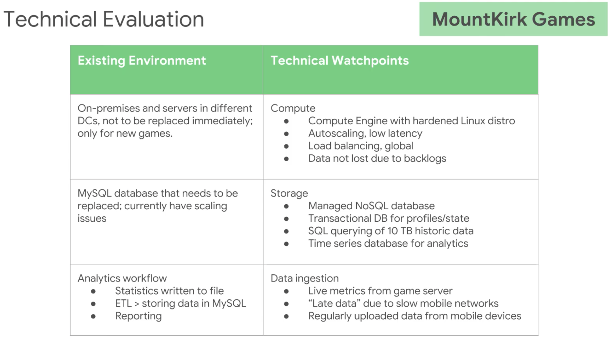

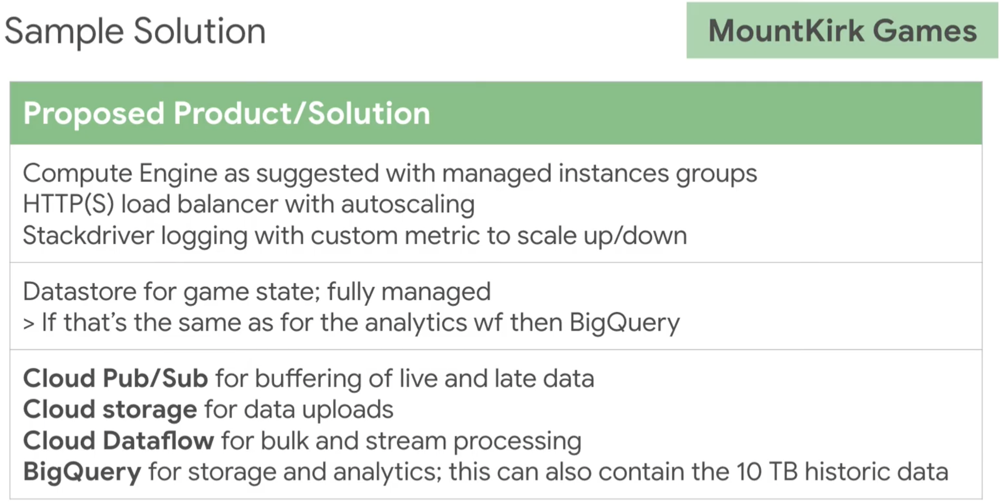

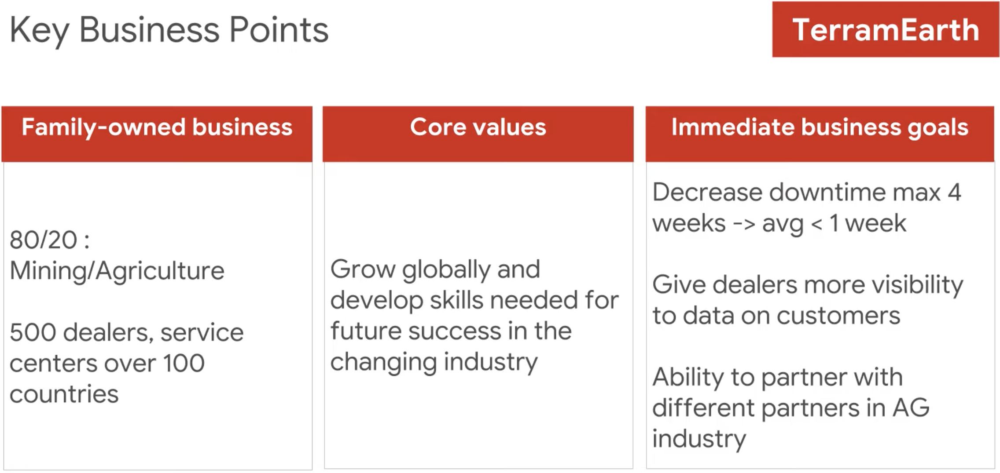

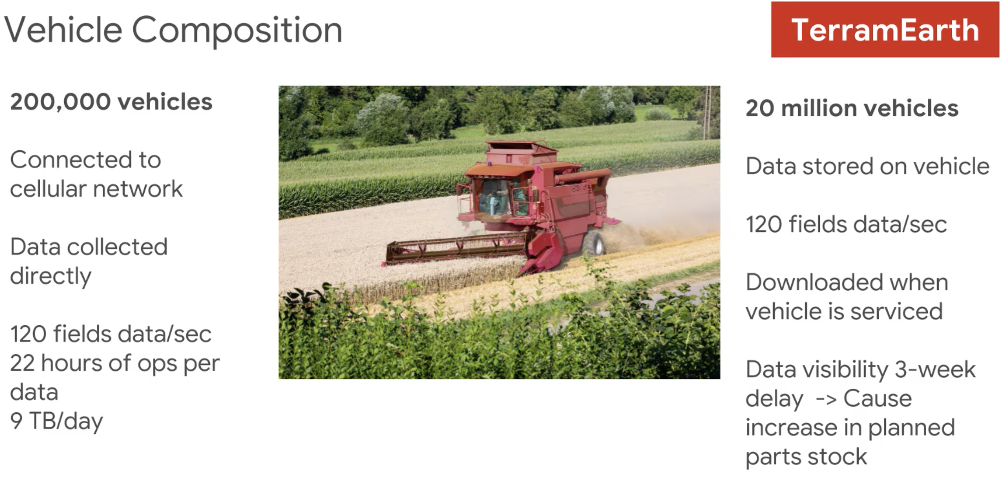

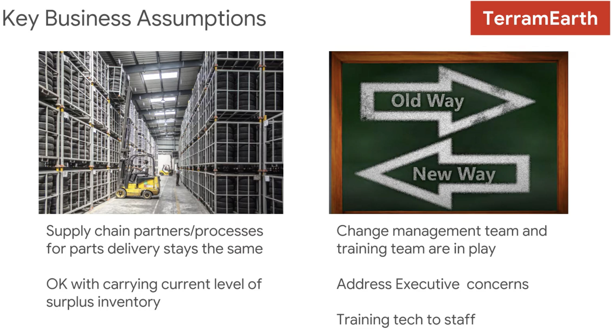

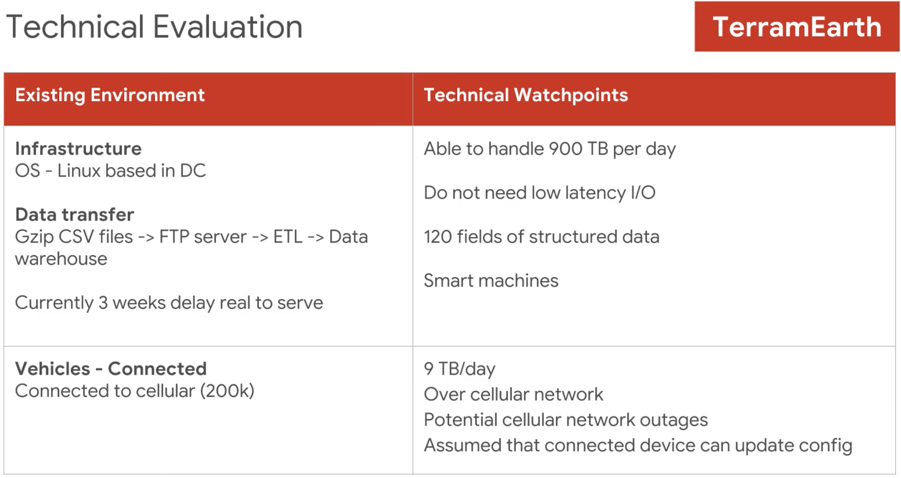

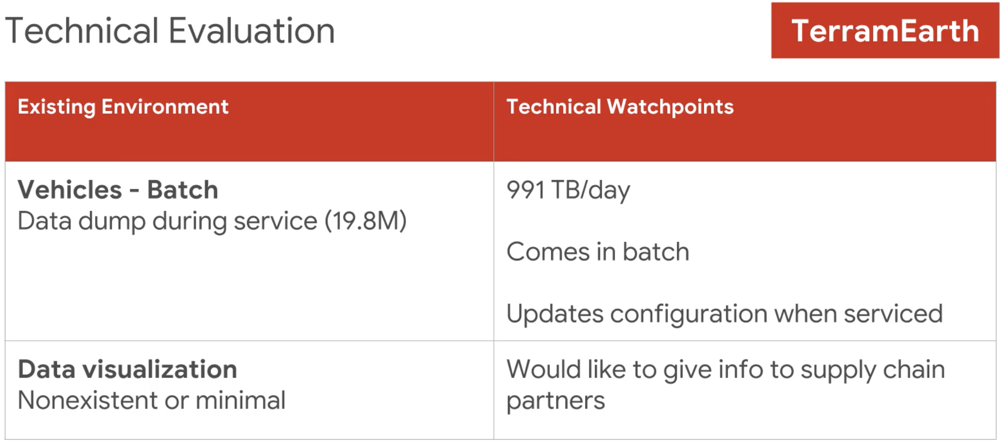

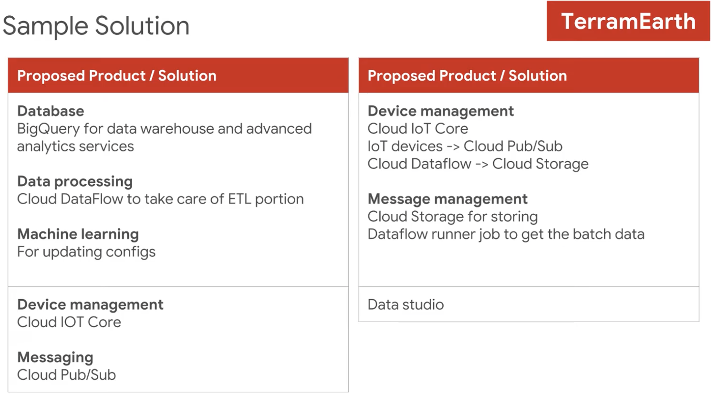

# Q&A

- Because you do not know every possible future use for the data TerramEarth collects, you have decided to build a system that captures and stores all raw data in case you need it later. How can you most cost-effectively accomplish this goal?

    A. Have the vehicles in the field stream the data directly into BigQuery.

    B. Have the vehicles in the field pass the data to Cloud Pub/Sub and dump it into a Cloud Dataproc cluster that stores data in Apache Hadoop Distributed File System (HDFS) on persistent disks.

    C. Have the vehicles in the field continue to dump data via FTP, adjust the existing Linux machines, and use a collector to upload them into Cloud Dataproc HDFS for storage.

    **D. Have the vehicles in the field continue to dump data via FTP, and adjust the existing Linux machines to immediately upload it to Cloud Storage with gsutil.**

    > A is not correct because TerramEarth has cellular service for 200,000 vehicles, and each vehicle sends at least one row (120 fields) per second. This exceeds BigQuery's maximum rows per second per project quota. Additionally, there are 20 million total vehicles, most of which perform uploads when connected by a maintenance port, which drastically exceeds the streaming project quota further.
    >
    > B is not correct because although Cloud Pub/Sub is a fine choice for this application, Cloud Dataproc is probably not. The question posed asks us to optimize for cost. Because Cloud Dataproc is optimized for ephemeral, job-scoped clusters, a long-running cluster with large amounts of HDFS storage could be very expensive to build and maintain when compared to managed and specialized storage solutions like Cloud Storage.
    >
    > C is not correct because the question asks us to optimize for cost, and because Cloud Dataproc is optimized for ephemeral, job-scoped clusters, a long-running cluster with large amounts of HDFS storage could be very expensive to build and maintain when compared to managed and specialized storage solutions like Cloud Storage.
    >
    > D is correct because several load-balanced Compute Engine VMs would suffice to ingest 9 TB per day, and Cloud Storage is the cheapest per-byte storage offered by Google. Depending on the format, the data could be available via BigQuery immediately, or shortly after running through an ETL job. Thus, this solution meets business and technical requirements while optimizing for cost.
    >
    > https://cloud.google.com/blog/products/data-analytics/10-tips-for-building-long-running-clusters-using-cloud-dataproc
    >
    > https://cloud.google.com/bigquery/quotas#streaming_inserts

- Today, TerramEarth maintenance workers receive interactive performance graphs for the last 24 hours (86,400 events) by plugging their maintenance tablets into the vehicle. The support group wants support technicians to view this data remotely to help troubleshoot problems. You want to minimize the latency of graph loads. How should you provide this functionality?

    A. Execute queries against data stored in a Cloud SQL.

    **B. Execute queries against data indexed by vehicle_id.timestamp in Cloud Bigtable.**

    C. Execute queries against data stored on daily partitioned BigQuery tables.

    D. Execute queries against BigQuery with data stored in Cloud Storage via BigQuery federation.

    > A is not correct because Cloud SQL provides relational database services that are well suited to OLTP workloads, but not storage and low-latency retrieval of time-series data.
    >
    > B is correct because Cloud Bigtable is optimized for time-series data. It is cost-efficient, highly available, and low-latency. It scales well. Best of all, it is a managed service that does not require significant operations work to keep running.
    >
    > C is not correct because BigQuery is fast for wide-range queries, but it is not as well optimized for narrow-range queries as Cloud Bigtable is. Latency will be an order of magnitude shorter with Cloud Bigtable for this use.
    >
    > D is not correct because the objective is to minimize latency, and although BigQuery federation offers tremendous flexibility, it doesn't perform as well as native BigQuery storage, and will have longer latency than Cloud Bigtable for narrow-range queries.
    >
    > https://cloud.google.com/bigquery/external-data-sources
    >
    > https://cloud.google.com/bigtable/docs/schema-design-time-series#time-series-cloud-bigtable

- Your agricultural division is experimenting with fully autonomous vehicles. You want your architecture to promote strong security during vehicle operation. Which two architecture characteristics should you consider? (choose two)

    A. Use multiple connectivity subsystems for redundancy.

    B. Require IPv6 for connectivity to ensure a secure address space.

    C. Enclose the vehicle’s drive electronics in a Faraday cage to isolate chips.

    D. Use a functional programming language to isolate code execution cycles.

    **E. Treat every microservice call between modules on the vehicle as untrusted.**

    **F. Use a Trusted Platform Module (TPM) and verify firmware and binaries on boot.**

    > A is not correct because this improves system durability, but it doesn't have any impact on the security during vehicle operation.
    >
    > B is not correct because IPv6 doesn't have any impact on the security during vehicle operation, although it improves system scalability and simplicity.
    >
    > C is not correct because it doesn't have any impact on the security during vehicle operation, although it improves system durability.
    >
    > D is not correct because merely using a functional programming language doesn't guarantee a more secure level of execution isolation. Any impact on security from this decision would be incidental at best.
    >
    > E is correct because this improves system security by making it more resistant to hacking, especially through man-in-the-middle attacks between modules.
    >
    > F is correct because this improves system security by making it more resistant to hacking, especially rootkits or other kinds of corruption by malicious actors.
    >
    > https://en.wikipedia.org/wiki/Trusted_Platform_Module

- Which of TerramEarth’s legacy enterprise processes will experience significant change as a result of increased Google Cloud Platform adoption?

    A. OpEx/CapEx allocation, LAN change management, capacity planning

    **B. Capacity planning, TCO calculations, OpEx/CapEx allocation**

    C. Capacity planning, utilization measurement, data center expansion

    D. Data center expansion,TCO calculations, utilization measurement

    > A is not correct because LAN change management processes don't need to change significantly. TerramEarth can easily peer their on-premises LAN with their Google Cloud Platform VPCs, and as devices and subnets move to the cloud, the LAN team's implementation will change, but the change management process doesn't have to.
    >
    > B is correct because all of these tasks are big changes when moving to the cloud. Capacity planning for cloud is different than for on-premises data centers; TCO calculations are adjusted because TerramEarth is using services, not leasing/buying servers; OpEx/CapEx allocation is adjusted as services are consumed vs. using capital expenditures.
    >
    > C is not correct because measuring utilization can be done in the same way, often with the same tools (along with some new ones). Data center expansion is not a concern for cloud customers; it is part of the undifferentiated heavy lifting that is taken care of by the cloud provider.
    >
    > D is not correct because data center expansion is not a concern for cloud customers; it is part of the undifferentiated heavy lifting that is taken care of by the cloud provider. Measuring utilization can be done in the same way, often with the same tools (along with some new ones).
    >
    > https://assets.kpmg/content/dam/kpmg/pdf/2015/11/cloud-economics.pdf

- You analyzed TerramEarth’s business requirement to reduce downtime and found that they can achieve a majority of time saving by reducing customers’ wait time for parts. You decided to focus on reduction of the 3 weeks’ aggregate reporting time. Which modifications to the company’s processes should you recommend?

    A. Migrate from CSV to binary format, migrate from FTP to SFTP transport, and develop machine learning analysis of metrics.

    B. Migrate from FTP to streaming transport, migrate from CSV to binary format, and develop machine learning analysis of metrics.

    **C. Increase fleet cellular connectivity to 80%, migrate from FTP to streaming transport, and develop machine learning analysis of metrics.**

    D. Migrate from FTP to SFTP transport, develop machine learning analysis of metrics, and increase dealer local inventory by a fixed factor.

    > A is not correct because machine learning analysis is a good means toward the end of reducing downtime, but shuffling formats and transport doesn't directly help at all.
    >
    > B is not correct because machine learning analysis is a good means toward the end of reducing downtime, and moving to streaming can improve the freshness of the information in that analysis, but changing the format doesn't directly help at all.
    >
    > C is correct because using cellular connectivity will greatly improve the freshness of data used for analysis from where it is now, collected when the machines are in for maintenance. Streaming transport instead of periodic FTP will tighten the feedback loop even more. Machine learning is ideal for predictive maintenance workloads.
    >
    > D is not correct because machine learning analysis is a good means toward the end of reducing downtime, but the rest of these changes don't directly help at all.

- Your company wants to deploy several microservices to help their system handle elastic loads. Each microservice uses a different version of software libraries. You want to enable their developers to keep their development environment in sync with the various production services. Which technology should you choose?

    A. RPM/DEB

    **B. Containers**

    C. Chef/Puppet

    D. Virtual machines

    > A is not correct because although OS packages are a convenient way to distribute and deploy libraries, they don't directly help with synchronizing. Even with a common repository, the development environments will probably deviate from production.
    >
    > B is correct because using containers for development, test, and production deployments abstracts away system OS environments, so that a single host OS image can be used for all environments. Changes that are made during development are captured using a copy on-write filesystem, and teams can easily publish new versions of the microservices in a repository.
    >
    > C is not correct because although infrastructure configuration as code can help unify production and test environments, it is very difficult to make all changes during development this way.
    >
    > D is not correct because virtual machines run their own OS, which will eventually deviate in each environment, just as now.

- Your company wants to track whether someone is present in a meeting room reserved for a scheduled meeting. There are 1000 meeting rooms across 5 offices on 3 continents. Each room is equipped with a motion sensor that reports its status every second. You want to support the data ingestion needs of this sensor network. The receiving infrastructure needs to account for the possibility that the devices may have inconsistent connectivity. Which solution should you design?

    A. Have each device create a persistent connection to a Compute Engine instance and write messages to a custom application.

    B. Have devices poll for connectivity to Cloud SQL and insert the latest messages on a regular interval to a device specific table.

    **C. Have devices poll for connectivity to Cloud Pub/Sub and publish the latest messages on a regular interval to a shared topic for all devices.**

    D. Have devices create a persistent connection to an App Engine application fronted by Cloud Endpoints, which ingest messages and write them to Cloud Datastore.

    > A is not correct because having a persistent connection does not handle the case where the device is disconnected.
    >
    > B is not correct because Cloud SQL is a regional, relational database and not the best fit for sensor data. Additionally, the frequency of the writes has the potential to exceed the supported number of concurrent connections.
    >
    > C is correct because Cloud Pub/Sub can handle the frequency of this data, and consumers of the data can pull from the shared topic for further processing.
    >
    > D is not correct because having a persistent connection does not handle the case where the device is disconnected.
    >
    > https://cloud.google.com/sql/
    >
    > https://cloud.google.com/pubsub/

- Your company wants to try out the cloud with low risk. They want to archive approximately 100 TB of their log data to the cloud and test the serverless analytics features available to them there, while also retaining that data as a long-term disaster recovery backup. Which two steps should they take? (choose two)

    **A. Load logs into BigQuery.**

    B. Load logs into Cloud SQL.

    C. Import logs into Cloud Logging.

    D. Insert logs into Cloud Bigtable.

    **E. Upload log files into Cloud Storage.**

    > A is correct because BigQuery is a serverless warehouse for analytics and supports the volume and analytics requirement.
    >
    > B is not correct because Cloud SQL does not support the expected 100 TB. Additionally, Cloud SQL is a relational database and not the best fit for time-series log data formats.
    >
    > C is not correct because Cloud Logging is optimized for monitoring, error reporting, and debugging instead of analytics queries.
    >
    > D is not correct because Cloud Bigtable is optimized for read-write latency and analytics throughput, not analytics querying and reporting.
    >
    > E is correct because Cloud Storage provides the Coldline and Archive storage classes to support long-term storage with infrequent access, which would support the long-term disaster recovery backup requirement.
    >
    > https://cloud.google.com/storage/docs/storage-classes#coldline
    >
    > https://cloud.google.com/bigtable/
    >
    > https://cloud.google.com/products/operations
    >
    > https://cloud.google.com/sql/
    >
    > https://cloud.google.com/bigquery/

- You set up an autoscaling managed instance group to serve web traffic for an upcoming launch. After configuring the instance group as a backend service to an HTTP(S) load balancer, you notice that virtual machine (VM) instances are being terminated and re-launched every minute. The instances do not have a public IP address. You have verified that the appropriate web response is coming from each instance using the curl command. You want to ensure that the backend is configured correctly. What should you do?

    A. Ensure that a firewall rule exists to allow source traffic on HTTP/HTTPS to reach the load balancer.

    B. Assign a public IP to each instance, and configure a firewall rule to allow the load balancer to reach the instance public IP.

    **C. Ensure that a firewall rule exists to allow load balancer health checks to reach the instances in the instance group.**

    D. Create a tag on each instance with the name of the load balancer. Configure a firewall rule with the name of the load balancer as the source and the instance tag as the destination.

    > A is not correct because the issue to resolve is the VMs being terminated, not access to the load balancer.
    >
    > B is not correct because this introduces a security vulnerability without addressing the primary concern of the VM termination.
    >
    > C is correct because health check failures lead to a VM being marked unhealthy and can result in termination if the health check continues to fail. Because you have already verified that the instances are functioning properly, the next step would be to determine why the health check is continuously failing.
    >
    > D is not correct because the source of the firewall rule that allows load balancer and health check access to instances is defined IP ranges, and not a named load balancer. Tagging the instances for the purpose of firewall rules is appropriate but would probably be a descriptor of the application, and not the load balancer.

- Your organization has a 3-tier web application deployed in the same Google Cloud Virtual Private Cloud (VPC). Each tier (web, API, and database) scales independently of the others. Network traffic should flow through the web to the API tier, and then on to the database tier. Traffic should not flow between the web and the database tier. How should you configure the network with minimal steps?

    A. Add each tier to a different subnetwork.

    B. Set up software-based firewalls on individual VMs.

    C. Add tags to each tier and set up routes to allow the desired traffic flow.

    **D. Add tags to each tier and set up firewall rules to allow the desired traffic flow.**

    > A is not correct because the subnetwork alone will not allow and restrict traffic as required without firewall rules.
    >
    > B is not correct because this adds complexity to the architecture and the instance configuration.
    >
    > C is not correct because routes still require firewall rules to allow traffic as requests. Additionally, the tags are used for defining the instances the route applies to, and not for identifying the next hop. The next hop is either an IP range or instance name, but in the proposed solution the tiers are only identified by tags.
    >
    > D is correct because as instances scale, they will all have the same tag to identify the tier. These tags can then be leveraged in firewall rules to allow and restrict traffic as required, because tags can be used for both the target and source.
    >
    > https://cloud.google.com/vpc/docs/using-vpc
    >
    > https://cloud.google.com/vpc/docs/routes
    >
    > https://cloud.google.com/vpc/docs/add-remove-network-tags

- You are designing a large distributed application with 30 microservices. Each of your distributed microservices needs to connect to a database backend. You want to store the credentials securely. Where should you store the credentials?

    A. In the source code

    B. In an environment variable

    **C. In a secret management system**

    D. In a config file that has restricted access through ACLs

    > A is not correct because storing credentials in source code and source control is discoverable, in plain text, by anyone with access to the source code. This also introduces the requirement to update code and do a deployment each time the credentials are rotated.
    >
    > B is not correct because consistently populating environment variables would require the credentials to be available, in plain text, when the session is started.
    >
    > C is correct because a secret management system such as Secret Manager is a secure and convenient storage system for API keys, passwords, certificates, and other sensitive data. Secret Manager provides a central place and single source of truth to manage, access, and audit secrets across Google Cloud.
    >
    > D is not correct because instead of managing access to the config file and updating manually as keys are rotated, it would be better to leverage a key management system. Additionally, there is increased risk if the config file contains the credentials in plain text.
    >
    > https://cloud.google.com/kubernetes-engine/docs/concepts/secret
    >
    > https://cloud.google.com/secret-manager

- Mountkirk Games wants to set up a real-time analytics platform for their new game. The new platform must meet their technical requirements. Which combination of Google technologies will meet all of their requirements?

    A. Kubernetes Engine, Cloud Pub/Sub, and Cloud SQL

    **B. Cloud Dataflow, Cloud Storage, Cloud Pub/Sub, and BigQuery**

    C. Cloud SQL, Cloud Storage, Cloud Pub/Sub, and Cloud Dataflow

    D. Cloud Dataproc, Cloud Pub/Sub, Cloud SQL, and Cloud Dataflow

    E. Cloud Pub/Sub, Compute Engine, Cloud Storage, and Cloud Dataproc

    > A is not correct because Cloud SQL is the only storage listed, is limited to 10 TB of storage, and is better suited for transactional workloads. Mountkirk Games needs queries to access at least 30,720 GB of historical data for analytic purposes.
    >
    > B is correct because:
    > -Cloud Dataflow dynamically scales up or down, can process data in real time, and is ideal for processing data that arrives late using Beam windows and triggers.
    > -Cloud Storage can be the landing space for files that are regularly uploaded by users’ mobile devices.
    > -Cloud Pub/Sub can ingest the streaming data from the mobile users.
    > BigQuery can query more than 10 TB of historical data.
    >
    > C is not correct because Cloud SQL is the only storage listed, is limited to 30,720 GB of storage, and is better suited for transactional workloads. Mountkirk Games needs queries to access at least 10 TB of historical data for analytic purposes.
    >
    > D is not correct because Cloud SQL is limited to 30,720 GB of storage and is better suited for transactional workloads. Mountkirk Games needs queries to access at least 10 TB of historical data for analytics purposes.
    >
    > E is not correct because Mountkirk Games needs the ability to query historical data. While this might be possible using workarounds, such as BigQuery federated queries for Cloud Storage or Hive queries for Cloud Dataproc, these approaches are more complex. BigQuery is a simpler and more flexible product that fulfills those requirements.
    >
    > https://cloud.google.com/sql/docs/quotas#fixed-limits
    >
    > https://beam.apache.org/documentation/programming-guide/#windowing
    >
    > https://beam.apache.org/documentation/programming-guide/#triggers
    >
    > https://cloud.google.com/bigquery/external-data-sources
    >
    > https://cloud.google.com/solutions/using-apache-hive-on-cloud-dataproc

- Mountkirk Games has deployed their new backend on Google Cloud Platform (GCP). You want to create a thorough testing process for new versions of the backend before they are released to the public. You want the testing environment to scale in an economical way. How should you design the process?

    **A. Create a scalable environment in Google Cloud for simulating production load.**

    B. Use the existing infrastructure to test the Google Cloud-based backend at scale.

    C. Build stress tests into each component of your application and use resources from the already deployed production backend to simulate load.

    D. Create a set of static environments in Google Cloud to test different levels of load—for example, high, medium, and low.

    > A is correct because simulating production load in Google Cloud can scale in an economical way.
    >
    > B is not correct because one of the pain points about the existing infrastructure was precisely that the environment did not scale well.
    >
    > C is not correct because it is a best practice to have a clear separation between test and production environments. Generating test load should not be done from a production environment.
    >
    > D is not correct because Mountkirk Games wants the testing environment to scale as needed. Defining several static environments for specific levels of load goes against this requirement.
    >
    > https://cloud.google.com/community/tutorials/load-testing-iot-using-gcp-and-locust
    >
    > https://github.com/GoogleCloudPlatform/distributed-load-testing-using-kubernetes

- Mountkirk Games wants to set up a continuous delivery pipeline. Their architecture includes many small services that they want to be able to update and roll back quickly. Mountkirk Games has the following requirements: (1) Services are deployed redundantly across multiple regions in the US and Europe, (2) Only frontend services are exposed on the public internet, (3) They can reserve a single frontend IP for their fleet of services, and (4) Deployment artifacts are immutable. Which set of products should they use?

    A. Cloud Storage, Cloud Dataflow, Compute Engine

    B. Cloud Storage, App Engine, Cloud Load Balancing

    **C. Container Registry, Google Kubernetes Engine, Cloud Load Balancing**

    D. Cloud Functions, Cloud Pub/Sub, Cloud Deployment Manager

    > A is not correct because Mountkirk Games wants to set up a continuous delivery pipeline, not a data processing pipeline. Cloud Dataflow is a fully managed service for creating data processing pipelines.
    >
    > B is not correct because a Cloud Load Balancer distributes traffic to Compute Engine instances. App Engine and Cloud Load Balancer are parts of different solutions.
    >
    > C is correct because:
    > -Google Kubernetes Engine is ideal for deploying small services that can be updated and rolled back quickly. It is a best practice to manage services using immutable containers. -Cloud Load Balancing supports globally distributed services across multiple regions. It provides a single global IP address that can be used in DNS records. Using URL Maps, the requests can be routed to only the services that Mountkirk wants to expose. -Container Registry is a single place for a team to manage Docker images for the services.
    >
    > D is not correct because you cannot reserve a single frontend IP for cloud functions. When deployed, an HTTP-triggered cloud function creates an endpoint with an automatically assigned IP.

- Your customer is moving their corporate applications to Google Cloud. The security team wants detailed visibility of all resources in the organization. You use Resource Manager to set yourself up as the Organization Administrator. Which Cloud Identity and Access Management (Cloud IAM) roles should you give to the security team while following Google recommended practices?

    A. Organization viewer, Project owner

    **B. Organization viewer, Project viewer**

    C. Organization administrator, Project browser

    D. Project owner, Network administrator

    > A is not correct because Project owner is too broad. The security team does not need to be able to make changes to projects.
    >
    > B is correct because:
    > -Organization viewer grants the security team permissions to view the organization's display name.
    > -Project viewer grants the security team permissions to see the resources within projects.
    >
    > C is not correct because Organization Administrator is too broad. The security team does not need to be able to make changes to the organization.
    >
    > D is not correct because Project Owner is too broad. The security team does not need to be able to make changes to projects.
    >
    > https://cloud.google.com/resource-manager/docs/access-control-org#using_predefined_roles

- To reduce costs, the Director of Engineering has required all developers to move their development infrastructure resources from on-premises virtual machines (VMs) to Google Cloud. These resources go through multiple start/stop events during the day and require state to persist. You have been asked to design the process of running a development environment in Google Cloud while providing cost visibility to the finance department. Which two steps should you take? (choose two)

    **A. Use persistent disks to store the state. Start and stop the VM as needed.**

    B. Use the --auto-delete flag on all persistent disks before stopping the VM.

    C. Apply VM CPU utilization label and include it in the BigQuery billing export.

    **D. Use BigQuery billing export and labels to relate cost to groups.**

    E. Store all state in a Local SSD, snapshot the persistent disks, and terminate the VM.

    > A is correct because persistent disks will not be deleted when an instance is stopped.
    >
    > B is not correct because the --auto-delete flag has no effect unless the instance is deleted. Stopping an instance does not delete the instance or the attached persistent disks.
    >
    > C is not correct because labels are used to organize instances, not to monitor metrics.
    >
    > D is correct because exporting daily usage and cost estimates automatically throughout the day to a BigQuery dataset is a good way of providing visibility to the finance department. Labels can then be used to group the costs based on team or cost center.
    >
    > E is not correct because the state stored in local SSDs will be lost when the instance is stopped.
    >
    > https://cloud.google.com/compute/docs/instances/instance-life-cycle
    >
    > https://cloud.google.com/sdk/gcloud/reference/compute/instances/set-disk-auto-delete#--auto-delete
    >
    > https://cloud.google.com/sdk/gcloud/reference/compute/instances/create#--disk
    >
    > https://cloud.google.com/compute/docs/disks/local-ssd#data_persistence
    >
    > https://cloud.google.com/billing/docs/how-to/export-data-bigquery
    >
    > https://cloud.google.com/resource-manager/docs/creating-managing-labels

- The database administration team has asked you to help them improve the performance of their new database server running on Compute Engine. The database is used for importing and normalizing the company’s performance statistics. It is built with MySQL running on Debian Linux. They have an n1-standard-8 virtual machine with 80 GB of SSD zonal persistent disk which they can't restart until the next maintenance event. What should they change to get better performance from this system as soon as possible and in a cost-effective manner?

    A. Increase the virtual machine’s memory to 64 GB.

    B. Create a new virtual machine running PostgreSQL.

    **C. Dynamically resize the SSD persistent disk to 500 GB.**

    D. Migrate their performance metrics warehouse to BigQuery.

    > A is not correct because increasing the memory size requires a VM restart.
    >
    > B is not correct because the DB administration team is requesting help with their MySQL instance. Migration to a different product should not be the solution when other optimization techniques can still be applied first.
    >
    > C is correct because persistent disk performance is based on the total persistent disk capacity attached to an instance and the number of vCPUs that the instance has. Incrementing the persistent disk capacity will increment its throughput and IOPS, which in turn improve the performance of MySQL.
    >
    > D is not correct because the DB administration team is requesting help with their MySQL instance. Migration to a different product should not be the solution when other optimization techniques can still be applied first.
    >
    > https://cloud.google.com/compute/docs/disks/performance
    >
    > https://cloud.google.com/compute/docs/disks/#pdspecs

- You need to implement back-out/rollback for a website with 100s of VMs. The site has frequent critical updates. Which of the following is the correct solution?

    - **Use managed instance groups with the "update-instances" command when starting a rolling update.**

        > This is correct. Allows Compute Engine to handle updates. Easy management of VMs.

    - Create a Nearline copy of static data in Cloud Storage.

    - Only deploy changes using Deployment Manager templates.

    - Create a snapshot of each VM prior to update, in case of failure.

- How can you minimize the cost of storing security video files that are processed repeatedly for 30 days?

    - Standard Storage, then move to Nearline Storage after 30 days.

    - **Standard Storage, then move to Coldline Storage or Archive Storage after 30 days.**

        > This is correct. Standard Storage for lowest access costs over the 30 days, then Coldline Storage or Archive Storage because it is unlikely to be read after the 30 days.

    - Keep the files in Standard Storage.

    - Nearline Storage, then move to Coldline Storage after 30 days.

- What security strategy would you recommend for PII (Personally Identifiable Information) data on Cloud Storage?
    - **No Cloud IAM roles to users, and granular ACLs on bucket.**

        > This is correct because it provides the most restrictive access among the options.
    - Signed URL with expiration.
    - Public access, random names, and share URLs in confidence.
    - Read-only access to users, and default ACL on bucket.

- A company wants penetration security testing that primarily matches an end user perspective. What action would you take?
    - Use on prem scanners over VPN.
    
    - ~~Notify Google you are going to run a penetration test.~~
    
        > This is not correct. Google doesn't require notification for this.
    - **Use on prem scanners over public Internet.**
    
    - ~~Deploy scanners in the cloud and test from there.~~
    
        > This is not correct. Scanners in the cloud wouldn't meet the "end user perspective"
    
- A car reservation system has long-running transactions. Which one of the following deployment methods should be avoided?
    - **Introduce a blue-green deployment model.**
    
        > This is correct. Switching the load balancer from pointing at the green "good" environment to the blue "new" environment is a fast way to rollback if there is a problem during release. However, long-running transactions will be disrupted by that switch.
    
    - Execute canary releases.
    
    - Introduce a pipeline deployment model.
    
    - Perform A/B testing prior to release.
    
- Multi-petabyte database for analysts that only know SQL and must be available 24 x 7.
    - **BigQuery**
    
        > This is correct because BigQuery SLA is 99.9%, meeting the uptime requirement, and it has an SQL interface.
    - Cloud Storage
    - Datastore
    - Cloud SQL
    
- How to test a risky update to an App Engine application requiring live traffic?
    - Create a second App Engine project, then redirect a subset of users.
    - Deploy as default temporarily, then roll it back.
    - **Deploy a new version, use traffic splitting to test a percentage.**
    
        > That is correct. Deploying a new version, but not as default, is easily reversed. Traffic splitting enables testing with some live traffic, meeting the requirement.
    - Create a separate isolated test project and onboard users.
    
- Which Cloud IAM roles would you assign for security auditors requiring visibility across all projects?
    - Org admin, project browser
    - Org viewer, project owner
    - Project owner, network admin
    - **Org viewer, project viewer**
    
        > This is correct. This gives read-only access across the company.
    
- Last week a region had a 1% failure rate in web tier VMs? How should you respond?
    - There are fewer LookML parameters to write in the dimension_group definition
    - **Perform a root cause analysis, reviewing cloud provider and deployment details to prevent similar future failures.**
    
        > This is correct. Perform root cause analysis, because you don't know from the information given whether the issue had to do with the Cloud Provider or was in the application or something to do with the interface between the application and cloud resources. The goal of identifying the root cause is to prevent future failures, that might include changing procedures.
    - Monitor the application for a 5% failure rate.
    - Halt all development until the application issue can be found and fixed.
    - Duplicate the application on prem to compensate for failures in the cloud.
    
- An existing application uses websockets. To help migrate the application to cloud you should:
    - **Do nothing to the application. HTTP(S) load balancing natively supports websocket proxying.**
    
        > This is correct because HTTP(S) Load Balancing has native support for the WebSocket protocol. Backends that use WebSocket to communicate with clients can use the HTTP(S) load balancer as a front end, for scale and availability. The load balancer does not need any additional configuration to proxy WebSocket connections.
    - Redesign the application to use HTTP streaming.
    - Review websocket encryption requirements with the security team.
    - Redesign the application to use distributed sessions instead of websockets.
    
- Which service should be used in the icon with the question mark in the diagram to keep VM file data in sync across regions? 
    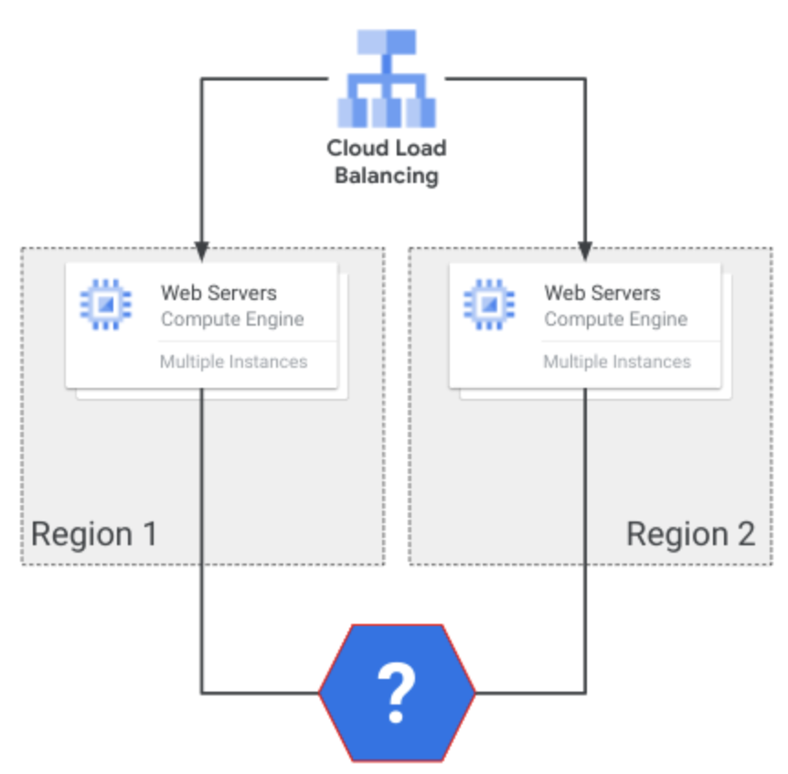
    
    - Transfer Appliance
    - Cloud SQL
    - **Cloud Storage**
    
        > This is correct. Cloud Storage Standard Storage buckets stay in sync between regions automatically. The other services listed are in a single region.
    - Cloud Bigtable
    
- A company is building an image tagging pipeline. Which service should be used in the icon with the question mark in the diagram?
    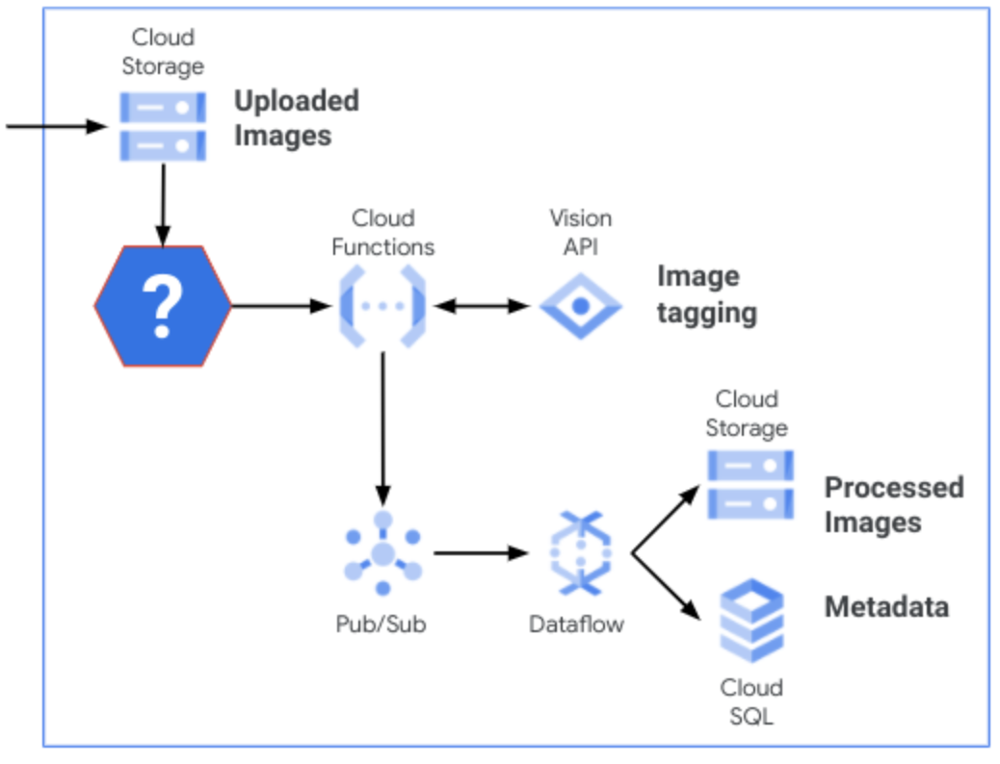
    
    - **Pub/Sub**
    
        > This is correct. Cloud Storage upload events can push Pub/Sub to trigger a Cloud Function to ingest and process the image.
    - Datastore
    - Cloud Bigtable
    - Dataflow
    
- How to store data to be accessed once a month and not needed after five years.
    - Nearline class, lifecycle policy change to Coldline after 5 years.
    - Standard Storage class, lifecycle policy to delete after 5 years.
    - **Nearline class, lifecycle policy to delete after 5 years.**
    
        > This is correct because the access pattern is Nearline. "Not needed" means delete, not archive.
    - Standard Storage class, lifecycle policy change to Coldline after 5 years.
    
- A sales company runs weekly resiliency tests of the current build in a separate environment by replaying the last holiday sales load. What can improve resiliency?
    - Use preemptible instances.
    - Apply twice the load to the test.
    - **Develop a script that mimics a zone outage and add it to the test.**
    
        > This is correct. The goal is resiliency -- to see that the application continues to run and "bounces back" after the outage is over. Simulating a zone outage is one way to ensure that the application can really handle the loss of a zone.
    - Run the resiliency tests daily instead of weekly.
    
- A company has a new IoT pipeline. Which services will make this design work? Select the services that should be used to replace the icons with the number "1" and number "2" in the diagram.
    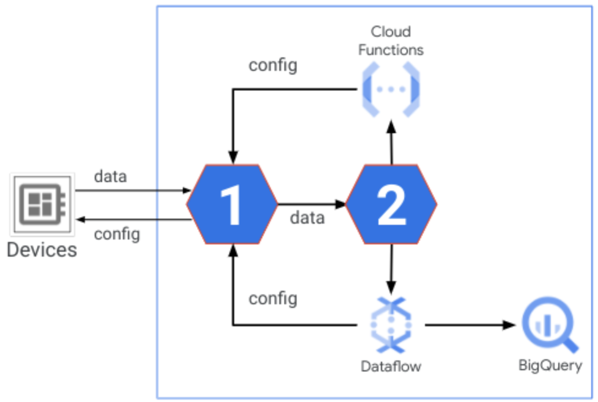
    
    - **Cloud IoT Core, Pub/Sub**
    
        > This is correct because device data captured by Cloud IoT Core gets published to Pub/Sub
    - Cloud IoT Core, Datastore
    - App Engine, Cloud IoT Core
    - Pub/Sub, Cloud Storage
    
- How can MountKirk Games meet its scaling requirements while providing insights to investors?
    - Autoscale based on CPU load and use Google Data Studio to share metrics.
    - Import MySQL game statistics to BigQuery for provisioning analysis and indicator reporting.
    - Autoscale based on network latency as a measure of user experience.
    - **Use Cloud Monitoring custom metrics for autoscaling and reporting.**
    
        > This is correct. Cloud Monitoring custom metrics can be crafted to expose specific game activities, which can be useful for autoscaling and provide a more detailed source of indicators for the targeted marketing investors require. Cloud Operations is a fully managed service.
    
- Simply and reliably clone a Linux VM to another project in another region.
    - Create an image from the root disk with Linux dd, create a disk from the image, and use it in the new VM.
    - Use Linux dd and netcat to stream the root disk to the new VM.
    - **Snapshot the root disk, create an image, and use the image for the new VM root disk.**
    
        > This is correct. It will work across project and region, and it is a simple and reliable method.
    - Snapshot the root disk and select it for the new VM.
    
- A company’s security team has decided to standardize on AES256 for storage device encryption. Which strategy should be used with Compute Engine instances?
    - Use Customer Supplied Encryption Keys (CSEK).
    - **Select SSDs rather than HDDs to ensure AES256 encryption.**
    
        > This is correct. Selection of disk type determines the default method for whole-disk encryption. HDDs use AES128 and SDDs use AES256.
    - Use openSSL for AES256 file encryption.
    - Use the linux dm-crypt tool for whole-disk encryption.
    
- Which service completes the CI/CD pipeline? Which service should be used in the icon with the question mark in the diagram?
    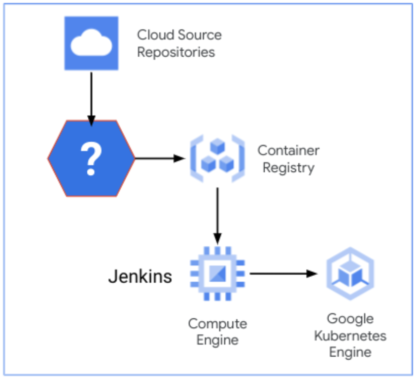
    
    - Cloud Storage
    - Pub/Sub
    - Dataproc
    - **Cloud Build**
    
        > This is correct because Cloud Build builds docker images from source repositories.
    
- Release failures keep causing rollbacks in a web application. Fixes to the QA process reduced rollbacks by 80%. What additional steps can you take?
    - Remove the QA environment. Start executing canary releases.
    - Replace the platform’s relational database systems with a NoSQL database.
    - Remove the platform’s dependency on relational database systems.
    - **Fragment the monolithic platform into microservices.**
    
        > This is correct. Smaller functional units means smaller releases with less "surface area" for problems to occur. More incremental rollouts. Fewer rollbacks.
    
- How will the application parts developed by separate project teams communicate over RFC1918 addresses?
    - Parts communicate using HTTPS
    - Single project, same VPC
    - Communicate over global load balancers, one per project
    - **Shared VPC, each project a service of the Shared VPC project**
    
        > This is correct. Each team has their own project but communicates securely over a single RFC1918 address space.
    
- Which platform features of Google Cloud support TerramEarth's business requirements?
    - **Vertex AI and BigQuery are designed for petabyte scale.**
    
        > This is correct. TerramEarth already has 200TB+ of data and is in a growth phase. Therefore they must be concerned that the solution will be supportable as they "undergo the next wave of transformations in our industry". Also, TerramEarth seeks a competitive advantage through "incremental innovations" which can come from data insights using BigQuery and Vertex AI.
    - Google has many years of experience with containers.
    - Google Cloud bills per minute, saving costs compared to hourly billing.
    - Google Cloud provides automatic discounts with increased usage.
    
- A company has this business requirement: "Improve security by defining and adhering to a set of security and Identity and Access Management (IAM) best practices for cloud." Company security has locked out SSH access to production VMs. How can operations manage the VMs?
    - **Grant operations team access to use Cloud Shell.**
    
        > Correct. The operations team doesn't actually need SSH access to manage VMs. All it needs is Cloud Shell with the Cloud SDK and gcloud tools. Cloud Shell provides all the tools for managing Compute Engine instances. In this case the assumption that SSH access is needed is incorrect.
    - Configure a VPN to allow SSH access to VMs.
    - Develop an application that grants temporary SSH access.
    - Develop a Cloud API application for all operations actions.
    
- A microservice has intermittent problems that bursts logs. How can you trap it for live debugging?
    - Configure microservice to send traces to Cloud Trace.
    - Log into machine with microservice and wait for the log messages.
    - **Set a log metric in Cloud Logging, alert on it past a threshold.**
    
        > This is correct. A Cloud Logging metric can identify a burst of log lines. You can set an alert. Then connect to the machine while the problem is happening.
    - Look for error in Error Reporting dashboard.
    
- How do you automatically and simultaneously deploy new code to each cluster?
    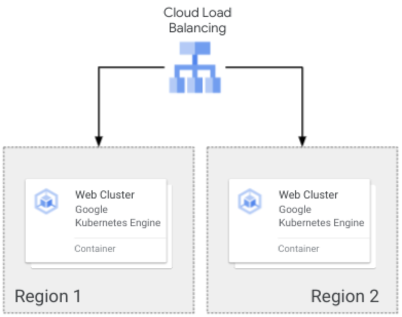
    
    - Use Parallel SSH with Cloud Shell and kubectl.
    - **Use an automation tool, such as Jenkins.**
    
        > This is correct. Jenkins handles automation and simultaneous deployment.
    - Use Cloud Build to publish the new images.
    - ~~Change the clusters to activate federated mode.~~
    
        > This is not correct. Federated mode handles simultaneous, but not automation.

