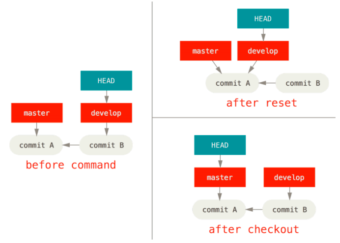

# Concept

## reset, revert, checkout 비교

| Command                    | HEAD | Index | Workdir | WD Safe |
| -------------------------- | ---- | ----- | ------- | ------- |
| `reset --soft [commit]`    | REF  | NO    | NO      | YES     |
| `reset --hard [commit]`    | REF  | YES   | YES     | NO      |
| `reset [commit]`           | REF  | YES   | NO      | YES     |
| `revert [commit]`          | NO   | YES   | YES     | YES     |
| `checkout [commit]`        | HEAD | YES   | YES     | YES     |
| `reset (commit) [file]`    | NO   | YES   | NO      | YES     |
| `checkout (commit) [file]` | NO   | YES   | YES     | NO      |

- revert [file] : Revert는 File 단위로 불가능, Commit 단위로만 가능

명령이 HEAD가 가리키는 Branch를 움직이면 HEAD 열에 ‘REF’, HEAD 자체를 움직이면 ‘HEAD’로 표기한다. 

Branch를 움직였다는 것은 해당 Branch의 마지막 Commit이 변경되었다는 것이고, HEAD를 움직였다는 것은 각 Branch의 마지막 Commit은 그대로 있고 HEAD가 가리키는 위치만 바뀐 것이다. 




# Config

## Global Configs

```sh
# global config
git config --global user.name "dgdsingen"
git config --global user.email dgdsingen@gmail.com

git config --global core.quotepath false
git config --global core.eol lf
git config --global core.autocrlf input
git config --global core.editor vim
git config --global diff.tool vimdiff
git config --global merge.tool vimdiff

git config --global alias.co checkout
git config --global alias.br branch
git config --global alias.ci commit
git config --global alias.st status
git config --global alias.mt mergetool
git config --global alias.df diff

git config --global init.defaultBranch main

git config --global pull.rebase false

## git log 등을 less 대신 cat으로 보고 싶다면
git config --global core.pager cat

# GitHub, GitLab 등 다양한 서비스와 계정을 사용하는 경우 --global 옵션을 제거하여 Repository 별로 Credential을 저장하자.

## Store credential
git config credential.helper store
git config --global credential.helper store
git config --system credential.helper store

## Remove credential
git config --unset credential.helper
git config --global --unset credential.helper
git config --system --unset credential.helper
```

## OS별 개행문자 설정

실제 소스를 변경하지 않았는데 개행문자(Windows = CRLF, Linux = LF) 차이로 인해 Git이 해당 소스를 commit 대상으로 착각할 수 있다. 

### core.eof

git 이 line ending을 어떻게 처리하는지 관련된 항목이다. 세 가지 설정을 할 수 있다.

1. core.eol = native. (default) Windows에서는 CRLF, Linux/OSX는 LF로 설정된다.
2. core.eol = crlf. CRLF 를 line ending 으로 사용한다.
3. core.eol = lf. LF를 line ending 으로 사용한다.

설정


```sh
git config --global core.eol lf
```


설정 확인


```sh
git config --global --list | grep core.eol
```


### core.autocrlf

git 은 저장소 메타 데이타 디렉터리인 .git 폴더에 모든 이력 데이터를 갖고 있다. 이력 데이타는 key/value 형식의 데이타베이스이며 core.autocrlf 는 text file 을 git object database 에 checkin, checkout 할 때 어떻게 처리할지를 설정하는 변수이다. 다음 세 가지 설정이 가능하다.

1. core.autocrlf = false. (default) 파일에 CRLF 를 썼든 LF 를 썼든 git 은 상관하지 않고 파일 그대로 checkin, checkout 한다. 이 설정은 line ending 이 다른 OS 에서는 text file 이 변경되었다고 나오므로 위에서 언급한 여러 가지 문제가 발생할 수 있다.
2. core.autocrlf = true. text file을 object database 에 넣기전에 CRLF 를 LF 로 변경한다.
3. core.autocrlf = input. LF를 line ending 으로 사용한다.

#### 방법 #1 - autocrlf 설정 사용

OS 별 CRLF 차이로 인한 문제를 막기 위해 OS 별로 다음과 같이 crlf 처리 방법을 설정하는 걸 권장한다.

WINDOWS

윈도에서는 CRLF 를 사용하므로 저장소에서 가져올 때 LF 를 CRLF 로 변경하고 저장소로 보낼 때는 CRLF 를 LF 로 변경하도록 true로 설정한다.


```sh
git config --global core.autocrlf true
```


LINUX, MAC OS

리눅스, 맥, 유닉스는 LF 만 사용하므로 input 으로 설정한다.


```sh
git config --global core.autocrlf input
```


#### 방법 #2 - .gitattributes 사용

git 은 텍스트 파일의 속성을 .gitattributes 파일을 통해 설정할 수 있으며 여기에는 crlf 처리도 지정할 수 있다. .gitattributes 를 저장소에 커밋하면 다른 클라이언트는 별도의 설정이 필요없다.


```sh
# Auto detect text files and perform LF normalization
-      text=auto


*.cs     text diff=csharp
*.java   text diff=java
*.html   text diff=html
*.css    text
*.js     text
*.sql    text


*.csproj text merge=union
*.sln    text merge=union eol=crlf


*.docx   diff=astextplain
*.DOCX   diff=astextplain


# absolute paths are ok, as are globs
/**/postinst* text eol-lf


# paths that don't start with / are treated relative to the .gitattributes folder
relative/path/*.txt text eol-lf
```


만약 git client 로 egit 을 사용하면 .gitattributes 를 읽지 못하므로 제대로 동작 안 하므로 방법 #1 을 사용해야 한다.

> 참조: https://www.lesstif.com/pages/viewpage.action?pageId=20776404


## Remote fetch/push 저장소 변경

원본 Repo를 fork 떠서, fetch는 원본 Repo(upstream)으로부터 받고 push는 fork(downstream) repo로 하는 등 fetch와 push remote를 변경하고 싶다면 아래와 같이 설정한다.

```sh
git clone repo
git remote set-url fork fork_url # set fetch remote
git remote set-url --push fork fork_url # set push remote
```


# Hook

## .git/hooks/pre-commit

gitlab enterprise 사용 중 이미지 상대 경로에  `` 와 같이 `/` 를 넣으면 웹에서 `.md` 파일 렌더링 시 이미지를 불러오지 못하는 현상을 발견했다.

`` 와 같이 `/` 없이 `.md` 파일과 같은 경로의 이미지는 잘 불러왔다. 그럼 마크다운 에디터에서 이미지 경로 설정을 `./images` 가 아닌 `./` 으로만 바꿔도 되겠지만

gitlab.com 이나 github의 경우에는 이미지 상대 경로 문제가 없었기 때문에 최대한 이미지는 상대 경로로 저장하고, gitlab enterprise을 쓰는 repo만 설정을 변경해주고 싶었다.

`.md` 파일에서 `` 와 같은 이미지 경로를 `` 와 같이 `.md` 파일과 같은 경로로 변경하고, 변경된 경로에 맞게 이미지 파일을 이동시킨다.

```sh
#!/bin/sh

# find가 아닌 git grep으로 찾아야 .gitignore가 적용된다.
git grep --heading "](images/" > tmp1

echo "### pre-commit ###"
md_file=""
while read line; do
    if [[ "${line}" == *".md" ]]; then
        md_file="${line}"
        echo "${md_file}"
    else
        # sed md file
        img_path=$(echo "${line}" | awk -F'\\]\\(' '{print $NF}' | sed 's/)$//g')
        img_file=$(echo "${img_path}" | awk -F'/' '{print $NF}')
        echo "sed ${img_path} -> ${img_file}"
        cat "${md_file}" | sed "s#${img_path}#${img_file}#g" > tmp2
        mv tmp2 "${md_file}"
        
        # mv img file
        mv_path=$(dirname "${md_file}")
        echo "mv ${mv_path}/${img_path} -> ${mv_path}"
        mv "${mv_path}/${img_path}" "${mv_path}"
    fi
done < tmp1

rm tmp1
echo "### pre-commit ###"
```


# Github

## Clone with Token

```sh
git clone https://$TOKEN@github.com/dgdsingen/wiki.git
```

## API

먼저 OAuth Access Token을 발급받아야 한다. 

Account Settings -> Developer Settings -> Personal access tokens에서 발급한다.

### Create a milestone

https://developer.github.com/v3/issues/milestones/#create-a-milestone을 참조한다.

Due Date의 포맷은 [ISO 8601](https://en.wikipedia.org/wiki/ISO_8601)을 따른다. 

```sh
curl -X POST -H "Authorization: token ${token}" https://api.github.com/repos/dgdsingen/config/milestones -d '{"title": "2020-01-01","state": "open","description": "","due_on": "2020-01-01T23:59:59+09:00"}'
```


# GitLab

> [Upgrading GitLab](https://docs.gitlab.com/ee/update/) 


## gitlab-ci

- Pipeline 수행 시 `fatal: unable to access 'https://gitlab.com/test.git/': The requested URL returned error: 403`라고 하면 그 프로젝트에 Maintainer로 나 자신을 추가하자. Admin이더라도 프로젝트에 속해 있지 않으면 해당 프로젝트 배포가 안된다.
- Pipeline 수행 시 GitLab > Admin Area > Settings > CI/CD > Variables 에 정의한 값을 읽지 못하는 경우가 있다. 이 때는 해당 값이 Protected 인지 확인하자. 만약 그런 경우 배포하려는 Repo > Settings > Repository > Protected Branches 에서 해당 Branch를 Protected로 추가해야 한다.


tag 생성시 자동 build & deploy 하는 .gitlab-ci.yml

```yaml
image: ${REGISTRY_URL}/base-google-sdk:latest

variables:
  DOCKER_DRIVER: overlay2
  APP_NAME: "${CI_PROJECT_NAME}"

stages:
  - package
  - deploy

package:
  stage: package
  before_script:
    - if [[ "${CI_COMMIT_TAG}" == 'dev-'* ]]; then ENV=dev; GCP_PROJECT_ID=pjt-test-dev; K8S_CLUSTER_NAME=gkecls-an3-test-dev; REPLICAS=1; fi
    - if [[ "${CI_COMMIT_TAG}" == 'ltd-'* ]]; then ENV=ltd; GCP_PROJECT_ID=pjt-test-ltd; K8S_CLUSTER_NAME=gkecls-an3-test-ltd; REPLICAS=1; fi
    - if [[ "${CI_COMMIT_TAG}" == 'stg-'* ]]; then ENV=stg; GCP_PROJECT_ID=pjt-test-stg; K8S_CLUSTER_NAME=gkecls-an3-test-stg; REPLICAS=1; fi
    - if [[ "${CI_COMMIT_TAG}" == 'lts-'* ]]; then ENV=lts; GCP_PROJECT_ID=pjt-test-lts; K8S_CLUSTER_NAME=gkecls-an3-test-lts; REPLICAS=1; fi
    - if [[ "${CI_COMMIT_TAG}" == 'prd-'* ]]; then ENV=prd; GCP_PROJECT_ID=pjt-test-prd; K8S_CLUSTER_NAME=gkecls-an3-test-prd; REPLICAS=2; fi
    - echo "${ENV}; ${GCP_PROJECT_ID}; ${K8S_CLUSTER_NAME}; ${REPLICAS}"
    - gcloud auth configure-docker
  script:
    - sed -i "s|<REGISTRY_URL>|${REGISTRY_URL}|" Dockerfile
    - docker build -t ${APP_NAME}-${ENV}:${CI_COMMIT_SHORT_SHA} .
    - docker tag ${APP_NAME}-${ENV}:${CI_COMMIT_SHORT_SHA} ${REGISTRY_URL}/${APP_NAME}/${ENV}:${CI_COMMIT_SHORT_SHA}
    - docker tag ${APP_NAME}-${ENV}:${CI_COMMIT_SHORT_SHA} ${REGISTRY_URL}/${APP_NAME}/${ENV}:latest
    - docker push ${REGISTRY_URL}/${APP_NAME}/${ENV}:${CI_COMMIT_SHORT_SHA}
    - docker push ${REGISTRY_URL}/${APP_NAME}/${ENV}:latest
    - docker rmi ${APP_NAME}-${ENV}:${CI_COMMIT_SHORT_SHA}
    - docker rmi ${REGISTRY_URL}/${APP_NAME}/${ENV}:${CI_COMMIT_SHORT_SHA}
    - docker rmi ${REGISTRY_URL}/${APP_NAME}/${ENV}:latest
  only:
    refs:
      - tags
    variables:
      - $CI_COMMIT_TAG =~ /^dev\-.*/
      - $CI_COMMIT_TAG =~ /^ltd\-.*/
      - $CI_COMMIT_TAG =~ /^stg\-.*/
      - $CI_COMMIT_TAG =~ /^lts\-.*/
      - $CI_COMMIT_TAG =~ /^prd\-.*/

deploy:
  stage: deploy
  needs: [ package ]
  before_script:
    - if [[ "${CI_COMMIT_TAG}" == 'dev-'* ]]; then ENV=dev; GCP_PROJECT_ID=pjt-test-dev; K8S_CLUSTER_NAME=gkecls-an3-test-dev; REPLICAS=1; fi
    - if [[ "${CI_COMMIT_TAG}" == 'ltd-'* ]]; then ENV=ltd; GCP_PROJECT_ID=pjt-test-ltd; K8S_CLUSTER_NAME=gkecls-an3-test-ltd; REPLICAS=1; fi
    - if [[ "${CI_COMMIT_TAG}" == 'stg-'* ]]; then ENV=stg; GCP_PROJECT_ID=pjt-test-stg; K8S_CLUSTER_NAME=gkecls-an3-test-stg; REPLICAS=1; fi
    - if [[ "${CI_COMMIT_TAG}" == 'lts-'* ]]; then ENV=lts; GCP_PROJECT_ID=pjt-test-lts; K8S_CLUSTER_NAME=gkecls-an3-test-lts; REPLICAS=1; fi
    - if [[ "${CI_COMMIT_TAG}" == 'prd-'* ]]; then ENV=prd; GCP_PROJECT_ID=pjt-test-prd; K8S_CLUSTER_NAME=gkecls-an3-test-prd; REPLICAS=2; fi
    - echo "${ENV}; ${GCP_PROJECT_ID}; ${K8S_CLUSTER_NAME}; ${REPLICAS}"
    - echo ${GOOGLE_KEY_SECRET} > key.json
    - gcloud auth activate-service-account --key-file key.json
    - gcloud config set project ${GCP_PROJECT_ID}
    - gcloud container clusters get-credentials ${K8S_CLUSTER_NAME} --region ${REGION} --project ${GCP_PROJECT_ID}
  script:
    - awk '!/version/' ${K8S_SVC_FILE_NAME}.yml > temp && mv temp ${K8S_SVC_FILE_NAME}.yml
    - sed -i "s/<APP_NAME>/${APP_NAME}/g" ./${K8S_SVC_FILE_NAME}.yml
    - sed -i "s/<APP_NAME>/${APP_NAME}/g" ./${K8S_DEPLOY_FILE_NAME}.yml
    - sed -i "s/<VERSION>/${CI_COMMIT_SHORT_SHA}/g" ${K8S_DEPLOY_FILE_NAME}.yml
    - sed -i "s/<REPLICAS>/${REPLICAS}/g" ${K8S_DEPLOY_FILE_NAME}.yml
    - sed -i "s|<REPO_URL>|${REGISTRY_URL}/${APP_NAME}/${ENV}|" ${K8S_DEPLOY_FILE_NAME}.yml
    - sed -i "s/<GCP_NEG>/neg-an3-test-${ENV}-${APP_NAME}/g" ${K8S_SVC_FILE_NAME}.yml
    - cat ${K8S_DEPLOY_FILE_NAME}.yml
    - cat ${K8S_SVC_FILE_NAME}.yml
    - cat ${K8S_DEPLOY_FILE_NAME}.yml | kubectl apply -f -
    - cat ${K8S_SVC_FILE_NAME}.yml | kubectl apply -f -
  only:
    refs:
      - tags
    variables:
      - $CI_COMMIT_TAG =~ /^dev\-.*/
      - $CI_COMMIT_TAG =~ /^ltd\-.*/
      - $CI_COMMIT_TAG =~ /^stg\-.*/
      - $CI_COMMIT_TAG =~ /^lts\-.*/
      - $CI_COMMIT_TAG =~ /^prd\-.*/
```


## Backup & Restore

> https://docs.gitlab.com/ee/raketasks/backup_restore.html

```sh
# create backup files
## container image를 Dockerfile로 다시 만들 수 있거나 다른 Registry를 사용하는 경우 백업에서 제외한다.
gitlab-backup create SKIP=registry
cp -rf /etc/gitlab ./etc.gitlab.directory
tar jcvf gitlab_backup_20220430.1448.tar.bz2 1651297262_2022_04_30_13.3.2-ee_gitlab_backup.tar etc.gitlab.directory/

# upload files
gcloud auth login
gsutil cp ./gitlab_backup_20220430.1448.tar.bz2 gs://test
gsutil ls gs://test

# restore
mkdir -p /gitlab_data/{backup,config,logs,data}
mv gitlab_backup_20220430.1448.tar.bz2 /gitlab_data/backup
cd /gitlab_data/backup
tar jxf gitlab_backup_20220430.1448.tar.bz2
cp -rf etc.gitlab.directory/* /gitlab_data/config/

## dir을 변경하지 않기 위해서 /etc/gitlab/gitlab.rb 파일은 복사하지 않음. 복사한다면 아래 디렉토리들 맞춰줘야함.
cat > dir_list << EOF
/gitlab_data/data/gitlab/gitlab-rails/shared/artifacts
/gitlab_data/data/gitlab/git-data
/gitlab_data/logs/gitlab/gitlab-rails
/gitlab_data/logs/gitlab/registry
/gitlab_data/logs/gitlab/gitlab-workhorse
/gitlab_data/logs/gitlab/puma
/gitlab_data/logs/gitlab/sidekiq
/gitlab_data/logs/gitlab/gitlab-shell/
/gitlab_data/logs/gitlab/postgresql
/gitlab_data/logs/gitlab/redis
/gitlab_data/logs/gitlab/nginx
/gitlab_data/logs/gitlab/logrotate
/gitlab_data/logs/gitlab/prometheus
/gitlab_data/logs/gitlab/alertmanager
/gitlab_data/logs/gitlab/node-exporter
/gitlab_data/logs/gitlab/redis-exporter
/gitlab_data/logs/gitlab/postgres-exporter
/gitlab_data/logs/gitlab/gitlab-exporter
/gitlab_data/logs/gitlab/grafana
/gitlab_data/logs/gitlab/gitaly
EOF

for i in $(cat dir_list); do mkdir -p $i ;done

## gitlab.rb 파일 주석과 빈줄 빼고 보기
cat /gitlab_data/config/gitlab.rb | grep -v ^$ | grep -v ^#

## gitlab.rb 파일 설정
sed -i "s/http:\/\/gitlab.dev.test.com/http:\/\/gitlab.test.com/g" /gitlab_data/config/gitlab.rb
sed -i "s/http:\/\/1.1.1.1/http:\/\/192.168.59.20/g" /gitlab_data/config/gitlab.rb
sed -i "s/\'1.1.0.0\/16\',\ \'130.211.0.0\/22\'/0.0.0.0/g" /gitlab_data/config/gitlab.rb

## gitlab.rb 파일에서 backup 경로도 설정
# gitlab_rails['backup_path'] = "/var/opt/gitlab/backups"
gitlab_rails['backup_path'] = "/data001/backup"

## run new instance: gitlab 버전을 맞춰줘야 한다
cat > docker-compose.yaml << 'EOF'
web:
  image: "gitlab/gitlab-ce:latest"
  restart: always
  hostname: "gitlab.test.com"
  environment:
    GITLAB_OMNIBUS_CONFIG: |
      external_url 'https://gitlab.test.com'
  ports:
    - "80:80"
    - "443:443"
    - "22:22"
  volumes:
    #- /gitlab_data/config:/etc/gitlab:ro
    #- /gitlab_data/logs:/logs001:rw
    - /gitlab_data:/data001:rw
    #- ${SOURCE-PATH}:${DESTINATION-PATH}:${MODE}
    #- /gitlab_data/backup:/data001/gitlab/backups:rw
EOF

docker-compose up -d

## check instance
docker exec -it gitlab /bin/bash
gitlab-ctl stop puma
gitlab-ctl stop sidekiq
gitlab-ctl status

## user:group, permission 맞추고 restore 진행
ln -sf 1651297262_2022_04_30_13.3.2-ee_gitlab_backup.tar 1651297262_2022_04_30_13.3.2-ee_gitlab_backup.tar_gitlab_backup.tar
chmod 666 1651297262_2022_04_30_13.3.2-ee_gitlab_backup.tar
gitlab-backup restore BACKUP=/data001/backup/1651297262_2022_04_30_13.3.2-ee_gitlab_backup.tar

## restart gitlab
gitlab-ctl reconfigure; gitlab-ctl restart

## 리빌드 수행시 redis 체크 과정에서 진행이 되지 않을 경우: 컨테이너의 엔트리포인트 오버라이딩을 통해 임의의 프로세스(sleep infinify) 와 같은 형태로 컨테이너를 강제 기동시키고 쉘에서 작업을 수행하는 경우, 기본적으로 기동되고 있어야 하는 gitlab 연관 프로세스들(redis, postgres ..)들이 대기중이지 않기 때문에 서비스들을 1차적으로 기동해주고 리빌드 작업을 수행해야 한다.
/opt/gitlab/embedded/bin/runsvdir-start &

## 모든 서비스 구동하는데 시간이 조금 걸림.. 기다려야함.
/Applications/Google\ Chrome.app/Contents/MacOS/Google\ Chrome --ignore-certificate-errors --ignore-urlfetcher-cert-requests &> /dev/null

## https://gitlab.test.com 접속
```


# Issues

## group/repo 일괄 git clone

```sh
#!/bin/bash

export GITLAB_HOST="https://gitlab.com"
export GITLAB_TOKEN="GITLAB에서 TOKEN을 발급받아 여기에 넣으세요"
# GITLAB_TOKEN 발급 방법: https://gitlab.com 접속 > 우상단 프로필 클릭 > Settings > Access Tokens > Scopes 전체 선택(필요한 것만 선택해도 됨) > Create personal access token 버튼 클릭

for group in $(http "${GITLAB_HOST}/api/v4/groups/" "PRIVATE-TOKEN":"$GITLAB_TOKEN" | jq ".[].path" | tr -d '"'); do
    mkdir -p $group
    cd $group

    for project in $(http "${GITLAB_HOST}/api/v4/groups/$group" "PRIVATE-TOKEN":"$GITLAB_TOKEN" | jq ".projects[].web_url" | tr -d '"'); do
        git clone $(echo $project | sed "s#http://#http://oauth2:$GITLAB_TOKEN@#")
    done

    cd ..
done
```


## 하위 dir 일괄 git pull

```sh
#!/bin/bash

for dir in $(find $PWD/ -type d -name .git); do
    cd $dir/..
    git pull &
done

wait
```


## Git commit 용량이 커서 clone 실패할 때

> [git clone timeout](https://mike73.tistory.com/54) 
>
> [Shallow Clone 하기](https://nochoco-lee.tistory.com/200) 

```sh
# 최근 commit 50개만 shallow clone 한다.
git clone https://github.com/test/test.git --depth 50

# 모든 commit 다 가져오려면 unshllow 한다.
git pull --unshallow
```

만약 shallow clone 후 remote branch가 보이지 않는다면 아래와 같이 실행한다.

```sh
git remote set-branches origin '*'
git fetch -v
git switch branch_what_i_want
```


## Delete all commits

```sh
git init
git remote add origin git@github.com:user/repo

git add .
git commit -am init

git push -f origin master
```

## Rename tag

```sh
git tag new old
git tag -d old
git push origin :refs/tags/old
git push --tags

# to other users
git pull --prune --tags
```

## Diff word

- prerequisites
```sh
sudo apt install xlsx2csv
```

- .git/config
```sh
[diff "pandoc"]
    textconv=pandoc --to=markdown
    prompt = false
[diff "xlsx2csv"]
    textconv = xlsx2csv --all -i
[alias]
    wdiff = diff --word-diff=color --unified=1
```

- .gitattributes
```sh
*.docx diff=pandoc
*.xlsx diff=xlsx2csv
```

# References
- [GitHub란?](https://www.44bits.io/ko/keyword/github)
- [GitLab](https://gitlab.com/) 
- [GitHub Docs](https://docs.github.com/en) 
- [Git Reference](https://git-scm.com/docs) 
- [Pro Git 2](https://git-scm.com/book/ko/v2) 
- [GitBook](https://www.gitbook.com/) 
- [Git Flight Rules](https://github.com/k88hudson/git-flight-rules/blob/master/README_kr.md) 
- [github-git-cheat-sheet](https://services.github.com/on-demand/downloads/github-git-cheat-sheet.pdf) 
- [A Visual Git Reference](http://marklodato.github.io/visual-git-guide/index-ko.html) 
- [git 에서 CRLF 개행 문자 차이로 인한 문제 해결하기](https://www.lesstif.com/pages/viewpage.action?pageId=20776404) 
- [Git: Support WSL · Issue #9502 · Microsoft/vscode](https://github.com/Microsoft/vscode/issues/9502) 
- [andy-5/wslgit: Use Git installed in Bash on Windows/Windows Subsystem for Linux (WSL) from Windows and Visual Studio Code (VSCode)](https://github.com/andy-5/wslgit) 
- [hangxingliu/wslgit: Use Git installed in WSL(windows Subsystem for Linux) from Windows and Visual Studio Code](https://github.com/hangxingliu/wslgit) 
- [GitHub Actions 소개](https://blog.outsider.ne.kr/1412) 
- [GitHub Actions에서 원하는 Workflow 만들기](https://blog.outsider.ne.kr/1415) 
- [NDP Software :: Git Cheatsheet](http://ndpsoftware.com/git-cheatsheet.html) 
- [Git Branch 전략 : Git flow, GitHub flow, GitLab flow](https://ujuc.github.io/2015/12/16/git-flow-github-flow-gitlab-flow/) 
- [cmd - How to use Visual Studio Code as Default Editor for Git MergeTool - Stack Overflow](https://stackoverflow.com/questions/44549733/how-to-use-visual-studio-code-as-default-editor-for-git-mergetool) 
- [github/gitignore: A collection of useful .gitignore templates](https://github.com/github/gitignore) 
- [Use vimdiff as git mergetool - Ruslan Osipov](https://www.rosipov.com/blog/use-vimdiff-as-git-mergetool/) 
- [Git 안내서](https://subicura.com/git/guide/#%E1%84%8C%E1%85%AE%E1%86%AB%E1%84%87%E1%85%B5) 
- [GPG(GNU PG)를 이용해 git 커밋에 서명하는 방법](https://www.44bits.io/ko/post/add-signing-key-to-git-commit-by-gpg) 
