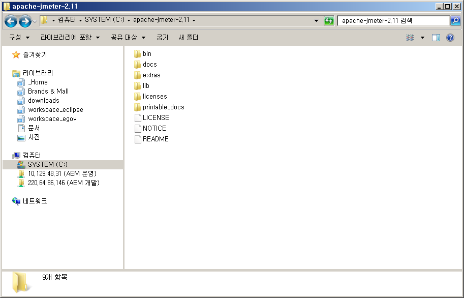
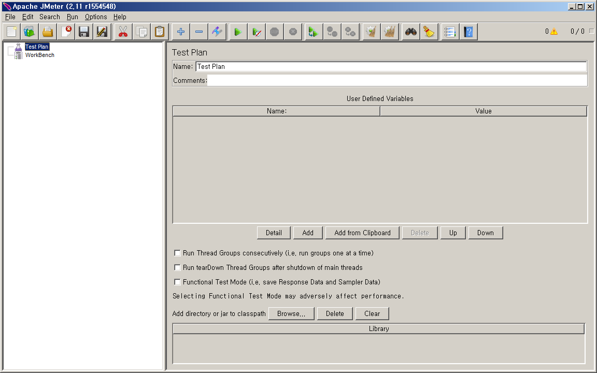
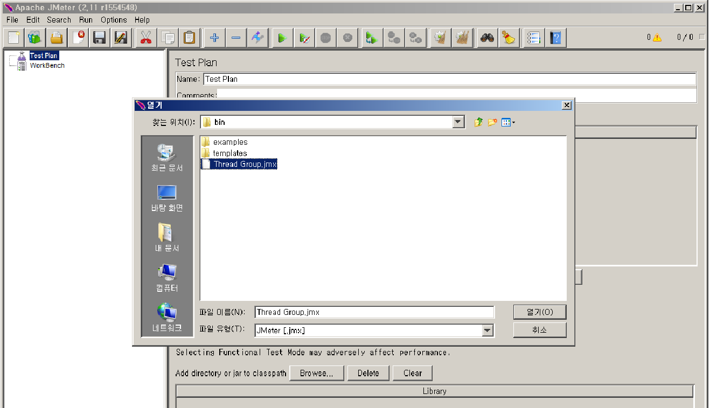
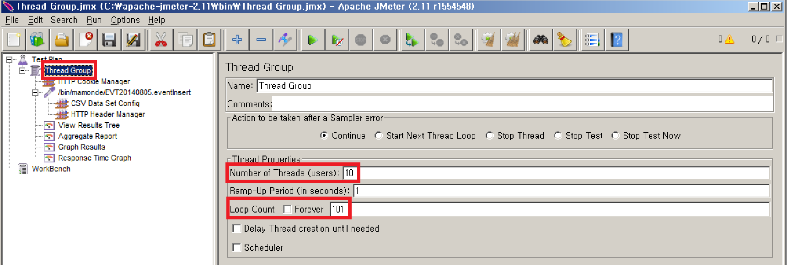
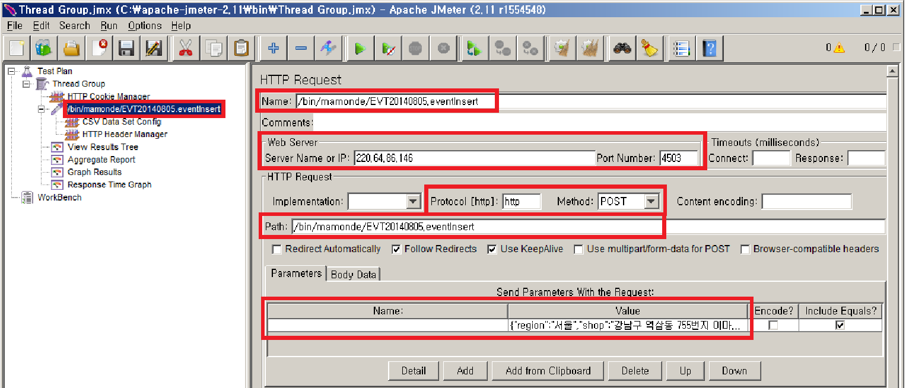
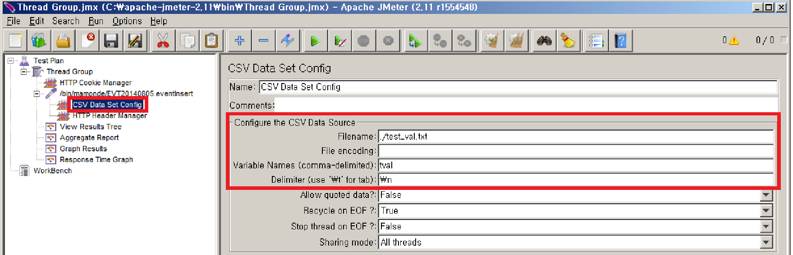
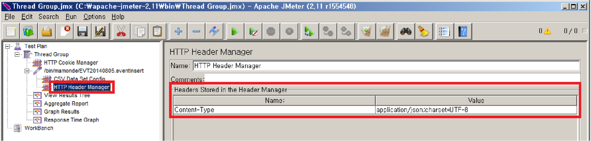
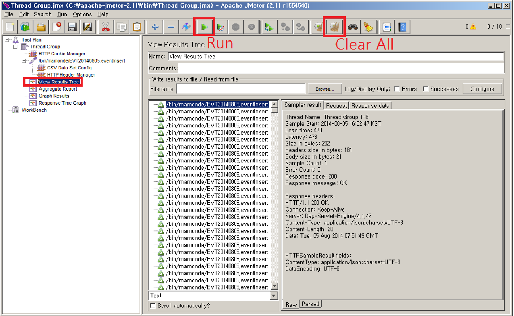
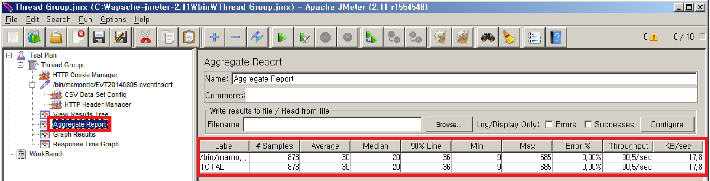
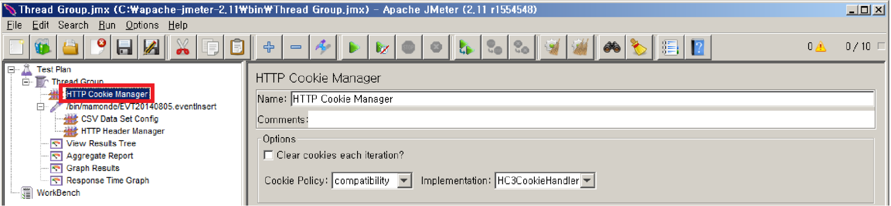

# 소개
jMeter는 테스트와 퍼포먼스 측정을 수행할 수 있는 어플리케이션입니다.  

Thread 기반으로 동작시켜 동시 처리 부하가 가능하며, 테스트 결과를 테이블, 그래프 등으로 분석해주는 기능 등을 포함하고 있습니다.  

HTTP, HTTPS, SOAP, FTP, JDBC, JMS, TCP, SMTP 등 다양한 프로토콜에 대해 테스트 수행이 가능합니다. 

jMeter는 java로 구현되었으므로, 이를 구동하기 위해서는 java가 설치되어 있어야 합니다. 

# 사용법
http://jmeter.apache.org/ 에서 jmeter 설치파일을 다운로드 받아 적당한 위치에 압축 해제합니다. 

(예 : C:\apache-jmeter-2.11로 압축해제, 이하 해당 경로로 설명합니다)

jMeter를 실행합니다. (C:\apache-jmeter-2.11/bin/jmeter.bat) 

실행하면 아래와 같은 화면이 뜨게 됩니다.

미리 준비해둔 설정을 가져오기 위해 Ctrl + O를 누르고, C:\apache-jmeter-2.11/bin/Thread Group.jmx를 선택합니다.

아래와 같이 왼쪽에 몇 개의 메뉴가 로드됩니다. 먼저 Thread Group을 클릭합니다. 

Thread의 개수와, 한 Thread 당 몇 번의 Loop를 돌 것인지 값을 설정합니다. 

아래의 경우 10개의 Thread를 돌리는데 한 Thread가 101회의 Loop를 돌게 되므로, 총 1010회의 http request가 실행됩니다. 

(한 사람당 101회씩, 총 10명이 접속하는 것과 같습니다)

주로 설정하게 될 HTTP Request 입니다. 

새로운 HTTP Request를 추가하기 위해서는 Thread Group 우클릭 – Add – Sampler – HTTP Request를 선택하면 됩니다.

Name은 자유롭게 입력하면 되고, 

Web Server에 http request를 받을 서버의 호스트와 포트를 입력하면 되는데, 호스트에는 http://test.com 말고 test.com만 입력합니다. 

Protocol은 Web Server 설정 바로 아래서 설정하게 됩니다. 기본값은 http입니다.

Method는 GET, POST, HEADER 등 원하는 것으로 선택한 뒤, Path에는 호스트와 포트를 제외한 나머지 주소를 입력해 줍니다. 

마지막으로 Parameters에서 Name – Value를 추가할 수 있는데, 아래의 예는 json을 보낼 경우입니다. json을 parameter로 사용할 때는 아래와 같이 Name을 비우고 값을 입력해 주면 됩니다. 

다음은 CSV Data Set Config입니다. 

여기서는 각각의 request마다 parameter 값을 변경해야 하는 경우에 사용하면 됩니다. 

아래와 같이 설정한 경우, C:\apache-jmeter-2.11\bin\test_val.txt를 라인 단위로 읽어 tval 변수에 값을 할당합니다. 

바로 앞 화면에서 HTTP Request의 Parameters에 Value를 보면 ${tval}이라고 설정된 부분이 있습니다. 

${tval}은 실제 http request가 실행될 때 파일 내용대로 0001, 0002, 0003... 으로 치환됩니다. 

다음은 HTTP Header Manager입니다. 

필요한 경우 HTTP Header를 수정할 수 있는 옵션인데, 이 예제에서는 Parameter에 json을 사용했으므로 Content-Type을 아래와 같이 수정해 주었습니다. 

특별히 수정할 필요가 없는 경우에는 이 노드를 삭제해도 무방합니다. 

Run을 눌러 HTTP Request를 수행하며, View Results Tree에서 Request와 Response 정보를 확인합니다. 

Clear All로 결과를 지울 수 있습니다.

Aggregate Report에서는 처리율과 에러율에 관한 분석을 확인 가능합니다. 

또 다른 여러가지 결과 분석을 원할 경우 Thread Group 우클릭 – Add – Listener – 원하는 노드를 선택하시면 됩니다. 

여기까지가 기본 설정이며, 추가적으로 로그인이 필요한 경우가 있습니다. 

그 경우 HTTP Cookie Manager를 추가해 줍니다. Thread Group – Add – Config Element – HTTP Cookie Manager를 선택합니다. 

이 쿠키 설정은 Thread Gourp 아래에 있으므로, Thread Group 안의 모든 Thread들이 쿠키 값을 공유하게 됩니다. 

이후 앞에서 설명한 HTTP Request를 하나 더 추가해 주고, login을 수행하도록 세팅해준 뒤 Run을 수행하면 됩니다. 

# Issues
## Status 3000, Msg I_DONT_KNOW
jMeter에서 json request 날릴때 header에서 Content-Type을 json으로 맞추지 않으면 return에 status 3000, msg I_DONT_KNOW와 같이 나온다 (gson 사용시)
