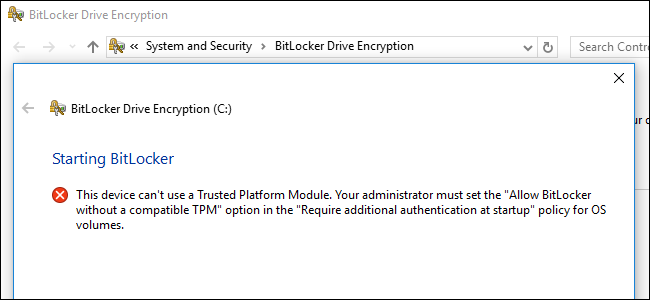
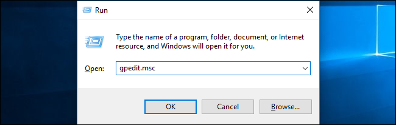
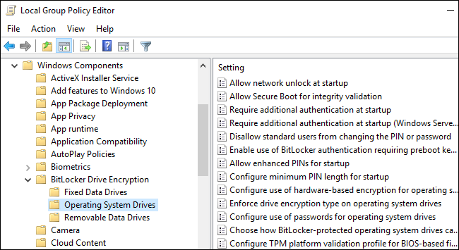
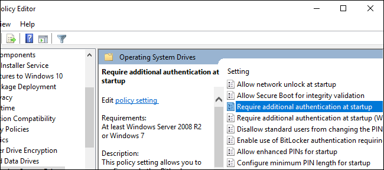
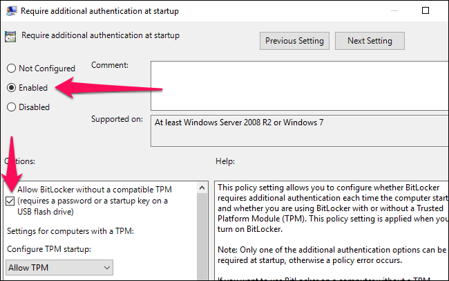
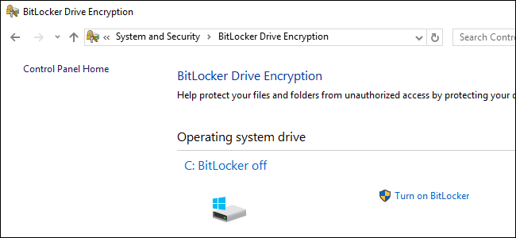
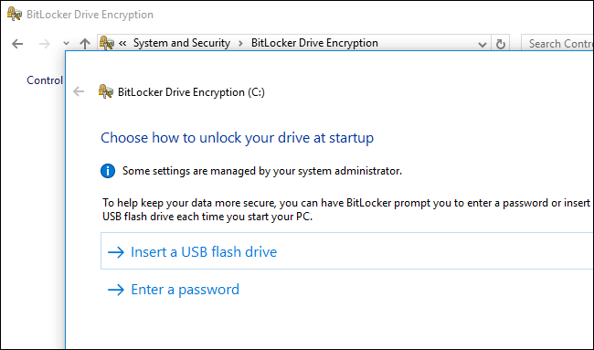
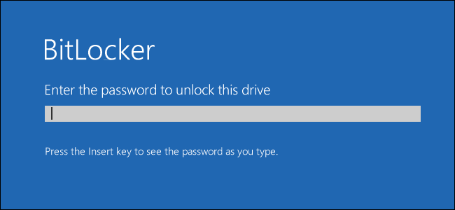

# Config

## brew

```sh
brew install bash-completion bat bind direnv dnsmasq docker docker-compose minikube fd ffmpeg fzf git helm htop hyperkit ipcalc jq k9s kubernetes-cli maven minikube nginx node openjdk p7zip pandoc peco pyenv pyenv-virtualenv python-tk@3.9 python@3.9 rclone tcl-tk telnet tree watch wget iproute2mac
# docker-machine squid terraform tmux webex

brew install --cask adobe-digital-editions alfred adoptopenjdk blackhole-2ch calibre dbeaver-community firefox google-chrome hammerspoon karabiner-elements libreoffice macvim smplayer spectacle typora visual-studio-code wireshark multipass
# apache-directory-studio citrix-workspace openvpn-connect virtualbox virtualbox-extension-pack
```


## Key Mapping

우선 `karabiner-elements` 를 설치한다.

```sh
brew install --cask karabiner-elements
```

- karabiner-elements > Simple modifications > Add item > From key: right_command > To key: f13
- 시스템 환경설정 > 키보드 > 단축키 > 입력 소스 > 입력 메뉴에서 다음 소스 선택 > F13 (`right_command` 키 누르면 됨)

이후 한/영 전환은 `right_command`를 누르면 되며 `caps_lock` 키로 한/영 전환할 때의 딜레이가 사라진다.


- karabiner-elements > Complex modifications > Rules > Add rule > Change caps_lock to command+control+option+shift > Enable

이후부터 `caps_lock` 은 `command+control+option+shift` 로 매핑되므로 다른 단축키와 중복되는 일 없이 `caps_lock + some_key` 로 단축키를 사용할 수 있게 된다.

예를 들어 hammerspoon의 `init.lua` 파일을 아래와 같이 설정하면 `caps_lock + d` 로 단축키 매핑된다.

```lua
hs.hotkey.bind({"cmd", "alt", "ctrl", "shift"}, "d", function()
  hs.eventtap.keyStrokes(os.date("%Y-%m-%d"))
end)
```


## CA Certificates

- [CA certificates extracted from Mozilla](https://curl.se/docs/caextract.html) 혹은

```sh
openssl s_client -showcerts -connect www.google.com:443 < /dev/null | openssl x509 -outform PEM > test.pem
```

와 같이 필요한 인증서 PEM 파일을 export한 뒤, "키체인 접근" 앱 실행 > "인증서" 탭 이동 > "새로운 키체인 항목 생성" 버튼을 눌러 import 해준다.


## DNS

### nslookup이 /etc/hosts를 볼 수 있게 설정

- nslookup은 기본적으로 /etc/resolv.conf 에 정의된 DNS Server로만 조회한다. 그러므로 로컬 DNS Server를 띄워서 해당 서버의 순위를 높여준다. 
- 아니면 ping을 써봐도 된다. ping은 /etc/hosts 도 조회한다. 

```sh
# install dnsmasq
brew install dnsmasq

# config dnsmasq
sudo vi /usr/local/etc/dnsmasq.conf

port=53
address=/mac-dns/127.0.0.1

# config resolv
sudo vi /etc/resolv.conf

nameserver 127.0.0.1 # Add this
nameserver 192.168.1.1

# config hosts
sudo vi /etc/hosts

192.168.1.80 test.com

# startup dnsmasq
sudo brew services start dnsmasq

# test
nslookup test.com
```


## Mac OS Filevault + BootCamp Windows 10 Bitlocker

결론부터 말하면 된다. 다만 Mac/Windows 모두 자기 자신의 파티션만 읽을 수 있게 된다. (서로 다른 방식으로 파티션이 암호화되어서 서로 못읽는듯) 참조한 자료는 아래와 같다. 


## FileVault and BitLocker on a Mac with Boot Camp

[https://tonyho.net/filevault-and-bitlocker-on-a-mac-with-boot-camp](https://tonyho.net/filevault-and-bitlocker-on-a-mac-with-boot-camp)

In the past, setting up both FileVault and BitLocker encryption on a Mac with Boot Camp required configuring the disk partitions in a specific way to work around limitations in the MBR (Master Boot Record) partition scheme. This now works by default with Boot Camp Assistant provided you are using the following:

- a Mac that supports booting Windows in EFI mode (all [Mac computers that support Windows 10](https://support.apple.com/en-au/HT204990#models))
- Boot Camp Assistant 6 or later (included in OS X El Capitan or later, and OS X Yosemite via update)
- Windows 8 or later

This is due to Boot Camp Assistant 6 using a different method to create the Boot Camp partition to support EFI booting for Windows 8 or later. The best explanation I have found is in the following article:


- [How El Capitan Boot Camp is Affected by Apple’s New System Integrity Protection (SIP)](https://twocanoes.com/how-el-capitan-boot-camp-is-affected-by-apples/)

Modern Macs always boot via EFI, but Windows hardware has only recently started natively booting EFI. While there was some support for EFI booting Windows 7, Apple didn’t support EFI booting Windows until Windows 8. With the newest Apple hardware, Windows 8 or later is required, and EFI booting is the only way that Windows will boot on the Mac.

Usually you don’t have to worry about any of this, since Boot Camp Assistant and the Windows installer will set everything up correctly.

If you use Boot Camp Assistant to create the Boot Camp partition, you’ll get a standard EFI "guard" MBR

The hybrid MBR has an entry for each of the first 4 partitions. The guard MBR has only a single entry that covers the entire disk

The key that allows having both FileVault and BitLocker is Boot Camp Assistant creating a "guard" MBR with only a single entry.


### Why this didn’t work previously

Older versions of Boot Camp Assistant create a [hybrid MBR](https://en.wikipedia.org/wiki/GUID_Partition_Table#Hybrid_MBR_.28LBA_0_.2B_GPT.29) to support running Windows 7 and earlier in legacy BIOS mode. The MBR partition scheme, however, has a limit of four primary partitions, and the hybrid MBR set up by Boot Camp Assistant uses all four.

As BitLocker requires a second partition, a hybrid MBR set up by Boot Camp Assistant has no spare partitions available for BitLocker.

Two partitions are required to run BitLocker because pre-startup authentication and system integrity verification must occur on a separate partition from the encrypted operating system drive. This configuration helps protect the operating system and the information in the encrypted drive. [BitLocker frequently asked questions (FAQ)](https://docs.microsoft.com/en-us/windows/device-security/bitlocker/bitlocker-frequently-asked-questions)

Previous solutions worked around this by setting up the MBR manually.

Note: The [Use Windows 10 on your Mac with Boot Camp](https://support.apple.com/en-au/HT204990) guide at Apple Support still states:

Microsoft BitLocker is not compatible with Boot Camp volumes.

This is no longer correct.


### Macs that support booting Windows in EFI mode

The Boot Camp Assistant configuration file (/Applications/Utilities/Boot Camp Assistant.app/Contents/Info.plist) provides an indication as to which Mac models are supported:


```xml
<key>PreUEFIModels</key>
<array>
        <string>MacBook7</string>
        <string>MacBookAir5</string>
        <string>MacBookPro10</string>
        <string>MacPro5</string>
        <string>Macmini6</string>
        <string>iMac13</string>
</array>
```


According to this, Macs with a [model identifier](https://support.apple.com/en-au/HT201300) higher than those listed above will be set up to boot Windows in EFI mode.

This matches Apple’s official list of [Mac computers that support Windows 10](https://support.apple.com/en-au/HT204990#models).

Note: Apple’s list of [Mac models you can use with Windows 8.1](https://support.apple.com/en-au/HT201457#models) includes older models. Presumably these will be set up in legacy mode.


### Configuring BitLocker on a Mac

BitLocker encryption normally requires a computer with a Trusted Platform Module (TPM). As Macs don’t have a TPM, the other requirement is to configure Windows to allow BitLocker without one:


- [How to Use BitLocker Without a Trusted Platform Module (TPM)](https://www.howtogeek.com/howto/6229/how-to-use-bitlocker-on-drives-without-tpm/)


### Summary

On recent Macs, the combination of Boot Camp Assistant and allowing BitLocker without a TPM is all that is required to have both FileVault encrypted macOS/OS X and BitLocker encrypted Windows.


## How to Use BitLocker Without a Trusted Platform Module (TPM)

[https://www.howtogeek.com/howto/6229/how-to-use-bitlocker-on-drives-without-tpm](https://www.howtogeek.com/howto/6229/how-to-use-bitlocker-on-drives-without-tpm)




BitLocker’s [full-disk encryption](https://www.howtogeek.com/234826/how-to-enable-full-disk-encryption-on-windows-10/) normally requires a computer with a Trusted Platform Module (TPM). Try to enable BitLocker on a PC without a TPM, and you’ll be told your administrator must set a system policy option.

BitLocker is available only on Professional, Enterprise, and Education [editions of Windows](https://www.howtogeek.com/222458/should-you-upgrade-to-the-professional-edition-of-windows-10/). It’s also included with Windows 7 Ultimate, but isn’t available on any Home editions of Windows.


### Why Does BitLocker Require a TPM?

RELATED: [What is a TPM, and Why Does Windows Need One For Disk Encryption?](https://www.howtogeek.com/237232/what-is-a-tpm-and-why-does-windows-need-one-for-disk-encryption/)

BitLocker normally requires a Trusted Platform Module, or TPM, on your computer’s motherboard. This chip generates and stores the actual encryption keys. It can automatically unlock your PC’s drive when it boots so you can sign in just by typing your Windows login password. It’s simple, but the TPM is doing the hard work under the hood.

If someone tampers with the PC or removes the drive from the computer and attempts to decrypt it, it can’t be accessed without the key stored in the TPM. The TPM won’t work if it’s moved to another PC’s motherboard, either.

You can buy and add a TPM chip to some motherboards, but if your motherboard (or laptop) doesn’t support doing so, you may want to use BitLocker without a TPM. It’s less secure, but better than nothing.


### How to Use BitLocker Without a TPM

You can bypass this limitation through a [Group Policy](https://www.howtogeek.com/125171/htg-explains-what-group-policy-is-and-how-you-can-use-it/) change. If your PC is joined to a business or school [domain](https://www.howtogeek.com/194069/what-is-a-windows-domain-and-how-does-it-affect-my-pc/), you can’t change the Group Policy setting yourself. Group policy is configured centrally by your network administrator.

If you’re just doing this on your own PC and it isn’t joined to a domain, you can use the Local Group Policy Editor to change the setting for your own PC.

To open the Local Group Policy Editor, press Windows+R on your keyboard, type "gpedit.msc" into the Run dialog box, and press Enter.




Navigate to Local Computer Policy > Computer Configuration > Administrative Templates > Windows Components > BitLocker Drive Encryption > Operating System Drives in the left pane.




Double-click the "Require additional authentication at startup" option in the right pane.




Select "Enabled" at the top of the window, and ensure the "Allow BitLocker without a compatible TPM (requires a password or a startup key on a USB flash drive)" checkbox is enabled here.




Click "OK" to save your changes. You can now close the Group Policy Editor window. Your change takes effect immediately—you don’t even need to reboot.


### How to Set Up BitLocker

You can now enable, configure, and use BitLocker normally. Head to Control Panel > System and Security > BitLocker Drive Encryption and click "Turn on BitLocker" to enable it for a drive.




You’ll first be asked how you want to unlock your drive when your PC boots up. If your PC had a TPM, you could have the computer automatically unlock the drive or use a short PIN that requires the TPM present.

Because you don’t have a TPM, you must choose to either enter a password each time your PC boots, or provide a USB flash drive. If you provide a USB flash drive here, you’ll need that flash drive connected to your PC each time you boot up your PC to access the files.




RELATED: [How to Set Up BitLocker Encryption on Windows](https://www.howtogeek.com/192894/how-to-set-up-bitlocker-encryption-on-windows/)

Continue through [the BitLocker setup process](https://www.howtogeek.com/192894/how-to-set-up-bitlocker-encryption-on-windows/) to enable BitLocker drive encryption, save a recovery key, and encrypt your drive. The rest of the process is the same as the normal BitLocker setup process.

When your PC boots, you’ll have to either enter the password or insert the USB flash drive you provided. If you can’t provide the password or USB drive, BitLocker won’t be able to decrypt your drive and you won’t be able to boot into your Windows system and access your files.




# Issues

## 한글 입력 느려짐, 자소 분리됨, 글자 사라짐

- OS update 시 이슈가 반복되고 있다. 이 때 설정 > 키보드 > 입력소스 > 한글(두벌식) 삭제 > 재설치 하면 어느 정도 해결된다.
- 아니면 [구름 입력기](https://github.com/gureum/gureum)를 설치해보자. 


# References

- [부트캠프 윈도우10 트랙패드 스크롤 방향 반대 설정 방법](https://extrememanual.net/13043) 
- [터미널 컬러링을 위한 초기 설정](http://theeye.pe.kr/archives/1669) 
- [emreyolcu/discrete-scroll: Fix for OS X scroll wheel problem](https://github.com/emreyolcu/discrete-scroll) 
- [MacOS에서 오라클 JDK를 삭제하고 OpenJDK 11 설치](https://velog.io/@jsoh/%EC%98%A4%EB%9D%BC%ED%81%B4-JDK%EB%A5%BC-%EC%82%AD%EC%A0%9C%ED%95%98%EA%B3%A0-OpenJDK-11-%EC%84%A4%EC%B9%98) 
- [How to make the function keys the default Touch Bar display](https://www.imore.com/how-make-function-keys-default-touch-bar-display) 
- [.DS_Store 삭제, 생성 방지](http://leechoong.com/posts/2018/ds_store/) 
- [Hammerspoon](https://www.hammerspoon.org/go/) 
