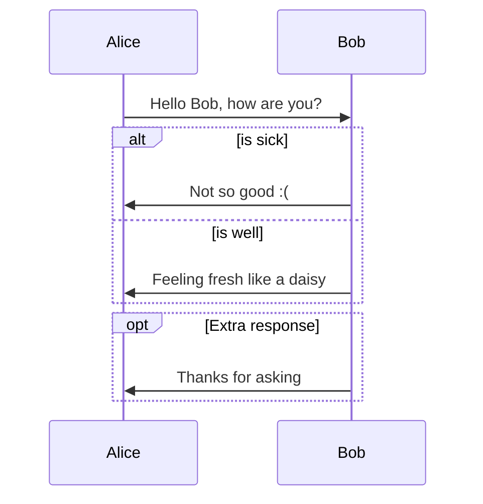
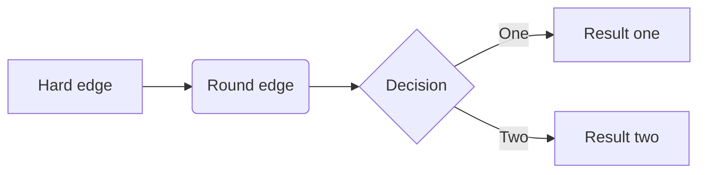
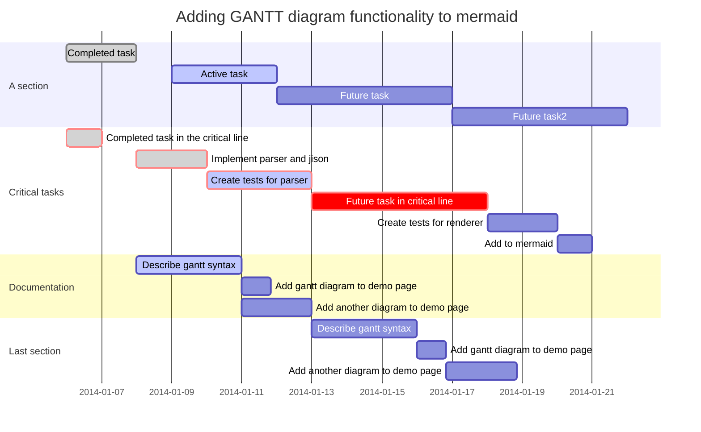
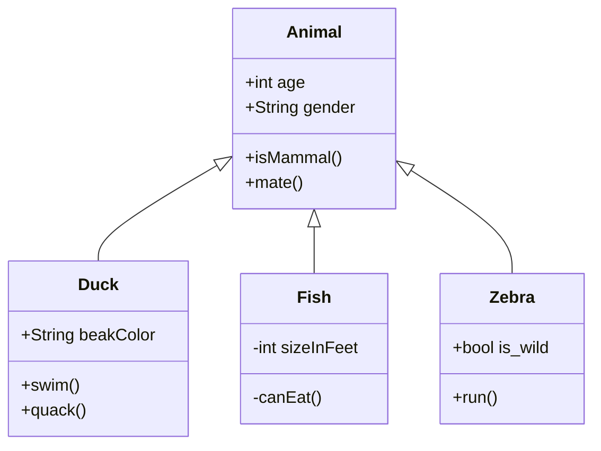
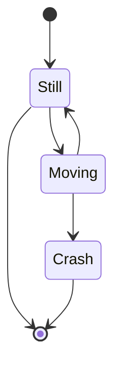
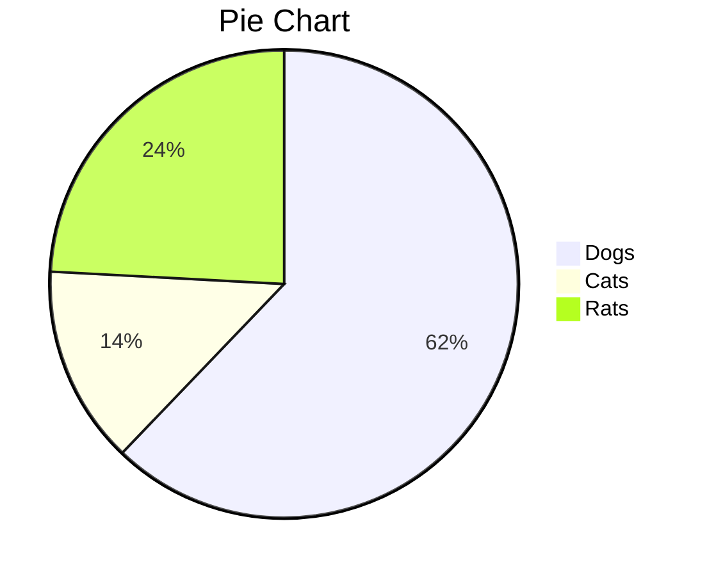

# Convert md to docx

- t.sh
```sh
# pandoc에서 '  - '로 스페이스 2칸이면 들여쓰기가 무시되므로 '    - '와 같이 스페이스 4칸으로 변경
cat "${1}" | sed 's/^\( *\)\*/\1\1-/g' | sed 's/^\( *\)-/\1\1-/g' | sed 's/^\( *\)\([0-9]\.\)/\1\1\2/g' > tmp.md
mv tmp.md "${1}"

# find 실행 결과 ‘./t.md’와 같이 나오면 pandoc에서 에러나므로 ‘t.md’와 같이 변경
file=$(echo "${1}" | sed 's/^\.\///g')
pandoc "${file}" -o "${file}.docx"

# md 파일 삭제 및 docx 파일 rename 
rm "${1}"
rename 's/.md.docx/.docx/g' "${1}.docx"
```

- ta.sh
```sh
find . -maxdepth 1 -name '*.md' -exec ./t.sh {} \;
```

# Typora

## Install

```sh
wget -qO - https://typora.io/linux/public-key.asc | sudo apt-key add -
sudo add-apt-repository 'deb https://typora.io/linux ./'
sudo apt-get update
sudo apt-get install typora
```

## Config

- 파일 > 환경설정
  - 모양 > 상태바, 왼쪽 패널
  - 이미지 > Copy image to custom folder, ./images/${filename}, 가능하다면 상대적 위치 사용


## Change Width of Writing Area

파일 > 환경설정 > 모양 > 테마 폴더 열기 선택

base.user.css 추가

```css
#write {
  max-width: 1300px;
}
```


## Draw Diagrams

> https://support.typora.io/Draw-Diagrams-With-Markdown/

### Sequence Diagrams

> https://bramp.github.io/js-sequence-diagrams/#syntax

```sequence
Alice->Bob: Hello Bob, how are you?
Note right of Bob: Bob thinks
Bob-->Alice: I am good thanks!
```

### Flowcharts

> http://flowchart.js.org/

```flow
st=>start: Start
op=>operation: Your Operation
cond=>condition: Yes or No?
e=>end

st->op->cond
cond(yes)->e
cond(no)->op
```

### Mermaid

>  https://mermaid-js.github.io/mermaid/#/

#### Sequence Diagrams

> https://mermaid-js.github.io/mermaid/#/sequenceDiagram



#### Flowcharts

>  https://mermaid-js.github.io/mermaid/#/flowchart



#### Gantt Charts

>  https://mermaid-js.github.io/mermaid/#gantt



#### Class Diagrams

>  https://mermaid-js.github.io/mermaid/#/classDiagram



#### State Diagrams

>  https://mermaidjs.github.io/#/stateDiagram



#### Pie Charts



# References
> [Typora](https://typora.io/#windows) 
>
> > [Typora: Change Width of Writing Area](https://support.typora.io/Width-of-Writing-Area/) 
> >
> > [Typora: Draw Diagrams With Markdown](https://support.typora.io/Draw-Diagrams-With-Markdown/) 
> >
> > [Mermaid Diagram Syntax](https://mermaid-js.github.io/mermaid/#/) 
>
> [Milkdown](https://milkdown.dev/) 
>
> > [Milkdown: GitHub](https://github.com/Saul-Mirone/milkdown) 
> >
> > [Milkdown: VSCode extension](https://marketplace.visualstudio.com/items?itemName=mirone.milkdown) 

