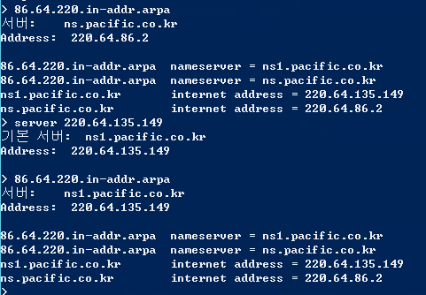
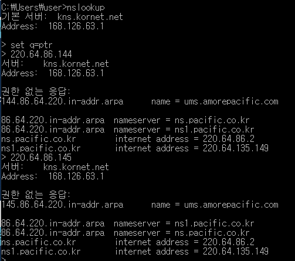

# LAN, WAN, Subnet

> [APIPA Explained](https://www.youtube.com/watch?v=0tEjUR6tjBU) 
>
> [LAN, WAN, Subnet Explained](https://www.youtube.com/watch?v=NyZWSvSj8ek) 
>
> [Subnet Mask Explained](https://www.youtube.com/watch?v=s_Ntt6eTn94&t=2s) 
>
> [Default Gateway Explained](https://www.youtube.com/watch?v=pCcJFdYNamc) 
>
> [NETSTAT Explained](https://www.youtube.com/watch?v=8UZFpCQeXnM) 
>
> [Traceroute (tracert) Explained](https://www.youtube.com/watch?v=up3bcBLZS74) 
>
> [Ping Command](https://www.youtube.com/watch?v=IIicPE38O-s) 
>
> [Ping and Tracert (traceroute) networking commands](https://www.youtube.com/watch?v=vJV-GBZ6PeM) 
>
> [VLAN Explained](https://www.youtube.com/watch?v=jC6MJTh9fRE) 
>
> [NAT Explained](https://www.youtube.com/watch?v=FTUV0t6JaDA&t=195s) 
>
> [Port Forwarding Explained](https://www.youtube.com/watch?v=2G1ueMDgwxw) 


# IP

> [Public vs Private IP Address](https://www.youtube.com/watch?v=po8ZFG0Xc4Q) 
>
> [IPCONFIG Explained](https://www.youtube.com/watch?v=ZKhorleA5aA) 
>
> [Private IP](https://ko.wikipedia.org/wiki/사설망) 
>
> [Reserved IPs](https://en.wikipedia.org/wiki/Reserved_IP_addresses) 
>
> [CIDR to IPv4 Address Range Utility Tool | IPAddressGuide](https://www.ipaddressguide.com/cidr) 
>
> [CIDR 계산기](https://ko.rakko.tools/tools/27/) 


# Mac Address

> [MAC Address Explained](https://www.youtube.com/watch?v=TIiQiw7fpsU) 
>
> [ARP Explained](https://www.youtube.com/watch?v=cn8Zxh9bPio) 


Mac Address는 Device의 Unique한 주소 값이다. 6 bytes로 이루어졌으며 앞쪽 3 bytes는 제조사 고유 코드를, 뒤쪽 3 bytes는 해당 업체의 LAN Card 정보를 담고 있다.

Device 끼리 통신하려면 Mac Address가 필요하다. IP Address만으로는 통신할 수 없다. IP Address는 Device가 "어디" 있는지 알려주고, Mac Address는 "어느" Device 인지 알려준다.

비유하자면 우편물을 배달할 때 집 주소인 "서울시 한강대로 100"이 IP Address이고, 수신인 "최냠냠"이 Mac Address다.


Device A와 B가 IP & Mac Address 로 통신하는 과정은 다음과 같다. 

A가 B에게 IP 패킷을 전달하려 한다. 이 때 A는 B의 IP Address만 알고 Mac Address는 모른다.

그럼 A는 자신이 속한 Network에 B의 IP 주소를 담아 ARP (Address Resolution Protocol) 패킷을 Broadcast 한다.

B는 ARP 패킷을 받고 자신의 Mac Address를 A에 응답하고, A는 B의 IP Address와 Mac Address를 가지고 IP 패킷을 전달한다.

이렇게 전파된 IP & Mac Address는 각 IP 호스트의 ARP 캐시에 테이블로 저장된다. 


ARP와 반대되는 개념으로 IP 호스트가 자신의 Mac Address는 알지만 IP Address를 모르는 경우 서버로부터 IP Address를 요청하기 위해 RARP가 사용된다. 즉

- ARP: IP Address로 Mac Address 찾기
- RARP: Mac Address로 IP Address 찾기


# DNS

> [How a DNS Server (Domain Name System) works](https://www.youtube.com/watch?v=mpQZVYPuDGU) 
>
> [Whois](https://xn--c79as89aj0e29b77z.xn--3e0b707e/kor/main.jsp) 


## ping, traceroute, nslookup, dig, host

- `ping`, `traceroute` 는 `/etc/hosts` 를 본다. 즉 아래와 같은 system wide DNS query 순서를 타게 된다. 이건 Windows의 예제이고 OS별로 다를 수 있음.
    - Machine checks if it’s not its own name
    - Checks DNS client resolver cache
    - DNS query to its DNS servers
    - Converts hostname to the NetBIOS name
    - Checks local NetBIOS cache
    - Sends NetBIOS query to its WINS servers
    - Broadcasts its subnet three times with a NetBIOS name query
    - Checks local lmhosts file
- `nslookup`, `dig`, `host` 는 system wide DNS query API를 쓰지 않고 자체적인 DNS resolve code를 가지고 있어서 system wide DNS query와는 다르게 동작한다. 즉 DNS resolver cache 나 `/etc/hosts` 를 보지 않고, `/etc/resolv.conf` 에 등록된 DNS Server에 바로 query 한다.


만약 Mac OS에서 system wide DNS query order를 보고 싶다면 `scutil --dns` 를 실행한다.

system wide DNS query를 해보고 싶다면 `dns-sd -q test.com` 을 실행한다.

>  https://superuser.com/questions/1177175/change-dns-search-order-on-mac-el-capitan


## 내/외부망 DNS 분리

내/외부망 환경 분리가 된 경우 DNS 서버도 내/외부 분리한다. 

그 상황에서 예를 들어 b.com이 내/외부 DNS 서버에 등록된 경우 a.b.com을 찾아가는 과정을 보자. 

만약 a.b.com이 외부 DNS 서버에만 등록되고 내부 DNS 서버에 등록되지 않은 상태라면

내부망 DNS 서버에 연결된 상태에서는 a.b.com에 접속할 수 없다. 

com -> b -> a 로 찾아갈 때 내부 DNS에서 IP를 찾지 못하면 외부 DNS로 가서 찾지는 않는다. 

이 경우 a.b.com을 내부 DNS 서버에도 등록해줘야만 내부망에서 a.b.com으로 접속 가능하다. 

## Root Domain

Root Domain은 CNAME으로 등록 불가능하다. 무조건 A Record로 등록해야 한다.

## PTR Records (Reverse Domain)

**1. 개념**

보통 DNS에 도메인을 질의하면 IP를 리턴해준다. 그러나 PTR Records (Reverse Domain)은 IP를 질의하면 도메인을 리턴해주는 것이다. 예를 들어 1.2.3.4를 질의하면 이에 대응되는 4.3.2.1.in-addr.arpa(IPv4) 도메인으로 질의되며 이에 해당하는 PTR Records(여러개일 수 있음)를 리턴해주게 된다. 

**2. 목적**

메일 대량 발송 시 수신측에서 메일 발송 서버의 IP를 조회하여 도메인이 등록된 PTR Records(Pointer)값과 일치하면 정상 메일로 간주한다. 

**3. 등록 방법**

DNS 운영업체가 아닌 ISP업체(KT, LG, SK 등)와 같이 IP 주소를 공급해주는 업체에 등록한다. ISP와 같은 상위 기관에 직접 PTR Records를 등록할 수도 있지만, 자체 DNS 서버에 PTR Records를 등록하고 상위 기관에는 DNS 서버만 위임하는 구조로 갈 수도 있다. 상위 기관의 DNS에 PTR Records에 대한 질의가 갈 경우 상위 기관에서 내가 등록 요청해둔 자체 DNS 서버로 질의를 위임하여 그 결과를 릴레이해주는 것이다. 즉 예를 들어 아래와 같이 220.64.86 존에 대해 네임서버를 ns(1).pacific.co.kr로 설정하고, 여기에 PTR Records를 등록해둔다. 




그리고 한국인터넷진흥원으로 리버스 위임 신청을 완료하게 되면, KT 등 국내 ISP DNS나 구글 DNS에서도 조회가 된다. 


```
한국인터넷진흥원 등록 처리 완료 메일 수신
귀하가 신청하신 리버스도메인 신규등록 처리가 완료되었음을 알려드립니다.

[In-addr.arpa 등록신청서]

h0. 신청서이름: IN-ADDR.ARPA-Template V4.0
h1. 신청서구분: 신규

1. 네트워크 정보 IP주소
(1) 220.64.86.0 - 220.64.86.255

2. 1차 네임서버 정보
2a. 호스트 이름: ns.pacific.co.kr

3. 2차 네임서버 정보
3a. 호스트 이름: ns1.pacific.co.kr

2. krDNS 업데이트 완료 확인

C:\Users\user>nslookup
기본 서버:  ns.dreamline.co.kr
Address:  210.181.1.24

> server b.dns.kr
기본 서버:  b.dns.kr
Address:  210.101.60.1

> 86.64.220.in-addr.arpa
서버:	b.dns.kr
Address:  210.101.60.1

이름:	86.64.220.in-addr.arpa
Served by:
- ns1.pacific.co.kr
       	86.64.220.in-addr.arpa
- ns.pacific.co.kr
      	86.64.220.in-addr.arpa
```


DNS 위임 완료 후 PTR Records를 조회해보면 결과가 잘 나온다. 




# TCP/UDP

> [TCP vs UDP](https://www.youtube.com/watch?v=uwoD5YsGACg&t=214s) 
>
> [TCP가 연결을 생성하고 종료하는 방법, 핸드쉐이크](https://evan-moon.github.io/2019/11/17/tcp-handshake/) 


## netcat

```sh
nc -vz 1.1.1.1 53
```


## tcpdump

```sh
sudo tcpdump -en tcp and port 1194 -vv
```


# SSL

> [Let's Encrypt - Free SSL/TLS Certificates](https://letsencrypt.org/) 
>
> [SSL이란 무엇이며 인증서(Certificate)란 무엇인가?](https://wiki.kldp.org/HOWTO/html/SSL-Certificates-HOWTO/x70.html) 
>
> [SSL과 인증서 구조 이해하기](https://blog.naver.com/alice_k106/221468341565) 

- Server는 우선 CA로부터 인증서를 발급받는다. 
    - Server 인증서 = (Server Public Key + 사용자 정보)를 CA Private Key로 암호화한 것
- Client가 Server에 접속 요청하면 Server는 인증서를 전달한다.
- Client의 Browser에는 주요 CA Public Key가 존재한다. 해당 CA Public Key로 Server 인증서를 복호화한다. 
- Client는 Pre Master Secret Key를 Server Public Key로 암호화하여 Server에 전달한다. 
- Server는 Private Key로 복호화하여 Pre Master Secret Key를 꺼낸다. 
- 일련의 과정을 거쳐 Pre Master Secret Key를 Master Secret Key로 만들고 Session Key를 생성하여 이후부터 대칭키 암호화로 주고 받는다. 


## OpenSSL

### Get Server's TLS Certificate

- [CA certificates extracted from Mozilla](https://curl.se/docs/caextract.html) 

```sh
# get certificate as pem
openssl s_client -showcerts -connect test.com:443 < /dev/null | openssl x509 -outform PEM > test.pem

# show start date from pem
openssl x509 -startdate -noout -in test.pem

# show end date from pem
openssl x509 -enddate -noout -in test.pem

# check expiry
openssl x509 -checkend 86400 -noout -in test.pem

# get certificate as pem & check expiry
openssl s_client -showcerts -connect test.com:443 < /dev/null | openssl x509 -outform PEM | openssl x509 -checkend 86400 -noout
```


### Encrypt file

- RSA를 이용한 비대칭키 암호화는 파일 크기가 매우 작을때만 사용 가능하다. 
- 그러므로 일반적인 파일 암호화는 AES로 대칭키 암호화를 사용하자. 

```sh
# Encrypt file
openssl enc -e -aes-256-cbc -pbkdf2 -kfile ~/.ssh/id_rsa -in file -out file.enc

# Decrypt file
openssl enc -d -aes-256-cbc -pbkdf2 -kfile ~/.ssh/id_rsa -in file.enc -out file
```


# OpenVPN

> [Configure OpenVPN Client/Server](https://openvpn.net/community-resources/how-to/) 
>
> [openvpn/server.conf at master - OpenVPN/openvpn](https://github.com/OpenVPN/openvpn/blob/master/sample/sample-config-files/server.conf) 
>
> [openvpn/client.conf at master - OpenVPN/openvpn](https://github.com/OpenVPN/openvpn/blob/master/sample/sample-config-files/client.conf) 
>
> [OpenVPN 설정파일(server.conf 또는 server.ovpn, client.ovpn) 이해](http://www.t8.co.kr/bbs/board.php?bo_table=networking&wr_id=2) 
>
> [OpenVPN 을 사용해 Site-to-Site VPN 구축하기](https://grip.news/archives/1208) 
>
> [Docker로 OpenVPN 쉽게 설치하기](https://rampart81.github.io/post/openvpn_aws/) 
>
> [kylemanna/docker-openvpn](https://github.com/kylemanna/docker-openvpn) 
>
> [How to set up an OpenVPN split tunnel to optimize your OpenVPN connection](https://vladtalks.tech/vpn/setup-openvpn-split-tunnel) 
>
> [OpenVPN Access Server system requirements](https://openvpn.net/vpn-server-resources/openvpn-access-server-system-requirements/) 


## Server

1. **Using Container** 

테스트 해봤는데 이상하게 udp는 안되고 tcp는 된다. udp가 OpenVPN 기본 프로토콜인데. 그리고 접속 테스트 전 반드시 1194 포트 방화벽 재확인.

```sh
# env
export OVPN_DATA=$PWD/ovpn-data

# using udp
docker run -v $OVPN_DATA:/etc/openvpn --rm kylemanna/openvpn ovpn_genconfig -u udp://t.com
# using tcp
docker run -v $OVPN_DATA:/etc/openvpn --rm kylemanna/openvpn ovpn_genconfig -u tcp://t.com

# common: Passphrase는 원하는대로 입력하고, Common Name은 그냥 엔터
docker run -v $OVPN_DATA:/etc/openvpn --rm -it kylemanna/openvpn ovpn_initpki
docker run -v $OVPN_DATA:/etc/openvpn --rm -it kylemanna/openvpn easyrsa build-client-full dgdsingen nopass
docker run -v $OVPN_DATA:/etc/openvpn --rm kylemanna/openvpn ovpn_getclient dgdsingen > dgdsingen.ovpn

# using udp
docker run --restart=unless-stopped -v $OVPN_DATA:/etc/openvpn -d -p 1194:1194/udp --cap-add=NET_ADMIN kylemanna/openvpn
# using tcp
docker run --restart=unless-stopped -v $OVPN_DATA:/etc/openvpn -d -p 1194:1194/tcp --cap-add=NET_ADMIN kylemanna/openvpn
```


**Mac Address Check** 

> [OpenVPN Access Server post_auth hardware address checking script](https://openvpn.net/vpn-server-resources/access-server-post-auth-script-host-checking/) 

OpenVPN 접속 시 특정 Mac Address만 접속 가능하도록 제한할 수 있다.

다만 Linux, Windows, macOS 에서는 OpenVPN Client에서 Mac Address를 전달하지만

Android, iOS 등 Mobile Platform에서는 Mac Address가 보통 랜덤인 관계로 OpenVPN Client에서 Mac Address 대신 UUID를 전달한다.

```sh
# install script
wget https://swupdate.openvpn.net/scripts/post_auth_mac_address_checking.py -O /root/mac.py

/usr/local/openvpn_as/scripts/sacli -k auth.module.post_auth_script --value_file=/root/mac.py ConfigPut
/usr/local/openvpn_as/scripts/sacli start

# uninstall script
/usr/local/openvpn_as/scripts/sacli -k auth.module.post_auth_script ConfigDel
/usr/local/openvpn_as/scripts/sacli start

# 최초 로그인 시 특정 ip에서 접근한 경우에만 Mac Address 등록하게 하려면 mac.py 에서 아래 부분에 원하는 ip를 기재한다.
first_login_ip_addr="123.45.67.89"

# insert/update a MAC address
/usr/local/openvpn_as/scripts/sacli -u "dgdsingen" -k "pvt_hw_addr" -v "11:22:3a:4b:c5:6d" UserPropPut

# insert a 2nd MAC address
/usr/local/openvpn_as/scripts/sacli -u "dgdsingen" -k "pvt_hw_addr2" -v "11:22:3a:4b:c5:6d" UserPropPut

# delete a MAC address
/usr/local/openvpn_as/scripts/sacli -u "dgdsingen" -k "pvt_hw_addr" UserPropDel

# select user properties
/usr/local/openvpn_as/scripts/sacli UserPropGet | jq .dgdsingen

# log
cat /var/log/openvpnas.log | grep "POST_AUTH" | tail -15
```


**Enable Client(Admin) to Client(All) Connection** 

- OpenVPN > CONFIGURATION > Advanced VPN > Allow VPN users with Administrator privilege to access all VPN client IP addresses
- OpenVPN > USER MANAGEMENT > Group Permissions > Group 선택 > More Settings > Access Control > Allow Access To groups: 전체 선택


## Client

1. **Using CLI** 

```sh
# sudo 없이 실행하면 에러남. debug 필요시 --verb 11
sudo openvpn --config dgdsingen.ovpn
```

2. **Using GUI** 

```sh
# Windows
choco install openvpn-connect

# MacOS
brew install --cask openvpn-connect

# Lunix: openvpn gui client for gnome
sudo apt install network-manager-openvpn-gnome
```


**Auto Login 설정** 

- OpenVPN Admin Console > User Management > User Permission > Auto Login 할 계정 Allow Auto-login 체크
- LDAP이나 Radius 등을 통해서 인증하는 경우 Auto Login 할 계정은 OTP 인증을 제거해주자
- OpenVPN Client > Settings > Launch Options > Connect latest 선택
- OpenVPN Client > Settings > Software Update > Never 선택. 혹시나 OpenVPN Client Update로 접속이 끊기는 일이 없도록 함
- OpenVPN Client > Profiles > Auto Login 할 계정 > Edit Profiles > Save Password > Password 입력 후 Save > Connect


# OpenConnect

Cisco AnyConnect Client로 접속할 수 있는 Open Source VPN Server.

다만 최신 Cisco AnyConnect Client는 라이센스 문제로 사용하기 어렵다. Open Source로 VPN 구축하려면 그냥 OpenVPN을 쓰자.

> [OpenConnect VPN Server](https://ocserv.gitlab.io/www/index.html) 
>
> [Set up OpenConnect VPN Server (ocserv) on Ubuntu 16.04/18.04 with Let's Encrypt](https://www.linuxbabe.com/ubuntu/openconnect-vpn-server-ocserv-ubuntu-16-04-17-10-lets-encrypt) 
>
> [ocserv configuration file example](https://gist.github.com/wongsyrone/55165ce767f7248656cc) 


# References

- [포워드 프록시(forward proxy) 리버스 프록시(reverse proxy) 의 차이](https://www.lesstif.com/pages/viewpage.action?pageId=21430345) 
- [Reverse Proxy Guide - Apache HTTP Server Version 2.4](https://httpd.apache.org/docs/2.4/howto/reverse_proxy.html) 
- [ASUS 라우터 퍼포먼스 최적화](http://kollhong.tistory.com/57) 
- [ngrok으로 로컬 네트워크의 터널 열기](https://blog.outsider.ne.kr/1159) 
- [mitmproxy를 활용해 구글 애널리틱스 테스트 자동화하기](https://engineering.linecorp.com/ko/blog/auto-inspecting-testing-with-google-analytics/) 
- [HTTP/3 explained](https://daniel.haxx.se/http3-explained/) 
- [gRPC](https://grpc.io/) 
- [도메인 위임에 의한 GSLB 서버 및 이를 이용한 CDN 서비스 시스템 및 방법](https://patents.google.com/patent/KR101039370B1/ko) 
- [NAT loopback 개요](https://vigroup6.tistory.com/109) 
- [NAT loopback 문제 분석](https://velog.io/@haruband/K8S-NAT-%EB%A3%A8%ED%94%84%EB%B0%B1-%EB%AC%B8%EC%A0%9C-%EB%B6%84%EC%84%9D) 

