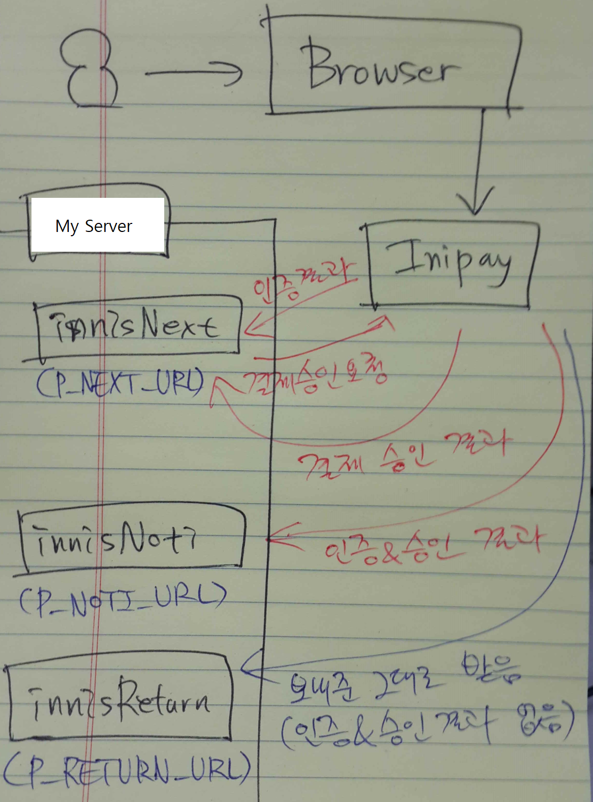

# Facebook

## Debugger

https://developers.facebook.com/tools/debug/

## OG Tags

```html
<meta property="og:url" content="http://my.test.com" />
<meta property="og:title" content="title" />
<meta property="og:description" content="description" />
<meta property="og:type" content="website" />
<meta property="og:site_name" content="site_name" />
<meta property="og:locale" content="ko_KR" />
<meta property="og:image" content="image" />
```

## Sharer

```js
'http://www.facebook.com/sharer.php?u=' + encodeURIComponent(url);
```

# Youtube

## 미리보기 이미지 갱신

동영상을 업로드하고 마지막 완료 부분에서 미리보기 이미지를 설정할 수 있다. 기본적으로 자동 생성된 이미지 3개를 선택할 수 있지만, 적절한 계정으로 인증된 상태라면 Custom Image를 업로드 가능하다. 이미지를 업로드하면 아래와 같이 해상도별로 이미지가 생성된다. (UR-LqejP_Wc 부분은 해당 동영상의 고유번호)

- http://img.youtube.com/vi/UR-LqejP_Wc/default.jpg

- http://img.youtube.com/vi/UR-LqejP_Wc/mqdefault.jpg

- http://img.youtube.com/vi/UR-LqejP_Wc/hqdefault.jpg

- http://img.youtube.com/vi/UR-LqejP_Wc/sddefault.jpg

- http://img.youtube.com/vi/UR-LqejP_Wc/maxresdefault.jpg

- https://i.ytimg.com/vi/UR-LqejP_Wc/default.jpg

- https://i.ytimg.com/vi/UR-LqejP_Wc/mqdefault.jpg

- https://i.ytimg.com/vi/UR-LqejP_Wc/hqdefault.jpg

- https://i.ytimg.com/vi/UR-LqejP_Wc/sddefault.jpg

- https://i.ytimg.com/vi/UR-LqejP_Wc/maxresdefault.jpg

- https://i.ytimg.com/vi_webp/UR-LqejP_Wc/default.webp

- https://i.ytimg.com/vi_webp/UR-LqejP_Wc/mqdefault.webp

- https://i.ytimg.com/vi_webp/UR-LqejP_Wc/hqdefault.webp

- https://i.ytimg.com/vi_webp/UR-LqejP_Wc/sddefault.webp

- https://i.ytimg.com/vi_webp/UR-LqejP_Wc/maxresdefault.webp


문제는 이렇게 한번 설정한 이미지를 바꾸고 싶을때, 이미지를 다시 업로드 하더라도 갱신되지 않는 경우가 있다. 어떤 해상도는 갱신되고, 어떤 해상도는 갱신되지 않는 등 문제가 생기는데, 이는 YouTube 서버 캐싱의 문제인듯 보인다. 이 경우 최고의 해결책은 해당 동영상을 재업로드하여 아예 새로운 동영상 URL을 따는 것이다. 물론 이때 올린 미리보기 이미지도 새로 생성되므로 문제없이 갱신할 수 있다.

## 광고 없애기

20150917 기준

YouTube 동영상 관리자에 들어가서 '비공개' 영상으로 처리하면 광고가 뜨지 않는다. 그럼에도 불구하고 음원 등의 저작권이 제 3자에게 있으면 저작권자의 요청에 따라 광고가 뜰 수 있다. 동영상 관리자에서 리스트 페이지 우측 부분에 '$' 표시가 뜨는 것들은 광고 기능을 노출할지 말지 설정할 수 있는 영상들이다. '$' 표시가 없으면 임의로 설정할 수 없다.


# INIpay

## 모바일 결제 흐름

결제시 넘기는 값 중 유의할 속성

- P_NEXT_URL : 여기로 인증 결과를 받는다. 인증 결과가 정상이면 다시 결제 승인 요청을 보내고, 받아와 처리한다.
- P_NOTI_URL : 인증과 결제 승인 결과를 받는다.
- P_RETURN_URL : 인증이나 결제 승인 결과값 등이 없고, 단순히 보내준 값 그대로 이니시스에서 호출해준다.

예를 들어

- P_NEXT_URL = 'http://test.com/inicisNext.do'이면 해당 주소의 Servlet로 들어온 요청값을 끄집어내 인증 결과가 정상인지 확인한다. 인증 결과가 이상하면 에러를 내든 결제 
- 실패 페이지로 포워딩하든 처리한다. 인증 결과가 정상이면 결제 승인 요청(HttpClient 등 사용)을 날린다. 결제 승인 결과를 확인해 정상이면 결제 프로세스를 완료시키면 된다. 
- 도중에 에러가 나면 이니시스에 결제 취소 요청을 날리는 것을 잊지 말자.
- P_NOTI_URL = 'http://test.com/inicisNoti.do'이면 해당 주소의 Servlet에 들어온 요청값을 끄집어내 인증 및 결제 승인 결과가 정상인지 확인. 이후 프로세스 진행
- P_RETURN_URL = 'http://test.com/inicisNoti.do'이면 해당 주소의 Servlet에서 그냥 처리하고 싶은 내용 아무거나 처리하면 된다. 이 부분은 인증이나 결제 승인과는 전혀 관계가 없다. 

결제 방식에 따른 속성값 설정 (2014.10.08 기준) : 만약 해당 지불 수단에서 필요한 속성값을 설정하지 않으면 결제가 진행되지 않는다

- P_NEXT_URL : ISP, 계좌이체, 삼성월렛, Kpay 제외한 모든 지불 수단 사용
- P_NOTI_URL : ISP, 가상계좌, 계좌이체, 삼성월렛, Kpay만 사용
- P_RETURN_URL : ISP, 계좌이체, 삼성월렛, Kpay만 사용



## MID

상점아이디(Merchant ID)의 줄임말. MID는 결제되는 사이트가 어느 상점인지 식별하는 구분자로 사용된다. MID를 사용하기 위해서는 이니시스 쪽에 MID 등록 후 받은 pem 키 파일을 서버의 '/INIPay/key/MID명' 경로에 저장하고 권한을 775로 조정하여 사용

- keypass.enc
- mcert.pem
- mpriv.pem

결제시 이니시스에 MID 값을 전달해야 하며, https://iniweb.inicis.com에서 해당 MID 계정으로 로그인해 결제 정보를 조회할수 있다.

### INIpayTest

이니시스에서 테스트용으로 제공하는 MID

기본적으로 이 MID에는 모든 서비스(KPay, 신용카드, 실시간 계좌이체 등)가 기본으로 제공된다

이 MID로 결제된 내역(카드이며 부분 취소가 아닌 경우)은 매일 자정에 자동으로 결제 취소 처리된다.

# Issues

## 네이버 이미지 안열림

네이버 이미지를 불러올때 예를 들어 http://cafefiles.naver.net/20151118_88/bmdwait_1447838143740G1rNk_JPEG/20151118_162531.jpg를 호출할 때 referrer를 검사해 네이버가 아닌 외부에서 호출시 403 에러가 떨어진다.
이를 회피하기 위해서 html을 뿌려줄때 `<meta name="referrer" content="never" />`를 헤더에 넣어주면 네이버의 referrer를 검사를 피해 403 에러가 발생하지 않고 정상적으로 이미지가 로딩된다.