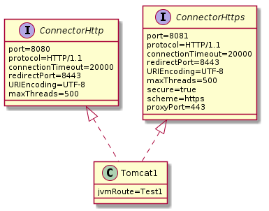

# Nginx

일반적으로 성능은 nginx >> lighttpd > apache 이다. 그러나 nginx의 경우 phpmyadmin을 지원하지 않는다. nginx을 쓸 경우 nginx과 php 연동, 그리고 php와 mysql 연동 후 수동으로 mysql을 사용하도록 하자.

## Install

```sh
sudo apt install nginx #php5-cgi php5-cli php5-fpm
```

## Config

/etc/php5/fpm/pool.d/www.conf

```sh
listen = localhost:9000
# 위 부분을 아래와 같이 변경한다
listen = /var/run/php5-fpm.sock

# 위 세팅과 관련한 성능 튜닝 팁
## local port 제한 영향을 받는다. (local loopback이므로 TIME_WAIT) TCP overhead가 걸린다.
fastcgi_pass 127.0.0.1:9000
## unix socket을 사용하기 때문에 TCP overhead가 없다. localhost 연결 방식보다 php 연계 동작이 빨라지게 된다. 다만 이 경우 소켓파일 권한을 web server와 호환 가능하도록 권한을 변경해야 한다.
fastcgi_pass unix:/var/run/php5-fpm.sock 

sudo vi /etc/php5/fpm/pool.d/www.conf (if your webserver runs as as user other than www-data, you will need to update the www.conf file accordingly)

listen.owner = www-data
listen.group = www-data
listen.mode = 0660

sudo service php5-fpm restart
```

### SSL

- 먼저 공유기에서 DDNS를 test.com으로 연결해준다. 
- 이후 포트포워딩으로 80, 443을 서버 머신으로 연결한다. 
- 혹시나 머신 IP가 변경될 수 있으니 DHCP에서 IP 고정도 걸어준다. 

#### Let's Encrypt with certbot

```sh
# open firewall
sudo ufw allow 80
sudo ufw allow 443
sudo service ufw restart

# install nginx
sudo apt update
sudo apt install -y nginx certbot python3-certbot-nginx
sudo service nginx restart

# get ssl certificate
sudo certbot --non-interactive --redirect --agree-tos --nginx -d test.com -m dgdsingen@gmail.com
sudo service nginx restart

# add cron to renew ssl cert
sudo vi /etc/crontab

00 06 * * * root certbot renew

# restart cron
sudo service cron restart
```

```sh
# get ssl certificate with DNS challenge
sudo certbot certonly --manual --preferred-challenges dns --server https://acme-v02.api.letsencrypt.org/directory --agree-tos -m dgdsingen@gmail.com -d test.com

# 이후 나오는 challenge 값을 복사해서 _acme-challenge.test.com DNS TXT 레코드로 등록하고 Enter

# certificate, private key
sudo cat /etc/letsencrypt/live/test.com/fullchain.pem
sudo cat /etc/letsencrypt/live/test.com/privkey.pem
```

```nginx
# http2 적용
sudo vi /etc/nginx/sites-enabled/default

listen 443 http2 ssl;
```

#### Let's Encrypt with acme-tiny

```sh
# get acme-tiny
git clone https://github.com/diafygi/acme-tiny.git

# generate keys
openssl genrsa 4096 > account.key
openssl genrsa 4096 > letsencrypt.key
openssl req -new -sha256 -key letsencrypt.key -subj "/CN=dgdsingen.duckdns.org" > letsencrypt.csr

# create challenge dir
mkdir -p /html/.well-known/acme-challenge/

# get ssl certificate
python acme_tiny.py --account-key account.key --csr letsencrypt.csr --acme-dir /html/.well-known/acme-challenge/ > letsencrypt.crt
```

```nginx
# install certificate
server {
  listen 443 ssl;
  server_name test.com;

  ssl_certificate letsencrypt.crt;
  ssl_certificate_key letsencrypt.key;
  ssl_session_timeout 5m;
  ssl_session_cache shared:SSL:50m;
  ssl_protocols TLSv1 TLSv1.1 TLSv1.2;
  ssl_ciphers ECDHE-RSA-AES256-GCM-SHA384:ECDHE-RSA-AES128-GCM-SHA256:DHE-RSA-AES256-GCM-SHA384:ECDHE-RSA-AES256-SHA384:ECDHE-RSA-AES128-SHA256:ECDHE-RSA-AES256-SHA:ECDHE-RSA-AES128-SHA:DHE-RSA-AES256-SHA:DHE-RSA-AES128-SHA;
  #ssl_dhparam /path/to/server.dhparam;
  ssl_prefer_server_ciphers on;

  ...the rest of your config
}

server {
  listen 80;
  server_name test.com;

  location /.well-known/acme-challenge/ {
    alias /var/www/challenges/;
    try_files $uri =404;
  }
}
```

### proxy_pass

- nginx를 Reverse Proxy로 사용하기 위한 설정

```nginx
# config nginx
sudo vi /etc/nginx/sites-enabled/default

server {
  listen 80;
  listen [::]:80;
  server_name test.com;

  location / {
    proxy_pass http://localhost:8080/;
    proxy_set_header Host $host;
    proxy_set_header Upgrade $http_upgrade;
    proxy_set_header Connection upgrade;
    proxy_set_header Accept-Encoding gzip;
  }
}
```

### sub_filter

- response 내용을 변경하고 싶을때 사용

```nginx
server {
  server_name localhost;
  listen 9002;

  location / {
    proxy_pass http://test.com;
    proxy_redirect off;
    proxy_set_header Host $host;
    proxy_set_header X-Real-IP $remote_addr;
    proxy_set_header X-Forwarded-Host $host;
    proxy_set_header X-Forwarded-Server $host;
    proxy_set_header X-Forwarded-For $proxy_add_x_forwarded_for;
    proxy_set_header Accept-Encoding ""; # gzip off for sub_filter

    sub_filter_types *;
    sub_filter_once off;
    sub_filter test.com localhost:9002;
  }
}
```

### User Agent Detection

> https://gist.github.com/perusio/1326701

```nginx
http {
  map $http_user_agent $is_desktop {
    default 0;
    ~*linux.*android|windows\s+(?:ce|phone) 0; # exceptions to the rule
    ~*spider|crawl|slurp|bot 1; # bots
    ~*windows|linux|os\s+x\s*[\d\._]+|solaris|bsd 1; # OSes
  }

  map $is_desktop $is_mobile {
    1 0;
    0 1;
  }

  server {
    location / {
      if ($is_mobile) {
        add_header ua mobile;
      }
      if ($is_desktop) {
        add_header ua desktop;
      }
    }
  }
}
```

### Client IP Detection & Filtering

```nginx
http {
  geo $xff $block {
    192.168.0.0/16 0;

    default 1;
  }

  server {
    # 만약 nginx가 Proxy(ALB 등) 뒤에 있다면 $remote_addr에 Proxy IP가 찍힌다. 이 때는 X-Forwarded-For 헤더에 있는 IP를 읽어준다. XFF는 마지막 값부터 읽는 것이 보안상 안전하다. 
    set $xff $http_x_forwarded_for;
    if ($http_x_forwarded_for ~ "(\d{1,3}\.\d{1,3}\.\d{1,3}\.\d{1,3})$") {
      set $xff $1;
    }
    if ($xff = "") {
      set $xff $remote_addr;
    }
    if ($block) {
      return 444 "$block; xff:$http_x_forwarded_for; ra:$remote_addr";
    }

    location / {
    }
  }
}
```

### Access Control

location을 선언하고 allow하면 비로소 접근 가능하다. 만약 접근 가능한 디렉토리의 하위 디렉토리 중 막고싶은 것이 있으면 명시적으로 선언한다.

/etc/nginx/sites-available/default

```nginx
server {
  root /var/www;
  index index.html index.htm index.php;
  server_name localhost;

  location / {
    try_files $uri $uri/ /index.html;
  }

  location /doc/ {
    alias /usr/share/doc/;
    autoindex on;
    allow 127.0.0.1;
    allow ::1;
    deny all;
  }

  location /wiki/ {
    autoindex on;
    allow 127.0.0.1;
    allow ::1;
  }

  location /wiki/data {
    deny all;
  }

  location /wiki/conf {
    deny all;
  }

  location /wiki/bin {
    deny all;
  }

  location /wiki/inc {
    deny all;
  }

  location /raspcontrol/ {
    autoindex on;
    try_files $uri $uri/ /index.php;
    allow 127.0.0.1;
    allow ::1;
  }

  location ~ \.php$ {
    fastcgi_split_path_info ^(.+\.php)(/.+)$;
    fastcgi_pass unix:/var/run/php5-fpm.sock;
    fastcgi_index index.php;
    include fastcgi_params;
  }
}
```

### Client keepalive

```nginx
http {
  keepalive_requests 320; # default: 100
  keepalive_timeout 300s; # default: 75s
}
```

### Upstream keepalive

```nginx
proxy_http_version 1.1; # HTTP 1.1 사용하여 맺어진 연결로 다수의 요청 처리할 수 있도록 함
proxy_set_header Connection ""; # Connection 헤더 기본값 'close'를 지워서 연결이 유지되도록 함

upstream backend {
  server 1.1.1.1;
  server 2.2.2.2;
  keepalive 32; # 여기에 지정한 연결 수와 실제 맺어진 연결 수는 다를 수 있다. 이 값은 충분히 작게 유지한다.
}
```

### Proxy buffering

```nginx
server {
    proxy_buffering on; # default: on
    proxy_buffer_size 8k; # upstream 서버 응답의 헤더 정보를 저장할 버퍼 크기. default: 4k|8k
    proxy_buffers 8 32k; # 버퍼 개수와 크기. default: 8 4k|8k
    proxy_busy_buffers_size 64k; # 버퍼 상한선. default: proxy_buffer_size or proxy_buffers 값의 2배
}
```

- nginx는 클라이언트 요청에 빠르게 반응하기 위해 upstream 서버의 응답을 완전히 수신하지 않았더라도 클라이언트로 응답을 시작한다. 
- 그러므로 만약 proxy_buffering을 off 시켰다면, 최초 클라이언트의 요청이 전달된 upstream 서버에서 에러 응답을 줄 때 다른 upstream 서버로 요청을 재전송할 수 없다. 응답을 버퍼에 저장하지 않고 이미 클라이언트에 응답을 전달하기 시작했기 때문이다.
- 또한 불필요하게 큰 버퍼를 할당하면 메모리 점유율이 쓸데없이 올라갈 수 있으므로 upstream 응답 특성에 따라 location 블록 단위로 사용해 최적화하도록 하자.

### Log buffering

```nginx
http {
    access_log /var/log/nginx/access.log main buffer=32k flush=1m gzip=1;
}
```

- buffer는 로그를 디스크에 쓰기 전에 메모리에 쌓아두는 버퍼 크기를 의미한다. 
- flush는 메모리 버퍼에 쌓인 로그를 디스크에 저장하기까지 기다릴 수 있는 최대 시간을 의미한다. 
- gzip 사용시 로그를 압축하며 1~9 레벨값을 지정할 수 있다. 1은 속도가 빠르나 압축률이 낮고, 9는 그 반대. 

### OS Tuning

- 커널 설정 중 net.core.somaxconn 값을 확인한다. 이 값은 nginx가 요청을 처리하도록 커널이 queuing할 수 있는 연결의 최대 개수를 의미한다. 512보다 큰 값으로 설정하는 경우, nginx 설정의 listen 지시자의 backlog 파라미터가 같은 값을 같도록 설정해야 한다. 보통 net.core.somaxconn 값을 설정해야 하는 시점은, 커널 로그에 명시적으로 값을 설정하라고 뜨는 경우다. 평소 nginx는 연결을 빠르게 처리하니 값을 조정할 일이 매우 드물다. 
- File descriptor 수를 늘리는 방법이 있다. Linux 환경에서 file handle은 새로운 연결이 생성될 때마다 열린다. nginx를 proxy or load balancer로 사용시 client 및 upstream으로 각각 연결을 맺기 때문에 file handle도 2개가 열린다. 따라서 대량의 연결을 처리하기 위해 커널의 sys.fs.file_max 옵션을 조정해 file descriptor 수를 늘리거나, nginx가 시스템 사용자를 통해 실행되는 경우 /etc/security/limits.conf 파일 내용을 조정할 수 있다. 이렇게 시스템 설정을 한 뒤에는 nginx 설정에서 worker_connections, worker_rlimit_nofile 지시자의 파라미터도 커널 설정 변경에 맞춰 늘려준다. 
- 임시(ephemeral) port를 활성화한다. nginx가 proxy or load balancer로 동작시 모든 upstream 연결이 response를 받을 임시 port를 열게 된다. 이 때 필요한 임시 port 최대 개수가 시스템 설정에 좌우된다. 커널 설정 중 net.ipv4.ip_local_port_range 값을 살펴본다. 해당 설정에는 min과 max값이 있으며 일반적으로 1024~65535까지 설정해도 문제없다. 다만 port range의 min 값은 nginx가 listen하는 port 번호보다 커야 한다. 

### debugging

- debug_connection 지시자(events 컨텍스트에서 사용 가능)를 사용하는 경우 특정 연결에 대해서만 디버깅을 활성화할 수 있다. 파라미터는 IP 주소 | CIDR 범위다. 이를 사용해 성능 저하를 피하면서 디버깅할 수 있다. 
- 특성 가상 서버에 대해서만 디버깅할 수도 있다. error_log 지시자는 http, mail, stream, server, location 컨텍스트 등에서 사용할 수 있으므로 필요에 따라 특정 컨텍스트에서만 디버깅을 활성화할 수도 있다.
- rewrite 구문에서 문제가 발생하는 경우, rewrite_log on을 사용하여 관련 로그를 볼 수 있다. 

### Custom Log

```nginx
http {
  log_format main '$remote_addr - $remote_user [$time_local] "$request" '
    '$status $body_bytes_sent "$http_referer" '
    '"$http_user_agent" "$http_x_forwarded_for":$xff';

  access_log  /var/log/nginx/access.log  main;
}
```

### Remove Server Header

```sh
sudo apt install -y nginx-extras
```

```nginx
server {
  server_tokens off;
  more_clear_headers Server;
}
```

### Run foreground in container

```dockerfile
FROM ubuntu:20.04

ARG DEBIAN_FRONTEND=noninteractive
ENV TZ=Asia/Seoul
ENV LANG=C.UTF-8

# nginx.conf나 default 등의 설정 파일을 volume으로 넣는 경우 /etc/nginx/sites-enabled/default와 default server 중복으로 nginx 실행이 실패할 수 있다. 만약 이렇게 실행하려는 경우 rm /etc/nginx/sites-enabled/* 해준다.
RUN apt-get update && apt-get install -y nginx nginx-extras && rm -rf /var/lib/apt/lists/* && rm /etc/nginx/sites-enabled/*

CMD ["nginx", "-g", "daemon off;"]

EXPOSE 80
```

### Example

```nginx
# transmission
server {
  server_name test.com;
  listen [::]:9003 ssl ipv6only=on; # managed by Certbot
  listen 9003 ssl http2; # managed by Certbot
  ssl_certificate /etc/letsencrypt/live/test.com/fullchain.pem; # managed by Certbot
  ssl_certificate_key /etc/letsencrypt/live/test.com/privkey.pem; # managed by Certbot
  include /etc/letsencrypt/options-ssl-nginx.conf; # managed by Certbot
  ssl_dhparam /etc/letsencrypt/ssl-dhparams.pem; # managed by Certbot

  gzip on;
  gzip_vary on;
  gzip_min_length 1000;
  gzip_proxied any;
  gzip_types text/plain text/css text/xml application/xml text/javascript application/x-javascript image/svg+xml;

  proxy_set_header Host $host;
  proxy_set_header X-Real-IP $remote_addr;
  proxy_set_header X-Forwarded-For $proxy_add_x_forwarded_for;
  proxy_set_header X-Forwarded-Proto $scheme;
  proxy_set_header Sec-WebSocket-Extensions $http_sec_websocket_extensions;
  proxy_set_header Sec-WebSocket-Key $http_sec_websocket_key;
  proxy_set_header Sec-WebSocket-Version $http_sec_websocket_version;
  proxy_pass_header X-Transmission-Session-Id;

  #Websockets
  proxy_http_version 1.1;
  proxy_set_header Upgrade $http_upgrade;
  proxy_set_header Connection "Upgrade";

  proxy_buffering off;

  location / {
    proxy_pass http://localhost:9501;
  }
}

# plex
server {
  server_name test.com;
  listen [::]:9002 ssl ipv6only=on; # managed by Certbot
  listen 9002 ssl http2; # managed by Certbot
  ssl_certificate /etc/letsencrypt/live/test.com/fullchain.pem; # managed by Certbot
  ssl_certificate_key /etc/letsencrypt/live/test.com/privkey.pem; # managed by Certbot
  include /etc/letsencrypt/options-ssl-nginx.conf; # managed by Certbot
  ssl_dhparam /etc/letsencrypt/ssl-dhparams.pem; # managed by Certbot

  gzip on;
  gzip_vary on;
  gzip_min_length 1000;
  gzip_proxied any;
  gzip_types text/plain text/css text/xml application/xml text/javascript application/x-javascript image/svg+xml;

  proxy_set_header Host $host:9002;
  proxy_set_header X-Real-IP $remote_addr;
  proxy_set_header X-Forwarded-For $proxy_add_x_forwarded_for;
  proxy_set_header X-Forwarded-Proto $scheme;
  proxy_set_header Sec-WebSocket-Extensions $http_sec_websocket_extensions;
  proxy_set_header Sec-WebSocket-Key $http_sec_websocket_key;
  proxy_set_header Sec-WebSocket-Version $http_sec_websocket_version;

  #Websockets
  proxy_http_version 1.1;
  proxy_set_header Upgrade $http_upgrade;
  proxy_set_header Connection "Upgrade";

  proxy_redirect off;
  proxy_buffering off;

  location / {
    proxy_pass http://localhost:32400;
  }
}

# bastillion
server {
  server_name test.com;
  listen [::]:9001 ssl ipv6only=on; # managed by Certbot
  listen 9001 ssl http2; # managed by Certbot
  ssl_certificate /etc/letsencrypt/live/test.com/fullchain.pem; # managed by Certbot
  ssl_certificate_key /etc/letsencrypt/live/test.com/privkey.pem; # managed by Certbot
  include /etc/letsencrypt/options-ssl-nginx.conf; # managed by Certbot
  ssl_dhparam /etc/letsencrypt/ssl-dhparams.pem; # managed by Certbot

  gzip on;
  gzip_vary on;
  gzip_min_length 1000;
  gzip_proxied any;
  gzip_types text/plain text/css text/xml application/xml text/javascript application/x-javascript image/svg+xml;

  proxy_set_header Host $host:9001;
  proxy_set_header X-Real-IP $remote_addr;
  proxy_set_header X-Forwarded-For $proxy_add_x_forwarded_for;
  proxy_set_header X-Forwarded-Proto $scheme;
  proxy_set_header Sec-WebSocket-Extensions $http_sec_websocket_extensions;
  proxy_set_header Sec-WebSocket-Key $http_sec_websocket_key;
  proxy_set_header Sec-WebSocket-Version $http_sec_websocket_version;

  #Websockets
  proxy_http_version 1.1;
  proxy_set_header Upgrade $http_upgrade;
  proxy_set_header Connection "Upgrade";

  proxy_buffering off;

  location / {
    proxy_pass https://localhost:8443;
  }
}

server {
  server_name test.com;
  listen [::]:443 ssl ipv6only=on; # managed by Certbot
  listen 443 ssl http2; # managed by Certbot
  ssl_certificate /etc/letsencrypt/live/test.com/fullchain.pem; # managed by Certbot
  ssl_certificate_key /etc/letsencrypt/live/test.com/privkey.pem; # managed by Certbot
  include /etc/letsencrypt/options-ssl-nginx.conf; # managed by Certbot
  ssl_dhparam /etc/letsencrypt/ssl-dhparams.pem; # managed by Certbot
}

server {
  if ($host = test.com) {
    return 301 https://$host$request_uri;
  } # managed by Certbot

  listen 80;
  listen [::]:80;
  server_name test.com;
  return 404; # managed by Certbot
}
```


# Apache

## Deflate, gzip

```nginx
AddType application/vnd.ms-fontobject .eot
AddType font/ttf .ttf
AddType font/otf .otf
AddType font/woff .woff
AddType font/woff2 .woff2
AddType image/svg+xml .svg

AddOutputFilterByType DEFLATE font/ttf font/otf image/svg+xml

ExpiresActive On
ExpiresByType text/plain "modification plus 2 days" 
ExpiresByType text/html "modification plus 2 days" 
ExpiresByType text/xml "modification plus 2 days"
ExpiresByType text/javascript "access plus 2 days" 
ExpiresByType text/x-javascript "access plus 2 days" 
ExpiresByType text/css "access plus 2 days"

ExpiresByType application/javascript "access plus 2 days" 
ExpiresByType application/x-javascript "access plus 2 days"

ExpiresByType image/bmp "access plus 2 days" 
ExpiresByType image/gif "access plus 2 days" 
ExpiresByType image/jpeg "access plus 2 days" 
ExpiresByType image/png "access plus 2 days" 
ExpiresByType image/tiff "access plus 2 days" 
ExpiresByType image/x-icon "access plus 2 days" 
ExpiresByType image/svg+xml "access plus 2 days"

ExpiresByType video/mpeg "access plus 1 month" 
ExpiresByType video/quicktime "access plus 1 month" 
ExpiresByType video/x-msvideo "access plus 1 month"

ExpiresByType audio/mpeg "access plus 1 month" 
ExpiresByType audio/x-aiff "access plus 1 month" 
ExpiresByType audio/x-mpegurl "access plus 1 month" 
ExpiresByType audio/x-wav  "access plus 1 month" 
ExpiresByType audio/mid  "access plus 1 month"

ExpiresByType font/ttf "access plus 1 month"
ExpiresByType font/otf "access plus 1 month"
ExpiresByType font/woff "access plus 1 month"
ExpiresByType font/woff2 "access plus 1 month"
ExpiresByType application/x-font-ttf "access plus 1 month" 
ExpiresByType application/x-font-opentype "access plus 1 month" 
ExpiresByType application/x-font-woff "access plus 1 month" 
ExpiresByType application/vnd.ms-fontobject "access plus 1 month"
```

## 인증 추가

/etc/apache2/sites-available/default

```nginx
<Directory /var/www/html/music>
    Options Indexes FollowSymLinks MultiViews
    AllowOverride None
    Order allow,deny
    Allow from all

    # 아래 부분을 추가해준다
    AuthType Basic
    AuthName dgdsingen
    AuthUserFile /etc/apache2/users
    Require valid-user
</Directory>
```

사용자 아이디 / 비밀번호 추가하기

```sh
sudo htpasswd -c /etc/apache2/users dgdsingen
New password:
Re-type new password:
Adding password for user dgdsingen
```

## Alias

아래와 같이 설정할 경우 /home/dgdsingen/test의 자원들을 URL /test로 호출할수 있게 된다.

/etc/apache2/sites-available/default

```nginx
<VirtualHost *:80>
   Alias /test /home/dgdsingen/test
</VirtualHost>
```

## Access Control

ACL로 User Access를 관리한다.
server.com/wiki/data/pages/dokuwiki.txt와 같이 파일의 절대경로로 접근할 경우 뚫린다. 이를 막기 위해 .htaccess 파일이 미리 작성되어 필요한 디렉토리에 들어있다. 이것을 activate하기 위해서는 다음과 같이 진행한다.

### 글로벌 설정파일에 명시

이 방법이 간편하고 효율적이다. LocationMatch 부분을 추가하되 canonical path로 적어야 한다. 그러나 적힌 경로가 전체 경로의 일부로 쓰여도 동작한다. 예를 들어 /wiki/data에 deny를 걸 경우 /wiki/data, /a/wiki/data 모두 deny된다.

/etc/apache2/sites-available/000-default.conf

```nginx
<VirtualHost *:80>
   ServerName dgdsingen.duckdns.org
   ServerAdmin dgdsingen@gmail.com
   DocumentRoot /var/www/html
   ErrorLog ${APACHE_LOG_DIR}/error.log
   CustomLog ${APACHE_LOG_DIR}/access.log combined

   <Directory />
       Options FollowSymLinks
       AllowOverride None
   </Directory>

   <Directory /var/www/html>
       Options Indexes FollowSymLinks MultiViews
       AllowOverride None
       Order allow,deny
       Deny from all
   </Directory>

   <directorymatch /var/www/html/(wiki|test)>
       options indexes followsymlinks multiviews
       allowoverride none
       order allow,deny
       allow from all
   </directorymatch>

   <directorymatch /var/www/html/(dgdsingen)>
       options indexes followsymlinks multiviews
       allowoverride none
       order allow,deny
       allow from all
       authtype basic
       authname dgdsingen
       authuserfile /etc/apache2/users
       require valid-user
   </directorymatch>

   <LocationMatch "/(wiki|test)/(data|conf|bin|inc)/*">
       Order allow,deny
       Deny from all
       Satisfy all
   </LocationMatch>
RewriteEngine on
RewriteCond %{SERVER_NAME} =dgdsingen.duckdns.org
RewriteRule ^ https://%{SERVER_NAME}%{REQUEST_URI} [END,QSA,R=permanent]
</VirtualHost>

/etc/apache2/sites-available/000-default-le-ssl.conf

<IfModule mod_ssl.c>
<VirtualHost *:443>
   ServerName dgdsingen.duckdns.org
   ServerAdmin dgdsingen@gmail.com
   DocumentRoot /var/www/html
   ErrorLog ${APACHE_LOG_DIR}/error.log
   CustomLog ${APACHE_LOG_DIR}/access.log combined

   <Directory />
       Options FollowSymLinks
       AllowOverride None
   </Directory>

   <Directory /var/www/html>
       Options Indexes FollowSymLinks MultiViews
       AllowOverride None
       Order allow,deny
       Deny from all
   </Directory>

   <DirectoryMatch /var/www/html/(wiki|test)>
       Options Indexes FollowSymLinks MultiViews
       AllowOverride None
       Order allow,deny
       Allow from all
   </DirectoryMatch>

   <DirectoryMatch /var/www/html/(dgdsingen)>
       Options Indexes FollowSymLinks MultiViews
       AllowOverride None
       Order allow,deny
       Allow from all
       AuthType Basic
       AuthName dgdsingen
       AuthUserFile /etc/apache2/users
       Require valid-user
   </DirectoryMatch>

   <LocationMatch "/(wiki|test)/(data|conf|bin|inc)/*">
       Order allow,deny
       Deny from all
       Satisfy all
   </LocationMatch>
SSLCertificateFile /etc/letsencrypt/live/dgdsingen.duckdns.org/fullchain.pem
SSLCertificateKeyFile /etc/letsencrypt/live/dgdsingen.duckdns.org/privkey.pem
Include /etc/letsencrypt/options-ssl-apache.conf
</VirtualHost>
</IfModule>
```

### .htaccess 사용

이 방법은 하위 디렉토리로 넘어갈 때마다 .파일을 검사하므로 비효율적이다. AllowOverride를 all로 설정한다.

/etc/apache2/sites-available/default

```nginx
<VirtualHost *:80>
   ServerAdmin webmaster@localhost
   DocumentRoot /var/www/html

   <Directory />
       Options FollowSymLinks
       AllowOverride all
   </Directory>

   <Directory /var/www/html>
       Options Indexes FollowSymLinks MultiViews
       AllowOverride all
       Order allow,deny
       Allow from all
   </Directory>

   ErrorLog ${APACHE_LOG_DIR}/error.log
   CustomLog ${APACHE_LOG_DIR}/access.log combined
</VirtualHost>
```

## SSL

### Auto : Let's Encrypt

```sh
sudo apt-get install letsencrypt python-letsencrypt-apache
sudo letsencrypt --apache -d dgdsingen.duckdns.org

/etc/crontab

00 02 * * * root /usr/bin/letsencrypt renew > /var/log/letsencrypt/renew.log
```

### Manual

openssl 설치

```sh
sudo apt-get install openssl
```

개인키 생성

```sh
openssl genrsa -des3 -out server.key 1024
```

여기서 주의

서버 인증서 생성 과정에서, Common Name란에는 사용할 https 호스트명을 적어야 한다. 예를 들어 https://secure.example.com을 사용하려고 한다면 secure.example.com을 쓴다. 일반 HTTP 연결의 경우, 하나의 포트(80번)로만 서비스하더라도 HTTP 헤더의 Host 필드를 통해 virtual host, 즉 하나의 물리적 서버에서 여러 개의 웹사이트를 서비스하는 것이 가능하지만 HTTPS는 일반적으로 그렇지 않다. 최근의 웹서버와 웹브라우저들은 이를 지원하기도 한다.

csr 키 생성

```sh
openssl req -new -key server.key -out server.csr
```

개인키에서 패스워드 삭제하기

```sh
openssl rsa -in server.key -out server.key.insecure
mv server.key server.key.secure
mv server.key.insecure server.key
```

CA 인증서 생성

```sh
openssl x509 -req -days 1280 -in server.csr -signkey server.key -out server.crt
```

key 파일 복사

```sh
sudo cp server.crt /etc/ssl/certs
sudo cp server.key /etc/ssl/private
```

SSL 모듈 활성화

```sh
sudo a2enmod ssl
```

apache 2.x 설정

```sh
# /etc/apache2/mods-available/ssl 파일을 /etc/apache2/mods-enabled/ssl 파일에 링크시킴
sudo a2ensite ssl
```

httpd-ssl.conf 설정

```sh
vi /etc/apache2/conf.d/httpd-ssl.conf

<ifmodule ssl_module>
<VirtualHost _default_:443>

# General setup for the virtual host
...
# SSL Engine Switch:
# Enable/Disable SSL for this virtual host.

SSLEngine on

SSLCertificateFile /etc/ssl/certs/server.crt
SSLCertificateKeyFile /etc/ssl/private/server.key
```

마지막으로 아파치를 재구동 해줍니다. 접속해 봅시다.

```sh
sudo service apache2 restart
```

## PHP 연동

php.ini

```sh
# Linux
/etc/php5/apache2/php.ini

# Windows (apache2 설치 root)
C:\apache2\php.ini
```


php application에서 에러가 나면 아래 패키지들을 같이 설치해주자

```sh
php5.6-cgi
php5.6-cli
php5.6-common
php5.6-gd
php5.6-json
php5.6-mbstring
php5.6-mysql
php5.6-opcache
php5.6-readline
php5.6-xml
php5.6-zip
```

## mod_jk

mod_jk 설정과 모듈 로드가 정상적인데 접속만 안된다면 apache virtualhost 설정을 확인하자. JkMountCopy On 옵션을 줄 경우 virtualhost 설정의 override 여부가 달라진다.

```sh
############## apache2.conf ##############
Include mod_jk.conf


############## mod_jk.conf ##############
LoadModule jk_module /usr/lib/apache2/modules/mod_jk.so

<IfModule jk_module>
   JkWorkersFile workers.properties
   JkLogFile mod_jk.log
   JkLogLevel debug
   JkShmFile /dev/jk_shm
   JkWatchdogInterval 60
   JkMountCopy On
#JkMountFile uri.properties
</IfModule>


############## worker.properties ##############
worker.list=lb,status

worker.Test1.type=ajp13
worker.Test1.host=localhost
worker.Test1.port=10009

worker.Test2.type=ajp13
worker.Test2.host=192.168.0.25
worker.Test2.port=8009

#worker.Test1.lbfactor=1
#worker.Test2.lbfactor=1

worker.status.type=status

worker.lb.type=lb
worker.lb.balance_workers=Test1,Test2


############## sites-available/*.conf ##############
<VirtualHost *:80>
   ServerName localhost
   JkMount /Test* lb
</VirtualHost>
```

### sticky_session

아래 옵션을 추가하고 나면, cookie의 jsessionid 값 끝에 .Test1 혹은 .Test2와 같이 jvmRoute를 구별하는 값이 추가된다.

```sh
############## mod_jk.conf ##############
worker.lb.sticky_session=1

############## server.xml ##############
### Test1 WAS에 다음 jvmRoute를 추가
<Engine jvmRoute="Test1" defaultHost="localhost" name="Catalina">

### Test2 WAS에 다음 jvmRoute를 추가
<Engine jvmRoute="Test2" defaultHost="localhost" name="Catalina">
```

#### jsessionid는 다른 was에 붙을 경우 달라지는게 맞는가?

다른 was에 붙으면 jsessionid 값은 바뀐다. (다른 was에 같은 jsessionid 값으로 session이 없으므로) 쿠키에서 jsessionid 값이 바뀌면 그 상태에서 같은 was에 다시 붙어도 session은 잃게 된다. (물론 서버에서 사라지는건 아니고 sessionid값이 바뀌었으니 예전 session을 못찾아온다. 쿠키에서 예전 sessionid값을 복원하면 session을 다시 얻어올수 있음) 그러므로 session을 유지하고 싶다면 jsessionid 값을 유지해야 하고, 이를 위해선 sticky session을 사용해야 한다. sticky session 옵션을 사용한다면 jsessionid에 jvmRoute 값이 붙어 한 was에만 붙어있을 수 있게 된다. 같은 jsessionid 값으로 한 was에만 계속 붙게 되므로, session이 살아있게 된다.

#### 다른 was의 jsessionid를 가져왔을 경우 session을 어떻게 가져오는가

다른 was에 붙었을 경우 jsessionid가 달라지므로 예전 session을 못가져온다. (was에 session 객체가 살아있을지언정, 그 session을 가리키는 jsessionid를 잃었으므로 해당 session에 접근할 수 없다. 이후 session은 timeout이 되면 was에서 사라진다)

#### http와 https 요청시 하나의 cookie를 쓰는가

hostname이 같아도 http - https 프로토콜 차이가 나면 쿠키가 달라진다! JSESSIONID 값이 같을지라도 secure property 값이 다르다. 그러나 http - https 간 sticky session이 유지되어 같은 was에 붙는다면 같은 jsessionid값으로 같은 session에 계속 접근할수 있다.

#### http와 https 요청시 같은 was에 붙는 것은 따로 설정해야 하는가

was 설정 중 server.xml을 보면 하나의 instance 안에 여러 Connector를 설정할 수 있다. server.xml 최상위에 Server가 있고 그 안에 Service, 그리고 Service 안에 1개 이상의 Connector 설정과 1개의 Engine 설정이 있다. Engine 설정 하나에 Connector 여러 개가 붙을 수 있으므로, 하나의 jvmRoute에 http와 https 연결이 모두 열려있는 셈이다. 그러므로 http와 https 접속 시 jsessionid에 붙는 jvmRoute만 일치시킨다면, http와 https 간 sticky session이 설정된다.



## ab

```sh
# 한번에 10개씩 총 100개의 request 발생시킴
ab -n 100 -c 10 http://localhost/
```


# WebSphere

## OOM으로 인해 지속적으로 heap dump가 생성되던 이슈

Class 영역의 메모리 확보를 위한 사이즈 설정

JVM 옵션 추가 후 정상 확인 : -XX:MaxPermSize=256m

XX:PermSize : 초기 Permanent size 설정

Permanent Space : Class에 대한 Meta 정보를 저장하는 공간. (Permanent Space는 Java Heap의 하위 영역)

## 버전(마이너 버전포함) 및 웹스피어에서 사용하는 JDK버전 확인

WebSphere 의 버전을 확인하시려면 관리콘솔 처음에 표시된 버전을 확인하시거나, WAS 가 설치된 root 의 bin 폴더에 가서 versionInfo.bat/sh 를 수행시키면 정확한 버전이 표시되오니 그것을 확인하시면 됩니다. (7.0.0.X 라고 나올때, 여기서 X 가 minor version 을 의미합니다.)

IBM WAS 의 경우는 WAS 가 설치된 루트 폴더의 하위에 있는 java 폴더의 java 를 사용합니다. 따라서, C:\IBM\WebSphere\AppServer\java\bin\java -version 이나 -fullversion 명령을 이용하면 지금 사용하는 WAS 의 Java 버전을 확인할 수 있습니다. 또는 하단의 링크를 통해서도 확인이 가능합니다.

Verify Java SDK version shipped with IBM WebSphere Application Server fix packs

http://www-01.ibm.com/support/docview.wss?uid=swg27005002

## JDBC 확인

WAS Console에서 자원 - JDBC - 데이터 소스

인증 정보 : 보안 - 글로벌 보안 - java 인증 및 권한 서비스 - J2C 인증 데이터

앱별 데이터소스 매핑 정보 : 서버 - 서버 유형 - WebSphere Application Server - 선택 - 설치된 응용프로그램 - 선택 - 자원 참조

## Cookie 확인

WAS Console에서 서버 - 서버 유형 - WebSphere Application Server - 선택 - 컨테이너 설정 - 세션 관리 - 쿠키 사용

'HTTPS 세션으로 쿠키 제한' 체크를 풀어두면 https로 접속하더라도 JSESSIONID의 secure 속성이 false로 유지된다.

당연히 체크하면 https 접속시 secure 속성이 true로 되어 https -> http 프로토콜을 변경해 접속시 session을 잃게 된다. (JSESSIONID의 CloneID, PartitionID도 사라지므로 WAS 연결도 바뀔 가능성이 있다)


# References
- [Serverless와 기술도입, Backend Application의 미래 – Vingle Tech Blog](https://medium.com/vingle-tech-blog/serverless%EC%99%80-%EA%B8%B0%EC%88%A0%EB%8F%84%EC%9E%85-backend-application%EC%9D%98-%EB%AF%B8%EB%9E%98-8f114a8b00d5) 
- [Apache](http://httpd.apache.org/docs/current/) 
- [mod_expires](https://www.google.com/amp/s/extrememanual.net/amp/11) 
- [mod_expires](https://httpd.apache.org/docs/2.2/ko/mod/mod_expires.html) 
- [How do I leverage browser caching of .woff fonts?](https://stackoverflow.com/questions/26553140/how-do-i-leverage-browser-caching-of-woff-fonts/28148035#28148035) 
- [AEM Session Timeout](https://forums.adobe.com/thread/2335712) 
- [AEM : Using Client-Side Libraries](https://helpx.adobe.com/experience-manager/6-3/sites/developing/using/clientlibs.html) 
- [WebSphere Application Server Class loaders](https://www.xtivia.com/understanding-websphere-appserver-class-loaders/) 
- [WebSphere Application Server V7 Class Loaders](http://www.redbooks.ibm.com/redpapers/pdfs/redp4581.pdf) 
- [EV SSL 인증서 발급 과정에서 알게된 것들](https://www.ridicorp.com/blog/2017/03/05/ev-ssl-howto/) 

