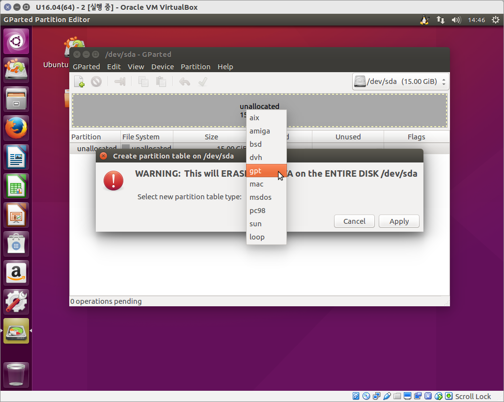
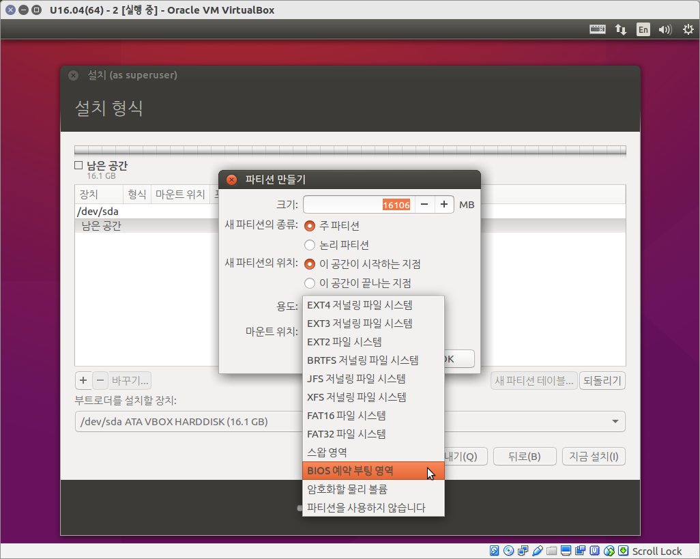
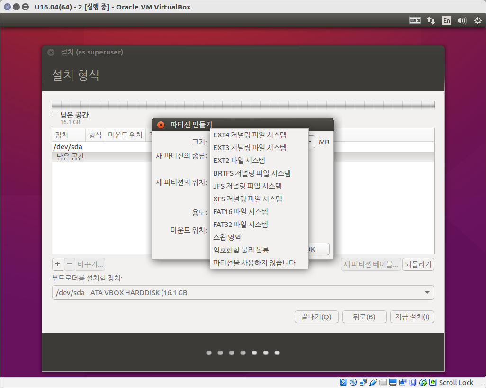

# References

> [LXR](http://lxr.linux.no/) 
>
> [TLDP](http://www.tldp.org/) 
>
> [Debian](https://www.debian.org/CD/live/) 
>
> [System freezes completely with Intel Bay Trail](https://askubuntu.com/questions/803640/system-freezes-completely-with-intel-bay-trail#) 
>
> [리눅스 swap 공간의 역할 | Young H. Oh](http://micol.tistory.com/269) 
>
> [AIX Memory](http://jangpd007.tistory.com/253) 
>
> [IBM Poor system and search performance and high swapping activity on the OmniFind Enterprise Edition search server - Korea](http://www-01.ibm.com/support/docview.wss?uid=swg21201836) 
>
> [Ubuntu Locale 한글로 바꾸기](https://beomi.github.io/2017/07/10/Ubuntu-Locale-to-ko_KR/) 
>
> [When does swap start to be used? When does a process get an out of memory error and be killed? - Unix &amp; Linux Stack Exchange](https://unix.stackexchange.com/questions/176372/when-does-swap-start-to-be-used-when-does-a-process-get-an-out-of-memory-error) 
>
> [boot - How can I set bluetooth off as default? - Ask Ubuntu](https://askubuntu.com/questions/1047018/how-can-i-set-bluetooth-off-as-default) 
>
> [ecryptfs 사용하기](https://andmemories.blogspot.com/2014/07/ecryptfs.html) 
>
> [ecryptfs로 home 암호화](http://kasw.blogspot.com/2016/03/blog-post.html) 
>
> [우분투 암호화 폴더 ecryptfs](http://cluster1.cafe.daum.net/_c21_/bbs_search_read?grpid=1HRzv&fldid=Hhp4&datanum=10&contentval=&docid=1HRzvHhp41020111221214036) 
>
> [데비안 리눅스 디스크/파티션 LUKS로 암호화하기 - 나긋한 개발](http://sacstory.tistory.com/entry/%ED%95%98%EB%93%9C-%EC%B6%94%EA%B0%80%EC%8B%9C) 
>
> [How to setup FTP server on Ubuntu 18.04 Bionic Beaver with VSFTPD - LinuxConfig.org](https://linuxconfig.org/how-to-setup-ftp-server-on-ubuntu-18-04-bionic-beaver-with-vsftpd) 
>
> [File encoding 변환](http://bitsoul.tistory.com/150) 
>
> [The Ultimate Wget Download Guide With 15 Awesome Examples](https://www.thegeekstuff.com/2009/09/the-ultimate-wget-download-guide-with-15-awesome-examples/) 
>
> [Linux sshfs로 다른 시스템 마운트(mount)하기](https://blog.leocat.kr/notes/2018/04/23/sshfs-mount-remote-server-using-ssh) 
>
> [Pen Drive Linux](https://www.pendrivelinux.com/) 
>
> [Ubuntu 20.04 LTS 노트북엔 필수! 전원 관리 tlp와 Powertop, Slimbook (Update)](https://pstudio411.tistory.com/entry/Ubuntu-2004-%EB%85%B8%ED%8A%B8%EB%B6%81%EC%97%94-%ED%95%84%EC%88%98-%EC%A0%84%EC%9B%90-%EA%B4%80%EB%A6%AC) 
>
> [리눅스 네임스페이스(Linux Namespace)란?](https://www.44bits.io/ko/keyword/linux-namespace)


## Mailing to remote domains not supported

```sh
sudo dpkg-reconfigure exim4-config
```

## Mac 한글파일명 자소분리 fix

```sh
sudo pip install nfd2nfc

nfd2nfc 경로명
```


# Boot

## grub 망가졌을때 live cd로 복구하기

```sh
# 라이브 CD로 부팅 후, 리눅스 파티션 확인
sudo fdisk -l

# 확인된 리눅스 파티션을 마운트 한 후
sudo mount /dev/sdb6 /mnt

# 필요한 것들을 추가로 마운트
sudo mount -t proc none /mnt/proc
sudo mount -o bind /dev /mnt/dev

# chroot 명령을 이용해서 /mnt디렉토리를 루트로 바꾼 후
sudo chroot /mnt/ /bin/bash

# grub 재설치
grub-install /dev/sda
```

## grub timeout 설정

```sh
/etc/default/grub

GRUB_TIMEOUT=10 #seconds

sudo update-grub
```


# Process

## Systemd

Service 파일 생성

> [systemd service](https://velog.io/@markyang92/systemd-timer) 
>
> [systemd 서비스 unit파일 작성에서 했던 실수](https://springboot.cloud/16) 
>
> systemd unit 파일 경로: `/etc/systemd/system/*.service` 


`/etc/systemd/system/test.service` 

```sh
[Unit]
Description=test
After=network-online.target
Wants=network-online.target

[Service]
User=tester
Group=tester
Type=simple
#Type=forking # chile process를 띄우는 경우
WorkingDirectory=/usr/local/bin # 쉘 파일 내에서 ./과 같이 상대경로를 사용하는 경우 기재
ExecStart=/usr/local/bin/test.sh
Restart=on-failure
RestartSec=10

[Install]
WantedBy=multi-user.target
```


```sh
sudo systemctl daemon-reload
sudo systemctl start test
sudo systemctl enable test
sudo systemctl status test
```


## chkconfig

일반적으로 start(), stop() 과 case 구문으로 init scripts를 만들어 데몬을 효율적으로 관리 할수 있다.

이때 부팅되는 런레벨에 맞게 자동으로 부팅시 데몬을 띄우고자 할때 /etc/rc.d/init.d 밑에 해당 스크립트 파일을 복사해 두고, chkconfig를 이용하여 추가하게 된다.

chkconfig --add 'scripts file name'

이때 해당 파일은 chkconfig 를 지원하지 않는다는 메세지를 보이며 추가가 안되는 경우가 있다.

Redhat에서 chkconfig를 이용하여 데몬을 관리 하기 위해서는 스크립터파일 상단 주석에 아래와 같은 comment가 추가가 되어야 한다.

chkconfig: 345 90 20

description: GridCenter is Cluster Power Middleware

위의 구문에서 chkconfig 뒤의 345 는 런레벨을 의미하고 90 20 은 booting, halt 시 start, stop 되는 순서이다.


## crontab

```sh
# crontab 확인
sudo crontab -l

# crontab 등록 (sudo이므로 root의 crontab에 등록)
sudo crontab -e

# 분 시 일 월 요일 명령
00 12 * * * /mnt/data/bak/bak.sh

# 위와 같이 처리 후 reboot 했을때 crontab 등록이 초기화될 경우에는 아래와 같이 처리
sudo vi /etc/crontab

# 분 시 일 월 요일 유저 명령
00 12 * * * root /mnt/data/bak/bak.sh

# cron service 재시작
sudo service cron restart
```


# Filesystem

## Partition Check

```sh
-- Tree 구조 확인
lsblk

-- UUID 확인
sudo blkid
```


## fstab

시스템 시작시 자동으로 mount할 file system을 등록한다.

- uuid 확인 : /dev/disk/by-uuid

```sh
# /etc/fstab: static file system information.
#
# Use 'blkid' to print the universally unique identifier for a device; this may
# be used with UUID= as a more robust way to name devices that works even if
# disks are added and removed. See fstab(5).
#
# <file system>             <mount point>  <type>  <options>  <dump>  <pass>
UUID=9d343430-d351-4dd6-bfde-bcae2c95b67e / ext4 defaults,discard,noatime 0 1
tmpfs /tmp tmpfs defaults,noatime,mode=1777 0 0
/dev/mmcblk0p1 /home/dgdsingen/sd ext4 defaults,discard,noatime 0 0
```


## 용량 확인

df 명령은 현재 마운트 되어있는 파일시스템과 사용량을 보여주는 명령이다. df 명령에 사용할 수 있는 옵션으로는 다음과 같다.

- -a : 디폴트로 생략된 파일시스템의 크기가 0KB 인것도 모두 보여준다.
- -t fstype, --type=fstype : 지정한 파일시스템 정보만 보여준다.
- -x fstype, --exclude-type=fstype : 지정한 파일시스템을 제외한 모든 파일시스템 정보를 보여준다.
- -i, --inode : 블럭 사용정보 대신에 inode 정보를 보여준다.
- -k, --kilobytes : 디스크 사용량의 단위를 KB단위로 보여준다.
- -m, --megabytes : 디스크 사용량의 단위를 MB단위로 보여준다.
- -h : 디스크 사용량의 크기 단위를 자동으로 설정한다. 

df명령어는 현재 사용하지 않고 남아있는 하드 디스크의 공간상태를 알려주는 명령어이다. 파일 시스템의 종류를 지정하지 않으면 현재 마운트 되어있는 파일 시스템에 대해 남아있는 디스크 정보를 보여주게 된다. 디스크 용량은 디폴트로 1KB Block으로 표시한다. 디렉토리별 용량을 보고 싶다면 du 명령어를 사용한다.

```sh
du -h
du -hd 1 # --max-depth=1 로 디렉토리 용량을 측정
du -hd 1 | sort -hr # 용량 큰 순으로 정렬
```


GUI로 좀 더 편하게 디렉토리 용량을 보고 싶다면 [ncdu](https://dev.yorhel.nl/ncdu)를 사용한다.

```sh
sudo apt install -y ncdu
```


## Directory 구조

- / (root)
    - 마운트 되는 리눅스 파일 시스템이 있는 최상위 디렉토리
    - 시스템의 근간을 이루는 가장 중요한 디렉토리
    - 파티션 설정 시 반드시 존재하여야 함
    - 절대경로의 기준이 되는 디렉토리
    - 절대경로 : / 디렉토리 기준 예) /usr/local
    - 상대경로 : 현재 작업 디렉토리 기준 예) ./local
- /bin
    - 리눅스의 기본 명령어(binary)들이 들어있는 디렉토리
    - 시스템을 운영하는데 기본적인 명령어들이 들어 있음.
- /sbin
    - 시스템 관리에 관련된 실행 명령어들이 들어있는 디렉토리
    - 시스템 점검 및 복구 명령, 시스템 초기 및 종료 명령 등 시스템 관리에 관련된 실행파일들 존재.
- /lib
    - 프로그램들이 의존하고 있는 라이브러리 파일들 존재.
    - /lib/modules : 커널 모듈 파일들 존재.
    - 대부분의 라이브러리들은 링크로 연결되어 있음.
- /proc
    - 시스템에 대한 정보를 제공하는 가상 파일 시스템.
    - 커널의 어떤 기능을 제어할 수 있는 역할을 가지고 있음.
    - 대부분 읽기 전용이나, 일부 파일중에는 쓰기가 가능한 파일이 존재 하는데 이러한 파일들에 특정 값을 지정하면 커널 기능이 변하게 됨.
    - 이 디렉토리 내에 있는 파일을 cat 명령을 이용하여 보면 시스템 정보를 확인 할 수 있음.
    - 예) 인터럽트 정보 확인 ---> cat /proc/interrupts
- /etc
    - 시스템 환경 설정 파일이 있는 디렉토리
    - 네트워크 관련 설정파일, 사용자 정보 및 암호정보, 파일 시스템 정보, 보안파일, 시스템 초기화 파일등 중요 설정 파일들의 위치한 디렉토리
    - /etc/CORBA : Common Object Request Broker Architecture (COBRA)에 관한 파일이 들어있음.
    - /etc/X11 : 엑스 윈도우 설정에 관련된 파일들이 있음.
    - /etc/cron.d : crontab 명령의 설정파일이 있음.
    - /etc/cron.daily : 매일 작동하게 하는 crontab 스크립트 파일이 존재.
    - /etc/gnome : GTK+ 정의파일들이 있음.
    - /etc/httpd : 아파치 웹 서버의 설정 및 로그파일이 있음.
    - /etc/logrotate.d : logrotate 설정 파일들이 있음.
    - /etc/mail : 센드메일과 관련된 파일이 있음.
    - /etc/ppp : ppp 설정에 관련된 파일들이 있음.
    - /etc/profile.d : 쉘 로그인 하여 프로파일의 실행되는 스크립트에 대한 정의가 있음.
    - /etc/rc.d : 시스템 초기화와 관련된 스크립트가 존재.
    - /etc/samba : 삼바에 관련된 파일들이 있음.
    - /etc/security : 터미널 보안에 관련된 설정이 있음.
    - /etc/skel : 새로운 사용자를 추가할 때 자동적으로 생성되는 디렉토리와 파일이 있음.
    - /etc/squid : squid 프록시 서버에 관련된 파일이 있음.
    - /etc/ssh : secure shell 설정 파일이 있음
    - /etc/sysconfig : 시스템과 네트워크 설정을 담고 있음.
    - /etc/xinetd.d : 슈퍼데몬 xinetd.d의 서비스 영역을 설정하는 디렉토리.
- /var
    - 가변 자료 저장 디렉토리
    - 시스템 운영중에 시스템 자료 데이터가 변경될 때 변경된 자료들이 저장되는 곳.
    - 주로 시스템 작동기록(log)들을 저장.
    - /var/log : 시스템에 발생된 일들에 대한 기록 파일이 있음
    - /var/named : 네임서버 설정 파일들 존재
    - /var/spool/mail : 수신 메일을 사용자 명으로 기록하는 디렉토리
- /usr
    - 일반 사용자들을 위한 대부분의 프로그램 라이브러리 파일들이 위치.
    - /usr/bin : 응용 프로그램의 실행 파일이 위치
    - /usr/sbin : 주로 네트워크 관련 실행 명령어와 실행 데몬들을 많이 포함하고 있음.
    - /usr/X11R6 : X-window
    - /usr/share/doc : 각종 프로그램에 관한 문서 파일들을 포함. 아래 3개와 독립적이다. (가장 상세)
        *   man * : 각종 프로그램에 관한 메뉴얼을 보여줌. (상세)
        *   help * : (간단)
        *   --help : (아주 간단)


## Symbolic Link

만약 심볼릭 링크가 참조하는 소스를 나타내는 곳에 상대경로가 들어갈 경우, 참조하는 기호가 너무 복잡해서 불가능하다는 메시지를 볼 수 있다. 그러므로 참조의 원본은 반드시 절대경로로 설정해주자.

```sh
sudo ln -s ./tomcatstart /usr/bin/tomcatstart (X)
sudo ln -s /home/cr420/tomcatstart ./tomcatstart (O)
```


# Hardware

## Hardware 상태 확인

```sh
# CPU 정보 확인 하기
cat /proc/cpuinfo
cat /proc/cpuinfo |grep cpu
dmesg | grep cpu

# RAM(memory) 정보 확인 하기
cat /proc/meminfo
## 메모리 & 스왑메모리 확인
free 

# DISK 정보 확인 하기
cat /proc/scsi/scsi
## 디스크 파티션 확인,용량 정보 보기
df -h
## 하드디스크 확인
format -l

# 하드 디스크 정보(ide일 경우(모델보기)) 
## 첫번째 하드 hda인경우
cat /proc/ide/hda/model
## 아래에는 하드가 몇개인지 확인 가능
/proc/ide/ 
## 아래에는 그 하드에 대한 여러 정보가 보인다
/proc/ide/hda/
## 만약 raid를 사용한다면 cat /proc/mdstat 로 상태 확인한다. 

# Network 정보 확인 하기
cat /proc/net/netlink
ifconfig -a # 추가

# 리눅스 버전 확인
uname -a
uname -r
cat /proc/version

#리눅스 배포본 확인 하기
lsb_release -a
cat /etc/rehat-release
```


## HDD 배드섹터 검사

```sh
sudo badblocks -v /dev/sda
```


## 모니터 refresh

```sh
xrandr -o left
xrandr -o normal
```


# Monitoring

top < htop < btop 순으로 좋음

## btop

cpu, memory, disk, network 사용량을 GUI로 한번에 확인하고 싶다면 [btop](https://github.com/aristocratos/btop)을 사용한다.

```sh
sudo snap install btop
```


# OS Config

## Mail

```sh
sudo apt-get install mailutils
cat test | mail -s 'subject' dgdsingen@gmail.com
```


## Date, Time, Timezone

```sh
# TZ 환경변수로 timezone 설정하기
export TZ=Asia/Seoul

# localtime 파일을 복사해서 timezone 설정하기. 만약 zoneinfo가 없다면 tzdata를 설치한다.
cp /usr/share/zoneinfo/Asia/Seoul /etc/localtime

# timedatectl 명령어로 timezone 설정하기. 명령어 내부적으로는 localtime 파일 복사 방법을 사용하는 것으로 보인다.
# 만약 timedatectl 명령어가 없다면 systemd를 설치한다. 그러나 container 내부에선 어차피 쓸 수 없으니 위 방식을 사용하자.
timedatectl set-timezone Asia/Seoul

# timedatectl 명령어로 datetime 설정하기
timedatectl set-time "2022-06-06 15:00:00"

# date 명령어로 datetime 설정하기
date -s "2022-06-06 15:00:00"

# ntp 활성화하기. ntp 활성화시 "Failed to set ntp: NTP not supported"라고 나오면 systemd-timesyncd를 설치한다.
timedatectl set-ntp yes
```

만약 Host에서 datetime을 변경한다면 그 위에 띄운 Container OS의 시간도 같이 바뀐다.

그러나 timezone 설정은 Container OS의 것을 그대로 따라간다.


# KVM

```sh
# kvm2 사용시 우선 가상화 지원 여부부터 확인
egrep -q 'vmx|svm' /proc/cpuinfo && echo yes || echo no

# install kvm
sudo apt install qemu-kvm libvirt-daemon-system libvirt-clients bridge-utils

# add user to group. 이후 reboot 필요
sudo adduser `id -un` libvirt
sudo adduser `id -un` kvm

# validation
virt-host-validate

# gui virt manager
sudo apt install virt-manager
```


# Ubuntu

## multipass

> https://multipass.run

```sh
mp launch --name primary --cpus 2 --mem 4G --disk 100G
mp shell
```

## xrdp

```sh
sudo apt install -y ubuntu-desktop xrdp

sudo systemctl enable gdm3
sudo systemctl enable xrdp
sudo systemctl start gdm3
sudo systemctl start xrdp

# 기본 에디터 변경 nano > vim
sudo update-alternatives --config editor

sudo adduser test1

# rdp 접속 후 sudo 권한이 필요한 계정을 sudo 그룹에 미리 추가
sudo usermod -G sudo test1
```

- Settings > Region & Language
    - Manage Installed Languages > Install / Remove Languages > Korean 선택 > Apply
        - Language > Apply System-Wide
        - Regional Formats > Apply System-Wide
    - Add an Input Source > Add > Korean (Hangul) 선택
- Logout & Login


## Date Time Format

```
%m.%d(%a) %H:%M
```

## /etc/fonts/fonts.conf

```xml
<!-- Aliases for commonly used MS fonts. -->
<match>
  <test name="family"><string>Arial</string></test>
  <edit name="family" mode="assign" binding="strong">
    <string>Ubuntu</string>
  </edit>
</match>
<match>
  <test name="family"><string>ArialMT</string></test>
  <edit name="family" mode="assign" binding="strong">
    <string>Ubuntu</string>
  </edit>
</match>
<match>
  <test name="family"><string>Helvetica</string></test>
  <edit name="family" mode="assign" binding="strong">
    <string>Ubuntu</string>
  </edit>
</match>
<match>
  <test name="family"><string>Tahoma</string></test>
  <edit name="family" mode="assign" binding="strong">
    <string>Ubuntu</string>
  </edit>
</match>
```

## SSD 최적화

**Kernel** 

- 되도록 최신의 Linux Kernel 사용
- 적어도 2.6.33 버전 이상을 사용해야 한다.

**Ramdisk** 


```sh
/etc/fstab
# tmpfs 설정으로 ramdisk 사용
tmpfs   /tmp       tmpfs   defaults,noatime,mode=1777   0  0
tmpfs   /var/tmp   tmpfs   defaults,noatime,mode=1777   0  0
tmpfs   /var/log   tmpfs   defaults,noatime,mode=1777   0  0
tmpfs   /var/spool tmpfs   defaults,noatime,mode=1777   0  0

# 아래 옵션은 부팅시 에러가 발생할 수 있으므로 끄자
#tmpfs   /var/run   tmpfs   defaults,noatime,mode=1777   0  0

# apache2, nginx 사용시 아래 경로를 추가해주자
tmpfs   /var/log/apache2   tmpfs   defaults,noatime,mode=1777   0  0
tmpfs   /var/log/letsencrypt   tmpfs   defaults,noatime,mode=1777   0  0
tmpfs   /var/log/nginx   tmpfs   defaults,noatime,mode=1777   0  0
```

**Server 기동시 file 없음 오류** 

우선 시작시 해당 경로를 마운트한다.


```sh
/etc/fstab
tmpfs /var/log/apache2 tmpfs defaults,noatime,mode=1777 0 0
```


restart시 /var/log/~ 경로가 없어서 에러가 나면 실행 스크립트에 디렉토리 생성 로직을 넣는다.


```sh
/etc/init.d/apache2
if [ ! -d /var/log/apache2]; then
    mkdir /var/log/apache2
fi
```

**Configure Browser's Cache** 

- 'Caching Dir 변경' 참조
    - [Firefox](http://docs.google.com/dev/tool/firefox.html)
    - [Chrome](http://docs.google.com/dev/tool/chrome.html)

**File System** 

- Use EXT4 File System for trim
- 파티션을 분할하지 않아야 특정 셀에만 write 작업이 몰리는 현상을 방지할 수 있다.
- noatime 옵션 추가 (공백 없이!) : last access time을 기록하지 않는다

```sh
sudo vi /etc/fstab

UUID=f4e8fefd-e4f1-4763-b7ab-a6fa291f0837 /               ext4    errors=remount-ro,noatime,discard 0       1
```

**Swap** 

- Don't use swap partition : RAM을 확보하고 SSD swap을 없앤다.

**Trim** 

1. Auto Trim

- discard 옵션 추가 (공백 없이!)

```sh
sudo vi /etc/fstab

UUID=f4e8fefd-e4f1-4763-b7ab-a6fa291f0837 /               ext4    errors=remount-ro,noatime,discard 0       1
```

2. Manual Trim

- auto를 쓰더라도 사용량에 따라 주기적으로 manual trim을 해주도록 하자.
- 그리고 fstrim 명령어가 os 버전에 따라 동작이 다를 수 있다.
    - 예를 들어, ubuntu 14.04에서는 주요 SSD 메이커 브랜드만 골라서 trim을 수행한다.
    - 이를 피하고 싶다면 fstrim -no-model-check 을 써주면 된다.

```sh
sudo apt-get install util-linux

/usr/local/bin/trimall

#! /bin/sh
for mount in / /boot /home; do
    sudo fstrim $mount
done
```


## JDK

```sh
# apt 설치
sudo apt install openjdk-8-jdk

# manual 설치
sudo tar zxvf jdk-8u171-linux-x64.tar.gz -C /usr/lib/jvm/

sudo update-alternatives --install /usr/bin/java java /usr/lib/jvm/jdk1.8.0_171/bin/java 1181
sudo update-alternatives --install /usr/bin/javac javac /usr/lib/jvm/jdk1.8.0_171/bin/javac 1181
sudo update-alternatives --install /usr/bin/javaws javaws /usr/lib/jvm/jdk1.8.0_171/bin/javaws 1181
sudo update-alternatives --install /usr/lib/mozilla/plugins/libnpjp2.so libnpjp2.so /usr/lib/jvm/jdk1.8.0_171/jre/lib/amd64/libnpjp2.so 1181

sudo update-alternatives --display java
```


## ecryptfs

ecryptfs-utils를 설치한다. 

```sh
sudo apt-get install ecryptfs-utils
```

유저 A의 home 디렉토리를 암호화하려면 다른 유저로 진행해야 하므로, 유저 B를 생성하고 sudo 권한을 준다. 

```sh
sudo adduser B sudo
```

이후 A에서 로그아웃하고 B로 로그인한 뒤에 A로 실행된 모든 프로세스를 kill한다. 이제 A의 home 디렉토리를 암호화한다. 

```sh
sudo ecryptfs-migrate-home –u A
```

암호화가 끝나면 A로 로그인 후 비상 복구용 암호(로그인용 암호 아님)를 생성해서 안전한 곳에 저장해둔다. 

```sh
ecryptfs-unwrap-passphrase
```

그러나 ecryptfs는 성능 이슈가 있으니 LUKS dm-crypt를 쓰자 (우분투 최초 설치시 선택 가능)


## Albert

> https://software.opensuse.org/download.html?project=home:manuelschneid3r&package=albert

```sh
# 명령 실행 후 강제 종료되는 이슈 해결
rm ~/.config/albert/core.db

# albert가 gnome terminal에서는 뜨지 않는 이슈 해결. 아래 명령어를 keyboard shortcut으로 등록한다.
albert toggle
```


## Issues

### network service discovery disabled

```sh
sudo vi /etc/default/avahi-daemon

AVAHI_DAEMON_DETECT_LOCAL=0
```

### Ubuntu 버전 변경 후 ufw 에러날때

```sh
sudo apt-get install linux-image-$(uname -r)
```

### session 종료 GUI 띄우기

```sh
gnome-session-quit --power-off
```

### Nautilus에서 sftp 마운트

```sh
sudo apt-get install gvfs-backends
```

### pptp 방식으로 VPN 연결

```sh
sudo apt-get install pptp-linux network-manager-pptp network-manager-pptp-gnome
```

### UEFI BIOS 상에서 설치

우분투를 UEFI 바이오스를 지원하게끔 설치하려면 다음 조건들이 '반드시' 충족되어야만 한다.

1. 메인보드에서 지원할 것.
2. 우분투 64bit 판을 사용할 것.
3. 설치하려는 디스크는 gpt 방식으로 파티션 테이블이 구성되어야 할 것.
4. 디스크 맨 앞 부분에 EFI 정보가 저장될 공간을 FAT32 방식으로 만들어 줄 것.

1, 2야 당연하고 쉬운 것이지만, 3, 4는 사용자가 놓치기 쉽다. 그러나 이 중 하나라도 충족되지 않으면, 설치에 보기 좋게 실패하고, 분노하고 있는 자신을 발견하게 된다.

2번까지 조건을 충족시켰다면 3/4는 크게 고려하지 않고 그냥 설치할 수도 있다. 다만, 이 경우, '설치 형식'에서 '디스크를 지우고 Ubuntu 설치', 즉 '자동설치'를 택해야만 원하는 결과를 얻을 수 있다. '기타'를 선택한다면... 또 다시 짜증나는 상황이 발생한다. 그러므로 다음 순서를 지키자. 

우분투 설치 미디어로 부팅을 한 뒤, 바로 '우분투 설치'로 가지 말고 Try 로 진입한다. 꼭 EFI 방식 설치가 아니더라도, Try 로 간 후 진행하는 것이 설치 시에 발생할 수도 있는 오류를 대처하기에 편하다.

우분투가 떴다면, 유니티 런처(대쉬)에서 gparted 를 선택하고 실행한다. 설치하기 원하는 디스크를 정확하게 선택한 뒤, Device 에서 Create partition table 을 택한다.



그리고 위 그림처럼 'gpt' 를 선택해준다.

그리고 나서 gparted 에서 EFI 가 들어갈 파티션을 만들어줘도 되는데.. 크기는 100MB 이상, FAT32 형식으로 파티션을 만들고, 플래그(Flag)를 boot, esp 를 주면 된다.

그러나 이 작업은 우분투 설치에서 하는 편이 좀 더 수월하고 실수할 여지도 줄어든다. 중요한 것은 gpt 형식으로 디스크를 초기화 해주는 것! 이것이 핵심이다.

gpt 방식 설정이 끝났으면 우분투 설치를 선택하여 순서대로 넘어가다가, 바로 위 첫번째 그림처럼 '기타'를 선택해준다.

UEFI 방식으로 설치를 하려면, 디스크 맨 앞 부분에 EFI 정보가 저장될 수 있는 공간을 먼저 만들어줘야 한다.



크기는 100MB 이상이라고 하는데, MS 윈도우계열도 100MB 를 사용하는 것으로 봐서, 크게 줄 필요는 없을 것 같다. 통 크게 한 200MB 정도~ 주면 충분하지 않을까.

그리고 용도를 위 그림과 같이 'BIOS 예약 부팅 영역'으로 설정한다. 이것으로 끝이다.

우분투 설치 쪽에서 디스크를 MBR 이냐 GPT냐 선택할 수 있게 해주면 더 좋겠지만, 그나마 Live 부팅으로 Gparted 를 사용할 수 있으니 기술적인 부분에서 보자면 사실 큰 불편함은 없다.

나머지 영역은 기존 설치하던 방법대로 해주면 된다.

참고로 만약 디스크가 gpt 가 아니고 mbr(msdos)라면, 다음 그림처럼 'BIOS 예약 부팅 영역' 메뉴가 나오지 않는다.



### Doesn't work Brightness control

```sh
sudo vi /usr/share/X11/xorg.conf.d/20-intel.conf

Section "Device"
    Identifier  "card0"
    Driver      "intel"
    Option      "Backlight"  "intel_backlight"
    BusID       "PCI:0:2:0"
EndSection
```

### 이모지가 깨져서 표시될 때

폰트 설치

```sh
sudo apt remove fonts-noto-color-emoji -y
sudo apt install fonts-noto-color-emoji -y
```

설정 파일 만들기

```sh
mkdir -p ~/.config/fontconfig/conf.d
vi ~/.config/fontconfig/conf.d/01-emoji.conf
```

설정 붙여넣기

```xml
<?xml version="1.0" encoding="UTF-8"?>
<!DOCTYPE fontconfig SYSTEM "fonts.dtd">
<fontconfig>
  <alias>
    <family>serif</family>
    <prefer>
      <family>Noto Color Emoji</family>
    </prefer>
  </alias>
  <alias>
    <family>sans-serif</family>
    <prefer>
      <family>Noto Color Emoji</family>
    </prefer>
  </alias>
  <alias>
    <family>monospace</family>
    <prefer>
      <family>Noto Color Emoji</family>
    </prefer>
  </alias>
</fontconfig>
```

설정 적용하기. 이후 크롬 브라우저 등 애플리케이션을 restart 하면 이모지가 잘 표시되는 것을 확인할 수 있음.

```sh
sudo fc-cache -f -v
```


# Raspberry Pi

## Install

- download img file
- insert sd card
- df -h
- umonut /dev/sd**
- dd bs=1M if=2012-07-15-wheezy-raspbian.img of=/dev/sdc
    - 여기서 of에 sd card의 내부 파티션을 적는게 아니라 sd card 자체의 경로를 적어준다.


## Default Initializing

- raspi-config
    - expand_rootfs
    - change_timezone
    - memory_split
    - overclock
    - ssh


## Auto Login

```sh
sudo vi /etc/inittab

1:2345:respawn:/sbin/getty –noclear 38400 tty1

위를 아래와 같이 변경

1:2345:respawn:/bin/login -f pi tty1 </dev/tty1 >/dev/tty1 2>&1
```

## Auto Start

```sh
sudo vi /etc/rc.local

_IP=$(hostname -I) || true
if [ "$_IP" ]; then
    printf "My IP address is %s\n" "$_IP"
fi

이 부분에 프로그램 등록. 해당 프로그램이 추가로 접근할 파일들의 권한은 실행 가능하도록 조정해 주어야 한다.

su pi -c '/etc/init.d/ssh start' &

exit 0
```


## File Server


### SFTP

- Raspbian 기본 ssh server 사용. port만 환경에 맞게 변경

### FTP

```sh
/etc/vsftpd.conf

listen=YES
anonymous_enable=YES
local_enable=YES
write_enable=YES
local_umask=022
dirmessage_enable=YES
use_localtime=YES
xferlog_enable=YES
connect_from_port_20=YES
secure_chroot_dir=/var/run/vsftpd/empty
pam_service_name=vsftpd
rsa_cert_file=/etc/ssl/private/vsftpd.pem
```

## Web Server

```sh
sudo apt-get install nginx php5 php5-cli php5-fpm php5-cgi
```

```sh
sudo vi /etc/init.d/nginx

log dir이 없으면 service가 올라가지 않으므로, nginx 실행 스크립트 최상단에서 log dir 생성

if [ ! -d /var/log/nginx ]; then
    mkdir /var/log/nginx
fi
```

```sh
sudo vi /etc/php5/fpm/pool.d/www.conf

;listen = localhost:9000
; 위를 아래와 같이 처리 (TCP overhead를 피하고 unix socket을 사용해 성능을 올리기 위함)
listen = /var/run/php5-fpm.sock
```

```sh
sudo vi /etc/nginx/sites-available/default

server { 
    root /var/www; 
    index index.html index.htm index.php; 
    server_name localhost; 
  
    location / { 
        try_files $uri $uri/ /index.html; 
    } 
  
    location /doc/ { 
        alias /usr/share/doc/; 
        autoindex on; 
        allow 127.0.0.1; 
        allow ::1; 
        deny all; 
    } 
  
    location /wiki/ { 
        autoindex on; 
        allow 127.0.0.1; 
        allow ::1; 
    } 
  
    location /wiki/data { 
        deny all; 
    } 
  
    location /wiki/conf { 
        deny all; 
    } 
  
    location /wiki/bin { 
        deny all; 
    } 
  
    location /wiki/inc { 
        deny all; 
    } 
  
    location /raspcontrol/ { 
         autoindex on; 
         try_files $uri $uri/ /index.php; 
         allow 127.0.0.1; 
         allow ::1; 
     } 
  
    location ~ \.php$ { 
            fastcgi_split_path_info ^(.+\.php)(/.+)$; 
            fastcgi_pass unix:/var/run/php5-fpm.sock; 
            fastcgi_index index.php; 
            include fastcgi_params; 
    } 
}
```


## CalDav & CardDav Server

- [radicale](http://docs.google.com/dev/web/server/radicale.html)
- [thunderbird](http://docs.google.com/dev/web/server/thunderbird.html)


## Mail Server

mpack 설치 후 sudo dpkg-reconfigure exim4-config 로 config (Internet 선택)

## ufw

```sh
sudo apt-get install ufw
sudo ufw allow 80
sudo ufw allow 9122
sudo ufw enable
sudo reboot
```

## 외장하드 사용시

```sh
sudo vi /boot/config.txt

max_usb_current=2
safe_mode_gpio=4
```

# CentOS

## Config

### yum repo 수정 (별로 추천하지 않음)

- vi /etc/yum.repos.d/CentOS-Base.repo
- baseurl=[http://ftp.daum.net/centos/](http://ftp.daum.net/centos/)$releasever/os/$basearch/

### ntfs mount

```sh
yum install yum-priorities
```

```sh
sudo vi /etc/yum/pluginconf.d/priorities.conf

[main]
enabled = 1
check_obsoletes = 1
priority=2
```

```sh
rpm -ivh http://apt.sw.be/redhat/el5/en/i386/dag/RPMS/ (가장 최근 파일명을 붙여넣음)

yum check-update
```

### root 로그인 허용 위해 주석제거

```sh
vi /etc/pam.d/gdm
```

### SELINUX 끄기

```sh
vi /etc/sysconfig/selinux

SELINUX=disabled
```

### 자동 로그인 설정

```sh
find / -name custom.conf
AutomaticLoginEnable = true
AutomaticLogin = userid
```

### 자동시작 프로그램 등록

```sh
chkconfig --level 2345 [서비스명] on
chkconfig --list
```

### vnc autostart

```sh
vi /etc/rc.local

su -c "vncserver -depth 32 -geometry 1024×768" username
```

### VLC 한글자막 깨지는 현상

- 입력/코덱 - 자막코덱에서 아래 형식화된 자막 전부 풀어주기
- 텍스트 인코딩은 EUC-KR
