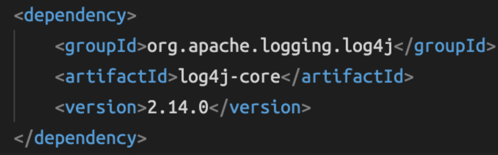

# Issues

## 2021-12-17 CVE-2021-45046 조치


### 작업 계획

2021-12-14 추가 취약점 [CVE-2021-45046](https://security-tracker.debian.org/tracker/CVE-2021-45046) 발표됨

- 기존 취약점 [CVE-2021-44228](https://security-tracker.debian.org/tracker/CVE-2021-44228)에 대한 조치로 2가지 방안이 제시된 바 있음.
    1. LOG4J_FORMAT_MSG_NO_LOOKUPS=true 환경변수 설정
    2. Apache Log4j 2 버전을 2.15.0로 업그레이드
- 그러나 추가 취약점 CVE-2021-45046 발견으로 아래와 같이 상황 변동됨
    1. LOG4J_FORMAT_MSG_NO_LOOKUPS=true 환경변수는 더 이상 안전하지 않음
    2. 이제 2.15.0 버전도 취약하므로 Java 7은 2.12.2로, Java 8+은 2.16.0으로 업그레이드해야 함
    3. 혹은 JndiLookup 클래스를 class path에서 제거한다. `zip -q -d log4j-core-*.jar org/apache/logging/log4j/core/lookup/JndiLookup.class` 


ElasticSearch

- https://discuss.elastic.co/t/apache-log4j2-remote-code-execution-rce-vulnerability-cve-2021-44228-esa-2021-31/291476


Jira, Confluence

- https://confluence.atlassian.com/kb/faq-for-cve-2021-44228-1103069406.html 와 같이 Jira/Confluence의 log4j는 1.x의 atlassian fork 버전으로, 이번 보안 취약점에 직접적으로 영향받지는 않는다고 공표했다. 그러나 명시적으로 org.apache.log4j.net.JMSAppender 설정을 사용하는 경우 보안 취약점에 노출된다고 하며 (자사 Jira/Confluence는 해당사항 없음) 추후 log4j 버전을 2.16.0 혹은 그 이상으로 업그레이드할 계획이라고 밝힘.


SonarQube

- https://community.sonarsource.com/t/sonarqube-sonarcloud-and-the-log4j-vulnerability/54721 와 같이 8.9.5 LTS and 9.2.3 버전으로 업그레이드하면 해결된다고 공표했다.

- 현재 자사에서 사용중인 SonarQube 버전은 8.6 임.

- https://docs.sonarqube.org/8.9/setup/upgrading/ 에 따르면 Migration Path는 From 8.2 > 8.9 LTS, the migration path is 8.2 > the latest 8.9 LTS patch 이다. (즉 현재 8.6에서 바로 8.9.5로 Upgrade)

- Upgrade 절차는 아래와 같다.

    - [x] 10:53 Download & unzip `sonarqube-8.9.5.50698.zip` 

    - [x] 12:58 install plugins: 

        - ```sh
            cp /opt/sonarqube/extensions/plugins/sonar-build-breaker-plugin-2.3.1.347.jar /opt/sonarqube-8.9.5.50698/extensions/plugins/sonar-build-breaker-plugin-2.3.1.347.jar
            ```

    - [x] 16:20 Update the contents of `sonar.properties` and `wrapper.conf` files (in `$NEW_SONAR_HOME/conf`) with the settings of the related files in the `$OLD_SONAR_HOME/conf` directory (web server URL, database, ldap settings, etc.). Do not copy-paste the old files.

        - ```sh
            # sonarqube-8.9.5.50698/conf/sonar.properties
            sonar.jdbc.username=id
            sonar.jdbc.password=pw
            sonar.jdbc.url=jdbc:postgresql://localhost/sonarqubedb
            sonar.web.host=0.0.0.0
            sonar.web.port=9000
            ```

    - [x] 15:20 Backup DB

        - ```sh
            sudo su - postgres
            cd /usr/pgsql-12/bin
            
            # database 목록 확인
            ./psql
            \l
            # 아래 database 1개임
            sonarqubedb
            
            # backup
            ./pg_dump -d sonarqubedb -h localhost -U sonarqube -F t -v > /var/lib/pgsql/bak-2021-12-17.tar
            
            # DB 계정
            id / pw
            ```

    - [x] 17:04 Stop your old SonarQube Server

        - ```sh
            /opt/sonarqube/bin/linux-x86-64/sonar.sh stop
            ps -ef | grep sonarqube
            ```

    - [x] 17:05 Edit systemd

        - ```sh
            # /etc/systemd/system/sonarqube.service
            /opt/sonarqube-8.9.5.50698/lib/sonar-application-8.9.5.50698.jar
            
            sudo systemctl daemon-reload
            ```

    - [x] 17:05 Start your new SonarQube Server

        - ```sh
            sudo systemctl start sonarqube
            ```

    - [x] 17:06 Browse to https://sq.com/setup and follow the setup instructions

    - [x] 17:06 Reanalyze your projects to get fresh data

    - [x] 17:36 GitLab에서 sample/example 프로젝트로 CI/CD Pipeline Stage 중 sonarqube-analysis 수행 검증 완료


### 작업 시작 공지

2021-12-17 (금) 17:00 ~ 18:00

log4j 보안 취약점 이슈 조치를 위한 SonarQube 서버 버전 업그레이드(8.6 > 8.9.5)를 진행하고자 합니다.

작업 시간 동안 CI/CD Pipeline에서 sonar 진행에 순단이 있을 수 있습니다.

CI/CD Pipeline stage에 sonar가 포함된 Project는 아래와 같으며, 작업에 이슈가 있으신 경우 알려주시기 바랍니다.

- test/test-project


### 작업 종료 공지

log4j 보안 취약점 이슈 조치를 위한 SonarQube 서버 버전 업그레이드(8.6 > 8.9.5) 작업 완료되었습니다.

17:05 경 신규 버전의 서버로 교체 완료되었으며, 이후 

17:36 GitLab Example 프로젝트의 CI/CD Pipeline Stage 중 sonarqube-analysis 수행 검증 완료되었습니다.


### 작업 완료 보고

아래와 같이 https://sq.com 접속 시 SonarQube 8.6 > 8.9.5 버전 업그레이드 된 것 확인됨.


----

## 2021-12-13 CVE-2021-44228 조치

### Overview

- Apache Log4j 2의 2.0-beta9 ~ 2.14.1 모든 버전에서 [CVE-2021-44228](https://security-tracker.debian.org/tracker/CVE-2021-44228) 보안 취약점이 발견됨.
    - [CVE-2021-44228](https://security-tracker.debian.org/tracker/CVE-2021-44228)
    - [Apache Log4j 2 CVE-2021-44228](https://www.docker.com/blog/apache-log4j-2-cve-2021-44228/)
    - [Apache Log4j 2 보안 업데이트 권고](https://www.boho.or.kr/data/secNoticeView.do?bulletin_writing_sequence=36389)
    - [log4j 취약점 발견! 빨리 패치하라!](https://velog.io/@composite/log4j-%EC%B7%A8%EC%95%BD%EC%A0%90-%EB%B0%9C%EA%B2%AC-%EB%B9%A8%EB%A6%AC-%ED%8C%A8%EC%B9%98%ED%95%98%EB%9D%BC)
    - [CVE-2021-44228 – log4j - 취약점 보고](https://news.hada.io/topic?id=5534)
    - [CVE-2021-44228-Scanner](https://github.com/logpresso/CVE-2021-44228-Scanner)


### Analysis

영향도 분석이 필요한 범위는 아래와 같이 파악중

- [x] GitLab에 올라간 모든 Repository
    - [x] Application에서 직접적으로 Log4j를 사용하는 부분이 있는지 소스 정적 검색
        - [x] Application은 기본적으로 log4j 를 쓰지 않는다(logback 사용). spring-gcp-starter-loggon 의 디펜던시로 logback을 사용하도록 되어 있음. gcp를 위한 logback 설정은 각 프로젝트 src/main/resources/logback-spring
        - [x] GitLab Repo 총 71개 중 개인 Repo 15개를 제외한 나머지 56개 Repo에서 [소스 정적 검색 결과](#find-in-gitlab-sources), 이슈가 되는 log4j core 라이브러리는 없음.
    - [x] Dependency로 엮인 Library들에서 Log4j를 Embed하여 사용하는 부분이 있는지 동적 검색
        - [x] 특히 jw(Jsp Web) 외부연동 모듈에 대해서 Log4j 사용하는 라이브러리가 있는지 확인 필요
        - [x] 56개 Repository에 대해 `mvn dependency:build-classpath -Dmdep.outputFile=classpath.txt` 로 [라이브러리 의존성 검색 결과](#find-in-maven-dependency), 이슈가 되는 log4j core 라이브러리는 없음.
- [x] GCP에서 구동중인 모든 VM(Jira/Conf 등), Containers 에서 `find / -name *log4j*.jar | grep jar` 실행
    - [x] 12-13 오전 혹시 모를 Container Image에서의 취약점 검출을 위해 [GCR](https://console.cloud.google.com/gcr/images/pjt-test-201211?project=pjt-test-201211) 에서 Vulnerability scanning을 On 시킴
        - 12-14 GCR vulnerability scanning이 CVE-2021-44228을 검출하는지 아래와 같이 테스트해봤으나 아직 검출 못하는 것으로 확인됨.
        - 
        - 
        - 
    - [x] Jira : log4j-1.2.17-atlassian-2.jar 사용하므로 이슈가 되는 log4j core 라이브러리 버전은 없음.
    - [x] Confluence : log4j-1.2.17-atlassian-3.jar 사용하므로 이슈가 되는 log4j core 라이브러리 버전은 없음.
    - [x] pjt-test/vm-elastic-search
        - /data001/openquery/software/nifi-1.12.1_OLD/work/nar/extensions/nifi-elasticsearch-client-service-nar-1.12.1.nar-unpacked/NAR-INF/bundled-dependencies/log4j-core-2.11.1.jar
        - /data001/openquery/software/nifi-1.12.1_OLD/work/nar/extensions/nifi-elasticsearch-restapi-nar-1.12.1.nar-unpacked/NAR-INF/bundled-dependencies/log4j-core-2.13.3.jar
        - /data001/openquery/software/logstash-7.10.0/logstash-core/lib/jars/log4j-core-2.13.3.jar
        - /data001/openquery/software/elasticsearch-7.10.0/lib/log4j-core-2.11.1.jar
        - /data001/openquery/software/nifi-1.12.1/work/nar/extensions/nifi-elasticsearch-client-service-nar-1.12.1.nar-unpacked/NAR-INF/bundled-dependencies/log4j-core-2.11.1.jar
        - /data001/openquery/software/nifi-1.12.1/work/nar/extensions/nifi-elasticsearch-restapi-nar-1.12.1.nar-unpacked/NAR-INF/bundled-dependencies/log4j-core-2.13.3.jar
        - /data001/s_openquery/software/elasticsearch-7.10.0/lib/log4j-core-2.11.1.jar
        - /data001/s_openquery/software/nifi-1.12.1/work/nar/extensions/nifi-elasticsearch-client-service-nar-1.12.1.nar-unpacked/NAR-INF/bundled-dependencies/log4j-core-2.11.1.jar
        - /data001/s_openquery/software/nifi-1.12.1/work/nar/extensions/nifi-elasticsearch-restapi-nar-1.12.1.nar-unpacked/NAR-INF/bundled-dependencies/log4j-core-2.13.3.jar
    - [x] pjt-test/vm-sonarqube
        - /opt/ds_agent/4.18.0-240.el8.x86_64/opt/sonarqube/elasticsearch/lib/log4j-core-2.11.1.jar


### Solution

- 크게 2가지 방안이 있다. 이 중 서비스 영향도가 적고 빠르게 적용 가능한 안은 2안이다. 이슈가 되는 버전의 log4j를 쓰는 곳은 2안을 적용하고, 새로 log4j를 사용해야 하는 경우 1안을 적용하면 될 것으로 보인다.

    1. Apache Log4j 2 버전을 2.15.0로 업그레이드
    2. LOG4J_FORMAT_MSG_NO_LOOKUPS=true 환경변수 설정

- [x] pjt-test/vm-elastic-search

    - | 구분 | 적용대상       | 적용일자         | 소요시간 | 영향도                                                      | 완료 여부 |
        | ---- | -------------- | ---------------- | -------- | ----------------------------------------------------------- | --------- |
        | DEV  | Elastic Search | 2021-12-14       | 약 2분   | 단일 서버로 환경변수 적용 후 재기동으로 인한 검색 순단 예상 | O         |
        | STG  | Elastic Search | 2021-12-15 15:00 | 약 2분   | 단일 서버로 환경변수 적용 후 재기동으로 인한 검색 순단 예상 | O         |
        | PRD  | Elastic Search | 2021-12-15 17:00 | 약 2분   | 3대의 서버 구성으로 서비스 제공에 순단 없음                 | O         |

- [x] pjt-test/vm-sonarqube

    - [SonarQube and the Log4J vulnerability](https://community.sonarsource.com/t/sonarqube-and-the-log4j-vulnerability/54721) 참조하여 환경변수 추가 후 서버 restart 필요

    - [x] 12-14 11:35 /opt/sonarqube/conf/sonar.properties 에 아래 옵션 추가함

        - ```sh
            # 2021-12-14 Patch for CVE-2021-44228
            sonar.search.javaAdditionalOpts=-Dlog4j2.formatMsgNoLookups=true
            ```

    - [x] 12-14 17:12 [SonarQube Operating the Server](https://docs.sonarqube.org/latest/setup/operate-server/) 참조해 서버 restart 함. 이후 아래와 같이 환경변수 적용된 것 확인됨.

        - ```sh
            # 옵션 적용 전 ps 결과
            [sonar@vm-sonarqube conf]$ ps -ef | grep sonarqube
            sonar        849       1  0 May10 ?        03:49:38 java -Xms32m -Xmx32m -Djava.net.preferIPv4Stack=true -jar /opt/sonarqube/lib/sonar-application-8.6.0.39681.jar
            sonar       1826     849  0 May10 ?        07:22:02 /usr/lib/jvm/java-11-openjdk-11.0.9.11-2.el8_3.x86_64/bin/java -XX:+UseConcMarkSweepGC -XX:CMSInitiatingOccupancyFraction=75 -XX:+UseCMSInitiatingOccupancyOnly -Djava.io.tmpdir=/opt/sonarqube/temp -XX:ErrorFile=../logs/es_hs_err_pid%p.log -Des.networkaddress.cache.ttl=60 -Des.networkaddress.cache.negative.ttl=10 -XX:+AlwaysPreTouch -Xss1m -Djava.awt.headless=true -Dfile.encoding=UTF-8 -Djna.nosys=true -XX:-OmitStackTraceInFastThrow -Dio.netty.noUnsafe=true -Dio.netty.noKeySetOptimization=true -Dio.netty.recycler.maxCapacityPerThread=0 -Dio.netty.allocator.numDirectArenas=0 -Dlog4j.shutdownHookEnabled=false -Dlog4j2.disable.jmx=true -Djava.locale.providers=COMPAT -Des.enforce.bootstrap.checks=true -Xmx512m -Xms512m -XX:MaxDirectMemorySize=256m -XX:+HeapDumpOnOutOfMemoryError -Des.path.home=/opt/sonarqube/elasticsearch -Des.path.conf=/opt/sonarqube/temp/conf/es -Des.distribution.flavor=oss -Des.distribution.type=tar -Des.bundled_jdk=false -cp /opt/sonarqube/elasticsearch/lib/* org.elasticsearch.bootstrap.Elasticsearch
            sonar       2215     849  0 May10 ?        11:55:01 /usr/lib/jvm/java-11-openjdk-11.0.9.11-2.el8_3.x86_64/bin/java -Djava.awt.headless=true -Dfile.encoding=UTF-8 -Djava.io.tmpdir=/opt/sonarqube/temp -XX:-OmitStackTraceInFastThrow --add-opens=java.base/java.util=ALL-UNNAMED --add-opens=java.base/java.lang=ALL-UNNAMED --add-opens=java.base/java.io=ALL-UNNAMED --add-opens=java.rmi/sun.rmi.transport=ALL-UNNAMED -Xmx512m -Xms128m -XX:+HeapDumpOnOutOfMemoryError -Dhttp.nonProxyHosts=localhost|127.*|[::1] -cp ./lib/common/*:/opt/sonarqube/lib/jdbc/postgresql/postgresql-42.2.17.jar org.sonar.server.app.WebServer /opt/sonarqube/temp/sq-process6989498111296916293properties
            sonar       2291     849  0 May10 ?        11:57:29 /usr/lib/jvm/java-11-openjdk-11.0.9.11-2.el8_3.x86_64/bin/java -Djava.awt.headless=true -Dfile.encoding=UTF-8 -Djava.io.tmpdir=/opt/sonarqube/temp -XX:-OmitStackTraceInFastThrow --add-opens=java.base/java.util=ALL-UNNAMED -Xmx512m -Xms128m -XX:+HeapDumpOnOutOfMemoryError -Dhttp.nonProxyHosts=localhost|127.*|[::1] -cp ./lib/common/*:/opt/sonarqube/lib/jdbc/postgresql/postgresql-42.2.17.jar org.sonar.ce.app.CeServer /opt/sonarqube/temp/sq-process1621575985976073233properties
            ```

        - ```sh
            # 옵션 적용 후 ps 결과
            [sonar@vm-sonarqube linux-x86-64]$ ps -ef | grep sonar | grep log4j
            sonar    1081571 1081551 47 17:10 ?        00:00:30 /usr/lib/jvm/java-11-openjdk-11.0.9.11-2.el8_3.x86_64/bin/java -XX:+UseConcMarkSweepGC -XX:CMSInitiatingOccupancyFraction=75 -XX:+UseCMSInitiatingOccupancyOnly -Djava.io.tmpdir=/opt/sonarqube/temp -XX:ErrorFile=../logs/es_hs_err_pid%p.log -Des.networkaddress.cache.ttl=60 -Des.networkaddress.cache.negative.ttl=10 -XX:+AlwaysPreTouch -Xss1m -Djava.awt.headless=true -Dfile.encoding=UTF-8 -Djna.nosys=true -XX:-OmitStackTraceInFastThrow -Dio.netty.noUnsafe=true -Dio.netty.noKeySetOptimization=true -Dio.netty.recycler.maxCapacityPerThread=0 -Dio.netty.allocator.numDirectArenas=0 -Dlog4j.shutdownHookEnabled=false -Dlog4j2.disable.jmx=true -Djava.locale.providers=COMPAT -Des.enforce.bootstrap.checks=true -Xmx512m -Xms512m -XX:MaxDirectMemorySize=256m -XX:+HeapDumpOnOutOfMemoryError -Dlog4j2.formatMsgNoLookups=true -Des.path.home=/opt/sonarqube/elasticsearch -Des.path.conf=/opt/sonarqube/temp/conf/es -Des.distribution.flavor=oss -Des.distribution.type=tar -Des.bundled_jdk=false -cp /opt/sonarqube/elasticsearch/lib/* org.elasticsearch.bootstrap.Elasticsearch
            ```

