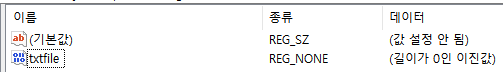

# Config

- ~/.vim
- [VimPlug](https://raw.githubusercontent.com/junegunn/vim-plug/master/plug.vim) : ~/.vim/autoload/plug.vim
- NerdTree
- Airline
- Bufferline
- FuzzyFinder
- Javacomplete2 + JavaParser
- L9

## java-autocomplete2

> https://github.com/artur-shaik/vim-javacomplete2

만약 windows에서 javavi server가 실행되지 않아 에러가 발생한다면 vim 설치 경로를 바꿔준다. 

기본 경로가 C:\Program Files (x86)\...일 경우 java -cp classpaths 실행시 공백문자를 처리하지 못해 java 오류가 발생한다. 

그러면 javavi server가 뜨지 못하고 그에 따라 autocompletion이 동작하지 않게 된다. 

vim 설치경로를 C:\vim과 같이 변경해주면 정상 동작한다.

## Jedi (Python Autocomplete)

sudo pip install git jedi

아래 파일 받아서 .vim 이하에 넣어주기

cd ~/.vim && git clone --recursive https://github.com/davidhalter/jedi-vim.git

- Mac, python3 연동할때
    - python 3.5 설치
    - App Store에서 xcode 설치
    - /usr/bin/ruby -e "$(curl -fsSL [https://raw.githubusercontent.com/Homebrew/install/master/install](https://raw.githubusercontent.com/Homebrew/install/master/install))"
    - brew install vim --with-python3
    - brew install macvim --with-python3
    - brew linkapps macvim
    - 만약 python 일부 모듈(ex: encodings)을 못찾는다고 하면 다음과 같이 설정해주자
        *   vi ~/.bash_profile
        *   Setting PATH for Python 3.5 The original version is saved in .bash_profile.pysave
        *   PATH="/Library/Frameworks/Python.framework/Versions/3.5/bin:${PATH}"
        *   export PATH
        *   PYTHONPATH="/Library/Frameworks/Python.framework/Versions/3.5/lib/python3.5"
        *   export PYTHONPATH
    - 만약 .vimrc의 let g:jedi#force_py_version = 3 부분에서 에러가 난다면 다음과 같이 설정해준다
        *   .vimrc의 let g:jedi#force_py_version = 3 부분을 주석처리한다
        *   ln -s /Library/Frameworks/Python.framework/Versions/3.5/bin/python3 /usr/local/bin/python
        *   즉 시스템 기본 버전을 3로 변경해버리면 된다
    - 그래도 안되면 걍 터미널에서 vim 쓰자.
- Windows, python3 연동할때
    - gvim 8.0, python 3.5 설치 (python 경로는 환경변수에 자동 추가됨)
    - 그러나 아직 버전 이슈가 있는듯... completion이 정상적이지 않다
    - Windows에서 python32.dll이 없다고 할때
        *   환경변수에 들어간 Python 경로에 python32.dll을 넣는다
        *   python32.dll은 python 3.2를 설치한 뒤에 \Windows\SysWOW64에 있다

## FileType Mapping

```sh
/usr/share/vim/vim74/filetype.vim
```

## ctags

```sh
sudo apt-get install ctags
cd $JAVA_HOME/src
ctags -R

sudo vi /etc/vim/vimrc
: autocmd Filetype java setlocal tags=$JAVA_HOME/src/tags
```

## tab & buffer config

- tab : --remote-tab-silent
- buf : --remote-silent


### Linux config

.desktop을 그냥 실행할 때와 mimeapps.list로 실행될 때를 나누고 싶다면, .desktop 파일을 2개 만든다. 경로는 편한대로.

```sh
sudo cp /usr/share/applications/gvim.desktop /usr/share/applications/gvim-silent.desktop
# or 
sudo cp /usr/share/applications/gvim.desktop ~/.local/share/applications/gvim-silent.desktop
```

```sh
vi gvim-silent.desktop

# 딴데는 건드리지 말고 이 부분만 수정
Exec=gvim --remote-silent %F

# mimetype 매핑 설정이 추가로 필요하다면 아래 파일을 수정
~/.local/share/applications/mimeapps.list
text/plain=gvim-silent.desktop;
```


### Windows config


```powershell
# 1. File Type Association 수정 방식 (관리자 권한으로 실행)
# 그런데 이건 에러도 나고 별로 안좋은듯
ftype txtfile="C:\tools\vim\vim82\gvim.exe" --remote-silent "%1"
assoc .log=txtfile
assoc .txt=txtfile
assoc .java=txtfile
assoc .jsp=txtfile
assoc .xml=txtfile
assoc .yml=txtfile
assoc .yaml=txtfile
assoc .vim=txtfile
assoc .yaml=txtfile
assoc .json=txtfile

# 2. Registry 수정 방식
\HKEY_CLASSES_ROOT\Applications\gvim.exe\shell\edit\command
"C:\vim\vim73\gvim.exe" --remote-silent "%1"
```

위 1번으로도 연결되지 않는 파일들이 있을 수 있다. (이미 예전에 default 실행 프로그램을 지정한 경우) 이 때는 Registry에서 default 실행 프로그램 정보를 변경해준다. 

```powershell
컴퓨터\HKEY_CURRENT_USER\Software\Microsoft\Windows\CurrentVersion\Explorer\FileExts\.java\OpenWithProgids
```

로 가서 아래와 같이 txtfile을 추가해주면 ftype txtfile과 연결된다.




## Windows & Linux Config Sync

설정을 맞추고 싶다면 Windows에서 다음 설정 부분을 주석 처리한다.

```sh
source $VIMRUNTIME/vimrc_example.vim
source $VIMRUNTIME/mswin.vim " 특히 이부분
behave mswin
```


## viminfo 에러날 때

```sh
rm ~/.viminfo ~/_viminfo
```


# Manual


## Sort

```
:sort (Ascending)
:sort! (Descending)
:sort u (Unique)
:g/^/m0 (Reverse)
```


## Word Count

- g -> Ctrl + g


## 실행결과를 현재 버퍼 위치에 붙여넣기

- :r !date (Shell 실행결과 붙여넣기)
- :r ~/t.txt (파일내용 붙여넣기)


## Folding

- zf : folding
- zo : unfolding


## Macro

- qa : save macro named 'a'
- @a : execute macro named 'a'


## Diff

- buffer에 diff할 대상을 2개 이상 열어둔 뒤 실행
- 먼저 화면을 나누고
    - :vert split
    - :split
- 비교하고 싶은 buffer를 diff에 참여시킴
    - :diffthis
- 차이점 탐색
    - [ + c : 현재 위치에서 위쪽으로 탐색
    - ] + c : 현재 위치에서 아래쪽으로 탐색
- merge
    - d + o : 반대쪽 창의 내용을 현재 위치에 복사
    - d + p : 현재 위치의 내용을 반대쪽 창에 복사
- 차이점 보기
    - z + m : 차이점만 보기
    - z + r : 모두 보기
- 차이점 재표시
    - :diffupdate


## 다중 파일 문자열 치환

여러 파일들을 args 명령으로 선택한다.

```
:args dir/*/*
```

선택한 파일들에 대해서 substitue 명령을 실행하고, 바뀐 파일은 저장한다.

```
:argdo %s/MAX_TYPE/MAX_CMD_TYPE/ge | update
```

이렇게 해서 수십개의 소스 파일들에서 MAX_TYPE 이란 문자열을 MAX_CMD_TYPE 으로 일괄 변경했다.


## System Clipboard Copy & Paste

"+x " 자르기
"+y " 복사
"+X " 줄 자르기
"+Y " 줄 복사
"+P " 붙이기

명령어 창에서 Ctrl + r 후 0을 누르면 방금 복사한 내용(0번 버퍼의 내용)이 들어간다. 시스템 버퍼라면 당연히 +를 눌러주면 된다.


## Tab

vim -p file1 file2 file3... 
vim -p3 " 이름없는 파일 탭 3개 
:tabnew file " 새탭 
:tabfir " 첫번째 탭으로 이동 
:tabla " 마지막 탭으로 이동 
:tabd 명령 " 열린 모든 탭에 명령을 수행 
gt " 다음 탭으로 이동 
gT " 이전 탭으로 이동


## 문자열 찾기, 치환

/문자열 " :noh 입력시 하이라이트 꺼짐 
Shift + Click left 

:%s/문자열/치환


## 주석처리

비주얼 모드 선택 후

:norm i// 
:norm xx


## 비주얼 모드

v " 비주얼 모드 
V " 비주얼 라인 
Ctrl +  q 혹은 v " 비주얼 블록. 선택 후 r (한문자 치환), R (모든 행 치환), I (블록 앞에 모두 끼워넣기)


## 텍스트 치환

1. 문서 처음부터 마지막까지의 char 를 _char_ 로 치환한다.  
   :%s/char/_&_/g 
   
2. 현재(커서위치)부터 마지막까지의 char 를 _char_ 로 치환한다. 
   :.,$s/char/_&_/g 
   
3. buf_.*[255], buf_in[255], buf_get[255] 와 같은 문자열을 hello 로 변경한다.  
   :1,10s/buf_.*\[255\]/hello/g 
   
4. 숫자로만 이루어진 행 찾기는 다음과 같습니다. 
   /^\d\+$ 
   

^ : 행의 첫부분 
\d : 0~9까지의 숫자 
+ : 바로 앞의 글자 (여기서는 숫자)가 1개나 1개 이상 있음. (즉 숫자가 최소한 1개 있음) 
  $ : 행의 마지막 부분 
  
5. 전체 문서에서 add 를 plus로 치환 
   :s/add/plus/g " 현재 줄만 적용 
   :%s/add/plus/g " 문서 전체 적용 
   
6. 현재 편집중인 전체 문서에서 /etc/ 를 /etc/local/ 로 치환 
   :s/\/etc\//\/etc\/local\//g " 현재 줄 적용 
   :s$/etc/$/etc/local/$g " 문서 전체 적용 
   

$말고도 여러가지 문자를 쓸 수 있습니다. :나 & 등등. 그리고 u를 눌러 취소했는데(undo), 다시 하고 싶다면 (redo) Ctrl+R을 누르면 됩니다. 
    
7. '앗싸좋구나108계단' 이 '좋구나108계단앗싸' 로 바뀝니다. 
   :%s/\(앗싸\)\(좋구나\)\(108계단\)/\2\3\1/g 
   
8. 대소문자 구분없이 바꾸려면 i 옵션을 붙입니다. 이것은 ".vimrc" 파일을 고치지 않아도 작동합니다. 
   :%s/foo/bar/i 
   
9. 정확하게 foo에 일치될 때만 바꿉니다. 즉 foo는 바꾸지만, foo 앞뒤로 다른 문자열이 붙어 있는 경우에는 바꾸지 않습니다. 
   :%s/\/bar 
   
10. 정렬 
    123 def ghi 
    432 ius dkf 
    089 cdo lks 
    

이걸 숫자를 가운데로, 두번째는 끝, 세번째 처음으로 보내려면 
    
:%s/\([0-9]*\) \([a-z]*\) \([a-z]*\)/\3 \2 \1/g 
    
11. 만약 3~5자리로 이루어진 모든 숫자를 검색하고 싶다면 다음과 같이 입력한다. 
    /[0123456789]\{3,5\} 또는 
    /[0-9]\{3,5\} 
    
12. 만약 'ab'로 시작하는 소문자로 되어 있는 모든 단어를 삭제하려면 다음과 같이 입력한다. 
    :%s/ab[a-z]*//g 
    
13. 만약 test라는 파일에 cpu가 들어있는 라인을 모조리 지우고자 한다면 vi mode에서 아래와 같이 사용한다. 
    :g/cpu/d 
    

g는 모든 라인에 적용한다라는 의미이고, 

d는 delete를 의미합니다. 


14. stat0,stat1.....stat9 패턴이 있는 라인을 모조리 지우기 
    :g/stat[0-9]/d 
    
15. 빈 줄 두 줄을 한 줄로 바꾸기 
    :%s/\n\n/\r/g 
    

15-1. 빈 줄 한 줄을 두 줄로 바꾸기 
:%s/\n/\r\r/g 
    

16. 두 칸을 한 칸으로 줄이기 
    :%s/ / /g 
    
17. 탭을 스페이스 공백으로 바꾸기 
    :%s/\t/ /g 
    
18. 마지막에 한 칸 띠우고 엔터된 것을 바로 엔터한 것으로 고치기 
    :%s/ $//g 또는 
    :%s/ \n/\n/g 
    
19. 줄 첫 칸의 띠어쓰기를 없애기 
    :%s/^ //g 
    
20. 잘못 바꾸기를 했을 때 되돌리려면 그냥 u 키를 누르면 됩니다. 
    
21. 줄 뒤 공백문자들 모두 지우기 
    :%s/[ \n]*//g 
    
22. 빈 줄 모두 삭제하기 
    :g/^$/d 
    

g는 모든 라인에 적용한다라는 의미이고, d는 delete를 의미합니다.

# References
> [Valloric/YouCompleteMe: A code-completion engine for Vim](https://github.com/Valloric/YouCompleteMe) 
>
> [Vim을 IDE처럼 사용하기](http://blog.b1ue.sh/2016/10/09/vim-ide/) 

