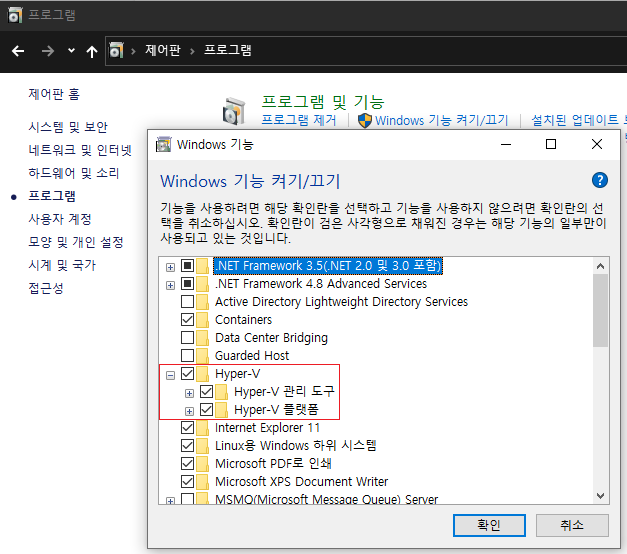

# Config

## Terminal

### 원하는 Font가 설정에 나오지 않을때

```powershell
# OS단 간단하게 설정 (추천)
Run intl.cpl > 관리자 옵션 > 시스템 로케일 변경 > Beta: 세계 언어 지원을 위해 Unicode UTF-8 사용 선택

# OS단 레지스트리 변경
[HKEY_LOCAL_MACHINE\SYSTEM\CurrentControlSet\Control\Nls\CodePage]
String OEMCP = 65001

# Prompt단 Autorun 설정
[HKEY_LOCAL_MACHINE\Software\Microsoft\Command Processor] 
String Autorun = @chcp 65001>nul
```

### Windows Terminal

```javascript
// settings.json
// https://aka.ms/terminal-documentation
// To view the default settings, hold "alt" while clicking on the "Settings" button.
{
    // https://aka.ms/terminal-global-settings
    "$schema": "https://aka.ms/terminal-profiles-schema",
    "defaultProfile": "{2c4de342-38b7-51cf-b940-2309a097f518}",
    "copyOnSelect": false,
    "copyFormatting": false,

    // https://aka.ms/terminal-profile-settings
    // A profile specifies a command to execute paired with information about how it should look and feel.
    // Each one of them will appear in the 'New Tab' dropdown,
    // and can be invoked from the commandline with `wt.exe -p xxx`
    "profiles": {
        "defaults": {
            "colorScheme": "Night Owlish Light",
            "cursorColor": "#000000"
        },
        "list": [
            {
                "guid": "{2c4de342-38b7-51cf-b940-2309a097f518}",
                "hidden": false,
                "name": "Ubuntu",
                "source": "Windows.Terminal.Wsl"
                ,"fontFace": "Ubuntu Mono"
                ,"fontSize": 12
            },
            {
                "guid": "{61c54bbd-c2c6-5271-96e7-009a87ff44bf}",
                "name": "Windows PowerShell",
                "commandline": "powershell.exe",
                "hidden": false
            },
            {
                "guid": "{0caa0dad-35be-5f56-a8ff-afceeeaa6101}",
                "name": "명령 프롬프트",
                "commandline": "cmd.exe",
                "hidden": false
            },
            {
                "guid": "{b453ae62-4e3d-5e58-b989-0a998ec441b8}",
                "hidden": false,
                "name": "Azure Cloud Shell",
                "source": "Windows.Terminal.Azure"
            }
        ]
    },

    // https://aka.ms/terminal-color-schemes
    // https://windowsterminalthemes.dev
    "schemes": [
        {"name": "Github", "black": "#3e3e3e", "red": "#970b16", "green": "#07962a", "yellow": "#f8eec7", "blue": "#003e8a", "purple": "#e94691", "cyan": "#89d1ec", "white": "#ffffff", "brightBlack": "#666666", "brightRed": "#de0000", "brightGreen": "#87d5a2", "brightYellow": "#f1d007", "brightBlue": "#2e6cba", "brightPurple": "#ffa29f", "brightCyan": "#1cfafe", "brightWhite": "#ffffff", "background": "#f4f4f4", "foreground": "#3e3e3e"},
        {"name": "Night Owlish Light", "black": "#011627", "red": "#d3423e", "green": "#2aa298", "yellow": "#daaa01", "blue": "#4876d6", "purple": "#403f53", "cyan": "#08916a", "white": "#7a8181", "brightBlack": "#7a8181", "brightRed": "#f76e6e", "brightGreen": "#49d0c5", "brightYellow": "#dac26b", "brightBlue": "#5ca7e4", "brightPurple": "#697098", "brightCyan": "#00c990", "brightWhite": "#989fb1", "background": "#ffffff", "foreground": "#403f53"}
    ],

    // https://aka.ms/terminal-keybindings
    // To unbind a key combination from your defaults.json, set the command to "unbound".
    "keybindings": [
        // Copy and paste are bound to Ctrl+Shift+C and Ctrl+Shift+V in your defaults.json.
        // These two lines additionally bind them to Ctrl+C and Ctrl+V.
        // To learn more about selection, visit https://aka.ms/terminal-selection
        { "command": {"action": "copy", "singleLine": false }, "keys": "ctrl+c" },
        { "command": "paste", "keys": "ctrl+v" },
        { "command": "find", "keys": "ctrl+shift+f" },

        // Press Alt+Shift+D to open a new pane.
        // - "split": "auto" makes this pane open in the direction that provides the most surface area.
        // - "splitMode": "duplicate" makes the new pane use the focused pane's profile.
        // To learn more about panes, visit https://aka.ms/terminal-panes
        { "command": { "action": "splitPane", "split": "auto", "splitMode": "duplicate" }, "keys": "alt+shift+d" },
        
        // unbind
        { "command": "unbound", "keys": "alt+h" },
        { "command": "unbound", "keys": "alt+j" },
        { "command": "unbound", "keys": "alt+k" },
        { "command": "unbound", "keys": "alt+l" },
        { "command": "unbound", "keys": "alt+down" },
        { "command": "unbound", "keys": "alt+left" },
        { "command": "unbound", "keys": "alt+right" },
        { "command": "unbound", "keys": "alt+up" }
    ]
}
```

## Long Path Enabled 켜기

```
regedit
컴퓨터\HKEY_LOCAL_MACHINE\SYSTEM\CurrentControlSet\Control\FileSystem
LongPathsEnabled 1로 변경
Restart
```

## 최대 절전 모드 끄기

- 최대 절전 모드나 재부팅이나 어차피 SSD 사용하면 부팅 속도에 차이가 없고, 최대 절전 모드 사용시에는 8G 정도 디스크 용량을 잡아먹기 때문에 끄는게 좋다. 

```powershell
cmd 관리자 모드로 실행

powercfg -h off
```

## 자동 로그인 설정

- 설정 > 계정 > 로그인 옵션 > `보안을 강화하려면 이 장치의 Microsoft 계정에 Windows Hello 로그인만 허용함` 체크 해제
- 설정 > 계정 > 로그인 옵션 > `Windows를 사용하지 않을 경우 언제 다시 로그인해야 합니까?` > `안 함`으로 변경
- `netplwiz` > `사용자의 이름과 암호를 입력해야 이 컴퓨터를 사용할 수 있음` 체크 해제 > PC 재부팅
    - `사용자의 이름과 암호를 입력해야 이 컴퓨터를 사용할 수 있음` 체크 항목이 보이지 않는 경우 해당 메뉴를 되살리려면 > `HKEY_LOCAL_MACHINE\SOFTWARE\Microsoft\Windows NT\CurrentVersion\PasswordLess\Device\DevicePasswordLessBuildVersion`  > `0`으로 수정
    - `사용자의 이름과 암호를 입력해야 이 컴퓨터를 사용할 수 있음` 체크 항목이 보이지 않는 경우 수동으로 설정하려면 > `regedit` > `HKEY_LOCAL_MACHINE\SOFTWARE\Microsoft\Windows NT\CurrentVersion\Winlogon\AutoAdminLogon` > `1`로 수정 > 새로 만들기 > 문자열 값 > 값 이름: `DefaultPassword`, 값 데이터: `계정 비번 입력`

## 자동 Shutdown, Boot Script 설정

- Shutdown: 작업 스케쥴러 > 트리거: 동작할 날짜/시간 입력 > 동작: `shutdown -s -f -t 0` 
- Boot: BIOS 설정 > Boot Option > Alarm > 시간 설정
- Execute PowerShell Script on Boot: 작업 스케쥴러 > 트리거: `사용자가 로그온할 때` > 동작: `PowerShell "C:\bin\test.ps1"` 
    - 만약  PowerShell 실행시 권한 문제가 있다면 `Set-ExecutionPolicy -ExecutionPolicy RemoteSigned -Scope CurrentUser` 실행 후 `Yes` or `All` 을 선택한다.

> [Executing PowerShell Scripts FAQ and Tips & Tricks](https://www.howto-outlook.com/howto/powershell-scripts-faq-tips-and-tricks.htm) 


## Get Microsoft Store appx file download URL

Fiddler → WInConfig → Microsoft Store 선택 → Fiddler 종료 → Microsoft Store에서 앱 다운로드 시작되면 → Fiddler 시작 → 바이너리 다운로드 URL을 Copy하여 브라우저에 붙여넣기

## 기본앱 삭제

Powershell을 관리자 권한으로 실행한 뒤에 아래 명령어들을 실행한다. 


```powershell
Get-AppxPackage *3dbuilder* | Remove-AppxPackage
Get-AppxPackage *bingfinance* | Remove-AppxPackage
Get-AppxPackage *bingnews* | Remove-AppxPackage
Get-AppxPackage *bingsports* | Remove-AppxPackage
Get-AppxPackage *bingweather* | Remove-AppxPackage
Get-AppxPackage *getstarted* | Remove-AppxPackage
Get-AppxPackage *officehub* | Remove-AppxPackage
Get-AppxPackage *onenote* | Remove-AppxPackage
Get-AppxPackage *people* | Remove-AppxPackage
Get-AppxPackage *photos* | Remove-AppxPackage
Get-AppxPackage *skypeapp* | Remove-AppxPackage
Get-AppxPackage *solitairecollection* | Remove-AppxPackage
Get-AppxPackage *soundrecorder* | Remove-AppxPackage
Get-AppxPackage *windowsalarms* | Remove-AppxPackage
Get-AppxPackage *windowscamera* | Remove-AppxPackage
Get-AppxPackage *windowscommunicationsapps* | Remove-AppxPackage
Get-AppxPackage *windowsmaps* | Remove-AppxPackage
Get-AppxPackage *windowsphone* | Remove-AppxPackage
Get-AppxPackage *xbox* | Remove-AppxPackage
Get-AppxPackage *zunemusic* | Remove-AppxPackage
Get-AppxPackage *zunevideo* | Remove-AppxPackage
Get-AppxPackage *3d* | Remove-AppxPackage
Get-AppxPackage *help* | Remove-AppxPackage
Get-AppxPackage *paint* | Remove-AppxPackage
Get-AppxPackage *messaging* | Remove-AppxPackage
Get-AppxPackage *phone* | Remove-AppxPackage
Get-AppxPackage *sticky* | Remove-AppxPackage
Get-AppxPackage *sketch* | Remove-AppxPackage
# Cortana
Get-AppxPackage -allusers Microsoft.549981C3F5F10 | Remove-AppxPackage
```


초기 상태로 되돌아가려면 Powershell을 관리자 권한으로 실행한 뒤에 아래 명령어를 실행한다. 


```powershell
Get-AppxPackage -allusers | foreach {Add-AppxPackage -register "$($_.InstallLocation)\appxmanifest.xml" -DisableDevelopmentMode}
```

## Chocolatey

https://chocolatey.org/install 을 먼저 설치한 뒤 

```powershell
Set-ExecutionPolicy Bypass -Scope Process -Force; [System.Net.ServicePointManager]::SecurityProtocol = [System.Net.ServicePointManager]::SecurityProtocol -bor 3072; iex ((New-Object System.Net.WebClient).DownloadString('https://chocolatey.org/install.ps1'))
```

관리자 권한으로 Powershell을 열어 아래 스크립트를 실행한다. 

```powershell
# choco feature enable -n allowGlobalConfirmation

# system drivers
choco install -y amd-ryzen-chipset

# common tools
# choco install -y pandoc
choco install -y 7zip transmission GoogleChrome sumatrapdf.install smplayer libreoffice-fresh typora

# dev tools
# choco install -y microsoft-windows-terminal winpcap wireshark
choco install -y git openjdk11 maven vim fiddler docker-for-windows dbeaver vscode
```

## Start Menu

```powershell
# System
%SystemDrive%\ProgramData\Microsoft\Windows\Start Menu

# User
%SystemDrive%\Users\%Username%\AppData\Roaming\Microsoft\Windows\Start Menu\
```

## Linux에서 Windows로 되돌리기

### Boot 복원


```powershell
bootrec /fixmbr
bootrec /fixboot
```

### Partition 망가졌을때 복원


```powershell
cmd
diskpart
list disk
select disk 번호
detail disk
clean
create partition primary
list partition
select partition 번호
active
format fs=ntfs quick
list volume
assign
```

## 정품인증 해제


```powershell
slmgr /cpky
slmgr /upk
```


# Powershell

```powershell
# Open URL in Browser
Start-Process "https://debug.to"
[system.Diagnostics.Process]::Start("msedge","https://debug.to")
[system.Diagnostics.Process]::Start("chrome","https://debug.to")
[system.Diagnostics.Process]::Start("firefox","https://debug.to")
[system.Diagnostics.Process]::Start("iexplore","https://debug.to")
```

> [Open URL in a browser in PowerShell](https://debug.to/696/open-url-in-browser-in-powershell) 


# RDP

- 제어판 - 시스템에서 원격 설정
    - '이 컴퓨터에 대한 원격 지원 연결 허용'에 체크
    - 아래 원격 데스크톱에서 '모든... 연결 허용' 체크
- 방화벽에서 3389번 포트를 풀어준다.
- 만약 로그인이 되지 않는다면, 다음과 같이 진행한다.
    - 실행 > `mmc` 
    - 파일 > 스냅인 추가/제거 > '로컬 사용자 및 그룹' 추가
    - 그룹 폴더에 들어가 원격과 네트워크에 관련된 그룹에 사용자를 추가한다.


## 외부망으로 RDP 뚫기

- [ngrok](https://ngrok.com/download) 다운로드

```
ngrok tcp --region=jp 3389
pause
```


# WSL

## Install

1. [제어판 - 프로그램 - Windows 기능 켜기/끄기]에서 [Linux용 Windows 하위 시스템] 활성화
2. Microsoft Store에서 Ubuntu를 찾아 설치

## Config

### WSL2 Config

- WSL2의 시스템 내부 파일시스템에 접속하려면 윈도우 탐색기에서 `\\WSL$`로 들어가면 된다.

```json
// This file was initially generated by Windows Terminal 1.0.1401.0
// It should still be usable in newer versions, but newer versions might have additional
// settings, help text, or changes that you will not see unless you clear this file
// and let us generate a new one for you.

// To view the default settings, hold "alt" while clicking on the "Settings" button.
// For documentation on these settings, see: https://aka.ms/terminal-documentation
{
    "$schema": "https://aka.ms/terminal-profiles-schema",

    "defaultProfile": "{2c4de342-38b7-51cf-b940-2309a097f518}",

    // You can add more global application settings here.
    // To learn more about global settings, visit https://aka.ms/terminal-global-settings

    // If enabled, selections are automatically copied to your clipboard.
    "copyOnSelect": false,

    // If enabled, formatted data is also copied to your clipboard
    "copyFormatting": false,

    // A profile specifies a command to execute paired with information about how it should look and feel.
    // Each one of them will appear in the 'New Tab' dropdown,
    //   and can be invoked from the commandline with `wt.exe -p xxx`
    // To learn more about profiles, visit https://aka.ms/terminal-profile-settings
    "profiles":
    {
        "defaults":
        {
            // Put settings here that you want to apply to all profiles.
        },
        "list":
        [
            {
                "guid": "{2c4de342-38b7-51cf-b940-2309a097f518}",
                "hidden": false,
                "name": "Ubuntu",
                "source": "Windows.Terminal.Wsl"
                ,"fontFace": "Ubuntu Mono"
                ,"fontSize": 12
            },
            {
                // Make changes here to the powershell.exe profile.
                "guid": "{61c54bbd-c2c6-5271-96e7-009a87ff44bf}",
                "name": "Windows PowerShell",
                "commandline": "powershell.exe",
                "hidden": false
            },
            {
                // Make changes here to the cmd.exe profile.
                "guid": "{0caa0dad-35be-5f56-a8ff-afceeeaa6101}",
                "name": "명령 프롬프트",
                "commandline": "cmd.exe",
                "hidden": false
            },
            {
                "guid": "{b453ae62-4e3d-5e58-b989-0a998ec441b8}",
                "hidden": false,
                "name": "Azure Cloud Shell",
                "source": "Windows.Terminal.Azure"
            }
        ]
    },

    // Add custom color schemes to this array.
    // To learn more about color schemes, visit https://aka.ms/terminal-color-schemes
    "schemes": [],

    // Add custom keybindings to this array.
    // To unbind a key combination from your defaults.json, set the command to "unbound".
    // To learn more about keybindings, visit https://aka.ms/terminal-keybindings
    "keybindings":
    [
        // Copy and paste are bound to Ctrl+Shift+C and Ctrl+Shift+V in your defaults.json.
        // These two lines additionally bind them to Ctrl+C and Ctrl+V.
        // To learn more about selection, visit https://aka.ms/terminal-selection
        { "command": {"action": "copy", "singleLine": false }, "keys": "ctrl+c" },
        { "command": "paste", "keys": "ctrl+v" },

        // Press Ctrl+Shift+F to open the search box
        { "command": "find", "keys": "ctrl+shift+f" },

        // Press Alt+Shift+D to open a new pane.
        // - "split": "auto" makes this pane open in the direction that provides the most surface area.
        // - "splitMode": "duplicate" makes the new pane use the focused pane's profile.
        // To learn more about panes, visit https://aka.ms/terminal-panes
        { "command": { "action": "splitPane", "split": "auto", "splitMode": "duplicate" }, "keys": "alt+shift+d" }
    ]
}
```


### CMD Files

Windows Prompt에서 바로 Linux Subsystem의 Bash 명령을 사용하고 싶다면 아래와 같이 사용한다. 


```
bash -c "git status"
```


성능을 좀 더 높여주기 위해서는 아래와 같이 옵션을 추가해주자. 


```
@echo off
bash --noediting --noprofile --norc -c "git status"
```


[C:\bin](https://drive.google.com/open?id=19XZhwShNeJcIvXYuqCv7ZJoz93EhPG7M)에 CMD 파일로 만들어두고 PATH에 추가하면 좋겠지. 참고로 %*은 모든 파라미터를 의미한다. 


```
mvn.cmd
@echo off
bash --noediting --noprofile --norc -c "mvn %*"
```

## Locale

Locale을 확인하려면 아래와 같은 명령어를 입력하면 됩니다:


```
locale
```


우분투에서 Locale을 변경하는 방법은 아래와 같습니다. 먼저 한글 패키지를 설치해 주세요.(이미 깔려있을수도 있습니다.)


```
sudo apt-get install language-pack-ko
```


그 다음으로는 locale-gen을 통해 Locale을 설치해 줍시다.


```
sudo locale-gen ko_KR.UTF-8
```


다음으로 dpkg-reconfigure을 이용하는 방법입니다. 아래와 같이 명령어를 쳐 주시고 나오는 화면에서 ko_KR.UTF-8을 스페이스로 선택(*모양이 뜨면 선택된 것입니다)후 엔터를 눌러 설정을 마무리 해 주세요.


```
sudo dpkg-reconfigure locales
```


마지막으로 update-locale으로 시스템 LANG설정을 업데이트 해 줍시다.


```
sudo update-locale LANG=ko_KR.UTF-8 LC_MESSAGES=POSIX
```


이 방법을 사용하면 시스템에서 자동으로 LANG에 지정된 한국어 UTF-8로 Locale세팅을 마무리해 줍니다.

다른 방법으로는 직접 시스템 파일을 수정해주는 방법이 있습니다.

/etc/default/locale 파일을 수정하는 것인데요, nano나 vim등으로 아래와 같이 내용을 수정해주시면 됩니다.


```
LANG=ko_KR.UTF-8
LC_MESSAGES=POSIX
```


(참조 : [https://beomi.github.io/2017/07/10/Ubuntu-Locale-to-ko_KR/](https://beomi.github.io/2017/07/10/Ubuntu-Locale-to-ko_KR/))

## Issues


### WSL Git + VS Code


### [andy’s solution](https://github.com/andy-5/wslgit)

[C:\bin\wslgit.exe](https://drive.google.com/open?id=1tLfBE_Sag2dZCpFeITBNZ8rTn8Ypyv41)를 준비하고, VS Code settings.json에 "git.path": "C:\\bin\\wslgit.exe"를 추가한다. 이 방법은 Windows와 WSL 간 경로 변경이 이루어지지 않아(?) Gitlens와 같은 Extension 사용이 불가하다. 


### [hangxingliu’s solution](https://github.com/hangxingliu/wslgit)

[/usr/bin/wslgit.sh](https://drive.google.com/open?id=1yHbWysQ8l7G-E_Xb4PTORGBeTkCDW0_K), [C:\bin\git.bat](https://drive.google.com/open?id=14rkd1mrjwEwUwa0WH8cpB1LkFiAE1zh4)을 준비하고, VS Code settings.json에 "git.path": "C:\\bin\\git.bat"를 추가한다. 이 방법은 wslpath 혹은 awk를 사용해 Windows와 WSL 간 경로 변경이 자동으로 처리되며 Gitlens와 같은 Extension 사용 가능하다. "마지막 커밋 취소" 등과 같은 기능에서 명령어 에러가 나긴 하지만 Gitlens에서 Reset to commit 등의 기능을 사용하면 문제없다. 참고로 awk가 아닌 wslpath를 기본으로 사용하는 좀 더 성능이 개선된 버전은 [/usr/bin/wslgit.sh](https://drive.google.com/open?id=19XLYZKNjcGqcbxzxe0pG6kuL18TJz2zN), [C:\bin\git.bat](https://drive.google.com/open?id=178vu6nthW7aMf_zrg1djirrILWDOFoi7)를 사용한다. 이쪽이 지금까지 찾은 방법 중 가장 완벽한 방법이다. 


# Hyper-V

## Prerequisite

Hyper-V 기능을 활성화한다. 우선 Windows 10 Pro/Enterprise 버전 이상이고 CPU에서 가상화를 지원해야 한다. 




위와 같이 설정 후 리스타트


## Install Ubuntu 20.04

Secure Boot를 사용하기 위해 [2세대 VM](https://docs.microsoft.com/en-us/previous-versions/orphan-topics/ws.11/dn770158(v=ws.11)?redirectedfrom=MSDN)으로 설치한다. 

Hyper-V 관리자 → 새로 만들기 → 가상 컴퓨터 → 세대 지정에서 2세대 선택 → 설치 옵션에서 부팅 가능 이미지 파일에서 운영 체제 설치 선택 → ubuntu-20.04.1-live-server-amd64.iso 선택하여 VM 생성

VM 생성이 완료되면 Powershell을 관리자 모드로 실행하여 아래 명령어를 입력한다. 


```powershell
Set-VMFirmware "ubuntu-20.04.1-live-server-amd64" -SecureBootTemplate MicrosoftUEFICertificateAuthority
```


이후 VM을 가동하고 리눅스를 설치한다. 

English → Install Ubuntu → Default DHCP, Proxy, Mirror → Use An Entire Disk And Set Up LVM → Select Disk → Select ubuntu-lv → Edit ubuntu-lv → Size to max → Set name, pswd → Install additional packages → 설치 끝나면 Reboot Now 엔터

설치 완료 후에는 아래와 같이 Secure Boot 활성화 여부를 확인한다. 


```sh
sudo apt-get install fwts
sudo fwts uefidump – | grep Secure
```


설치 도중에 선택 화면이 표시되면 No를 선택하고, grep 결과 "Secure Boot Mode On"이 보인다면 OK


## Config Ubuntu


```sh
sudo vi /etc/default/grub
Edit GRUB_CMDLINE_LINUX_DEFAULT="quiet splash video=hyperv_fb:1200x600"
sudo update-grub
Restart VM
```

## VM에 동적 IP 할당

기본적으로 Hyper-V에서는 VM에 Default Switch를 할당한다. 이 경우 DHCP를 통해 동적으로 IP를 할당해준다. 다만 이 경우 SSH를 통해 VM에 접속하려고 할 때 동적으로 바뀌는 VM의 IP를 알아내야 접속이 가능하다. Host에서 Linux VM의 동적 IP를 알아내기 위해서는 아래와 같이 진행한다. 

우선 Hyper-V 기능을 제공하는 커널 설치를 진행한다. 

```sh
sudo apt install -y linux-azure
```

이후 Powershell에서 VM의 IP를 확인할 수 있다. 

```powershell
get-vm -Name ubuntu-18.04.3-live-server-amd64 | Select -ExpandProperty Networkadapters | Select IPAddresses | select -expandproperty ipaddresses | select-string -pattern "\d{1,3}(\.\d{1,3}){3}"

192.168.20.23
```

이를 활용하여 아래와 같은 Powershell 스크립트를 사용한다. 

```powershell
powershell "$ip = get-vm -Name ubuntu-20.04.1-live-server-amd64 | Select -ExpandProperty Networkadapters | Select IPAddresses | select -expandproperty ipaddresses | select-string -pattern '\d{1,3}(\.\d{1,3}){3}'; echo $ip; ssh dgdsingen@$ip"
```

이를 응용하여 VM을 sshfs나 samba로 동적 마운트하는 스크립트도 사용할 수 있다.

```powershell
powershell "$ip = get-vm -Name ubuntu-20.04.1-live-server-amd64 | Select -ExpandProperty Networkadapters | Select IPAddresses | select -expandproperty ipaddresses | select-string -pattern '\d{1,3}(\.\d{1,3}){3}'; echo $ip; net use s: \\sshfs\dgdsingen@$ip"
```

```powershell
powershell "$ip = get-vm -Name ubuntu-20.04.1-live-server-amd64 | Select -ExpandProperty Networkadapters | Select IPAddresses | select -expandproperty ipaddresses | select-string -pattern '\d{1,3}(\.\d{1,3}){3}'; echo $ip; net use o: \\$ip\dgdsingen /user:dgdsingen {passwd}"
```

만약 커널 업데이트 후 위 스크립트로 IP를 얻어올 수 없다면 linux-azure를 재설치해보자.

```sh
sudo apt remove -y linux-azure && sudo apt install -y linux-azure
```

만약 get-vm 명령어 실행 시 권한이 없다고 나온다면 아래와 같이 진행한다. 

제어판\시스템 및 보안\관리 도구 > 컴퓨터 관리 > 시스템 도구 > 로컬 사용자 및 그룹 > 그룹 > Hyper-V Administrators > 추가 > 고급 > 지금 찾기 > 계정 선택 > 확인

## VM에 고정 IP 할당

VM에 Default Switch가 아닌 Internal NAT Switch를 할당하여 IP를 고정해버리는 방법이 있다. 그러나 이 방법을 사용하는 경우 간헐적으로 인터넷이 끊기는 현상이 있다. 되도록 Default Switch를 통해 동적 IP를 할당하고 SSH 접속시에 그 IP를 알아내서 붙는 방식을 사용하자.

1. Hyper-V 관리자 → 가상 스위치 관리자 → 내부 유형으로 가상 스위치 만들기 → 이름은 NAT, 연결 형식은 내부 네트워크로 지정하여 생성
2. VM 설정 → 네트워크 어댑터 → 가상 스위치에서 NAT 선택
3. 제어판 → 네트워크 및 인터넷 → 네트워크 및 공유 센터 → 어댑터 설정 변경 → vEthernet (NAT) 우클릭 후 속성 → TCP/IPv4 더블클릭 → IP 192.168.137.1 → 이번에는 인터넷 연결되는 네트워크 어댑터(ex: Wi-Fi) 우클릭 후 속성 → 공유 탭에서 ‘다른 네트워크 사용자가 이 컴퓨터의 인터넷 연결을 통해 연결할 수 있도록 허용’ 후 홈 네트워킹 연결로 vEthernet (NAT) 선택
4. ‘다른 네트워크 사용자가 공유 인터넷 연결을 제어하거나 중지시킬 수 있도록 허용’은 체크 해제하자. 이것 때문인지 가끔 VM에서 인터넷 연결이 끊기는 경우가 생긴다. 만약 갑자기 VM에서 인터넷 접속이 안될 경우에는 3번을 재적용한다.
5. 이제 VM(Ubuntu Server 18.04 기준)의 ip 할당 방식을 DHCP에서 Static으로 변경해보자.
6. 우선 OS의 네트워크 어댑터를 찾는다.


```sh
ls /sys/class/net
eth0 lo
```

7. 위 네트워크 어댑터의 설정을 바꿔주자.


```sh
sudo vi /etc/netplan/50-cloud-init.yaml

network:
    ethernets:
        eth0:
            dhcp4: no
            addresses: [192.168.137.100/24]
            gateway4: 192.168.137.1
            nameservers:
              addresses: [1.1.1.1,8.8.8.8]
    version: 2

sudo netplan apply
```

8. PC 리스타트 후 네트워크 접속 여부를 확인한다. 이제 Host OS에서 192.168.137.100으로 VM에 접속할 수 있다.

좀 더 편하게 쓰고 싶다면 hosts에 도메인을 등록하자.

```
C:\Windows\System32\drivers\etc\hosts

192.168.137.100 t.com
```


## Host에 고정 IP 할당

위와 같이 설정할 경우 Host의 IP는 192.168.137.1로 고정된다. 


## 호스트와 VM 간 파일 전송


### 호스트 → VM 접속

VM이 Windows가 아닌 Linux Server라면 Hyper-V 자체에서 파일 전송을 지원해주지 못한다.

**sshfs 사용**

Linux Server에 [sshd](https://drive.google.com/open?id=1na0r6zn1fcB1raiCWk6UL3BR3IeSub54pX4ZAWojDQo)를 설정한다.

sshfs for windows를 설치하면 Windows 탐색기로 sshfs를 붙일 수도 있다.

[https://github.com/billziss-gh/winfsp](https://github.com/billziss-gh/winfsp)

[https://github.com/billziss-gh/sshfs-win](https://github.com/billziss-gh/sshfs-win)

순서대로 설치한 뒤 `\\sshfs\dgdsingen@t.com` 경로를 네트워크 드라이브로 추가한다. 

**samba 사용**

VM에 [Samba](server.md#Samba) 설정을 하고 호스트에서 `\\192.168.137.100\dgdsingen` 으로 접속한다. 


### VM → 호스트 접속

**sshfs 사용**


```sh
sudo apt install sshfs
sshfs dgdsingen@192.168.137.1:/Users/dgdsingen /home/dgdsingen/host
```

**samba 사용**


```sh
mkdir /home/dgdsingen/host
sudo mount -t cifs -o user=dgdsingen@gmail.com,pass=${pswd},vers=1.0 //192.168.137.1/Users/dgdsi /home/dgdsingen/host
```

**Scripts**

[/bin/mnt](./linux/bin/mnt)

[/bin/umnt](./linux/bin/umnt)


## Windows Default OpenSSH 사용

설치 가능 여부부터 확인한다. Powershell을 관리자 권한으로 실행 후 아래 명령어를 실행한다. 

Get-WindowsCapability -Online | ? Name -like 'OpenSSH*'


### OpenSSH Client

설치

```powershell
Add-WindowsCapability -Online -Name OpenSSH.Client~~~~0.0.1.0
```

제거

```powershell
Remove-WindowsCapability -Online -Name OpenSSH.Client~~~~0.0.1.0
```

공개키 설정

```
$HOME\.ssh
```

에 id_rsa를 넣는다. 

권한은 id_rsa 파일 우클릭 → 보안 → 고급 → SYSTEM, Administrators, User만 남기고 제거

접속

```sh
ssh dgdsingen@192.168.137.100
```


### OpenSSH Server

설치

```powershell
Add-WindowsCapability -Online -Name OpenSSH.Server~~~~0.0.1.0
```

제거

```powershell
Remove-WindowsCapability -Online -Name OpenSSH.Server~~~~0.0.1.0
```

공개키 설정

```powershell
Start-Service sshd
Set-Service -Name sshd -StartupType 'Automatic'
Get-NetFirewallRule -Name *ssh*
New-NetFirewallRule -Name sshd -DisplayName 'OpenSSH Server (sshd)' -Enabled True -Direction Inbound -Protocol TCP -Action Allow -LocalPort 22

notepad.exe $env:PROGRAMDATA\ssh\sshd_config

# 아래 주석 해제
PubkeyAuthentication yes

# 아래 주석 처리
Match Group administrators
  AuthorizedKeysFile  __PROGRAMDATA__/ssh/administrators_authorized_keys
```

작업 관리자 → 서비스 → sshd 재시작 후 

```
$HOME\.ssh
```

경로에 id_rsa, id_rsa.pub, authorized_keys를 넣는다. 권한은 파일 우클릭 → 보안 → 고급 → SYSTEM, Administrators, User만 남기고 제거

접속

```sh
ssh dgdsingen@192.168.137.1
```

주의할 점은 $HOME 경로에 명시된 User명 그대로 넣어주어야 한다는 것이다. 예를 들어 $HOME이 C:\Users\dgdsi라면 ssh dgdsi@192.168.137.1로 접속해야 한다. 

## vhdx 용량 줄이기

동적 크기를 가진 하드 디스크의 경우 사용하다 한번 늘어나면 자동으로 줄어들지 않는다. 한번 늘어난 용량을 줄이기 위해서는 먼저 zerofill을 수행하여 사용되지 않는 부분을 zero로 표기하고 그 이후에 compact 작업을 진행해야 한다.

우선 VM 내부를 아래와 같이 정리한다. 

```sh
# clean
sudo apt autoremove -y
sudo apt autoclean
sudo apt clean

journalctl --disk-usage
sudo journalctl --vacuum-time=3d
journalctl --disk-usage

du -h /var/lib/snapd/snaps
snap list --all | awk '/disabled/{print $1, $3}' |
    while read snapname revision; do
        sudo snap remove "$snapname" --revision="$revision"
    done
du -h /var/lib/snapd/snaps

# zerofill
sudo fstrim /
dd if=/dev/zero of=~/zeroes
sudo sync
rm ~/zeroes
```

VM 정리가 완료되면 VM을 종료한 뒤에 Host에서 아래와 같이 vhdx를 압축한다.

```powershell
Optimize-VHD ./ubuntu-18.04.3-live-server-amd64.vhdx -Mode Full
```

# Web Server


## Apache + PHP

Windows 에서 Apache + php 연동은 매우 간단하며 다음과 같다. (Apache 2.0 / PHP 5.2 or 5.4 에서 테스트)

- Apache 를 다운받아 설치한다.
- PHP 를 다운받아 (zip버전) C:\PHP 디렉토리에 압축을 푼다.
- Apache 의 설정파일(httpd.conf)에 PHP 모듈과 php 확장자를 등록하는 설정을 추가한다.

```nginx
# 경로에서 \, / 아무거나 상관 없음
LoadModule php5_module "C:\php\php5apache2.dll"
AddType application/x-httpd-php .php .html
```

- Apache 재시작. 끝.
- Apache + PHP 연동 테스트 : 다음과 같이 phpinfo.php 파일을 만들어 htdocs 디렉토리에 올린후 실행해본다.

```php
<? phpinfo(); ?>
```


### phpinfo.php 파일이 정상적으로 실행은 되는데 화면에 아무것도 나오지 않는다면

(즉, php 파일이 파싱되지 않아 다운로드 되거나 404 오류등이 뜨지 않고 정상적으로 200 ok 가 될때) php 코드의 태그가 맞지 않아서 그런 것이므로 php.ini 파일에서 short_open_tag 설정을 바꿔주거나 해당 설정에 맞게 코드를 바꾼다

- short_open_tag = off 일때 태그 : `<?php phpinfo(); ?>` 
- short_open_tag = on 일때 태그 : `<? phpinfo(); ?>` 


### 설정 파일(php.ini) 수정 및 수정된 내용의 적용

PHP 설치 폴더에 php.ini-recommended 형태로 있는 예제 파일의 사본을 생성한 후 php.ini 로 이름을 변경하여 내용을 수정한다.

수정된 내용을 적용하기 위해서는 php.ini 파일을 알맞는 위치에 복사해주어야 하는데, Apache + PHP 연동시 php.ini 를 찾는 위치의 우선 순서를 참고하면 된다.

우선순위는 다음과 같다.

1. Apache 설치 디렉토리 (C:\Apache foundation\Apache2)
2. 윈도우즈 디렉토리 (C:\Windows)

검색해보면 많은 웹페이지들이 php.ini 를 C:\windows 폴더에 복사하라고 안내하고 있는데, 그것보다는 Apache 설치 디렉토리에 두는 것이 더 직관적이고, 웹서버를 여러개 돌릴 경우 각각의 설정을 적용할 수 있는 등 관리하기도 좋다.


### PHP 설치후 Apache 를 재시작할 때, the requested operation has failed 에러가 발생하는 경우

시작 메뉴의 아파치 그룹의 "Configure Apache Server -> Test Configuration" 을 실행하여 설정 파일을 검토한다.

만일 "no Thread safe" 관련하여 에러가 나온다면, PHP 사이트에서 PHP를 다운받을 때, Thread Safe 버전으로 받아 설치하면 된다.


### MySQL 연동

- MySQL을 설치한다.
- libmysql.dll 파일을 system32 폴더로 복사한다
- php.ini 파일의 수정
- extension_dir="c:\(php설치디렉토리)\ext"
- extenstion=php_mysql.dll    (주석 제거)
- phpinfo() 페이지에서 MySQL 항목이 출력되면 연동 성공


## lightTPD + PHP

[lighttpd-1.4.30-4-ipv6-win32-ssl.exe.7z](http://docs.google.com/dev/lighttpd-1.4.30-4-ipv6-win32-ssl.exe.7z)

### Prerequisite

1. LightTPD : [http://wlmp.dtech.hu](http://wlmp.dtech.hu)
2. PHP : [http://www.php.net/downloads.php](http://www.php.net/downloads.php)에서 받는다. 설치 버전 필요 없고, PECL버전도 필요 없다. 무설치 zip파일로 받으라.
3. MySQL : [http://dev.mysql.com/downloads/mysql](http://dev.mysql.com/downloads/mysql). 역시 무설치 버전으로 받으라.
4. Perl : ActivePerl. zip패키지로 받으라. 하지만 필자는 설치 법전으로 이미 설치해서 사용하고 있다. lighttpd를 쓰기 이전부터 펄스크립트를 윈도우에서 쓰고 싶어서 설치했기 때문.
5. phpMyAdmin : 옵션이다. 편안한 관리를 위해서.


### Install

1. lighttpd는[http://blog.naver.com/ssanzing2/140039635677](http://blog.naver.com/ssanzing2/140039635677) 이 글에 잘(?) 써있다.
2. zip으로 받은 것을 잘 압축해제한다.
3. PHP는 C:\lighttpd\php\php.exe,
4. MySQL은 C:\lighttpd\mysql\bin\mysql.exe,
5. Perl은 C:\lighttpd\perl\bin\perl.exe이 오도록 한다. (C:\lighttpd\htdocs에는 phpMyAdmin을 넣어도 됨)


### Config lighttpd

C:\lighttpd\etc\lighttpd.conf를 메모장 같은 텍스트 편집기로 열어

cgi.assign = ( \
  ".php" => "c:/lighttpd/php/php-cgi.exe", \
  ".pl" => "c:/lighttpd/perl/bin/perl.exe", \
  ".cgi" => "c:/lighttpd/perl/bin/perl.exe" \
)

라고 적는다. 그리고 그보다 조금 밑으로 가면, 여러가지 mod_xxxx라는 것들이 보일 것이다.

mod_cgi, mod_fastcgi, mod_ssi를 켠다. mod_compress를 켜고 싶지만 그건 켜면 lighttpd가 작동을 거부한다. (윈도우로 포팅되면서 생긴 문제인 듯.)

디렉토리에 어떤 파일이 있는지 공개하고 싶으면

dir-listing.activate = "enable"

라고 적으면 된다. 보안상 비추천이지만, http로 파일을 공유하고 싶다면 그렇게 해도 좋다.


### Config php

C:\lighttpd\php\php.ini-dist를 php.ini로 이름 변경하고 수정한다.

설정에 오류가 있는데, "extension_dir"를 "./"에서 "./ext"로 변경한다.

"register_globals"는 "On"으로 수정.

그 외 확장 기능이 뭐가 사용되는게 좋을지 설정하는 부분이 있다.

Windows Extensions라고 된 부분인데, 적어도

mbstring, curl, imap, mysql, openssl

은 켜는 것이 좋다. 이 외 사용하고 싶은 기능이 있다면 켜둔다.


### Config MySQL

C:\lighttpd\mysql\bin\mysqld-nt.exe

를 실행시키면 MySQL데몬이 실행된다.

이제 root 비번을 정해주자.

도스에서,

mysql -u root

를 쳐서 mysql에 접속하고,

set password = password("사용하고싶은비밀번호");

명령을 내려서 비번을 지정해주자.


### Run Lighttpd

info.php를 만들어서

<?PHP phpinfo(); ?>

라고 집어넣고 테스트 해보니 PHP도 잘 된다.


### phpMyAdmin

설치스크립트를 돌리면서 시키는대로만 하면 된다. phpMyAdmin 로그인을 cookie를 쓰는 방법으로 하게 했는데 버그인지 알 수 없는 이유로, 그냥 phpMyAdmin으로 접속하려고 하면 root로 접속을 시도한 뒤 로그인 할 수 없다고 하는 경우가 있다. 새 창에 phpmyadmin 띄우기를 클릭하면 된다.

# Command

```powershell
# 프로세스 목록 보기
tasklist

# 프로세스 죽이기
taskkill

ipconfig
netstat
ping

# 바뀐것만 디렉토리 구조 그대로 재귀적으로 복사
xcopy C:\a D:\a /d /c /i /h /k /e /y

# recursive remove
rmdir /s /Q C:\GRLOG
del /Q C:\*.log
```

# References

- [Windows 10 : 기본앱 삭제](https://jun7222.tistory.com/268) 
- [Windows 10 : 3D 개체 폴더 삭제](https://prolite.tistory.com/1138) 
- [Windows 10 : Confirm Digital License](https://answers.microsoft.com/ko-kr/windows/forum/windows_10-windows_install/%EC%9C%88%EB%8F%84%EC%9A%B0/496b2d47-ff09-4f53-a8c5-b7c5470bbc9d) 
- [Remove installed Enterprise Policy](https://malwaretips.com/blogs/installed-enterprise-policy-removal) 
- [Install WSL using powershell](https://github.com/Microsoft/windows-dev-box-setup-scripts/blob/master/scripts/WSL.ps1) 
- [윈도우10 안전모드 부팅 F8부팅 2가지 방법](https://gbworld.tistory.com/1162) 
- [GitHub - microsoft/terminal: The new Windows Terminal, and the original Windows console host -- all in the same place!](https://github.com/microsoft/terminal) 
- [Hyper-V - 우분투 서버 18.04 설치](https://psychoria.tistory.com/657) 
- [Shared Folders over Hyper-V Ubuntu Guest – Linux Hint](https://linuxhint.com/shared_folders_hypver-v_ubuntu_guest/) 
- [How to Compact a VHDX with a Linux Filesystem](https://www.altaro.com/hyper-v/compact-vhdx-linux-filesystem/) 
- [Hyper-v Integration Services 관리 | Microsoft Docs](https://docs.microsoft.com/ko-kr/windows-server/virtualization/hyper-v/manage/manage-hyper-v-integration-services) 
- [Windows용 OpenSSH 설치 | Microsoft Docs](https://docs.microsoft.com/ko-kr/windows-server/administration/openssh/openssh_install_firstuse) 
- [Windows 10 네이티브 방식으로 SSH 서버 설정하기 - 남정현의 블로그 - Medium](https://medium.com/rkttu/windows-10-%EB%84%A4%EC%9D%B4%ED%8B%B0%EB%B8%8C-%EB%B0%A9%EC%8B%9D%EC%9C%BC%EB%A1%9C-ssh-%EC%84%9C%EB%B2%84-%EC%84%A4%EC%A0%95%ED%95%98%EA%B8%B0-64988d87349) 
- [billziss-gh/winfsp: Windows File System Proxy - FUSE for Windows](https://github.com/billziss-gh/winfsp) 
- [billziss-gh/sshfs-win: SSHFS For Windows](https://github.com/billziss-gh/sshfs-win) 
- [Chocolatey Software | Chocolatey - The package manager for Windows](https://chocolatey.org/) 
- [Git Powershell 에서 한글 깨짐 | Coozplz Blog](https://coozplz.me/2017/07/27/git-powershell-%EC%97%90%EC%84%9C-%ED%95%9C%EA%B8%80-%EA%B9%A8%EC%A7%90/) 
- [windows 7 - Create new text document option missing from context menu - Super User](https://superuser.com/questions/629813/create-new-text-document-option-missing-from-context-menu) 
- [FindInFiles](https://github.com/toolscode/findinfiles/tags) 
- [WSL 2 Linux 커널 업데이트 | Microsoft Docs](https://docs.microsoft.com/ko-kr/windows/wsl/wsl2-kernel) 
- [WSL 2(Windows Subsystem For Linux 2) 사용하기](https://www.lesstif.com/software-architect/wsl-2-windows-subsystem-for-linux-2-71401661.html) 
- [WSL 2 consumes massive amounts of RAM and doesn&#39;t return it · Issue #4166 · microsoft/WSL](https://github.com/microsoft/WSL/issues/4166) 
- [Windows Terminal Customization: How to customize the new Windows Terminal with Visual Studio Code - DEV](https://dev.to/expertsinside/how-to-customize-the-new-windows-terminal-with-visual-studio-code-56b1) 
- [Wox-launcher/Wox: Launcher for Windows, an alternative to Alfred and Launchy.](https://github.com/Wox-launcher/Wox) 
- [Everything](https://www.voidtools.com/ko-kr/support/everything/) 
- [윈도우 10 시작프로그램 삭제 및 추가 관리 방법 - 도라가이드](https://dora-guide.com/windows-10-startup-program/) 
- [WSL에서 vi 글꼴 설정 하기](https://myskan.tistory.com/95) 
